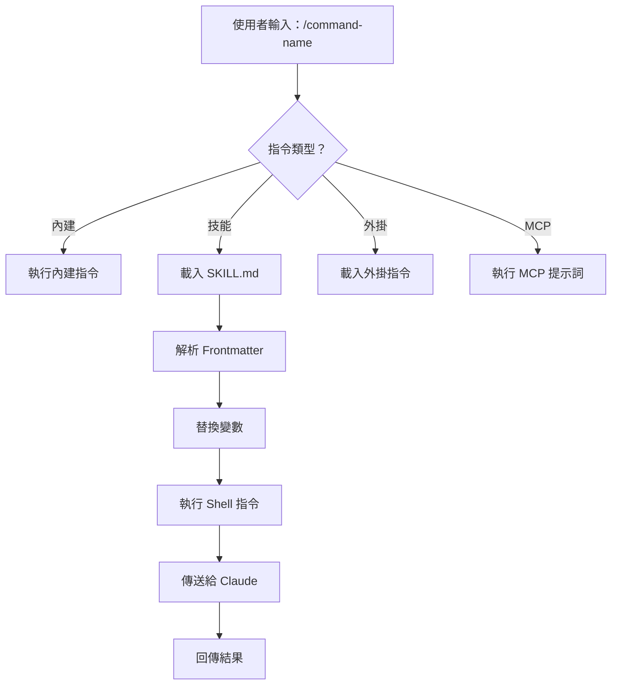
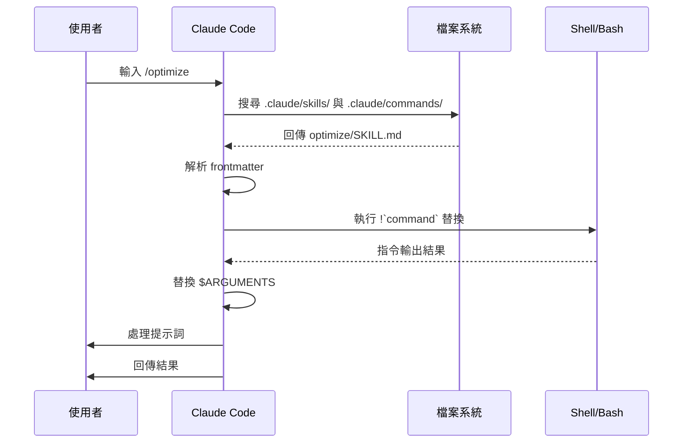
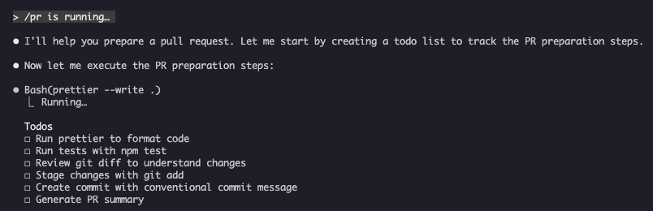

<picture>
  <source media="(prefers-color-scheme: dark)" srcset="../resources/logos/claude-howto-logo-dark.svg">
  
</picture>

# 斜線指令（Slash Commands）

## 總覽

斜線指令（Slash Commands）是在互動式工作階段（session）中用來控制 Claude 行為的捷徑，可分成幾種類型：

- **內建指令**：由 Claude Code 提供（`/help`、`/clear`、`/model`）
- **技能（Skills）**：使用者以 `SKILL.md` 檔案自訂的指令（`/optimize`、`/pr`）
- **外掛（Plugins）指令**：來自已安裝外掛的指令（`/frontend-design:frontend-design`）
- **MCP 提示詞**：來自 MCP 伺服器的指令（`/mcp__github__list_prs`）

> **備註**：自訂斜線指令已合併進技能。`.claude/commands/` 中的檔案仍可運作，但現在建議使用技能（`.claude/skills/`）。兩者都會建立 `/command-name` 這樣的捷徑。完整參考請見[技能指南](../03-skills/)。

## 內建指令參考

內建指令是常見動作的捷徑。目前有 **60 多個內建指令**與 **10 個隨附技能**可用。在 Claude Code 中輸入 `/` 即可看到完整清單，或輸入 `/` 加上任意字母來篩選。

> **備註**：自 v2.1.236 起，對打錯的斜線指令按下 Enter——或是對目前工作階段中無法使用的指令按下 Enter——會回報錯誤，而不是默默執行最接近的模糊比對結果。無歧義的前綴與已定義的別名仍會照常執行。

| 指令 | 用途 |
|---------|---------|
| `/add-dir <path>` | 新增工作目錄 |
| `/advisor [model\|off]` | 設定顧問（advisor）。以互動式對話框開啟；在桌面應用程式、遠端控制（Remote Control）與無介面（headless，`-p` / Agent SDK）工作階段中，改為採用純文字形式——單獨輸入 `/advisor`、`/advisor <model>`，或 `/advisor off`（v2.1.260+） |
| `/agents` | 管理代理設定 |
| `/branch [name]` | 切換到此時間點對話的副本，並保留原始對話（可用 `/resume` 回到原本的對話） |
| `/fork [prompt]` | 將目前對話複製到新的**背景工作階段**，並繼續在這裡工作；從那個時間點起兩者互相獨立，複本會在 `claude agents` 中取得自己的一列（v2.1.212+）。除非複本是原地編輯，否則 Claude Code 會指示它在修改程式碼前先建立自己的 worktree（此隔離指示需要 v2.1.221+） |
| `/subtask <task>` | 派生一個**分叉子代理（forked subagent）**，繼承完整對話並在你繼續工作的同時處理該任務；完成後結果會回到這個對話（v2.1.212+） |
| `/btw <question>` | 在 Claude 處理主要任務時，提出一個臨時的旁支問題；不會污染主對話的上下文 |
| `/cd <path>` | 將工作階段移到新的工作目錄，且不會破壞提示詞快取（prompt cache）（v2.1.169 新增） |
| `/chrome` | 設定 Chrome 瀏覽器整合 |
| `/clear` | 清除對話（別名：`/reset`、`/new`） |
| `/color [color\|default]` | 設定提示列顏色。單獨輸入 `/color`（不帶參數）會隨機選一個工作階段顏色（v2.1.128+）；傳入顏色名稱或 hex 值可明確指定。 |
| `/compact [instructions]` | 壓縮（compact）對話，可加上聚焦指示。壓縮失敗時現在會在介面上顯示為錯誤，而不是默默無反應（v2.1.216） |
| `/config` | 開啟設定（別名：`/settings`） |
| `/context` | 以彩色網格視覺化上下文使用量。用量超過上下文視窗上限時會顯示明確警告（v2.1.216） |
| `/copy [N]` | 複製助理回應到剪貼簿；`w` 會寫入檔案 |
| `/cost` | `/usage` 的輸入捷徑別名——開啟成本分頁（v2.1.118+） |
| `/desktop` | 在桌面應用程式中繼續（別名：`/app`） |
| `/diff` | 針對未提交變更的互動式 diff 檢視器。在全螢幕渲染模式下，改為在對話旁開啟一個 diff 面板，並在你持續工作時保持開啟——它會列出變更的檔案與新增／刪除行數，並在 Claude 每次編輯檔案或執行 shell 指令時更新；再次執行 `/diff` 或按一下 `✕` 即可關閉（v2.1.260+）。傳統渲染模式則是在提示列位置直接開啟檢視器 |
| `/doctor` | 診斷安裝狀態——可在 Claude 回應時開啟；顯示狀態圖示；按 `f` 可自動修正問題（v2.1.116 強化；v2.1.178 版面改為圖示更清楚的扁平樹狀結構） |
| `/effort [low\|medium\|high\|xhigh\|max\|auto]` | 透過互動式方向鍵滑桿設定投入程度（effort level）。等級：`low` → `medium` → `high` → `xhigh`（v2.1.111 新增）→ `max`。在 Opus 5、Sonnet 5、Opus 4.8 上預設為 `high`（Opus 4.7 上為 `xhigh`）；`xhigh` 需要 Opus 5、Sonnet 5、Opus 4.8 或 Opus 4.7；`max` 可用於 Opus 5、Sonnet 5、Opus 4.8／4.7／4.6 與 Sonnet 4.6。選單中也提供 `ultracode`（並非模型投入等級——它會送出 `xhigh`，並讓 Claude 協調動態工作流程；僅限本次工作階段） |
| `/exit` | 結束 REPL（別名：`/quit`） |
| `/export [filename]` | 將目前對話匯出到檔案或剪貼簿 |
| `/usage-credits` | 設定速率限制的額外用量（v2.1.144 由 `/extra-usage` 更名而來；`/extra-usage` 仍可作為別名使用） |
| `/fast [on\|off]` | 切換快速模式。適用於 Opus 5 與 Opus 4.8（v2.1.219） |
| `/feedback` | 提交意見回饋（別名：`/bug`）。自 v2.1.141 起，可附加最近的工作階段（最近 24 小時或 7 天），讓橫跨多個工作階段的回報帶有上下文。自 v2.1.178 起，`/bug` 需要先填寫說明才能送出。 |
| `/focus` | 切換聚焦檢視（v2.1.110 新增；取代 `Ctrl+O` 作為聚焦切換鍵） |
| `/goal <statement>` | 註冊工作階段層級的完成條件；Claude 會持續工作直到達成目標。`/goal clear` 可移除目標。有效目標會顯示在狀態列，並有即時懸浮面板顯示經過時間、輪次與 token 用量（v2.1.139 新增）。 |
| `/help` | 顯示說明 |
| `/hooks` | 檢視 Hook 設定 |
| `/ide` | 管理 IDE 整合 |
| `/init` | 初始化 `CLAUDE.md`。設定 `CLAUDE_CODE_NEW_INIT=1` 可啟用互動式流程 |
| `/insights` | 產生工作階段分析報告 |
| `/install-github-app` | 設定 GitHub Actions 應用程式 |
| `/install-slack-app` | 安裝 Slack 應用程式 |
| `/keybindings` | 開啟按鍵繫結設定 |
| `/fewer-permission-prompts` | 分析近期的 Bash／MCP 工具呼叫，並在 `.claude/settings.json` 中加入優先順序排列的允許清單，以減少權限提示（v2.1.111 新增） |
| `/login` | 切換 Anthropic 帳號 |
| `/logout` | 從你的 Anthropic 帳號登出 |
| `/mcp` | 管理 MCP 伺服器與 OAuth |
| `/memory` | 編輯 `CLAUDE.md`、切換自動記憶 |
| `/mobile` | 手機應用程式的 QR code（別名：`/ios`、`/android`） |
| `/model [model]` | 選擇模型，並以左右方向鍵調整投入程度。自 v2.1.153 起，選擇會**儲存為新工作階段的預設值**（與 IDE 一致）；選定後按 `s` 可只套用到目前工作階段。（按鍵繫結 `modelPicker:setAsDefault` 已更名為 `modelPicker:thisSessionOnly`；原本的 `d` 動作現在是 `s`。）自 v2.1.219 起，選擇器會將合併的 Opus 選項顯示為「Opus (1M context)」。 |
| `/passes` | 分享 Claude Code 的免費一週體驗 |
| `/permissions` | 檢視／更新權限（別名：`/allowed-tools`） |
| `/plan [description]` | 進入規劃模式（Planning Mode） |
| `/plugin` | 管理外掛 |
| `/proactive` | `/loop` 的別名（v2.1.105 新增） |
| `/powerup` | 透過附動畫示範的互動式課程探索功能 |
| `/privacy-settings` | 隱私設定（僅限 Pro／Max） |
| `/release-notes` | 檢視更新日誌 |
| `/recap` | 回到工作階段時顯示工作階段回顧／摘要（v2.1.108 新增） |
| `/reload-plugins` | 重新載入啟用中的外掛。自 v2.1.221 起，大多數安裝會立即啟用，因此只有在安裝摘要顯示 `Run /reload-plugins to activate.` 時才需要執行這個指令。自 v2.1.260 起，此指令也可用於無介面工作階段，因此也會出現在 Claude Code Desktop 與 SDK 的指令清單中 |
| `/reload-skills` | 重新掃描技能目錄，不需重新啟動工作階段（v2.1.152 新增） |
| `/remote-control` | 從 claude.ai 遠端控制（別名：`/rc`） |
| `/remote-env` | 設定預設遠端環境 |
| `/rename [name]` | 為工作階段重新命名 |
| `/resume [session]` | 繼續對話（別名：`/continue`） |
| `/review [low\|medium\|high\|xhigh\|max\|ultra] [--fix] [--comment] [pr#\|branch\|path]` | `/code-review` 的別名（v2.1.223）：審查目前的 diff，或是你傳入的 PR 編號、分支或路徑——例如 `/review 1234`。接受同樣的投入等級與旗標。未指定等級時，會沿用你上次輸入的 `low`–`max` 等級 |
| `/rewind` | 回溯對話與／或程式碼（別名：`/checkpoint`） |
| `/sandbox` | 切換沙箱模式 |
| `/schedule [description]` | 建立／管理雲端排程任務 |
| `/scroll-speed <+N\|-N>` | 調整 TUI 即時預覽窗格的滑鼠滾輪捲動速度，並附即時預覽。會依機器儲存到 `~/.claude/preferences.json`（v2.1.139 新增）。 |
| `/security-review` | 分析分支中的安全漏洞 |
| `/skill-doctor` | 顯示哪些已載入的技能未被使用、以及每個技能在上下文中的成本，方便你決定要停用哪些。報告會在 `/plugin` 管理器的「統計（Stats）」分頁中開啟；在非互動式的 `-p` 模式下則以文字形式輸出。透過遠端控制使用時，會回覆 `Skill usage reports are not available on this connection.`——請在執行工作階段的機器終端機中執行（需要 v2.1.252+） |
| `/skills` | 列出可用技能 |
| `/stats` | `/usage` 的輸入捷徑別名——開啟統計分頁（每日用量、工作階段、連續天數）（v2.1.118+） |
| `/stickers` | 訂購 Claude Code 貼紙 |
| `/status` | 顯示版本、模型、帳號，以及一列顯示 `background job · attached`、`background job · unattended` 或 `interactive` 的 `Session kind`（此列於 v2.1.221 新增）。可在 Claude 回應時開啟 |
| `/statusline` | 設定狀態列 |
| `/tasks` | 列出／管理背景任務 |
| `/team-onboarding` | 根據專案的 Claude Code 設定，產生隊友上手指南（v2.1.101 新增） |
| `/teleport` | 在此終端機中繼續一個 Claude Code on the web 的工作階段；會開啟你網頁工作階段的選擇器（別名：`/tp`）。需要 claude.ai 訂閱 |
| `/terminal-setup` | 設定終端機按鍵繫結 |
| `/theme` | 開啟佈景主題選擇器／管理自訂佈景主題（v2.1.118）。可透過 `~/.claude/themes/<name>.json` 的 JSON 定義自訂佈景主題 |
| `/tui` | 切換無閃爍渲染的全螢幕 TUI（文字使用者介面）模式（v2.1.110 新增） |
| `/ultrareview` | 全面的雲端式多代理程式碼審查（v2.1.111 新增）。現在建議改用 `/code-review ultra` 呼叫；`/ultrareview` 仍保留作為別名。Pro 與 Max 方案含 3 次免費使用，之後需要用量額度 |
| `/upgrade` | 開啟升級頁面以取得更高階方案 |
| `/usage` | 標準用量儀表板（v2.1.118）——整合方案用量上限、速率限制、成本與每日工作階段統計。`/cost` 與 `/stats` 是開啟特定分頁的輸入捷徑別名 |
| `/voice` | 切換按鍵通話語音輸入 |
| `/workflows` | 檢視執行中與已完成的動態工作流程執行紀錄（v2.1.154 新增）。詳見[動態工作流程](../09-advanced-features/README.md#動態工作流程) |

> **為什麼 `/cd` 很重要**：過去切換目錄會讓快取失去暖機狀態（讓下一輪回應變慢、變貴）；`/cd` 能在切換目錄時保留提示詞快取。

### 隨附技能

這些技能隨 Claude Code 附帶，呼叫方式與斜線指令相同：

| 技能 | 用途 |
|-------|---------|
| `/batch <instruction>` | 使用 worktree 協調大規模的平行變更 |
| `/claude-api` | 依專案語言載入 Claude API 參考文件 |
| `/dataviz` | 圖表與儀表板設計指南，附可執行的配色驗證工具（v2.1.198） |
| `/debug [description]` | 啟用除錯記錄 |
| `/design [description]` | 建立**設計畫布（design canvas）**——一個多畫板的視覺設計（UI 原型、畫面流程、著陸頁、海報），以 artifact 形式發布並用視覺方式調整，而非手寫程式碼。當你想調整的是版面本身時，可用它取代手寫 HTML。研究預覽階段；需要 v2.1.233+ 以及 Pro、Max、Team 或 Enterprise 方案 |
| `/loop [interval] <prompt>` | 依間隔重複執行提示詞 |
| `/code-review [low\|medium\|high\|xhigh\|max\|ultra] [--fix] [--comment] [pr#\|branch\|path]` | 審查目前的 diff——或是你傳入的 PR 編號、分支或路徑——找出正確性方面的錯誤。傳入 `--fix` 會直接套用審查結果的修正，`--comment` 可以行內留言方式張貼到 GitHub PR，`ultra` 可執行深度雲端審查；以 `ultra` 搭配 `github.com` 的 PR 目標時，`--post` 會預先選取將發現張貼到 PR。未指定投入等級時，審查會沿用你上次輸入的等級（v2.1.223）。原本在 v2.1.146 併入了 `/simplify`，但 `/simplify` 在 v2.1.154 又回歸為獨立指令 |
| `/simplify` | 執行純清理型審查（重複使用／簡化／效率／視角），並套用修正；**不**會找正確性錯誤——這部分請用 `/code-review`。曾短暫作為 `/code-review --fix` 的別名（v2.1.152），在 v2.1.154 變為純清理用途 |

### 已淘汰指令

| 指令 | 狀態 |
|---------|--------|
| `/output-style` | 已於 v2.1.91 移除（v2.1.73 起淘汰）——改用 `/config` → Output style，或 `outputStyle` 設定 |
| `/pr-comments` | 已於 v2.1.91 移除——直接請 Claude 檢視 PR 留言 |
| `/vim` | 已於 v2.1.92 移除——改用 /config → Editor mode |
| `/undo` | 自 v2.1.245 起不再列於官方指令參考中（原本於 v2.1.108 新增為 `/rewind` 的別名）——改用 `/rewind` 或按兩次 `Esc` |

### 近期變更

- `/fork` 與 `/subtask` 在 **v2.1.212** 互換了角色。`/fork` 現在會將對話複製到新的獨立背景工作階段；它原本的分叉子代理行為則移到新的 `/subtask` 指令上。歷史沿革：`/fork` 從 v2.1.77 到 v2.1.161 是 `/branch` 的別名；從 v2.1.161 到 v2.1.211 則會啟動一個分叉子代理（也就是現在 `/subtask` 的行為）。當代理檢視功能關閉時，`/subtask` 無法使用，此時 `/fork` 會保留分叉子代理的行為
- `/resume`（不帶參數）會開啟過去工作階段的選擇器——包含已從可見清單移除的工作階段——並將所選的工作階段以背景工作階段的形式繼續（v2.1.212）
- `/output-style` 已淘汰（v2.1.73）並移除（v2.1.91）——輸出樣式仍可透過 `/config` → Output style 或 `outputStyle` 設定使用；內建樣式有 Default、Proactive、Explanatory、Learning 與 Concise（v2.1.237 新增）
- `/review` 成為 `/code-review` 的完整別名——目標、投入等級與旗標皆相同（v2.1.223）。歷史沿革：它最早在 v2.1.186 改用 `/code-review medium` 引擎，但當時仍僅限 PR
- 新增 `/effort` 指令；`max` 等級可用於 Opus 4.6 以上版本（原本僅限 Opus 4.6）
- 新增 `/voice` 指令，用於按鍵通話語音輸入
- 新增 `/schedule` 指令，用於建立／管理排程任務
- 新增 `/color` 指令，用於自訂提示列
- /pr-comments 已於 v2.1.91 移除——直接請 Claude 檢視 PR 留言
- /vim 已於 v2.1.92 移除——改用 /config → Editor mode
- `/ultraplan` 已於 v2.1.222 移除——改用規劃模式
- 新增 /powerup，用於互動式功能課程
- 新增 /sandbox，用於切換沙箱模式
- `/model` 選擇器現在會顯示人類可讀的標籤（例如「Sonnet 4.6」），而非原始模型 ID
- `/resume` 支援 `/continue` 別名
- MCP 提示詞可作為 `/mcp__<server>__<prompt>` 指令使用（詳見 [MCP 提示詞作為指令](#mcp-提示詞作為指令)）
- 新增 `/team-onboarding`，用於自動產生隊友上手指南（v2.1.101）
- 新增 `/tui` 指令，用於無閃爍全螢幕 TUI 渲染（v2.1.110）
- 新增 `/focus` 指令，用於切換聚焦檢視；`Ctrl+O` 現在僅用於切換詳細逐字稿（v2.1.110）
- 新增 `/recap` 指令，可手動觸發工作階段上下文回顧（v2.1.108）
- 新增 `/undo` 作為 `/rewind` 的別名（v2.1.108）；自 v2.1.245 起已不再列於官方指令參考中——改用 `/rewind` 或 `Esc Esc`
- 新增 `/proactive` 作為 `/loop` 的別名（v2.1.105）
- `/effort` 新增了互動式方向鍵滑桿，以及介於 `high` 與 `max` 之間的新等級 `xhigh`；Opus 4.7 方案的預設投入等級提升為 `xhigh`（v2.1.111）。在 Opus 4.8 上預設為 `high`（v2.1.154）；Opus 5 預設也是 `high`（v2.1.219）
- 新增 `/ultrareview`，用於全面的雲端式多代理程式碼審查（v2.1.111）
- 新增 `/fewer-permission-prompts`，可分析 Bash／MCP 工具呼叫，並透過 `.claude/settings.json` 中的允許清單減少權限提示（v2.1.111）
- 自動模式（Auto mode）對 Opus 4.7 上的 Max 訂閱者不再需要 `--enable-auto-mode` 旗標（v2.1.112）
- 新增 `/goal`——工作階段層級的完成條件，Claude 會跨多輪持續朝目標努力；即時懸浮面板會顯示經過時間、輪次與 token 用量（v2.1.139）
- 新增 `/scroll-speed`——調整 TUI 即時預覽窗格的滑鼠滾輪捲動速度；設定值依機器儲存（v2.1.139）
- 新增 `/reload-skills`——重新掃描技能目錄，不需重新啟動工作階段（v2.1.152）
- `/model` 現在會將選定的模型儲存為新工作階段的預設值；按 `s` 可僅套用到本次工作階段（按鍵繫結 `modelPicker:setAsDefault` → `modelPicker:thisSessionOnly`）（v2.1.153）
- 新增 `/workflows`——檢視執行中與已完成的動態工作流程執行紀錄（v2.1.154）
- `/simplify` 回歸為獨立的純清理型審查指令（重複使用／簡化／效率／視角），與 `/code-review` 的抓錯功能區隔開來（v2.1.154）
- `/status` 新增了 `Session kind` 列，用來區分已連接與未連接的背景工作，以及互動式工作階段（v2.1.221）
- 外掛安裝現在會在安全的情況下立即啟用；只有在安裝摘要要求時才需要執行 `/reload-plugins`（v2.1.221）
- 移除 `/ultraplan`——改用規劃模式（v2.1.222）
- 未指定投入等級時，`/code-review` 與 `/review` 會沿用你上次輸入的等級（v2.1.223）
- `/code-review ultra` 成為雲端多代理審查的建議入口；`/ultrareview` 仍保留作為別名（v2.1.223）
- `/code-review` 在 `high`、`xhigh` 與 `max` 投入等級下，現在也會像其他等級一樣在背景代理中執行（v2.1.232）
- 移除了建議你建立自訂子代理的啟動提示，以及 `/powerup` 導覽中對應的提醒（v2.1.232）
- `/permissions` 現在可在 Claude 工作時開啟——規則變更會套用到目前這一輪剩餘的部分（v2.1.234）
- `/add-dir <path>` 現在可在 Claude 工作時使用；在**全螢幕 TUI** 中，`/add-dir`、`/autocompact`、`/theme`、`/help`、`/config` 與 `/advisor` 對話框會在輪次中途直接開啟，而不是排隊等到 Claude 回應完畢（`/bug` 自 v2.1.232 起已可立即開啟）（v2.1.234）

### `/goal` — 工作階段層級完成條件

> **v2.1.139 新增**

使用 `/goal` 為目前的工作階段註冊完成條件。Claude 會跨多輪朝這個目標努力，懸浮面板會顯示經過時間、輪次與已使用的 token 數。用 `/goal clear` 清除。可用於互動模式、`claude -p` 與遠端控制。

```
User: /goal 把付款服務從 REST 遷移到 gRPC，並讓整合測試通過。
Claude: 已註冊目標。我會持續朝這個目標努力，直到你清除它為止。
[目標面板：⏱ 0s · 輪次 0 · tokens 0]

User: 先列出 REST 端點
Claude: [執行工作，面板隨之更新]
```

**停滯背景任務的回報確認（v2.1.234）：** 當目標處於啟用狀態時，若背景任務超過 30 分鐘沒有進度，Claude 會主動回報狀態更新，而不是默默繼續執行。可用 `CLAUDE_CODE_GOAL_CHECKIN_MINUTES` 環境變數調整這個門檻（以分鐘為單位），設為 `0` 則完全停用回報確認。

### `/team-onboarding` — 隊友上手指南

> **v2.1.101 新增**

使用 `/team-onboarding` 可根據專案中本機的 Claude Code 使用情況，產生隊友上手指南。這個指令會檢查你的 `CLAUDE.md`、已安裝的技能、子代理、Hooks 與近期工作流程，接著產生一份能幫助新開發者快速上手的引導文件。

這是內建指令——不需要另外安裝。

**用法：**

```bash
claude /team-onboarding
```

產生的指南會摘要以下內容：

- 專案目的與來自 [`CLAUDE.md`](../02-memory/README.md) 的核心慣例
- 可用的[技能](../03-skills/README.md)以及自動觸發的時機
- 已設定的[子代理](../04-subagents/README.md)及其職責
- 在常見事件時執行的 [Hooks](../06-hooks/README.md)
- 新人應該了解的常見工作流程

**可用版本：** 隨 Claude Code v2.1.101（2026 年 4 月 11 日）發行。

## 自訂指令（現為技能）

自訂斜線指令已**合併進技能**。兩種做法都會建立可用 `/command-name` 呼叫的指令：

| 做法 | 位置 | 狀態 |
|----------|----------|--------|
| **技能（建議）** | `.claude/skills/<name>/SKILL.md` | 目前標準 |
| **舊版指令** | `.claude/commands/<name>.md` | 仍可運作 |

如果技能與指令同名，**技能優先**。例如當 `.claude/commands/review.md` 與 `.claude/skills/review/SKILL.md` 同時存在時，會使用技能版本。

### 遷移路徑

你現有的 `.claude/commands/` 檔案不需修改即可繼續運作。若要遷移到技能：

**遷移前（指令）：**
```
.claude/commands/optimize.md
```

**遷移後（技能）：**
```
.claude/skills/optimize/SKILL.md
```

### 為什麼用技能？

相較於舊版指令，技能提供更多功能：

- **目錄結構**：可包裝腳本、範本與參考檔案
- **自動觸發**：相關情境下 Claude 可自動觸發技能
- **觸發控制**：可選擇由使用者、Claude，或兩者皆可觸發
- **子代理執行**：以 `context: fork` 在隔離的上下文中執行技能
- **漸進式揭露**：只在需要時載入額外檔案

### 將自訂指令建立為技能

建立一個含有 `SKILL.md` 檔案的目錄：

```bash
mkdir -p .claude/skills/my-command
```

**檔案：** `.claude/skills/my-command/SKILL.md`

```yaml
---
name: my-command
description: 這個指令的功能，以及何時使用它
---

# 我的指令

指令被呼叫時，Claude 要遵循的說明。

1. 第一步
2. 第二步
3. 第三步
```

### Frontmatter 參考

| 欄位 | 用途 | 預設值 |
|-------|---------|---------|
| `name` | 指令名稱（會成為 `/name`） | 目錄名稱 |
| `description` | 簡短說明（協助 Claude 判斷何時使用） | 第一段內容 |
| `argument-hint` | 自動完成用的預期參數 | 無 |
| `allowed-tools` | 指令可不經授權使用的工具 | 繼承 |
| `model` | 指定使用的模型 | 繼承 |
| `disable-model-invocation` | 若為 `true`，只有使用者可以觸發（Claude 不行） | `false` |
| `user-invocable` | 若為 `false`，會從 `/` 選單中隱藏 | `true` |
| `context` | 設為 `fork` 可在隔離的子代理中執行 | 無 |
| `agent` | 使用 `context: fork` 時的代理類型 | `general-purpose` |
| `hooks` | 技能範圍的 Hooks（PreToolUse、PostToolUse、Stop） | 無 |

### 參數

指令可以接收參數：

**用 `$ARGUMENTS` 取得全部參數：**

```yaml
---
name: fix-issue
description: 依編號修正 GitHub issue
---

依我們的程式碼規範，修正 #$ARGUMENTS 這個 issue
```

用法：`/fix-issue 123` → `$ARGUMENTS` 會變成「123」

**用 `$0`、`$1` 等取得個別參數：**

```yaml
---
name: review-pr
description: 依優先順序審查 PR
---

以優先順序 $1 審查 PR #$0
```

用法：`/review-pr 456 high` → `$0`＝「456」，`$1`＝「high」

`${CLAUDE_PROJECT_DIR}` 會解析為專案根目錄的絕對路徑（v2.1.196）。

### 用 Shell 指令產生動態上下文

在提示詞執行前，用 `` !`command` `` 執行 bash 指令：

```yaml
---
name: commit
description: 建立包含上下文的 git commit
allowed-tools: Bash(git *)
---

## 上下文

- 目前的 git 狀態：!`git status`
- 目前的 git diff：!`git diff HEAD`
- 目前分支：!`git branch --show-current`
- 最近的 commit：!`git log --oneline -5`

## 你的任務

根據上述變更，建立一個 git commit。
```

### 檔案引用

用 `@` 引用檔案內容：

```markdown
審查 @src/utils/helpers.js 中的實作
比較 @src/old-version.js 與 @src/new-version.js
```

## 外掛指令

外掛可以提供自訂指令：

```
/plugin-name:command-name
```

若沒有命名衝突，也可以直接使用 `/command-name`。

**範例：**
```bash
/frontend-design:frontend-design
/commit-commands:commit
```

## MCP 提示詞作為指令

MCP 伺服器可以將提示詞公開為斜線指令：

```
/mcp__<server-name>__<prompt-name> [arguments]
```

**範例：**
```bash
/mcp__github__list_prs
/mcp__github__pr_review 456
/mcp__jira__create_issue "錯誤標題" high
```

### MCP 權限語法

在權限設定中控制 MCP 伺服器的存取：

- `mcp__github` - 存取整個 GitHub MCP 伺服器
- `mcp__github__*` - 萬用字元，存取所有工具
- `mcp__github__get_issue` - 存取特定工具

## 指令架構



## 指令生命週期



## 本資料夾中的可用指令

這些範例指令可以安裝為技能或舊版指令。

### 1. `/optimize` - 程式碼最佳化

分析程式碼中的效能問題、記憶體洩漏與最佳化機會。

**用法：**
```
/optimize
[貼上你的程式碼]
```

### 2. `/pr` - Pull Request 準備

引導完成 PR 準備清單，包括 lint、測試與 commit 格式化。

**用法：**
```
/pr
```

**截圖：**


### 3. `/generate-api-docs` - API 文件產生器

從原始碼產生完整的 API 文件。

**用法：**
```
/generate-api-docs
```

### 4. `/commit` - 帶上下文的 Git Commit

根據儲存庫的動態上下文建立 git commit。

**用法：**
```
/commit [選填訊息]
```

### 5. `/push-all` - 暫存、提交並推送

暫存所有變更、建立 commit，並在安全檢查後推送到遠端。

**用法：**
```
/push-all
```

**安全檢查：**
- 機密資訊：`.env*`、`*.key`、`*.pem`、`credentials.json`
- API 金鑰：偵測真實金鑰與佔位字串的差異
- 大型檔案：超過 `10MB` 且未使用 Git LFS
- 建置產物：`node_modules/`、`dist/`、`__pycache__/`

### 6. `/doc-refactor` - 文件重構

重構專案文件，讓內容更清楚、更易於使用。

**用法：**
```
/doc-refactor
```

### 7. `/setup-ci-cd` - CI/CD 管線設定

建立 pre-commit hooks 與 GitHub Actions 以確保品質。

**用法：**
```
/setup-ci-cd
```

### 8. `/unit-test-expand` - 測試涵蓋率擴增

針對未測試的分支與邊界情況，提升測試涵蓋率。

**用法：**
```
/unit-test-expand
```

## 安裝

### 以技能安裝（建議）

複製到你的技能目錄：

```bash
# 建立技能目錄
mkdir -p .claude/skills

# 為每個指令檔案建立一個技能目錄
for cmd in optimize pr commit; do
  mkdir -p .claude/skills/$cmd
  cp 01-slash-commands/$cmd.md .claude/skills/$cmd/SKILL.md
done
```

### 以舊版指令安裝

複製到你的指令目錄：

```bash
# 專案層級（團隊共用）
mkdir -p .claude/commands
cp 01-slash-commands/*.md .claude/commands/

# 個人使用
mkdir -p ~/.claude/commands
cp 01-slash-commands/*.md ~/.claude/commands/
```

## 建立你自己的指令

### 技能範本（建議）

建立 `.claude/skills/my-command/SKILL.md`：

```yaml
---
name: my-command
description: 這個指令的功能。在 [觸發條件] 時使用。
argument-hint: [optional-args]
allowed-tools: Bash(npm *), Read, Grep
---

# 指令標題

## 上下文

- 目前分支：!`git branch --show-current`
- 相關檔案：@package.json

## 指示

1. 第一步
2. 第二步，附帶參數：$ARGUMENTS
3. 第三步

## 輸出格式

- 如何格式化回應
- 應包含哪些內容
```

### 僅限使用者觸發的指令（不自動觸發）

適用於有副作用、不該由 Claude 自動觸發的指令：

```yaml
---
name: deploy
description: 部署到正式環境
disable-model-invocation: true
allowed-tools: Bash(npm *), Bash(git *)
---

將應用程式部署到正式環境：

1. 執行測試
2. 建置應用程式
3. 推送到部署目標
4. 驗證部署結果
```

## 最佳實踐

| 建議 | 避免 |
|------|---------|
| 使用清楚、以動作為導向的名稱 | 為一次性任務建立指令 |
| 在 `description` 中包含觸發條件 | 在指令中建構複雜的邏輯 |
| 讓指令專注於單一任務 | 寫死敏感資訊 |
| 有副作用時使用 `disable-model-invocation` | 略過 description 欄位 |
| 用 `!` 前綴取得動態上下文 | 假設 Claude 知道目前狀態 |
| 把相關檔案整理到技能目錄中 | 把所有東西塞進同一個檔案 |

## 疑難排解

### 找不到指令

**解決方法：**
- 確認檔案位於 `.claude/skills/<name>/SKILL.md` 或 `.claude/commands/<name>.md`
- 確認 frontmatter 中的 `name` 欄位與預期的指令名稱一致
- 重新啟動 Claude Code 工作階段
- 執行 `/help` 查看可用指令

### 指令執行結果不如預期

**解決方法：**
- 加入更明確的指示
- 在技能檔案中加入範例
- 若使用 bash 指令，檢查 `allowed-tools`
- 先用簡單的輸入測試

### 技能與指令衝突

若兩者同名，**技能優先**。請移除其中一個或重新命名。

## 相關指南

- **[技能](../03-skills/)** - 技能（自動觸發能力）的完整參考
- **[記憶（Memory）](../02-memory/)** - 透過 CLAUDE.md 提供的持久化上下文
- **[子代理](../04-subagents/)** - 委派任務的 AI 代理
- **[外掛](../07-plugins/)** - 打包好的指令集合
- **[Hooks](../06-hooks/)** - 事件驅動的自動化

## 延伸資源

- [官方互動模式文件](https://code.claude.com/docs/en/interactive-mode) - 內建指令參考
- [官方技能文件](https://code.claude.com/docs/en/skills) - 完整技能參考
- [CLI 參考](https://code.claude.com/docs/en/cli-reference) - 命令列選項

---

**最後更新**：2026 年 9 月 6 日
**Claude Code 版本**：2.1.263
**資料來源**：
- https://code.claude.com/docs/en/skills
- https://code.claude.com/docs/en/slash-commands
- https://code.claude.com/docs/en/interactive-mode
- https://code.claude.com/docs/en/interactive-mode#review-changes-with-diff
- https://code.claude.com/docs/en/changelog
- https://code.claude.com/docs/en/commands
- https://code.claude.com/docs/en/whats-new/2026-w34
- https://code.claude.com/docs/en/model-config
- https://github.com/anthropics/claude-code/blob/main/CHANGELOG.md
- https://github.com/anthropics/claude-code/releases/tag/v2.1.139
- https://github.com/anthropics/claude-code/releases/tag/v2.1.144
- https://github.com/anthropics/claude-code/releases/tag/v2.1.152
- https://github.com/anthropics/claude-code/releases/tag/v2.1.153
- https://github.com/anthropics/claude-code/releases/tag/v2.1.154
**相容模型**：Claude Fable 5, Claude Opus 5, Claude Sonnet 5, Claude Sonnet 4.6, Claude Opus 4.8, Claude Haiku 4.5

*[Claude How To](../) 教學系列的一部分*
