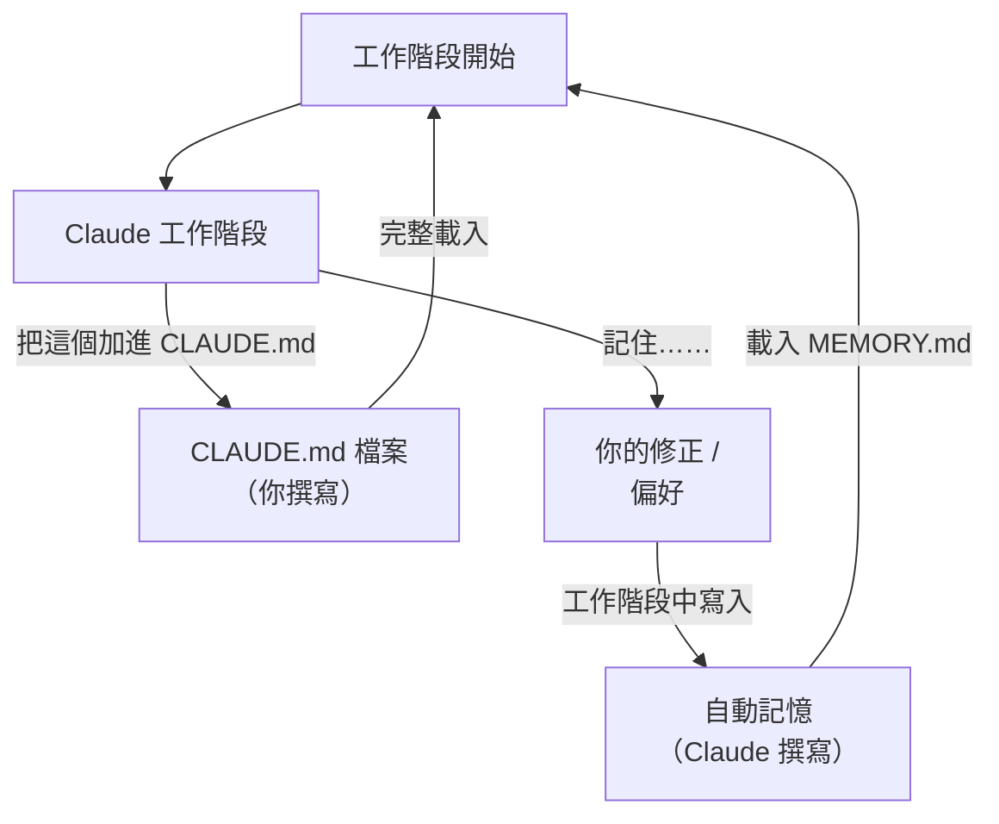
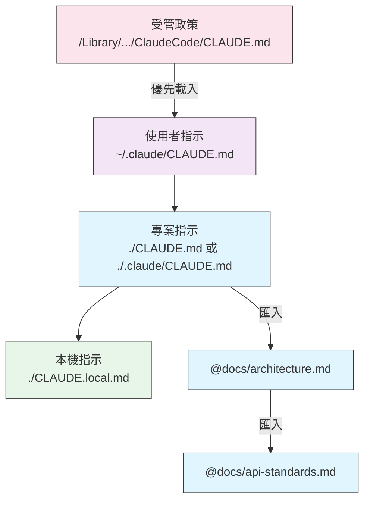
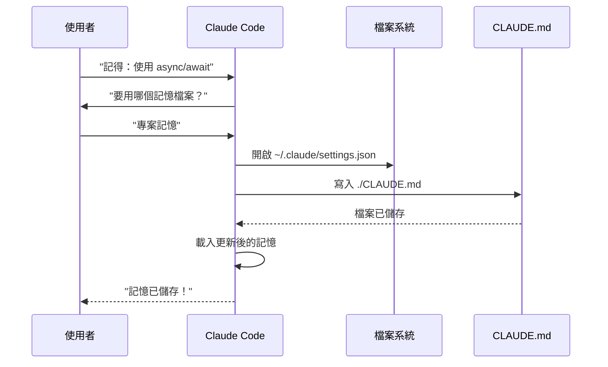
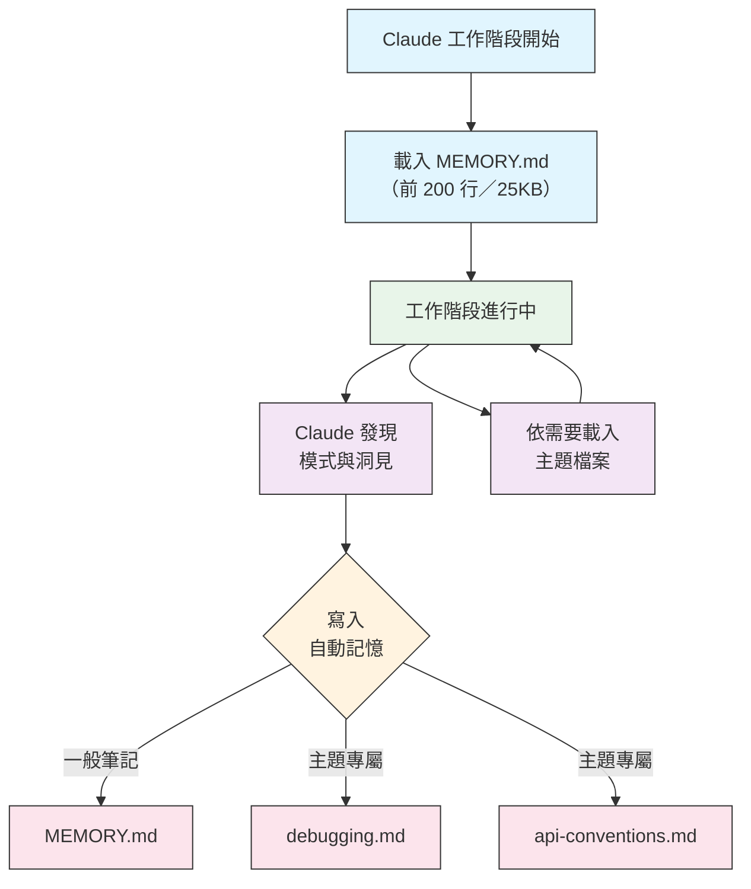
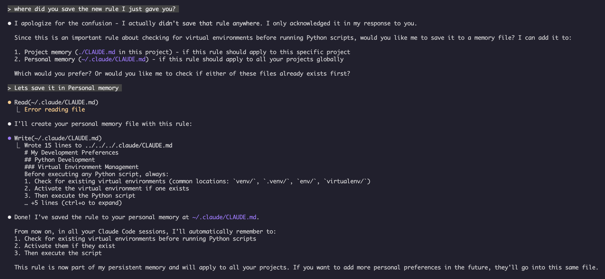

<picture>
  <source media="(prefers-color-scheme: dark)" srcset="../resources/logos/claude-code-tutorial-logo-dark.svg">
  
</picture>

# 記憶指南

記憶（Memory）讓 Claude 能夠在工作階段（session）與對話之間保留上下文。它有兩種形式：claude.ai 中的自動整合，以及 Claude Code 中以檔案系統為基礎的 CLAUDE.md。

## 總覽

Claude Code 中的記憶提供持久性的上下文，可以延續到多個工作階段與對話之間。與暫時性的上下文視窗不同，記憶檔案讓你可以：

- 與團隊分享專案標準
- 儲存個人開發偏好
- 維護特定目錄的規則與設定
- 匯入外部文件
- 將記憶納入專案的版本控制

記憶系統在多個層級運作，從全域的個人偏好一路到特定子目錄，讓你可以細緻地控制 Claude 記住什麼、以及如何套用這些知識。

## 記憶指令快速參考

| 指令 | 用途 | 用法 | 使用時機 |
|---------|---------|-------|-------------|
| `/init` | 初始化專案記憶 | `/init` | 開始新專案、第一次設定 CLAUDE.md |
| `/memory` | 在編輯器中編輯記憶檔案 | `/memory` | 大幅更新、重新整理、檢視內容 |
| `#` 前綴 | ~~快速新增單行記憶~~ **已停用** | — | 改用 `/memory` 或直接用對話方式請求 |
| `@path/to/file` | 匯入外部內容 | `@README.md` 或 `@docs/api.md` | 在 CLAUDE.md 中引用既有文件 |

## 快速開始：初始化記憶

### `/init` 指令

`/init` 指令是在 Claude Code 中設定專案記憶最快的方式。它會用基礎的專案文件初始化一份 CLAUDE.md 檔案。

**用法：**

```bash
/init
```

**它會做什麼：**

- 在你的專案中建立一份新的 CLAUDE.md 檔案（通常位於 `./CLAUDE.md` 或 `./.claude/CLAUDE.md`）
- 建立專案慣例與指引
- 為跨工作階段的上下文持久化打好基礎
- 提供範本結構，方便記錄你的專案標準

**強化互動模式**：設定 `CLAUDE_CODE_NEW_INIT=1` 可以啟用多階段互動流程，一步一步引導你完成專案設定：

```bash
CLAUDE_CODE_NEW_INIT=1 claude
/init
```

**何時該用 `/init`：**

- 用 Claude Code 開始新專案
- 建立團隊的程式碼標準與慣例
- 為你的程式碼庫結構建立文件
- 為協作開發設定記憶階層

**範例工作流程：**

```markdown
# 進到你的專案目錄
/init

# Claude 會建立結構類似這樣的 CLAUDE.md：
# 專案設定
## 專案總覽
- 名稱：你的專案
- 技術堆疊：[你的技術]
- 團隊規模：[開發者人數]

## 開發標準
- 程式碼風格偏好
- 測試需求
- Git 工作流程慣例
```

### 快速更新記憶

> **備註**：內嵌記憶用的 `#` 捷徑已經停用。請改用 `/memory` 直接編輯記憶檔案，或直接用對話方式請 Claude 記住某件事（例如：「記住我們一律使用 TypeScript strict mode」）。

建議用以下方式把資訊加進記憶：

**方式一：使用 `/memory` 指令**

```bash
/memory
```

在你系統的編輯器中開啟記憶檔案，直接編輯。

**方式二：直接用對話方式請求**

```
記住我們這個專案一律使用 TypeScript strict mode。
請加進記憶：優先使用 async/await，而不是 promise chain。
```

Claude 會根據你的請求更新適當的 CLAUDE.md 檔案。

**歷史紀錄**（已無作用）：

`#` 前綴捷徑過去可以用來內嵌新增規則：

```markdown
# 這個專案一律使用 TypeScript strict mode  ← 已經失效
```

如果你之前依賴這個用法，請改用 `/memory` 指令或直接用對話方式請求。

### `/memory` 指令

`/memory` 指令讓你可以在 Claude Code 工作階段中直接編輯 CLAUDE.md 記憶檔案。它會在你系統的編輯器中開啟記憶檔案，方便做完整的編輯。當檔案在 GUI 編輯器中開啟時，工作階段不會因為檔案保持開啟而被卡住，你可以同時繼續工作（v2.1.216）；像 Vim 這類終端機編輯器仍會佔用終端機，直到你離開為止。

**用法：**

```bash
/memory
```

**它會做什麼：**

- 用你系統的預設編輯器開啟記憶檔案
- 讓你可以大幅新增、修改與重新整理內容
- 直接存取階層中所有的記憶檔案
- 讓你可以管理跨工作階段的持久上下文

**何時該用 `/memory`：**

- 檢視既有的記憶內容
- 大幅更新專案標準
- 重新整理記憶結構
- 新增詳細的文件或指引
- 隨著專案演進維護並更新記憶

**比較：`/memory` vs `/init`**

| 面向 | `/memory` | `/init` |
|--------|-----------|---------|
| **目的** | 編輯既有的記憶檔案 | 初始化新的 CLAUDE.md |
| **使用時機** | 更新 / 修改專案上下文 | 開始新專案 |
| **動作** | 開啟編輯器進行變更 | 產生起始範本 |
| **工作流程** | 持續維護 | 一次性設定 |

**範例工作流程：**

```markdown
# 開啟記憶以進行編輯
/memory

# Claude 會顯示以下選項：
# 1. 受管政策記憶
# 2. 專案記憶（./CLAUDE.md）
# 3. 使用者記憶（~/.claude/CLAUDE.md）
# 4. 本機專案記憶

# 選擇選項 2（專案記憶）
# 你的預設編輯器會開啟，顯示 ./CLAUDE.md 的內容

# 進行修改、儲存並關閉編輯器
# Claude 會自動重新載入更新後的記憶
```

**使用記憶匯入：**

CLAUDE.md 檔案支援 `@path/to/file` 語法，可以納入外部內容：

```markdown
# 專案文件
專案總覽請見 @README.md
可用的 npm 指令請見 @package.json
系統設計請見 @docs/architecture.md

# 用絕對路徑從家目錄匯入
@~/.claude/my-project-instructions.md
```

**匯入功能：**

- 同時支援相對路徑與絕對路徑（例如 `@docs/api.md` 或 `@~/.claude/my-project-instructions.md`）
- 支援遞迴匯入，最大深度為 4 層
- 第一次從外部位置匯入時，基於安全考量會跳出核准對話框
- 匯入指令在 markdown 行內程式碼或程式碼區塊中不會被解析（所以在範例中示範它們是安全的）
- 透過引用既有文件來避免重複內容
- 自動把引用的內容納入 Claude 的上下文

## 記憶架構

Claude Code 中的記憶採用階層式系統，不同範圍各自負責不同用途。與 Claude Web/Desktop 每 24 小時整合一次的循環不同（見下方 [Claude Web/Desktop 中的記憶](#claude-webdesktop-中的記憶)），Claude Code 有兩套記憶系統，兩者都會在每個工作階段開始時載入，並持續更新，而不是定時更新：



## Claude Code 中的記憶階層

Claude Code 有兩套互補的記憶系統，兩者都會在每次對話開始時載入：**CLAUDE.md 檔案**（你撰寫的指示）與**自動記憶**（Claude 自己寫的筆記）。CLAUDE.md 檔案是**串接進上下文，而不是互相覆蓋**——這不是一個嚴格的優先順序鏈，高層級不會取代低層級。`.claude/rules/*.md` 檔案是另一套相關但獨立的機制，用來提供按主題或路徑範圍限定的指示。

**CLAUDE.md 檔案位置，依載入順序排列（範圍由最廣到最具體）：**

| 範圍 | 位置 | 用途 |
|-------|----------|---------|
| 受管政策 | macOS：`/Library/Application Support/ClaudeCode/CLAUDE.md`<br>Linux/WSL：`/etc/claude-code/CLAUDE.md`<br>Windows：`C:\Program Files\ClaudeCode\CLAUDE.md` | 由 IT / DevOps 管理的組織層級指示。無法透過個人設定排除。 |
| 使用者指示 | `~/.claude/CLAUDE.md` | 適用於所有專案的個人偏好 |
| 專案指示 | `./CLAUDE.md` 或 `./.claude/CLAUDE.md` | 團隊共用的指示，納入版本控制 |
| 本機指示 | `./CLAUDE.local.md` | 個人的專案特定偏好；請加入 `.gitignore` |

在目錄樹中，Claude Code 會從你的工作目錄往上走：如果你是從 `foo/bar/` 啟動，`foo/CLAUDE.md` 會比 `foo/bar/CLAUDE.md` 先載入，所以離你啟動位置越近的指示，會被讀取得*越晚*——這不是覆蓋意義上的「最高優先」，只是在上下文中比較晚出現而已。在每個目錄中，`CLAUDE.local.md` 會接在 `CLAUDE.md` 之後附加進去。工作目錄*底下*子目錄中的 CLAUDE.md 與 CLAUDE.local.md 檔案，會在 Claude 讀取那些子目錄中的檔案時依需要載入，而不是在啟動時就載入。

組織也可以透過 `claudeMd` 這個 key，直接把受管的 CLAUDE.md 內容放進 `managed-settings.json`，而不用額外部署一個獨立檔案。這個作法只在受管 / 政策設定中才有效——在使用者或專案設定中設定 `claudeMd` 不會有任何作用。

**`.claude/rules/*.md`** ——模組化、針對特定主題的指示，可以透過 `paths` frontmatter 選擇性限定檔案路徑範圍。沒有 `paths` 欄位的規則會無條件載入，優先順序與 `.claude/CLAUDE.md` 相同；路徑限定的規則會在 Claude 讀取符合條件的檔案時依需要載入。使用者層級的規則（`~/.claude/rules/`）會先於專案規則載入。

**自動記憶**（`~/.claude/projects/<project>/memory/`）是另一套獨立的系統：這是 Claude 自己的筆記，不是 CLAUDE.md 的內容，也不屬於上面的串接順序。詳見下方的[自動記憶](#自動記憶)。

> **備註**：`CLAUDE.local.md` 完全受支援，並記載於[官方文件](https://code.claude.com/docs/en/memory)中。它提供不會納入版本控制的個人專案特定偏好。請把 `CLAUDE.local.md` 加入你的 `.gitignore`。

**記憶探索行為：**



圖中列出的所有檔案都會串接進同一個上下文，而不是靠覆蓋來挑選——後面的方框只是在上下文中比較晚出現，不代表「取代」前面的方框。

## 用 `claudeMdExcludes` 排除 CLAUDE.md 檔案

在大型 monorepo 中，有些 CLAUDE.md 檔案可能與你目前的工作無關。`claudeMdExcludes` 設定可以讓你跳過特定的 CLAUDE.md 檔案，不讓它們載入上下文：

```jsonc
// 在 ~/.claude/settings.json 或 .claude/settings.json 中
{
  "claudeMdExcludes": [
    "packages/legacy-app/CLAUDE.md",
    "vendors/**/CLAUDE.md"
  ]
}
```

路徑會依相對於專案根目錄的方式做模式比對。這特別適合用在：

- 有很多子專案的 monorepo，其中只有部分與你相關
- 包含 vendored 或第三方 CLAUDE.md 檔案的儲存庫
- 排除過時或不相關的指示，減少 Claude 上下文視窗中的雜訊

## 設定檔階層

Claude Code 的設定（包含 `autoMemoryDirectory`、`claudeMdExcludes` 與其他設定項目）是依優先順序解析的——與上面的 CLAUDE.md 檔案不同，設定是真正的覆蓋，而不是串接。當同一個設定出現在多個範圍時，層級較高的會勝出：

| 層級 | 位置 | 適用範圍 |
|-------|----------|-------|
| 1（最高） | 受管 —— `managed-settings.json`、plist/登錄檔，或由伺服器管理 | 組織層級強制規定，無法被覆蓋 |
| 2 | 命令列參數 | 臨時的工作階段覆蓋 |
| 3 | `.claude/settings.local.json` | 本機覆蓋（不納入 git） |
| 4 | `.claude/settings.json` | 專案層級（納入 git 版本控制） |
| 5（最低） | `~/.claude/settings.json` | 使用者偏好設定 |

受管設定除了 `managed-settings.json` 之外，也支援一個 drop-in 目錄 `managed-settings.d/`：基礎檔案會先合併，接著 drop-in 目錄中的 `*.json` 檔案會依字母順序疊加合併（純量會覆蓋、陣列會串接並去除重複、物件會深度合併）。這讓不同團隊可以各自部署獨立的政策片段，而不需要編輯共用檔案。請注意，這是 **settings.json** 的機制，不是 CLAUDE.md 的機制——不適用於上面說明的 CLAUDE.md 檔案位置。

權限規則（`allow`/`ask`/`deny`）的行為與其他設定不同：它們會跨範圍合併，而不是由較高層級取代較低層級。

**平台專屬設定（v2.1.51+）：**

設定也可以透過以下方式配置：
- **macOS**：Property list（plist）檔案
- **Windows**：Windows 登錄檔

這些平台原生機制會與 JSON 設定檔一起被讀取，並遵循相同的優先順序規則。

> **備註（v2.1.119）**：`/config` 所做的變更現在會持久化寫入 `~/.claude/settings.json`。透過 `/config` 寫入的值會加入上面說明的政策 / 本機 / 專案優先順序鏈，不再只是工作階段層級的暫時設定。互動式編輯請用 `/config`；若要做腳本化或受管設定，請直接編輯 `settings.json` 檔案。

### 保留與清理設定

| 設定 | 型別 | 預設值 | 說明 |
|---------|------|---------|-------------|
| `cleanupPeriodDays` | integer（天數） | 30 | 磁碟上產出物的保留期限。**從 v2.1.117 起**，適用於以下全部四種：檢查點（Checkpoints）（`~/.claude/checkpoints/`）、任務（`~/.claude/tasks/`）、shell 快照（`~/.claude/shell-snapshots/`）與備份（`~/.claude/backups/`）。超過保留期限的檔案會在啟動時被清除。 |

```jsonc
// ~/.claude/settings.json
{
  "cleanupPeriodDays": 14
}
```

### 署名、語音與 PR URL 設定

| 設定 | 型別 | 說明 |
|---------|------|-------------|
| `attribution.commit` | boolean | 在 Claude 建立的提交中加上 `Co-Authored-By: Claude` 附註。取代已棄用的 `includeCoAuthoredBy` 旗標。 |
| `attribution.pr` | boolean | 在 Pull Request 說明中加上 Claude 的署名。取代已棄用、用於 PR 的 `includeCoAuthoredBy` 旗標。 |
| `attribution.sessionUrl` | boolean | 在 Web 與遠端控制工作階段建立的提交與 PR 中，省略 claude.ai 的工作階段連結（v2.1.183+）。 |
| `voice.enabled` | boolean | 啟用按住說話的語音輸入（`/voice`）。取代已棄用的 `voiceEnabled` 旗標。 |
| `prUrlTemplate` | string | **v2.1.119 新增。** 頁尾 PR 徽章的自訂 URL 範本；適合用在 GitLab、Bitbucket 或內部程式碼審查平台。支援 `{{owner}}`、`{{repo}}`、`{{number}}` 佔位字串。 |

```jsonc
// ~/.claude/settings.json
{
  "attribution": {
    "commit": false,
    "pr": true
  },
  "voice": {
    "enabled": true
  },
  "prUrlTemplate": "https://gitlab.internal/{{owner}}/{{repo}}/-/merge_requests/{{number}}"
}
```

#### 已棄用的設定名稱

以下舊版設定鍵仍可使用，但已棄用。建議改用上面的替代項目。

| 已棄用的鍵 | 替代項目 | 備註 |
|----------------|-------------|-------|
| `includeCoAuthoredBy` | `attribution.commit` / `attribution.pr` | 舊版的單一旗標被拆成獨立的提交與 PR 開關。使用舊版安裝的使用者可以保留舊鍵；新專案應使用巢狀寫法。 |
| `voiceEnabled` | `voice.enabled` | 歸類到 `voice` 命名空間下，與未來的語音相關選項放在一起。 |

## 模組化規則系統

用 `.claude/rules/` 目錄結構建立有組織、依路徑限定的規則。規則可以同時定義在專案層級與使用者層級：

```
your-project/
├── .claude/
│   ├── CLAUDE.md
│   └── rules/
│       ├── code-style.md
│       ├── testing.md
│       ├── security.md
│       └── api/                  # 支援子目錄
│           ├── conventions.md
│           └── validation.md

~/.claude/
├── CLAUDE.md
└── rules/                        # 使用者層級規則（所有專案）
    ├── personal-style.md
    └── preferred-patterns.md
```

規則會在 `rules/` 目錄中遞迴搜尋，包含所有子目錄。位於 `~/.claude/rules/` 的使用者層級規則會先於專案層級規則載入，讓個人預設值可以被專案覆蓋。

### 用 YAML Frontmatter 定義路徑限定規則

定義只套用在特定檔案路徑的規則：

```markdown
---
paths: src/api/**/*.ts
---

# API 開發規則

- 所有 API 端點都必須包含輸入驗證
- 使用 Zod 做結構描述驗證（schema validation）
- 為所有參數與回應型別撰寫文件
- 所有操作都要包含錯誤處理
```

**Glob 模式範例：**

- `**/*.ts` - 所有 TypeScript 檔案
- `src/**/*` - src/ 底下的所有檔案
- `src/**/*.{ts,tsx}` - 多種副檔名
- `{src,lib}/**/*.ts, tests/**/*.test.ts` - 多個模式

### 子目錄與符號連結

`.claude/rules/` 中的規則支援兩種組織方式：

- **子目錄**：規則會遞迴搜尋，所以你可以把它們組織成依主題分類的資料夾（例如 `rules/api/`、`rules/testing/`、`rules/security/`）
- **符號連結**：支援用符號連結在多個專案之間共用規則。例如，你可以把一個共用的規則檔案從中央位置，用符號連結的方式連進每個專案的 `.claude/rules/` 目錄

## 記憶位置表

CLAUDE.md 檔案與規則會串接進上下文，而不是靠嚴格覆蓋來挑選——下面的「載入順序」指的是*在上下文中出現的位置*，而不是*哪一個會勝出*。自動記憶是另一套獨立的機制，有自己的儲存位置。

| 位置 | 類型 | 載入順序 | 共用範圍 | 存取方式 | 最適合 |
|----------|------|-------------|--------|--------|----------|
| `/Library/Application Support/ClaudeCode/CLAUDE.md`（macOS） | 受管政策 | 第 1（最先載入） | 組織 | 系統 | 公司全體政策 |
| `/etc/claude-code/CLAUDE.md`（Linux/WSL） | 受管政策 | 第 1（最先載入） | 組織 | 系統 | 組織標準 |
| `C:\Program Files\ClaudeCode\CLAUDE.md`（Windows） | 受管政策 | 第 1（最先載入） | 組織 | 系統 | 企業準則 |
| `~/.claude/rules/*.md` | 使用者規則 | 第 2 | 個人 | 檔案系統 | 個人規則（所有專案） |
| `~/.claude/CLAUDE.md` | 使用者記憶 | 第 3 | 個人 | 檔案系統 | 個人偏好設定（所有專案） |
| `./.claude/rules/*.md` | 專案規則 | 第 4 | 團隊 | Git | 依路徑限定的模組化規則 |
| `./CLAUDE.md` 或 `./.claude/CLAUDE.md` | 專案記憶 | 第 5 | 團隊 | Git | 團隊標準、共用架構 |
| `./CLAUDE.local.md` | 專案本機 | 第 6（最後載入） | 個人 | Git（已忽略） | 個人專案專屬偏好設定 |
| `~/.claude/projects/<project>/memory/` | 自動記憶 | 不適用——獨立機制 | 個人 | 檔案系統 | Claude 的自動筆記與學習內容 |

## 記憶更新生命週期

以下是記憶更新在你的 Claude Code 工作階段中如何流動：



## 自動記憶

自動記憶是一個持久性目錄，Claude 在處理你的專案時，會自動把學到的東西、模式與洞見記錄在裡面。與你手動撰寫、維護的 CLAUDE.md 檔案不同，自動記憶是 Claude 在工作階段中自己寫的。

### 自動記憶如何運作

- **位置**：`~/.claude/projects/<project>/memory/`
- **進入點**：`MEMORY.md` 是自動記憶目錄中的主要檔案
- **主題檔案**：針對特定主題的選用附加檔案（例如 `debugging.md`、`api-conventions.md`）
- **載入行為**：工作階段開始時，會把 `MEMORY.md` 的前 200 行（或前 25KB，以先到者為準）載入上下文。主題檔案則是依需要載入，不是在啟動時載入。
- **讀取／寫入**：Claude 會在工作階段中，隨著發現模式與專案特定知識，讀取並寫入記憶檔案
- **Frontmatter**：以 YAML frontmatter 開頭的檔案會有一個 `modified` 欄位——Claude Code 每次寫入檔案時記錄的 ISO 8601 時間戳記（v2.1.214）

### 自動記憶架構



### 自動記憶目錄結構

```
~/.claude/projects/<project>/memory/
├── MEMORY.md              # 進入點（啟動時載入前 200 行／25KB）
├── debugging.md           # 主題檔案（依需要載入）
├── api-conventions.md     # 主題檔案（依需要載入）
└── testing-patterns.md    # 主題檔案（依需要載入）
```

### 版本需求

自動記憶需要 **Claude Code v2.1.59 或更新版本**。如果你的版本較舊，請先升級：

```bash
npm install -g @anthropic-ai/claude-code@latest
```

### 開啟或關閉自動記憶

自動記憶**預設為開啟**。由 `autoMemoryEnabled` 設定（預設值 `true`）控制；設為 `false` 時，Claude 就不會讀取或寫入自動記憶目錄。你也可以在工作階段中用 `/memory` 切換。

```json
{
  "autoMemoryEnabled": false
}
```

如果想改用環境變數停用，設定 `CLAUDE_CODE_DISABLE_AUTO_MEMORY=1`。把它設為 `0` 則會強制**開啟**自動記憶，即使 `--bare` 模式或 `autoMemoryEnabled: false` 原本會停用它。

### 自訂自動記憶目錄

自動記憶預設會儲存在 `~/.claude/projects/<project>/memory/`。你可以用 `autoMemoryDirectory` 設定變更這個位置（**v2.1.74** 起提供）：

```jsonc
// 在 ~/.claude/settings.json 或 .claude/settings.local.json 中（僅限使用者／本機設定）
{
  "autoMemoryDirectory": "/path/to/custom/memory/directory"
}
```

> **備註**：`autoMemoryDirectory` 只能在使用者層級（`~/.claude/settings.json`）或本機設定（`.claude/settings.local.json`）中設定，不能在專案或受管政策設定中設定。

這在你想要以下情況時很有用：

- 把自動記憶儲存在共用或同步的位置
- 把自動記憶與預設的 Claude 設定目錄分開
- 使用預設階層以外的專案專屬路徑

### Worktree 與儲存庫共用

同一個 git 儲存庫中的所有 worktree 與子目錄，會共用同一個自動記憶目錄。這代表在 worktree 之間切換，或是在同一個儲存庫的不同子目錄中工作，都會讀寫同一批記憶檔案。

### 子代理記憶

子代理（Subagents）（透過 Task 之類的工具或平行執行派生）可以有自己的記憶上下文。在子代理定義中使用 `memory` frontmatter 欄位，指定要載入哪些記憶範圍：

```yaml
memory: user      # 只載入使用者層級記憶
memory: project   # 只載入專案層級記憶
memory: local     # 只載入本機記憶
```

這讓子代理可以用聚焦的上下文運作，而不用繼承整個記憶階層。

> **備註**：子代理也可以維護自己的自動記憶。詳情請見[官方子代理記憶文件](https://code.claude.com/docs/en/sub-agents#enable-persistent-memory)。

### 控制自動記憶

可以透過 `CLAUDE_CODE_DISABLE_AUTO_MEMORY` 環境變數控制自動記憶：

| 值 | 行為 |
|-------|----------|
| `0` | 強制**開啟**自動記憶 |
| `1` | 強制**關閉**自動記憶 |
| *（未設定）* | 預設行為（自動記憶為開啟） |

```bash
# 為單一工作階段停用自動記憶
CLAUDE_CODE_DISABLE_AUTO_MEMORY=1 claude

# 明確強制開啟自動記憶
CLAUDE_CODE_DISABLE_AUTO_MEMORY=0 claude
```

## 用 `--add-dir` 加入額外目錄

`--add-dir` 旗標讓 Claude Code 可以從目前工作目錄以外的其他目錄載入 CLAUDE.md 檔案。這在 monorepo 或多專案架構、且其他目錄的上下文也相關時很有用。

要啟用這個功能，請設定環境變數：

```bash
CLAUDE_CODE_ADDITIONAL_DIRECTORIES_CLAUDE_MD=1
```

接著用這個旗標啟動 Claude Code：

```bash
claude --add-dir /path/to/other/project
```

Claude 會從指定的額外目錄載入 CLAUDE.md，並與目前工作目錄的記憶檔案一起使用。

## 實際範例

### 範例 1：專案記憶結構

**檔案：** `./CLAUDE.md`

```markdown
# 專案設定

## 專案總覽
- **名稱**：電商平台
- **技術堆疊**：Node.js、PostgreSQL、React 18、Docker
- **團隊規模**：5 位開發者
- **截止日期**：2025 年第 4 季

## 架構
@docs/architecture.md
@docs/api-standards.md
@docs/database-schema.md

## 開發標準

### 程式碼風格
- 使用 Prettier 做格式化
- 使用搭配 airbnb 設定的 ESLint
- 每行最多 100 個字元
- 使用 2 個空格縮排

### 命名慣例
- **檔案**：kebab-case（user-controller.js）
- **類別**：PascalCase（UserService）
- **函式／變數**：camelCase（getUserById）
- **常數**：UPPER_SNAKE_CASE（API_BASE_URL）
- **資料庫資料表**：snake_case（user_accounts）

### Git 工作流程
- 分支名稱：`feature/description` 或 `fix/description`
- 提交訊息：遵循 conventional commits
- 合併前必須先開 PR
- 所有 CI/CD 檢查都必須通過
- 至少需要 1 個核准

### 測試需求
- 最低 80% 程式碼涵蓋率
- 所有關鍵路徑都必須有測試
- 單元測試使用 Jest
- E2E 測試使用 Cypress
- 測試檔名：`*.test.ts` 或 `*.spec.ts`

### API 標準
- 只使用 RESTful 端點
- 請求／回應皆用 JSON
- 正確使用 HTTP 狀態碼
- API 端點要有版本：`/api/v1/`
- 所有端點都要附範例文件

### 資料庫
- 結構變更使用 migration
- 絕不寫死認證憑證
- 使用連線池
- 開發環境啟用查詢日誌
- 需要定期備份

### 部署
- 以 Docker 為基礎的部署
- Kubernetes 協調
- 藍綠部署策略
- 失敗時自動回滾
- 部署前先執行資料庫遷移

## 常用指令

| 指令 | 用途 |
|---------|---------|
| `npm run dev` | 啟動開發伺服器 |
| `npm test` | 執行測試套件 |
| `npm run lint` | 檢查程式碼風格 |
| `npm run build` | 建置生產版本 |
| `npm run migrate` | 執行資料庫遷移 |

## 團隊聯絡人
- 技術主管：Sarah Chen（@sarah.chen）
- 產品經理：Mike Johnson（@mike.j）
- DevOps：Alex Kim（@alex.k）

## 已知問題與因應方式
- 尖峰時段 PostgreSQL 連線池限制為 20
- 因應方式：實作查詢佇列
- Safari 14 與 async generator 有相容性問題
- 因應方式：使用 Babel 轉譯

## 相關專案
- 分析儀表板：`/projects/analytics`
- 行動應用程式：`/projects/mobile`
- 管理後台：`/projects/admin`
```

### 範例 2：目錄專屬記憶

**檔案：** `./src/api/CLAUDE.md`

````markdown
# API 模組標準

這份檔案是根目錄 CLAUDE.md 在 /src/api/ 底下所有內容的補充。記憶檔案是
串接關係，而不是覆蓋關係——根目錄的 CLAUDE.md 仍然適用，Claude Code
會在讀取這個子樹中的檔案時，依需要載入這份檔案。

## API 專屬標準

### 請求驗證
- 使用 Zod 做結構描述驗證（schema validation）
- 一律驗證輸入
- 驗證錯誤時回傳 400
- 附上欄位層級的錯誤細節

### 身分驗證
- 所有端點都需要 JWT token
- token 放在 Authorization 標頭中
- token 在 24 小時後過期
- 實作 refresh token 機制

### 回應格式

所有回應都必須遵循以下結構：

```json
{
  "success": true,
  "data": { /* 實際資料 */ },
  "timestamp": "2025-11-06T10:30:00Z",
  "version": "1.0"
}
```

錯誤回應：
```json
{
  "success": false,
  "error": {
    "code": "VALIDATION_ERROR",
    "message": "使用者訊息",
    "details": { /* 欄位錯誤 */ }
  },
  "timestamp": "2025-11-06T10:30:00Z"
}
```

### 分頁
- 使用以游標（cursor）為基礎的分頁（而非 offset）
- 包含 `hasMore` 布林值
- 單頁最多 100 筆
- 預設單頁筆數：20

### 速率限制
- 已驗證使用者：每小時 1000 次請求
- 公開端點：每小時 100 次請求
- 超過限制時回傳 429
- 附上 retry-after 標頭

### 快取
- 使用 Redis 做工作階段快取
- 預設快取時間：5 分鐘
- 寫入操作時清除快取
- 用資源類型標記快取鍵
````

### 範例 3：個人記憶

**檔案：** `~/.claude/CLAUDE.md`

```markdown
# 我的開發偏好

## 關於我
- **經驗年資**：8 年全端開發經驗
- **偏好語言**：TypeScript、Python
- **溝通風格**：直接、搭配範例
- **學習風格**：搭配程式碼的視覺化圖表

## 程式碼偏好

### 錯誤處理
我偏好用 try-catch 區塊做明確的錯誤處理，並附上有意義的錯誤訊息。
避免使用泛用錯誤。務必記錄錯誤以便除錯。

### 註解
註解要說明「為什麼」，不是「做什麼」。程式碼本身應該要能自我說明。
註解應該解釋商業邏輯或不明顯的決策。

### 測試
我偏好 TDD（測試驅動開發）。
先寫測試，再寫實作。
著重在行為，而不是實作細節。

### 架構
我偏好模組化、鬆散耦合的設計。
用依賴注入來提升可測試性。
關注點分離（Controller、Service、Repository）。

## 除錯偏好
- 用加了前綴的 console.log：`[DEBUG]`
- 附上上下文：函式名稱、相關變數
- 有堆疊追蹤時就使用
- 日誌一律附上時間戳記

## 溝通方式
- 用圖表解釋複雜的概念
- 先給具體範例，再解釋理論
- 附上前後對照的程式碼片段
- 最後總結重點

## 專案組織
我會這樣組織我的專案：

   project/
   ├── src/
   │   ├── api/
   │   ├── services/
   │   ├── models/
   │   └── utils/
   ├── tests/
   ├── docs/
   └── docker/

## 工具
- **IDE**：VS Code，搭配 vim 按鍵綁定
- **終端機**：Zsh，搭配 Oh-My-Zsh
- **格式化**：Prettier（100 字元行長）
- **Linter**：搭配 airbnb 設定的 ESLint
- **測試框架**：Jest 搭配 React Testing Library
```

_我的測試_
要求 Claude 儲存一則新規則


Claude 並沒有儲存這則規則，因為我在任何地方都還沒有 `Claude.md` 檔案。接著我請 Claude 確認要存放的位置。



### 範例 4：工作階段中更新記憶

你可以在使用中的 Claude Code 工作階段裡，用對話的方式把新規則加進記憶：

```markdown
User: 記得我偏好在所有新元件中使用 React hooks，
     而不是 class component。

Claude: 我把這個加進你的記憶了。這應該存到哪個記憶檔案？
        1. 專案記憶（./CLAUDE.md）
        2. 個人記憶（~/.claude/CLAUDE.md）

User: 專案記憶

Claude: ✅ 記憶已儲存！

已加入 ./CLAUDE.md：
---

### 元件開發
- 使用搭配 React Hooks 的函式元件
- 偏好使用 hooks，而不是 class component
- 用自訂 hooks 處理可重用的邏輯
- 事件處理器使用 useCallback
- 昂貴的運算使用 useMemo
```

或者，若要做大量更新或重新整理，可以用 `/memory` 直接編輯記憶檔案。

#### 新增記憶的小技巧

- 規則要具體、可執行
- 把相關的規則放在同一個章節標題下
- 更新既有章節，而不是重複內容
- 選擇適當的記憶範圍（專案 vs. 個人）

## 記憶功能比較

| 功能 | Claude Web/Desktop | Claude Code（CLAUDE.md） |
|---------|-------------------|------------------------|
| 自動整合 | ✅ 每 24 小時 | ✅ 自動記憶 |
| 跨專案 | ✅ 共用 | ❌ 專案專屬 |
| 團隊存取 | ✅ 共用專案 | ✅ Git 追蹤 |
| 可搜尋 | ✅ 內建 | ✅ 透過 `/memory` |
| 可編輯 | ✅ 在對話中 | ✅ 直接編輯檔案 |
| 匯入／匯出 | ✅ 支援 | ✅ 複製／貼上 |
| 持久性 | ✅ 24 小時以上 | ✅ 無限期 |

### Claude Web/Desktop 中的記憶

#### 記憶整合時間軸


**記憶摘要範例：**

```markdown
## Claude 對使用者的記憶

### 專業背景
- 資深全端開發者，8 年經驗
- 專精 TypeScript/Node.js 後端與 React 前端
- 積極參與開源貢獻
- 對 AI 與機器學習有興趣

### 專案背景
- 目前正在建置電商平台
- 技術堆疊：Node.js、PostgreSQL、React 18、Docker
- 與 5 位開發者的團隊一起工作
- 使用 CI/CD 與藍綠部署

### 溝通偏好
- 偏好直接、精簡的說明
- 喜歡視覺化圖表與範例
- 喜歡程式碼片段
- 用註解解釋商業邏輯

### 目前目標
- 改善 API 效能
- 把測試涵蓋率提升到 90%
- 實作快取策略
- 撰寫架構文件
```

## 最佳實踐

### 建議做法——該包含的內容

- **具體詳細**：使用清楚、詳細的指示，而不是模糊的指引
  - ✅ 好：「所有 JavaScript 檔案使用 2 個空格縮排」
  - ❌ 避免：「遵循最佳實踐」

- **保持組織性**：用清楚的 Markdown 章節與標題來組織記憶檔案

- **使用適當的階層層級**：
  - **受管政策**：公司全體政策、安全標準、法規遵循需求
  - **專案記憶**：團隊標準、架構、程式碼慣例（提交到 git）
  - **使用者記憶**：個人偏好、溝通風格、工具選擇
  - **目錄記憶**：模組專屬的規則與覆蓋

- **善用匯入**：使用 `@path/to/file` 語法來引用既有文件
  - 遞迴匯入最多支援 4 層深度
  - 避免在多個記憶檔案間重複內容
  - 範例：`參閱 @README.md 以取得專案總覽`

- **記錄常用指令**：把你經常使用的指令記下來，節省時間

- **把專案記憶納入版本控制**：把專案層級的 CLAUDE.md 檔案提交到 git，讓整個團隊受惠

- **定期檢視**：隨著專案演進與需求變化，定期更新記憶

- **提供具體範例**：附上程式碼片段與具體情境

### 避免做法——該避免的事項

- **不要儲存機密資訊**：絕對不要包含 API 金鑰、密碼、token 或憑證

- **不要包含敏感資料**：不要有個資、隱私資訊，或專屬機密

- **不要重複內容**：改用匯入（`@path`）來引用既有文件

- **不要模糊不清**：避免像「遵循最佳實踐」或「寫出好程式碼」這類籠統的說法

- **不要太長**：每份 CLAUDE.md 的目標是**低於 200 行**。更長的檔案還是會完整載入，但遵循度會下降——詳見下方的[讓 CLAUDE.md 保持精簡](#讓-claudemd-保持精簡)

- **不要過度組織**：策略性地使用階層；不要建立過多的子目錄覆蓋

- **不要忘記更新**：過時的記憶會造成混淆與過時的做法

- **不要超過巢狀層級限制**：記憶匯入最多支援 4 層深度

### 讓 CLAUDE.md 保持精簡

Anthropic 目前的建議恰好與「把所有東西都放進 CLAUDE.md」相反。這份檔案會載入**每一個**工作階段，所以你加進去的每一行，都會在與它毫不相關的任務中，跟其他內容搶奪注意力。

**經驗法則：讓 CLAUDE.md 保持在 200 行以下。** 更長的檔案仍會完整載入，但隨著檔案變大，指示的遵循度會下降。

當檔案開始變大時，應該把內容搬出去，而不是刪減文字：

| 內容 | 該放到哪裡 | 原因 |
|---------|------------------|-----|
| 多步驟流程 | 一個[技能（Skills）](../03-skills/) | 依需要載入，只有在相關時才載入 |
| 依目錄或檔案類型限定的規則 | 帶有 `paths:` frontmatter 的 `.claude/rules/*.md` | 依 glob 限定範圍；只有在你碰到符合的檔案時才載入 |
| 參考資料與長篇範例 | 技能的 `references/` 目錄 | 只有在技能需要時才會被讀取 |
| Claude 該記住*關於你*的事 | 自動記憶（預設開啟） | 自動寫入並自動載入 |

> **備註**：`@path` 匯入可以整理一份龐大的 CLAUDE.md，但**不會**節省上下文——匯入的檔案在載入時一樣會被整個拉進來。真正能減少載入量的做法，是拆成依路徑限定的規則。

`/doctor`（v2.1.206+）會檢查你的設定，當 CLAUDE.md 已經大到失去效用時，提出刪減建議。

### 不要寫驗證提醒

舊版的建議會鼓勵你寫像「完成前一定要先跑測試」或「再三檢查你的成果」這類文字。在 **Claude Opus 5 與 Fable 5 上，這類文字現在反而會造成過度驗證**——Claude 會重新檢查原本就已經正確的成果，白白消耗回合數與 token。

Anthropic 在 Claude 5 世代移除了 Claude Code 自身系統提示詞中超過 80% 的內容，卻沒有測得任何效果退步。同樣的原則也適用於你的 CLAUDE.md：與其列舉 Claude 該執行的每一項檢查，不如直接說明目標，讓 Claude 自行判斷。

如果你的 CLAUDE.md 是給 Opus 5 或 Fable 5 使用，請刪除既有的驗證提醒文字。真正不明顯的專案需求則要保留——像「整合測試需要先啟動 Docker」這種是資訊，不是提醒。

### 記憶管理小技巧

**選擇適當的記憶層級：**

| 使用情境 | 記憶層級 | 理由 |
|----------|-------------|-----------|
| 公司安全政策 | 受管政策 | 適用於組織內所有專案 |
| 團隊程式碼風格指南 | 專案 | 透過 git 與團隊共用 |
| 你偏好的編輯器快速鍵 | 使用者 | 個人偏好，不共用 |
| API 模組標準 | 目錄 | 只適用於該模組 |

**快速更新工作流程：**

1. 單一規則：用 `/memory` 開啟編輯器，或直接用對話方式詢問
2. 多項變更：用 `/memory` 開啟編輯器
3. 初始設定：用 `/init` 建立範本

**匯入最佳實踐：**

```markdown
# 好：引用既有文件
@README.md
@docs/architecture.md
@package.json

# 避免：複製其他地方已經存在的內容
# 與其把 README 的內容複製進 CLAUDE.md，不如直接匯入它
```

## 安裝說明

### 設定專案記憶

#### 方法 1：使用 `/init` 指令（建議）

設定專案記憶最快的方式：

1. **切換到你的專案目錄：**
   ```bash
   cd /path/to/your/project
   ```

2. **在 Claude Code 中執行 init 指令：**
   ```bash
   /init
   ```

3. **Claude 會建立並用範本結構填入 CLAUDE.md**

4. **依你的專案需求，客製化產生的檔案**

5. **提交到 git：**
   ```bash
   git add CLAUDE.md
   git commit -m "用 /init 初始化專案記憶"
   ```

#### 方法 2：手動建立

如果你偏好手動設定：

1. **在你的專案根目錄建立一份 CLAUDE.md：**
   ```bash
   cd /path/to/your/project
   touch CLAUDE.md
   ```

2. **加入專案標準：**
   ```bash
   cat > CLAUDE.md << 'EOF'
   # 專案設定

   ## 專案總覽
   - **名稱**：你的專案名稱
   - **技術堆疊**：列出你使用的技術
   - **團隊規模**：開發者人數

   ## 開發標準
   - 你的程式碼標準
   - 命名慣例
   - 測試需求
   EOF
   ```

3. **提交到 git：**
   ```bash
   git add CLAUDE.md
   git commit -m "加入專案記憶設定"
   ```

### 設定個人記憶

1. **建立 ~/.claude 目錄：**
   ```bash
   mkdir -p ~/.claude
   ```

2. **建立個人 CLAUDE.md：**
   ```bash
   touch ~/.claude/CLAUDE.md
   ```

3. **加入你的偏好：**
   ```bash
   cat > ~/.claude/CLAUDE.md << 'EOF'
   # 我的開發偏好

   ## 關於我
   - 經驗年資：[你的年資]
   - 偏好語言：[你使用的語言]
   - 溝通風格：[你的風格]

   ## 程式碼偏好
   - [你的偏好]
   EOF
   ```

### 設定目錄專屬記憶

1. **為特定目錄建立記憶：**
   ```bash
   mkdir -p /path/to/directory/.claude
   touch /path/to/directory/CLAUDE.md
   ```

2. **加入目錄專屬規則：**
   ```bash
   cat > /path/to/directory/CLAUDE.md << 'EOF'
   # [目錄名稱] 標準

   這份檔案是根目錄 CLAUDE.md 在這個目錄的補充。記憶檔案是
   串接關係，而不是覆蓋關係——Claude Code 會在讀取這個目錄中
   的檔案時，依需要載入這份檔案。

   ## [特定標準]
   EOF
   ```

3. **提交到版本控制：**
   ```bash
   git add /path/to/directory/CLAUDE.md
   git commit -m "加入 [目錄] 記憶設定"
   ```

### 驗證設定

1. **檢查記憶位置：**
   ```bash
   # 專案根目錄記憶
   ls -la ./CLAUDE.md

   # 個人記憶
   ls -la ~/.claude/CLAUDE.md
   ```

2. **Claude Code 會在工作階段開始時，自動載入**這些檔案

3. **用 Claude Code 測試**：在你的專案中開啟新的工作階段

## 官方文件

想取得最新資訊，請參閱官方的 Claude Code 文件：

- **[記憶文件](https://code.claude.com/docs/en/memory)** - 完整的記憶系統參考
- **[斜線指令（Slash Commands）參考](https://code.claude.com/docs/en/interactive-mode)** - 所有內建指令，包含 `/init` 與 `/memory`
- **[CLI 參考](https://code.claude.com/docs/en/cli-reference)** - 命令列介面文件

### 官方文件中的關鍵技術細節

**記憶載入：**

- Claude Code 啟動時，所有記憶檔案都會自動載入
- Claude 會從目前工作目錄往上尋找，以發現 CLAUDE.md 檔案
- 子樹中的檔案會在存取那些目錄時，依上下文被發現並載入

**匯入語法：**

- 使用 `@path/to/file` 納入外部內容（例如 `@~/.claude/my-project-instructions.md`）
- 支援相對與絕對路徑（相對路徑是相對於包含這個匯入的檔案來解析，而不是相對於工作目錄）
- 支援遞迴匯入，最多 4 層深度
- 第一次匯入外部內容時，會觸發核准對話框
- 在 Markdown 的行內程式碼或程式碼區塊中不會被解析
- 會自動把引用的內容納入 Claude 的上下文

**CLAUDE.md 載入順序**（串接進上下文，而不是嚴格覆蓋——詳見上方的 [Claude Code 中的記憶階層](#claude-code-中的記憶階層)）：

1. 受管政策（最先載入）
2. 使用者層級規則（`~/.claude/rules/`）
3. 使用者記憶
4. 專案規則（`.claude/rules/`）
5. 專案記憶
6. 本機專案記憶（最後載入）

自動記憶是另一套獨立的機制（`~/.claude/projects/<project>/memory/`），不屬於這個串接順序。

## 相關概念連結

### 整合點
- [MCP 協定](../05-mcp/) - 與記憶並存的即時資料存取
- [斜線指令](../01-slash-commands/) - 工作階段專屬的捷徑
- [技能](../03-skills/) - 具備記憶上下文的自動化工作流程

### 相關 Claude 功能
- [Claude Web 記憶](https://claude.ai) - 自動整合
- [官方記憶文件](https://code.claude.com/docs/en/memory) - Anthropic 文件

---

**最後更新**：2026 年 8 月 25 日
**Claude Code 版本**：2.1.245
**資料來源**：
- https://code.claude.com/docs/en/memory
**相容模型**：Claude Fable 5、Claude Opus 5、Claude Sonnet 5、Claude Sonnet 4.6、Claude Opus 4.8、Claude Haiku 4.5
