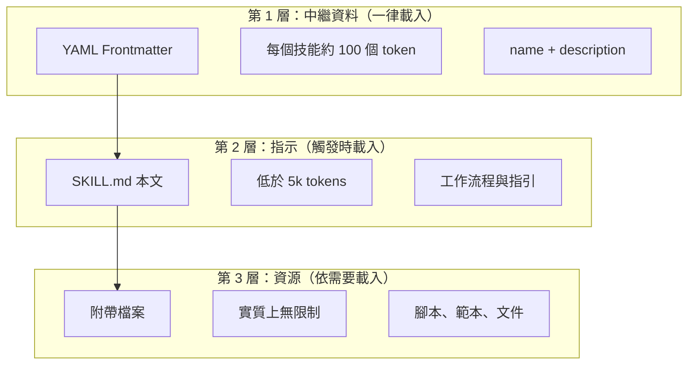
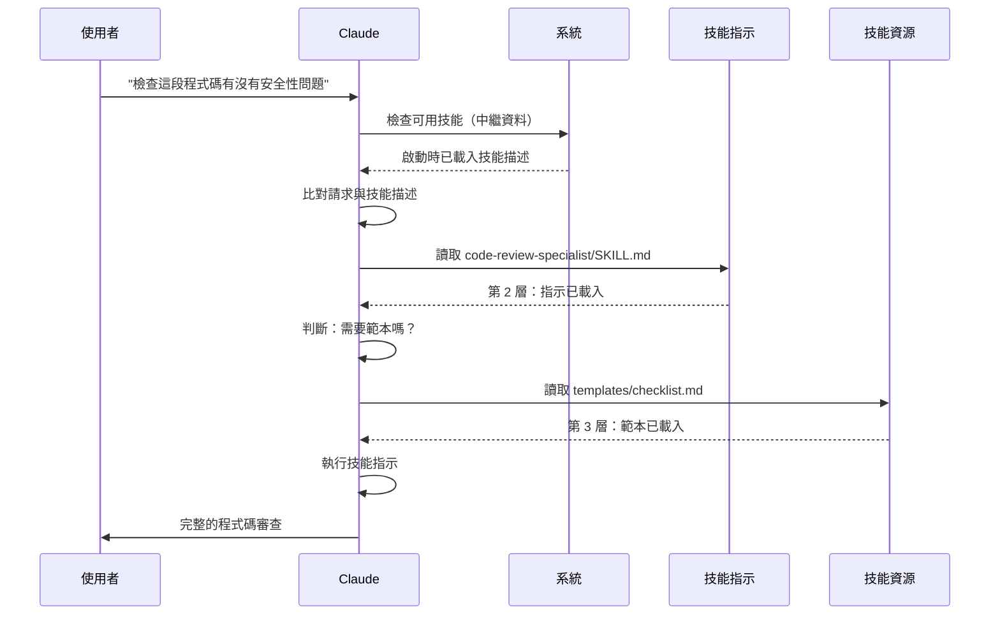

<picture>
  <source media="(prefers-color-scheme: dark)" srcset="../resources/logos/claude-code-tutorial-logo-dark.svg">
  
</picture>

# 技能指南（Agent Skills）

技能（Skills）是可重複使用、以檔案系統為基礎的能力，用來擴充 Claude 的功能。它們把特定領域的專業知識、工作流程與最佳實踐包裝成可探索的元件，讓 Claude 在相關時機自動使用。

## 總覽

**技能**是把泛用型代理轉變成專家的模組化能力。與提示詞（對話層級、用於一次性任務的指示）不同，技能會依需求載入，不必在多次對話中重複提供相同的指引。

### 主要優點

- **讓 Claude 專精**：針對特定領域任務調校能力
- **減少重複**：建立一次，就能在多次對話中自動使用
- **組合能力**：結合多個技能來建立複雜的工作流程
- **擴展工作流程**：跨多個專案與團隊重複使用技能
- **維持品質**：把最佳實踐直接嵌入你的工作流程

技能遵循 [Agent Skills](https://agentskills.io) 開放標準，可跨多種 AI 工具運作。Claude Code 在此標準之上擴充了額外功能，例如呼叫控制、子代理（Subagents）執行與動態上下文注入。

> **備註**：自訂斜線指令（Slash Commands）已合併到技能中。`.claude/commands/` 檔案仍可使用，並支援相同的 frontmatter 欄位。新開發建議改用技能。當兩者存在於相同路徑時（例如 `.claude/commands/review.md` 與 `.claude/skills/review/SKILL.md`），技能優先。

## 技能如何運作：漸進式揭露

技能採用漸進式揭露架構——Claude 依需要分階段載入資訊，而不是一開始就耗用大量上下文。這讓你能有效管理上下文，同時維持無限的可擴展性。

### 三層載入機制



| 層級 | 何時載入 | Token 成本 | 內容 |
|-------|------------|------------|---------|
| **第 1 層：中繼資料** | 一律載入（啟動時） | 每個技能約 100 個 token | YAML frontmatter 中的 `name` 與 `description` |
| **第 2 層：指示** | 技能被觸發時 | 低於 5k tokens | 含指示與指引的 SKILL.md 本文 |
| **第 3+ 層：資源** | 依需要載入 | 實質上無限制 | 透過 bash 執行的附帶檔案，內容不會載入上下文 |

這代表你可以安裝許多技能而不必付出上下文代價——在真正被觸發之前，Claude 只知道每個技能存在、以及何時該用它。

## 技能載入流程



## 技能類型與位置

| 類型 | 位置 | 範圍 | 共用 | 最適合 |
|------|----------|-------|--------|----------|
| **企業** | 受管設定 | 全組織使用者 | 是 | 全組織標準 |
| **個人** | `~/.claude/skills/<skill-name>/SKILL.md` | 個人 | 否 | 個人工作流程 |
| **專案** | `.claude/skills/<skill-name>/SKILL.md` | 團隊 | 是（透過 git） | 團隊標準 |
| **外掛（Plugins）** | `<plugin>/skills/<skill-name>/SKILL.md` | 啟用的地方 | 視情況 | 隨外掛一併提供 |

當不同層級出現同名技能時，優先權較高的位置勝出：**企業 > 個人 > 專案**。個人技能預設會覆蓋專案技能；`skillOverrides` 設定（v2.1.129+）可以調整這個行為——見〈[控制技能覆蓋行為](#控制技能覆蓋行為skilloverrides)〉。外掛技能使用 `plugin-name:skill-name` 的命名空間，因此不會互相衝突。

> **子代理技能探索（v2.1.133+）**：子代理現在會透過 Skill 工具，以和主要工作階段（session）相同的方式探索專案、使用者與外掛技能。較舊版本只讓子代理使用自己內建的一組技能，導致技能＋子代理的工作流程悄悄失效；從 v2.1.133 起，兩者能看到相同的技能目錄。

### 自動探索

**巢狀目錄**：當你在子目錄中處理檔案時，Claude Code 會自動從巢狀的 `.claude/skills/` 目錄探索技能。例如，如果你正在編輯 `packages/frontend/` 底下的檔案，Claude Code 也會在 `packages/frontend/.claude/skills/` 中尋找技能。這支援了套件各自擁有技能的 monorepo 架構。從 v2.1.178 起，當巢狀 `.claude/skills/` 目錄之間出現同名技能衝突時，**離你目前工作目錄最近的目錄勝出**——套件層級的技能會覆蓋同名的儲存庫根目錄技能。

**`--add-dir` 目錄**：透過 `--add-dir` 加入的目錄中的技能會自動載入，並具備即時變更偵測。對這些目錄中技能檔案的任何修改，不必重啟 Claude Code 即可立即生效。

**重新載入技能**：`/reload-skills` 指令（v2.1.152 新增）會重新掃描所有技能目錄而不必重啟工作階段——適合用在新增或編輯了未被即時偵測抓到的技能之後。`SessionStart` Hook 也可以透過回傳 `reloadSkills: true` 來觸發同樣的重新掃描（見〈[Hooks](../06-hooks/README.md)〉）。

**描述預算**：技能描述（第 1 層中繼資料）上限為**上下文視窗的 1%**（後備上限：**8,000 字元**）。如果你安裝了很多技能，描述可能會被縮短。所有技能名稱一律會被包含，但描述會被裁切以符合預算。請把關鍵使用情境放在描述的最前面。可用 `SLASH_COMMAND_TOOL_CHAR_BUDGET` 環境變數覆蓋這個預算。

## 建立自訂技能

### 基本目錄結構

```
my-skill/
├── SKILL.md           # 主要指示（必要）
├── template.md        # 給 Claude 填寫的範本
├── examples/
│   └── sample.md      # 展示預期格式的範例輸出
└── scripts/
    └── validate.sh    # Claude 可以執行的腳本
```

### SKILL.md 格式

```yaml
---
name: your-skill-name
description: 這個技能做什麼、以及何時使用它的簡短描述
---

# 你的技能名稱

## 指示
給 Claude 提供清楚、按步驟的指引。

## 範例
展示使用這個技能的具體範例。
```

### 建議欄位

- **description**（建議）：技能做什麼**以及**何時使用它。若省略，Claude Code 會使用 markdown 內容的第一段。`description` 與 `when_to_use` 合併後的文字，在技能清單中會被截斷為**1,536 個字元**（可透過 `skillListingMaxDescChars` 設定）。Claude 就是靠這段文字來判斷何時啟用這個技能。
- **name**（非必要）：預設為技能的**目錄名稱**。若有提供，會設定顯示名稱——只能用小寫字母、數字、連字號（最多 64 個字元），且不能包含「anthropic」或「claude」。對外掛技能來說，`name` 也會決定指令的最後一段。

所有 SKILL.md frontmatter 欄位都是非必要的；只有 `description` 是建議填寫的。

### 非必要的 Frontmatter 欄位

```yaml
---
name: my-skill
description: 這個技能做什麼、以及何時使用它
argument-hint: "[filename] [format]"        # 自動完成用的提示
disable-model-invocation: true              # 只有使用者能呼叫
user-invocable: false                       # 不出現在斜線選單中
allowed-tools: Read, Grep, Glob             # 限制可用的工具
disallowed-tools: Write, Edit               # 啟用期間移除特定工具（v2.1.152）
model: opus                                 # 指定要使用的模型
effort: high                                # Effort 等級覆蓋（low、medium、high、xhigh、max）
context: fork                               # 在隔離的子代理中執行
agent: Explore                              # 使用哪種代理類型（搭配 context: fork）
background: false                           # fork 技能預設在背景執行（true）；false = 在前景執行
shell: bash                                 # 指令用的 shell：bash（預設）或 powershell
hooks:                                      # 技能範圍的 Hooks
  PreToolUse:
    - matcher: "Bash"
      hooks:
        - type: command
          command: "./scripts/validate.sh"
paths: "src/api/**/*.ts"               # 限制技能何時啟動的 glob 模式
---
```

| 欄位 | 說明 |
|-------|-------------|
| `name` | 只能用小寫字母、數字、連字號（最多 64 個字元）。不能包含「anthropic」或「claude」。 |
| `description` | 這個技能做什麼、以及何時使用它。`description` 與 `when_to_use` 合併後的文字，在技能清單中會被截斷為 1,536 個字元（可透過 `skillListingMaxDescChars` 設定）。這對自動呼叫的比對至關重要。 |
| `when_to_use` | Claude 何時該呼叫這個技能的補充說明。會附加在技能清單的 `description` 之後，並計入 1,536 字元的上限。 |
| `argument-hint` | 顯示在 `/` 自動完成選單中的提示（例如 `"[filename] [format]"`）。 |
| `disable-model-invocation` | `true` = 只有使用者能透過 `/name` 呼叫。Claude 永遠不會自動呼叫。 |
| `user-invocable` | `false` = 從 `/` 選單中隱藏。只有 Claude 能自動呼叫它。 |
| `allowed-tools` | 這個技能可以不經權限提示直接使用的工具清單（以逗號分隔）。 |
| `disallowed-tools` | 技能啟用期間要移除的工具清單（以逗號分隔，與 `allowed-tools` 互補）。v2.1.152 新增。 |
| `model` | 技能啟用期間覆蓋使用的模型（例如 `opus`、`sonnet`）。 |
| `effort` | 技能啟用期間覆蓋的 Effort 等級：`low`、`medium`、`high`、`xhigh` 或 `max`——Opus 5、Sonnet 5、Opus 4.8 與 Opus 4.7 都支援全部五種。除了 Opus 4.7 預設為 `xhigh` 之外，其他支援 effort 的模型預設都是 `high`。 |
| `context` | 設為 `fork` 會在有獨立上下文視窗的 fork 子代理上下文中執行這個技能。 |
| `agent` | `context: fork` 時使用的子代理類型（例如 `Explore`、`Plan`、`general-purpose`）。 |
| `background` | 只有在搭配 `context: fork` 時才有意義。`context: fork` 技能預設為 `true`，因此會在背景執行；設為 `false` 可改在前景執行。v2.1.218 新增。 |
| `shell` | `` !`command` `` 替換與腳本使用的 shell：`bash`（預設）或 `powershell`。 |
| `hooks` | 綁定在這個技能生命週期上的 Hooks（格式與全域 Hooks 相同）。 |
| `paths` | 限制技能何時自動啟動的 glob 模式。可用逗號分隔的字串或 YAML 清單。格式與路徑專屬規則相同。 |
| `arguments` | 宣告這個技能接受的引數，供自動完成與引數替換使用。 |
| `metadata` | 給你自己記錄用的自由格式鍵值對（例如 `version`、`author`）。Claude Code 會原樣傳遞。 |
| `license` | 這個技能的授權識別字（例如 `MIT`）。 |
| `compatibility` | 自由格式的相容性說明，最多 500 個字元。Claude Code 會接受它，但不會依此做任何動作。 |

> **備註**：上傳到 claude.ai 或透過 Skills API 建立的技能，只有 `name`、`description`、`license`、`compatibility`、`metadata` 與 `allowed-tools` 有效。這張表中的其他欄位是 Claude Code 專屬的。

從 v2.1.218 起，布林值的 frontmatter 欄位除了 `true`/`false`，也接受 `yes`/`no`、`on`/`off` 與 `1`/`0`（不分大小寫）。

## 技能內容類型

技能可以包含兩種內容類型，各自適合不同用途：

### 參考內容

補充 Claude 套用在你目前工作上的知識——慣例、模式、風格指南、領域知識。會直接併入你的對話上下文執行。

```yaml
---
name: api-conventions
description: 這個程式碼庫的 API 設計模式
---

撰寫 API 端點時：
- 使用 RESTful 命名慣例
- 回傳一致的錯誤格式
- 加入請求驗證
```

### 任務內容

針對特定動作的按步驟指示。通常直接用 `/skill-name` 呼叫。

```yaml
---
name: deploy
description: 把應用程式部署到生產環境
context: fork
disable-model-invocation: true
---

部署應用程式：
1. 執行測試套件
2. 建置應用程式
3. 推送到部署目標
```

## 控制技能呼叫方式

預設情況下，你和 Claude 都能呼叫任何技能。有兩個 frontmatter 欄位可以控制三種呼叫模式：

| Frontmatter | 你能呼叫 | Claude 能呼叫 |
|---|---|---|
| （預設） | 是 | 是 |
| `disable-model-invocation: true` | 是 | 否 |
| `user-invocable: false` | 否 | 是 |

**使用 `disable-model-invocation: true`** 來處理有副作用的工作流程：`/commit`、`/deploy`、`/send-slack-message`。你不會希望 Claude 因為覺得程式碼看起來準備好了，就自己決定要部署。

**使用 `user-invocable: false`** 來處理不適合當成指令執行的背景知識。`legacy-system-context` 這類技能用來說明舊系統如何運作——對 Claude 有用，但對使用者來說不是有意義的動作。

## 字串替換

技能支援在內容送達 Claude 之前解析的動態值：

| 變數 | 說明 |
|----------|-------------|
| `$ARGUMENTS` | 呼叫技能時傳入的所有引數 |
| `$ARGUMENTS[N]` 或 `$N` | 依索引（從 0 開始）存取特定引數 |
| `${CLAUDE_SESSION_ID}` | 目前的工作階段 ID |
| `${CLAUDE_SKILL_DIR}` | 該技能 SKILL.md 檔案所在的目錄 |
| `${CLAUDE_PROJECT_DIR}` | 專案根目錄的絕對路徑。可用在技能本文與 `allowed-tools` 中（v2.1.196） |
| `${CLAUDE_EFFORT}` | 目前的 Effort 等級（`low`、`medium`、`high`、`xhigh` 或 `max`）。適合用來分支技能行為，例如：`[ "${CLAUDE_EFFORT}" = "max" ] && deep_analysis`（v2.1.120+） |
| `` !`command` `` | 動態上下文注入——執行一個 shell 指令並內嵌其輸出 |

**範例：**

```yaml
---
name: fix-issue
description: 修正一個 GitHub issue
---

依照我們的程式碼標準修正 GitHub issue $ARGUMENTS。
1. 讀取 issue 描述
2. 實作修正
3. 撰寫測試
4. 建立提交
```

執行 `/fix-issue 123` 會把 `$ARGUMENTS` 替換成 `123`。

### 堆疊技能

你可以在一次呼叫中堆疊多個斜線技能，例如 `/code-review /fix-issue 123`。從 v2.1.199 起，這會載入**所有**排在前面的技能——第一個加上最多 5 個——並把後面的引數（`123`）傳給每一個技能；先前的版本只會載入第一個技能。如果同一個技能被呼叫超過一次，其相同的內容會被去除重複（v2.1.202），而不是附加兩次。

## 注入動態上下文

`` !`command` `` 語法會在技能內容送到 Claude 之前執行 shell 指令：

```yaml
---
name: pr-summary
description: 摘要一個 pull request 中的變更
context: fork
agent: Explore
---

## Pull Request 上下文
- PR 差異：!`gh pr diff`
- PR 留言：!`gh pr view --comments`
- 變更的檔案：!`gh pr diff --name-only`

## 你的任務
摘要這個 pull request……
```

指令會立即執行；Claude 只會看到最終輸出。預設情況下，指令在 `bash` 中執行。在 frontmatter 中設定 `shell: powershell` 可以改用 PowerShell。

## 在子代理中執行技能

加上 `context: fork` 可以讓技能在隔離的子代理上下文中執行。技能內容會變成一個專屬子代理的任務，該子代理有自己的上下文視窗，讓主要對話保持乾淨。從 v2.1.218 起，`context: fork` 技能的 `background` 預設為 `true`，因此會在背景執行；在 frontmatter 中設定 `background: false` 可以改讓 fork 技能在前景執行。

> **v2.1.145 修正**：使用 `context: fork` 的技能，先前在少數情況下可能觸發無限重複呼叫的迴圈。如果你撰寫或依賴 fork 技能，請升級到 v2.1.145 以上版本。

`agent` 欄位指定要使用哪一種代理類型：

| 代理類型 | 最適合 |
|---|---|
| `Explore` | 唯讀研究、程式碼庫分析 |
| `Plan` | 建立實作計畫 |
| `general-purpose` | 需要所有工具的廣泛任務 |
| 自訂代理 | 在你的設定中定義的專屬代理 |

**Frontmatter 範例：**

```yaml
---
context: fork
agent: Explore
---
```

**完整技能範例：**

```yaml
---
name: topic-research
description: 深入研究一個主題
context: fork
agent: Explore
---

徹底研究 $ARGUMENTS：
1. 用 Glob 和 Grep 找出相關檔案
2. 讀取並分析程式碼
3. 用具體的檔案參照來總結發現
```

## 實際範例

### 範例 1：程式碼審查技能

**目錄結構：**

```
~/.claude/skills/code-review-specialist/
├── SKILL.md
├── templates/
│   ├── review-checklist.md
│   └── finding-template.md
└── scripts/
    ├── analyze-metrics.py
    └── compare-complexity.py
```

**檔案：** `~/.claude/skills/code-review-specialist/SKILL.md`

```yaml
---
name: code-review-specialist
description: 全方位程式碼審查，涵蓋安全性、效能與品質分析。使用時機：使用者要求審查程式碼、分析程式碼品質、評估 pull request，或提到程式碼審查、安全性分析、效能最佳化。
---

# 程式碼審查技能

這個技能提供全方位的程式碼審查能力，聚焦於：

1. **安全性分析**
   - 身分驗證／授權問題
   - 資料外洩風險
   - 注入攻擊漏洞
   - 密碼學弱點

2. **效能審查**
   - 演算法效率（Big O 分析）
   - 記憶體最佳化
   - 資料庫查詢最佳化
   - 快取機會

3. **程式碼品質**
   - SOLID 原則
   - 設計模式
   - 命名慣例
   - 測試涵蓋率

4. **可維護性**
   - 程式碼可讀性
   - 函式長度（應少於 50 行）
   - 循環複雜度
   - 型別安全

## 審查範本

針對審查的每一段程式碼，請提供：

### 摘要
- 整體品質評分（1-5）
- 主要發現數量
- 建議優先處理的區域

### 重大問題（如果有）
- **問題**：清楚的描述
- **位置**：檔案與行號
- **影響**：為什麼這件事重要
- **嚴重程度**：Critical／High／Medium
- **修正**：程式碼範例

詳細的檢查清單見〈[templates/review-checklist.md](templates/review-checklist.md)〉。
```

### 範例 2：程式碼庫視覺化技能

一個會產生互動式 HTML 視覺化圖表的技能：

**目錄結構：**

```
~/.claude/skills/codebase-visualizer/
├── SKILL.md
└── scripts/
    └── visualize.py
```

**檔案：** `~/.claude/skills/codebase-visualizer/SKILL.md`

````yaml
---
name: codebase-visualizer
description: 產生你程式碼庫的互動式可收合樹狀視覺化圖表。使用時機：探索新的儲存庫、了解專案結構，或找出過大的檔案。
allowed-tools: Bash(python *)
---

# 程式碼庫視覺化工具

產生一個顯示你專案檔案結構的互動式 HTML 樹狀檢視畫面。

## 用法

從專案根目錄執行視覺化腳本：

```bash
python ~/.claude/skills/codebase-visualizer/scripts/visualize.py .
```

這會建立 `codebase-map.html`，並用你的預設瀏覽器開啟它。

## 視覺化畫面顯示的內容

- **可收合的目錄**：點擊資料夾可展開／收合
- **檔案大小**：顯示在每個檔案旁邊
- **顏色**：不同檔案類型使用不同顏色
- **目錄總計**：顯示每個資料夾的總大小
````

附帶的 Python 腳本負責繁重的運算工作，Claude 則負責協調整體流程。

### 範例 3：部署技能（僅限使用者呼叫）

```yaml
---
name: deploy
description: 把應用程式部署到生產環境
disable-model-invocation: true
allowed-tools: Bash(npm *), Bash(git *)
---

把 $ARGUMENTS 部署到生產環境：

1. 執行測試套件：`npm test`
2. 建置應用程式：`npm run build`
3. 推送到部署目標
4. 確認部署成功
5. 回報部署狀態
```

### 範例 4：品牌語調技能（背景知識）

```yaml
---
name: brand-voice
description: 確保所有溝通內容都符合品牌語調與風格準則。使用時機：撰寫行銷文案、客戶溝通內容，或對外公開內容。
user-invocable: false
---

## 語調
- **友善但專業** - 平易近人但不隨便
- **清楚簡潔** - 避免術語
- **有自信** - 我們知道自己在做什麼
- **同理心** - 理解使用者的需求

## 撰寫準則
- 稱呼讀者時使用「你」
- 使用主動語態
- 句子維持在 20 個字以內
- 以價值主張開頭

範本請見〈[templates/](templates/)〉。
```

### 範例 5：CLAUDE.md 產生器技能

```yaml
---
name: claude-md
description: 依照最佳實踐建立或更新 CLAUDE.md 檔案，讓 AI 代理能以最佳方式融入專案。使用時機：使用者提到 CLAUDE.md、專案文件，或 AI 上手引導。
---

## 核心原則

**LLM 是無狀態的**：CLAUDE.md 是唯一會自動納入每個對話的檔案。

### 黃金原則

1. **少即是多**：保持在 300 行以內（理想上少於 100 行）
2. **通用適用性**：只納入每一個工作階段都會用到的資訊
3. **不要把 Claude 當 linter 用**：改用確定性的工具
4. **絕不自動產生**：親自仔細琢磨撰寫

## 必要章節

- **專案名稱**：簡短的一行描述
- **技術堆疊**：主要語言、框架、資料庫
- **開發指令**：安裝、測試、建置指令
- **關鍵慣例**：只列出不明顯但影響重大的慣例
- **已知問題／眉角**：容易讓開發者踩雷的地方
```

### 範例 6：附帶腳本的重構技能

**目錄結構：**

```
refactor/
├── SKILL.md
├── references/
│   ├── code-smells.md
│   └── refactoring-catalog.md
├── templates/
│   └── refactoring-plan.md
└── scripts/
    ├── analyze-complexity.py
    └── detect-smells.py
```

**檔案：** `refactor/SKILL.md`

```yaml
---
name: refactor
description: 依據 Martin Fowler 的方法論進行系統化程式碼重構。使用時機：使用者要求重構程式碼、改善程式碼結構、減少技術債，或消除程式碼異味。
---

# 程式碼重構技能

一套強調由測試撐腰、安全漸進式變更的分階段做法。

## 工作流程

第 1 階段：研究與分析 → 第 2 階段：測試涵蓋率評估 →
第 3 階段：程式碼異味辨識 → 第 4 階段：擬定重構計畫 →
第 5 階段：漸進式實作 → 第 6 階段：審閱與反覆修正

## 核心原則

1. **行為不變**：外部行為必須維持不變
2. **小步前進**：進行微小、可測試的變更
3. **測試驅動**：測試是安全網
4. **持續進行**：重構是持續進行的事，不是一次性的活動

程式碼異味目錄見〈[references/code-smells.md](references/code-smells.md)〉。
重構技巧見〈[references/refactoring-catalog.md](references/refactoring-catalog.md)〉。
```

## 附帶檔案

技能除了 `SKILL.md` 之外，還能在目錄中包含多個檔案。這些附帶檔案（範本、範例、腳本、參考文件）能讓你的主要技能檔案保持聚焦，同時讓 Claude 依需要載入額外資源。

```
my-skill/
├── SKILL.md              # 主要指示（必要，保持在 500 行以內）
├── templates/            # 給 Claude 填寫的範本
│   └── output-format.md
├── examples/             # 展示預期格式的範例輸出
│   └── sample-output.md
├── references/           # 領域知識與規格
│   └── api-spec.md
└── scripts/              # Claude 可以執行的腳本
    └── validate.sh
```

附帶檔案的指引：

- 讓 `SKILL.md` 保持在**500 行**以內。把詳細的參考資料、大量範例與規格移到獨立的檔案中。
- 在 `SKILL.md` 中用**相對路徑**參照其他檔案（例如 `[API reference](references/api-spec.md)`）。
- 附帶檔案會在第 3 層（依需要）載入，因此在 Claude 實際讀取它們之前不會耗用上下文。

## 管理技能

### 查看可用技能

直接問 Claude：
```
有哪些技能可以用？
```

或檢查檔案系統：
```bash
# 列出個人技能
ls ~/.claude/skills/

# 列出專案技能
ls .claude/skills/
```

> **提示（v2.1.121+）：** 輸入文字可以過濾 `/skills` 互動選單——在安裝了很多技能時很好用。

### 測試技能

有兩種測試方式：

**讓 Claude 自動呼叫**：提出符合描述的請求：
```
可以幫我檢查這段程式碼有沒有安全性問題嗎？
```

**或直接用技能名稱呼叫**：
```
/code-review-specialist src/auth/login.ts
```

> **備註**：這個本機技能安裝為 `code-review-specialist`，因此**不會**與內建的 `/code-review` 指令（改名自 `/simplify`，隨 Claude Code v2.1.146 推出）衝突。如果你把它改成複製到 `~/.claude/skills/code-review/`，就會蓋掉內建指令——保留 `-specialist` 這個後綴可以避免這個問題。

### 更新技能

直接編輯 `SKILL.md` 檔案，然後執行 `/reload-skills`（v2.1.152+）重新掃描技能目錄。重啟 Claude Code 也可以，但不是必要的——`--add-dir` 目錄中的技能會即時被抓到，`SessionStart` Hook 回傳 `reloadSkills: true` 也會觸發同樣的重新掃描。

```bash
# 個人技能
code ~/.claude/skills/my-skill/SKILL.md

# 專案技能
code .claude/skills/my-skill/SKILL.md
```

### 限制 Claude 的技能存取權

有三種方式可以控制 Claude 能呼叫哪些技能：

**停用所有技能**，在 `/permissions` 中：
```
# 加入拒絕規則：
Skill
```

**允許或拒絕特定技能**：
```
# 只允許特定技能
Skill(commit)
Skill(review-pr *)

# 拒絕特定技能
Skill(deploy *)
```

**隱藏個別技能**：在其 frontmatter 中加上 `disable-model-invocation: true`。

### 控制技能覆蓋行為（`skillOverrides`）

當專案技能與使用者技能同名時，預設專案技能勝出。`skillOverrides` 設定（v2.1.129+）能讓你調整這個行為。把它加到 `~/.claude/settings.json` 或專案的 `.claude/settings.json`：

```json
{
  "skillOverrides": "name-only"
}
```

可接受的值：

| 值 | 行為 |
|-------|----------|
| `"on"`（預設） | 儲存庫技能可以覆蓋同名的使用者技能。 |
| `"off"` | 完全停用覆蓋——使用者技能一律勝出。 |
| `"name-only"` | 只依技能名稱比對覆蓋（忽略描述／來源）。 |
| `"user-invocable-only"` | 只有使用者可呼叫的技能可以被覆蓋——由模型呼叫的技能一律使用原本的位置。 |

適合用在團隊政策要求「使用者定義的技能一律優先」（`"off"`）或「只允許狹義的名稱比對覆蓋」（`"name-only"`）的情況。

## 最佳實踐

### 1. 讓描述更具體

- **不好（模糊）**：「協助處理文件」
- **好（具體）**：「從 PDF 檔案中擷取文字與表格、填寫表單、合併文件。使用時機：處理 PDF 檔案，或使用者提到 PDF、表單、文件擷取時。」

### 2. 讓技能保持聚焦

- 一個技能 = 一種能力
- ✅「PDF 表單填寫」
- ❌「文件處理」（太籠統）

### 3. 加入觸發用語

在描述中加入符合使用者請求的關鍵字：
```yaml
description: 分析 Excel 試算表、產生樞紐分析表、建立圖表。使用時機：處理 Excel 檔案、試算表或 .xlsx 檔案。
```

### 4. 讓 SKILL.md 保持在 500 行以內

把詳細的參考資料移到 Claude 依需要載入的獨立檔案中。

### 5. 參照附帶檔案

```markdown
## 延伸資源

- 完整 API 細節見 [reference.md](reference.md)
- 用法範例見 [examples.md](examples.md)
```

### 建議做法

- 使用清楚、具描述性的名稱
- 附上完整的指示
- 加入具體的範例
- 把相關的腳本與範本打包在一起
- 用真實情境測試
- 記錄相依套件

### 避免做法

- 不要為一次性任務建立技能
- 不要重複既有的功能
- 不要讓技能太籠統
- 不要省略 description 欄位
- 不要在未經審查的情況下安裝來路不明的技能

## 疑難排解

### 快速參考

| 問題 | 解決方法 |
|-------|----------|
| Claude 沒有使用技能 | 讓描述更具體，加入觸發用語 |
| 找不到技能檔案 | 確認路徑：`~/.claude/skills/name/SKILL.md` |
| YAML 錯誤 | 檢查 `---` 標記、縮排，不能有 tab |
| 技能互相衝突 | 在描述中使用不同的觸發用語 |
| 腳本無法執行 | 檢查權限：`chmod +x scripts/*.py` |
| Claude 沒看到所有技能 | 技能太多；用 `/context` 檢查警告，再執行 `/skill-doctor`（v2.1.252+）查看哪些技能沒被用到、各佔用多少成本 |

### 技能沒有被觸發

如果 Claude 沒有在預期情況下使用你的技能：

1. 檢查描述是否包含使用者自然會說出的關鍵字
2. 問「有哪些技能可以用？」確認技能有出現
3. 試著改用符合描述的方式重新表達你的請求
4. 直接用 `/skill-name` 呼叫來測試

### 技能太常被觸發

如果 Claude 在你不希望的情況下使用了你的技能：

1. 讓描述更具體
2. 加上 `disable-model-invocation: true` 改為僅限手動呼叫

### Claude 沒看到所有技能

技能描述會載入至**上下文視窗的 1%**（後備上限：**8,000 字元**）。不論預算多少，每個項目都上限 250 字元。執行 `/context` 可以檢查是否有技能被排除的警告。可用 `SLASH_COMMAND_TOOL_CHAR_BUDGET` 環境變數覆蓋這個預算。

## 安全性考量

**只使用來自可信來源的技能。** 技能透過指示與程式碼賦予 Claude 能力——惡意技能可能會引導 Claude 以有害的方式呼叫工具或執行程式碼。

**關鍵安全性考量：**

- **徹底審查**：檢視技能目錄中的所有檔案
- **外部來源有風險**：從外部 URL 擷取內容的技能可能已遭入侵
- **工具濫用**：惡意技能可能以有害的方式呼叫工具
- **視同安裝軟體**：只使用來自可信來源的技能

### 停用技能中的 shell 替換功能

技能支援 `` !`command` `` 語法，可以在 Claude 看到提示詞之前，把 shell 指令的輸出注入其中。在安全敏感的環境中（共用的企業部署、鎖定的 CI 執行環境），你可以透過 `disableSkillShellExecution` 設定（**v2.1.91** 新增）完全停用這個替換功能：

```jsonc
// ~/.claude/settings.json 或受管政策
{
  "disableSkillShellExecution": true
}
```

當 `disableSkillShellExecution` 為 `true` 時，技能中任何 `` !`command` `` 標記都會被當成純文字保留，不會被執行——這可以移除技能層級的 shell 注入攻擊面，同時不必停用技能本身。建議搭配 `allowedTools` 允許清單，形成多層防禦。

### 隱藏隨附技能（`disableBundledSkills`）

`disableBundledSkills` 設定（**v2.1.169** 新增）會讓模型看不到 Claude Code 隨附的技能、工作流程與指令。適合在內建技能對特定專案來說是干擾時使用，或用來減少模型可見的技能範圍：

```jsonc
// ~/.claude/settings.json 或專案的 .claude/settings.json
{
  "disableBundledSkills": true
}
```

對應的環境變數形式為：

```bash
export CLAUDE_CODE_DISABLE_BUNDLED_SKILLS=1
```

## 技能與其他功能比較

| 功能 | 呼叫方式 | 最適合 |
|---------|------------|----------|
| **技能** | 自動或 `/name` | 可重複使用的專業能力、工作流程 |
| **斜線指令** | 使用者主動輸入 `/name` | 快速捷徑（已併入技能） |
| **子代理** | 自動委派 | 隔離的任務執行 |
| **記憶（Memory）（CLAUDE.md）** | 一律載入 | 持久化的專案上下文 |
| **MCP** | 即時 | 存取外部資料／服務 |
| **Hooks** | 事件驅動 | 自動化的副作用 |

## 隨附技能

Claude Code 隨附一組不必安裝就能一律使用的內建技能（下面列出最常用的一些；完整清單見〈[指令參考](https://code.claude.com/docs/en/commands)〉）：

| 技能 | 說明 |
|-------|-------------|
| `/batch <instruction>` | 使用 git worktree 跨程式碼庫協調大規模的平行變更 |
| `/claude-api` | 載入 Claude API／SDK 參考文件；在偵測到 `anthropic`／`@anthropic-ai/sdk` 匯入時自動啟動 |
| `/dataviz` | 圖表與儀表板設計指南，附可執行的配色驗證工具（v2.1.198） |
| `/debug [description]` | 讀取除錯記錄，排解目前工作階段的問題 |
| `/deep-research <topic>` | 針對某個主題執行深入研究（自 v2.1.218 起僅能明確呼叫——Claude 不會自行觸發） |
| `/fewer-permission-prompts` | 掃描逐字稿，針對常見的唯讀工具提出優先順序排列的允許清單 |
| `/loop [interval] <prompt>` | 依間隔重複執行提示詞（例如 `/loop 5m check the deploy`） |
| `/run` *(v2.1.145+)* | 啟動此專案的應用程式，查看變更執行情形——會先找專案自己的技能，找不到才回退到依專案類型內建的模式 |
| `/run-skill-generator` *(v2.1.145+)* | 為特定專案產生專屬技能，教導 `/run`／`/verify` 如何處理該專案 |
| `/code-review [effort]` | 以選定的投入等級審查目前的 diff，找出正確性方面的錯誤（例如 `/code-review high`）；傳入 `--comment` 可以行內留言方式張貼到 PR。這是與 `/simplify`（品質／重用清理）不同的技能，兩者在 v2.1.154 又拆回獨立指令。（自 v2.1.215 起僅能明確呼叫——Claude 不會自行觸發）自 v2.1.218 起，它會以背景子代理的形式執行，因此審查工作不再佔滿你的對話，堆疊的斜線指令仍會是它的審查目標。 |
| `/simplify` | 僅做整理性的審查——重用、簡化、效率、視角——並套用修正。v2.1.154 從 `/code-review` 拆回獨立指令 |
| `/verify` *(v2.1.145+)* | 建置、執行並觀察應用程式，以確認修正是否有效（不只是測試通過）（自 v2.1.215 起僅能明確呼叫——Claude 不會自行觸發） |

這些技能開箱即用，不需要安裝或設定。它們遵循和自訂技能相同的 SKILL.md 格式。

## 分享技能

### 專案技能（團隊共用）

1. 在 `.claude/skills/` 中建立技能
2. 提交到 git
3. 團隊成員拉取變更——技能立即可用

### 個人技能

```bash
# 複製到個人目錄
cp -r my-skill ~/.claude/skills/

# 讓腳本可執行
chmod +x ~/.claude/skills/my-skill/scripts/*.py
```

### 外掛散布

把技能打包進外掛的 `skills/` 目錄，以擴大散布範圍。

## 更進一步：一套技能收藏庫與一套技能管理工具

當你開始認真建立技能，有兩件事會變得不可或缺：一套已驗證的技能庫，以及管理它們的工具。

**[kevin801221/skills](https://github.com/kevin801221/skills)** — 我幾乎在所有專案中每天都會用到的一套技能收藏。其中值得一提的有 `logo-designer`（即時產生專案標誌）與 `ollama-optimizer`（為你的硬體調校本機 LLM 效能）。如果你想要現成可用的技能，這是很好的起點。

**[kevin801221/asm](https://github.com/kevin801221/asm)** — Agent Skill Manager（代理技能管理工具）。處理技能開發、重複偵測與測試。`asm link` 指令能讓你在任何專案中測試技能，不必到處複製檔案——一旦你的技能數量超過幾個，這個工具就不可或缺。

## 延伸資源

- [官方技能文件](https://code.claude.com/docs/en/skills)
- [Agent Skills 架構部落格文章](https://claude.com/blog/equipping-agents-for-the-real-world-with-agent-skills)
- [技能收藏庫](https://github.com/kevin801221/skills) - 現成可用技能的收藏
- [斜線指令指南](../01-slash-commands/) - 使用者主動呼叫的捷徑
- [子代理指南](../04-subagents/) - 委派任務的 AI 代理
- [記憶指南](../02-memory/) - 持久化上下文
- [MCP（Model Context Protocol）](../05-mcp/) - 即時的外部資料
- [Hooks 指南](../06-hooks/) - 事件驅動的自動化

---

**最後更新**：2026 年 9 月 6 日
**Claude Code 版本**：2.1.263
**資料來源**：
- https://code.claude.com/docs/en/skills
- https://code.claude.com/docs/en/slash-commands
- https://github.com/anthropics/claude-code/blob/main/CHANGELOG.md
- https://code.claude.com/docs/en/model-config
**相容模型**：Claude Fable 5, Claude Opus 5, Claude Sonnet 5, Claude Sonnet 4.6, Claude Opus 4.8, Claude Haiku 4.5
