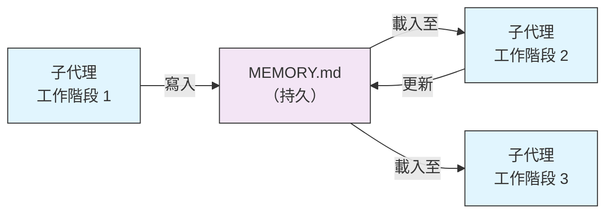
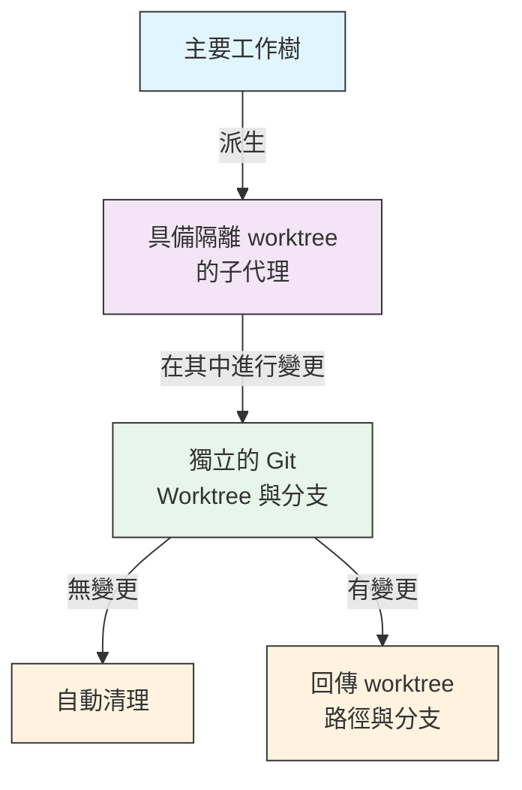
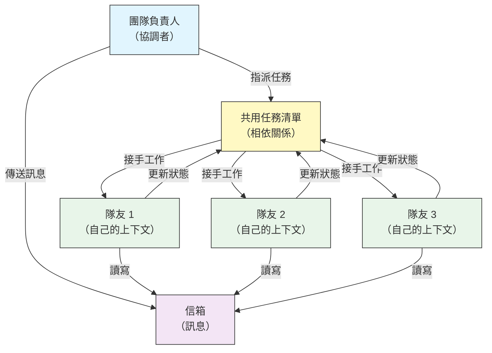
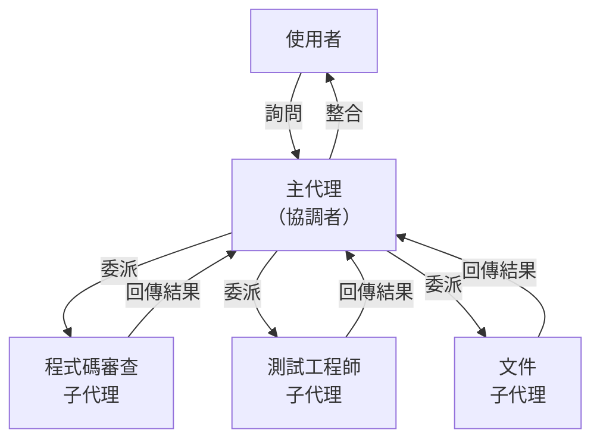
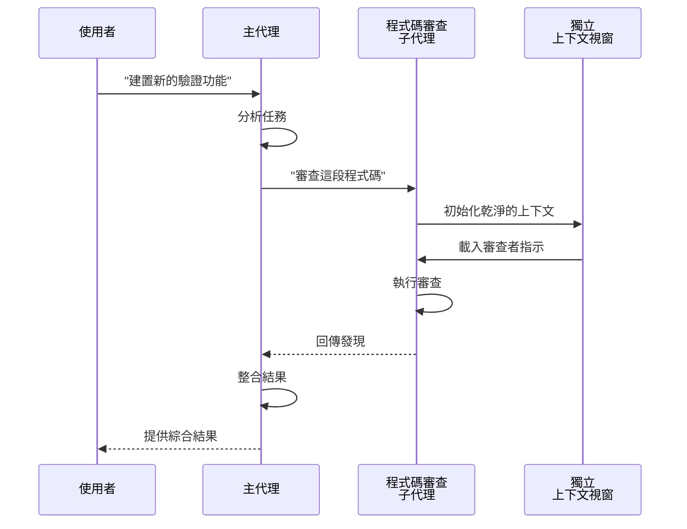
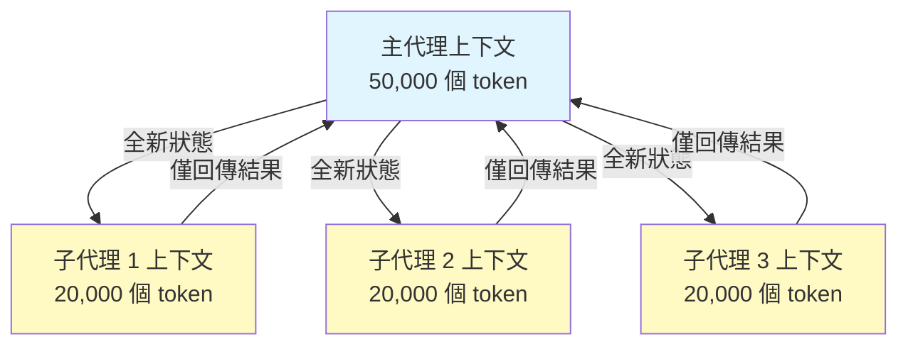
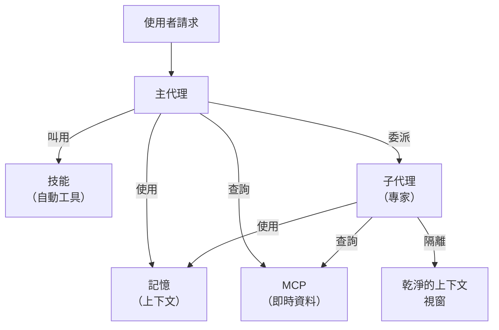

<picture>
  <source media="(prefers-color-scheme: dark)" srcset="../resources/logos/claude-code-tutorial-logo-dark.svg">
  
</picture>

# 子代理 - 完整參考指南

子代理（Subagents）是 Claude Code 可以委派任務的專責 AI 助理。每個子代理都有明確用途，使用與主對話分開的獨立上下文視窗，並可設定專屬工具與自訂系統提示詞。

## 目錄

1. [總覽](#總覽)
2. [主要優點](#主要優點)
3. [檔案位置](#檔案位置)
4. [設定](#設定)
5. [內建子代理](#內建子代理)
6. [管理子代理](#管理子代理)
7. [使用子代理](#使用子代理)
8. [可恢復的代理](#可恢復的代理)
9. [串接子代理](#串接子代理)
10. [子代理的持久記憶](#子代理的持久記憶)
11. [背景子代理](#背景子代理)
12. [Worktree 隔離](#worktree-隔離)
13. [Fork 子代理](#fork-子代理)
14. [限制可派生的子代理](#限制可派生的子代理)
15. [`claude agents` CLI 指令](#claude-agents-cli-指令)
16. [代理團隊（實驗性）](#代理團隊實驗性)
17. [外掛子代理安全性](#外掛子代理安全性)
18. [架構](#架構)
19. [上下文管理](#上下文管理)
20. [何時該用子代理](#何時該用子代理)
21. [最佳實踐](#最佳實踐)
22. [本資料夾中的範例子代理](#本資料夾中的範例子代理)
23. [安裝說明](#安裝說明)
24. [檔案結構](#檔案結構)
25. [相關概念](#相關概念)
26. [可觀測性](#可觀測性)
27. [延伸資源](#延伸資源)

---

## 總覽

子代理讓 Claude Code 能委派任務執行，做法是：

- 建立擁有獨立上下文視窗的**隔離 AI 助理**
- 提供**客製化系統提示詞**以取得專業能力
- 執行**工具存取控管**以限制能力範圍
- 避免複雜任務造成**上下文污染**
- 讓多個專責任務能**平行執行**

每個子代理都獨立運作、從乾淨的狀態開始，只接收完成任務所需的特定上下文，再把結果回傳給主代理整合。

**快速開始**：請 Claude 幫你建立子代理（例如「建立一個檢查安全性的子代理」），或直接新增 `.claude/agents/<name>.md` 檔案——詳見下方[管理子代理](#管理子代理)。

> **備註**：自 v2.1.198 起，`/agents` 指令不再開啟互動式建立精靈。請改為請 Claude 建立，或直接編輯 `.claude/agents/` 檔案來管理子代理。

---

## 主要優點

| 優點 | 說明 |
|---------|-------------|
| **保留上下文** | 在獨立上下文中運作，避免污染主對話 |
| **專業能力** | 針對特定領域微調，成功率更高 |
| **可重複使用** | 可跨專案使用，也能與團隊共享 |
| **彈性權限** | 不同類型的子代理可設定不同的工具存取層級 |
| **可擴充性** | 多個代理可同時處理不同面向的工作 |

---

## 檔案位置

子代理檔案可存放在多個位置，各有不同的作用範圍：

| 優先順序 | 類型 | 位置 | 範圍 |
|----------|------|----------|-------|
| 1（最高） | **CLI 定義** | 透過 `--agents` 旗標（JSON） | 僅限本次工作階段（session） |
| 2 | **專案子代理** | `.claude/agents/` | 目前的專案 |
| 3 | **使用者子代理** | `~/.claude/agents/` | 所有專案 |
| 4（最低） | **外掛（Plugins）代理** | 外掛的 `agents/` 目錄 | 透過外掛 |

當名稱重複時，優先順序較高的來源勝出。

> **巢狀 `.claude/` 的優先順序（v2.1.178）**：當同一個代理名稱在多個巢狀的 `.claude/agents/` 目錄中都有定義（例如 monorepo 中每個套件各有自己的 `.claude/` 資料夾），**離目前工作目錄最近的定義會勝出**。巢狀的 workflow 與 output-style 定義也適用同樣的「就近勝出」規則。

---

## 設定

### 檔案格式

子代理是以 YAML frontmatter 定義，後面接著以 Markdown 撰寫的系統提示詞：

```yaml
---
name: your-sub-agent-name
description: 描述這個子代理該在什麼時候被叫用
tools: tool1, tool2, tool3  # 選用 - 若省略則繼承所有工具
disallowedTools: tool4  # 選用 - 明確禁用的工具
model: sonnet  # 選用 - sonnet、opus、haiku 或 inherit
permissionMode: default  # 選用 - 權限模式
maxTurns: 20  # 選用 - 限制代理式回合數
skills: skill1, skill2  # 選用 - 要預先載入上下文的技能
mcpServers: server1  # 選用 - 要提供給子代理使用的 MCP 伺服器
memory: user  # 選用 - 持久記憶的範圍（user、project、local）
background: false  # 選用 - 是否以背景任務執行
effort: high  # 選用 - 推理強度（low、medium、high、xhigh、max）
isolation: worktree  # 選用 - git worktree 隔離
initialPrompt: "先從分析程式碼庫開始"  # 選用 - 自動送出的第一輪內容
experimental:  # 選用 - 實驗性設定區塊
  cacheTtl: "1h"  # 這個子代理的快取存活時間："5m" 或 "1h"（v2.1.248+）
hooks:  # 選用 - 元件層級的 hooks
  PreToolUse:
    - matcher: "Bash"
      hooks:
        - type: command
          command: "./scripts/security-check.sh"
---

你的子代理系統提示詞寫在這裡。內容可以是多個段落，
應該清楚定義子代理的角色、能力，以及
解決問題的方式。
```

### 設定欄位

| 欄位 | 是否必填 | 說明 |
|-------|----------|-------------|
| `name` | 是 | 唯一識別碼（小寫字母與連字號）。查找時會正規化比對（不分大小寫、不分隔符號——詳見下方），但自 v2.1.218 起，名稱中含 `:` 會被**拒絕**：`:` 保留給外掛命名空間使用 |
| `description` | 是 | 以自然語言描述用途。加入「use PROACTIVELY」可鼓勵自動叫用 |
| `tools` | 否 | 以逗號分隔的特定工具清單。省略則繼承所有工具。支援 `Agent(agent_name)` 語法以限制可派生的子代理 |
| `disallowedTools` | 否 | 以逗號分隔、子代理不得使用的工具清單 |
| `model` | 否 | 要使用的模型：`sonnet`、`opus`、`haiku`、完整模型 ID，或 `inherit`。預設採用設定的子代理模型 |
| `permissionMode` | 否 | `manual`（v2.1.200 由 `default` 改名而來——`default` 仍可作為舊名稱使用）、`acceptEdits`、`dontAsk`、`bypassPermissions`、`plan`、`auto`。自 v2.1.212 起，Task 工具呼叫時的 `mode` 參數已棄用並會被忽略——除非在此覆寫，否則子代理預設會繼承父工作階段的權限模式 |
| `maxTurns` | 否 | 子代理可執行的最大代理式回合數 |
| `skills` | 否 | 要預先載入的技能（Skills）清單，以逗號分隔。會在啟動時把完整的技能內容注入子代理的上下文。**v2.1.133+**：子代理現在也能透過 Skill 工具探索專案、使用者與外掛的技能——與主工作階段用的是同一套清單，不再限於子代理自身內嵌的技能集 |
| `mcpServers` | 否 | 要提供給子代理使用的 MCP 伺服器 |
| `hooks` | 否 | 元件層級的 hooks（PreToolUse、PostToolUse、Stop） |
| `memory` | 否 | 持久記憶（Memory）目錄的範圍：`user`、`project` 或 `local` |
| `background` | 否 | 子代理預設已在背景執行（v2.1.198）。設為 `true` 可*強制*一律在背景執行，不允許內嵌執行 |
| `effort` | 否 | 推理強度等級：`low`、`medium`、`high`、`xhigh` 或 `max`。會覆寫工作階段的推理強度；可用等級依模型而定 |
| `isolation` | 否 | 設為 `worktree`，讓子代理擁有自己的 git worktree |
| `initialPrompt` | 否 | 當子代理以主代理身分執行時，自動送出的第一輪內容 |
| `color` | 否 | 子代理在任務清單與逐字稿中顯示的顏色。可接受 `red`、`blue`、`green`、`yellow`、`purple`、`orange`、`pink` 或 `cyan` |
| `experimental` | 否 | 實驗性設定區塊（v2.1.248+）。`experimental.cacheTtl` 用來設定這個子代理的快取存活時間——`"5m"` 或 `"1h"` |

#### 子代理模型的環境變數

有兩個環境變數會影響子代理使用的模型：

| 變數 | 版本 | 說明 |
|----------|---------|-------------|
| `CLAUDE_CODE_SUBAGENT_MODEL` | — | 設定子代理使用的模型 |
| `CLAUDE_CODE_SUBAGENT_MODEL_FORCE` | v2.1.257+ | 設為 `1` 可強制以子代理模型覆寫子代理 frontmatter 中的 `model:` |

> **v2.1.251 起優先順序有變動**：在該版本之前，`CLAUDE_CODE_SUBAGENT_MODEL` 會優先套用並覆寫代理 frontmatter——包含 `model: inherit`。從 v2.1.251 起，子代理自己的 `model:` frontmatter 會優先生效。若要讓環境變數再次覆寫 frontmatter（例如要讓整個評估流程固定使用同一個模型），可設定 `CLAUDE_CODE_SUBAGENT_MODEL_FORCE=1`（v2.1.257+）。

### 主執行緒代理的 Frontmatter 生效欄位（v2.1.117+/v2.1.119+）

當代理以主執行緒代理的身分被叫用時（透過 `claude --agent <name>` 或 `--print` 模式），以下 frontmatter 欄位會生效：

| 欄位 | 版本 | 備註 |
|-------|---------|-------|
| `mcpServers` | v2.1.117+ | 透過 `claude --agent <name>` 以主執行緒代理身分叫用時會載入 |
| `permissionMode` | v2.1.119+ | 透過 `--agent <name>` 叫用內建代理時會生效 |
| `tools` / `disallowedTools` | v2.1.119+ | 在 `--print` 模式（非互動／腳本化用法）下會生效 |

**範例——搭配 `mcpServers` 與 `permissionMode` 的代理：**

```yaml
---
name: secure-researcher
description: 具有限定範圍 MCP 存取權與受限權限的研究代理
permissionMode: acceptEdits
mcpServers:
  notion:
    type: http
    url: https://mcp.notion.com/mcp
  github:
    type: http
    url: https://api.github.com/mcp
tools: Read, Grep, Glob
---

你是一個研究代理。你可以透過設定好的 MCP 伺服器查詢 Notion 與
GitHub，也可以讀取本機檔案，但除了已核准的編輯之外，
不能寫入檔案或執行指令。
```

執行方式：

```bash
claude --agent secure-researcher
```

### 工具設定選項

**選項 1：繼承所有工具（省略此欄位）**
```yaml
---
name: full-access-agent
description: 擁有所有可用工具的代理
---
```

**選項 2：指定個別工具**
```yaml
---
name: limited-agent
description: 只擁有特定工具的代理
tools: Read, Grep, Glob, Bash
---
```

> **關於 Glob/Grep 的說明（v2.1.113+）：** 在原生 macOS/Linux 版本中，Glob 與 Grep 是透過 Bash 工具以 `bfs`/`ugrep` 提供，而非獨立工具。Windows 與 npm-JS 版本仍將它們視為獨立工具。作者仍可在 `allowedTools` 中參照 Glob/Grep，後端會透明地代換。

**選項 3：條件式工具存取**
```yaml
---
name: conditional-agent
description: 具有篩選過工具存取權的代理
tools: Read, Bash(npm:*), Bash(test:*)
---
```

### 以 CLI 設定

使用 `--agents` 旗標搭配 JSON 格式，可為單一工作階段定義子代理：

```bash
claude --agents '{
  "code-reviewer": {
    "description": "資深程式碼審查專家，程式碼變更後請主動使用。",
    "prompt": "你是資深程式碼審查員，專注於程式碼品質、安全性與最佳實踐。",
    "tools": ["Read", "Grep", "Glob", "Bash"],
    "model": "sonnet"
  }
}'
```

**`--agents` 旗標的 JSON 格式：**

```json
{
  "agent-name": {
    "description": "必填：什麼時候該叫用這個代理",
    "prompt": "必填：這個代理的系統提示詞",
    "tools": ["選用", "工具", "陣列"],
    "model": "選用：sonnet|opus|haiku"
  }
}
```

> **備註**：自 v2.1.243 起，`--agents` 不再默默忽略無效的 JSON 或無效的代理定義——Claude Code 會直接結束並顯示明確錯誤，與 `--mcp-config` 的行為一致。

**代理定義的優先順序：**

代理定義會依以下優先順序載入（第一個相符者勝出）：
1. **CLI 定義** - `--agents` 旗標（僅限本次工作階段，JSON）
2. **專案層級** - `.claude/agents/`（目前的專案）
3. **使用者層級** - `~/.claude/agents/`（所有專案）
4. **外掛層級** - 外掛的 `agents/` 目錄

這讓 CLI 定義可以在單一工作階段中覆寫所有其他來源。

---

## 內建子代理

Claude Code 內建幾個一律可用的子代理：

| 代理 | 模型 | 用途 |
|-------|-------|---------|
| **general-purpose** | 繼承 | 複雜、多步驟的任務 |
| **Plan** | 繼承 | 為規劃模式（Planning Mode）進行研究 |
| **Explore** | 繼承（上限為 Opus） | 唯讀方式探索程式碼庫（quick/medium/very thorough） |
| **claude** | 繼承 | 在其他專責代理都不適用時作為萬用代理；擁有子代理可用的所有工具。也是背景工作階段派送時的預設代理 |
| **statusline-setup** | Sonnet | 當你用 `/statusline` 設定狀態列時執行 |
| **claude-code-guide** | Haiku | 回答關於 Claude Code 功能的問題 |

### General-Purpose 子代理

| 屬性 | 值 |
|----------|-------|
| **模型** | 繼承自父層 |
| **工具** | 所有工具 |
| **用途** | 複雜的研究任務、多步驟操作、程式碼修改 |

**使用時機**：需要同時進行探索與修改、並涉及複雜推理的任務。

### Plan 子代理

| 屬性 | 值 |
|----------|-------|
| **模型** | 繼承自父層 |
| **工具** | Read、Glob、Grep、Bash |
| **用途** | 在規劃模式中自動用來研究程式碼庫 |

**使用時機**：當 Claude 需要先了解程式碼庫，才能提出計畫時。

### Explore 子代理

| 屬性 | 值 |
|----------|-------|
| **模型** | 繼承工作階段的模型，上限為 Opus（v2.1.198）。設定 `model: haiku` 可維持快速且低成本 |
| **模式** | 嚴格唯讀 |
| **工具** | Glob、Grep、Read、Bash（僅限唯讀指令） |
| **用途** | 快速搜尋與分析程式碼庫 |

**使用時機**：在不做修改的情況下搜尋／理解程式碼時。

**徹底程度等級** - 指定探索的深度：
- **"quick"** - 快速搜尋、探索範圍最小，適合尋找特定模式
- **"medium"** - 適度探索，兼顧速度與徹底程度，為預設做法
- **"very thorough"** - 跨多個位置與命名慣例進行全面分析，可能花費較長時間

### Claude 子代理

| 屬性 | 值 |
|----------|-------|
| **模型** | 繼承自父層 |
| **工具** | 子代理可用的所有工具 |
| **用途** | 在其他專責代理都不適用時使用的萬用代理 |

**使用時機**：當任務不符合其他更專責的內建代理時。它也是背景工作階段派送時的預設代理；啟動時採用哪種權限模式，取決於該工作階段是如何啟動的。

### Statusline Setup 子代理

| 屬性 | 值 |
|----------|-------|
| **模型** | Sonnet |
| **工具** | Read、Write、Bash |
| **用途** | 設定 Claude Code 狀態列的顯示方式 |

**使用時機**：在設定或自訂狀態列時。

### Claude Code Guide 子代理（`claude-code-guide`）

| 屬性 | 值 |
|----------|-------|
| **模型** | Haiku（快速、低延遲） |
| **工具** | 唯讀 |
| **用途** | 回答關於 Claude Code 功能與用法的問題 |

**使用時機**：當使用者詢問 Claude Code 運作方式或特定功能用法時。

---

## 管理子代理

### 詢問 Claude（建議做法）

建立或管理子代理最簡單的方式，就是直接請 Claude 幫忙：

```text
建立一個檢查程式碼安全漏洞的子代理。
```

Claude 會幫你寫好 `.claude/agents/<name>.md` 檔案，並選擇合理的 frontmatter（工具、模型、description）。之後你可以手動微調檔案，或請 Claude 幫你調整。

> **備註**：`/agents` 指令不再開啟互動式建立精靈（已於 v2.1.198 移除）。現在會引導你改為請 Claude 建立，或直接編輯 `.claude/agents/` 檔案。

### 直接管理檔案

```bash
# 建立專案子代理
mkdir -p .claude/agents
cat > .claude/agents/test-runner.md << 'EOF'
---
name: test-runner
description: 請主動用來執行測試並修正失敗的測試
---

你是測試自動化專家。當你看到程式碼變更時，請主動執行對應的測試。
如果測試失敗，請分析失敗原因並修正，同時保留原本測試的意圖。
EOF

# 建立使用者子代理（可用於所有專案）
mkdir -p ~/.claude/agents
```

---

## 使用子代理

### 自動委派

Claude 會依下列依據主動委派任務：
- 你請求中的任務描述
- 子代理設定中的 `description` 欄位
- 目前的上下文與可用工具

為了鼓勵主動使用，請在 `description` 欄位中加入「use PROACTIVELY」或「MUST BE USED」：

```yaml
---
name: code-reviewer
description: 資深程式碼審查專家。程式碼撰寫或修改後請主動使用（Use PROACTIVELY）。
---
```

### 明確呼叫

你可以明確要求使用特定的子代理：

```
> 用 test-runner 子代理修正失敗的測試
> 請 code-reviewer 子代理看一下我最近的變更
> 請 debugger 子代理調查這個錯誤
```

> **`subagent_type` 比對不分大小寫也不分隔符號（v2.1.140）**：`subagent_type`（在 `Agent` 工具呼叫或 `--agent` 旗標中）比對時不分大小寫，也不理會分隔符號樣式——`code-reviewer`、`Code Reviewer`、`code_reviewer` 都會解析為同一個代理。這解決了長期以來的一個陷阱：大小寫些微不同時，過去會默默退回使用預設代理。

### 用 @ 提及呼叫

使用 `@` 前綴可確保叫用特定的子代理（略過自動委派的判斷機制）：

```
> @"code-reviewer (agent)" 審查身分驗證模組
```

### 全工作階段代理

讓整個工作階段都以特定代理作為主代理來執行：

```bash
# 透過 CLI 旗標
claude --agent code-reviewer

# 透過 settings.json
{
  "agent": "code-reviewer"
}
```

### 列出可用代理

使用 `claude agents` 指令，可列出所有來源中已設定的代理：

```bash
claude agents
```

---

## 可恢復的代理

子代理可以接續先前的對話，並完整保留上下文：

```bash
# 第一次呼叫
> 用 code-analyzer 代理開始審查身分驗證模組
# 回傳 agentId："abc123"

# 之後再恢復這個代理
> 恢復 agent abc123，現在也一併分析授權邏輯
```

**使用情境**：
- 跨多個工作階段的長期研究
- 反覆精煉但不遺失上下文
- 維持上下文的多步驟工作流程

---

## 串接子代理

依序執行多個子代理：

```bash
> 先用 code-analyzer 子代理找出效能問題，
  再用 optimizer 子代理修正它們
```

這讓複雜的工作流程得以實現：一個子代理的輸出可以接續餵給下一個子代理。

---

## 子代理的持久記憶

`memory` 欄位會給子代理一個能跨對話持續存在的目錄。這讓子代理可以隨時間累積知識，儲存能在不同工作階段之間留存的筆記、發現與上下文。

### 記憶範圍

| 範圍 | 目錄 | 使用情境 |
|-------|-----------|----------|
| `user` | `~/.claude/agent-memory/<name>/` | 跨所有專案的個人筆記與偏好設定 |
| `project` | `.claude/agent-memory/<name>/` | 與團隊共享的專案專屬知識 |
| `local` | `.claude/agent-memory-local/<name>/` | 不提交到版本控制的本機專案知識 |

### 運作原理

- 記憶目錄中 `MEMORY.md` 的前 200 行會自動載入子代理的系統提示詞
- 系統會自動為子代理啟用 `Read`、`Write`、`Edit` 工具，以管理其記憶檔案
- 子代理可視需要在其記憶目錄中建立其他檔案

### 設定範例

```yaml
---
name: researcher
memory: user
---

你是研究助理。請使用你的記憶目錄來儲存發現、追蹤跨工作階段的進度，
並隨時間累積知識。

每個工作階段開始時，請先檢查你的 MEMORY.md 檔案，回想先前的上下文。
```



---

## 背景子代理

子代理預設會在背景執行（v2.1.198）。子代理執行時，Claude 會繼續處理主要對話，並在子代理完成時收到通知，你不再需要等子代理回傳結果才能繼續。

### 設定

由於背景執行已是預設行為，frontmatter 中的 `background: true` 會*強制*子代理一律在背景執行，不允許以內嵌方式執行：

```yaml
---
name: long-runner
background: true
description: 在背景執行長時間執行的分析任務
---
```

### 鍵盤快捷鍵

| 快捷鍵 | 動作 |
|----------|--------|
| `Ctrl+B` | 把目前執行中的子代理任務轉為背景執行 |
| `Ctrl+F` | 終止所有背景代理（按兩次以確認） |

### 停用背景任務

設定這個環境變數可完全停用背景任務支援：

```bash
export CLAUDE_CODE_DISABLE_BACKGROUND_TASKS=1
```

---

## Worktree 隔離

`isolation: worktree` 設定會讓子代理擁有自己的 git worktree，使它可以獨立進行變更，而不影響主要的工作樹。

### 設定

```yaml
---
name: feature-builder
isolation: worktree
description: 在隔離的 git worktree 中實作功能
tools: Read, Write, Edit, Bash, Grep, Glob
---
```

### 運作原理



- 子代理會在自己獨立分支的 git worktree 中運作
- 若子代理沒有做出任何變更，worktree 會自動清理
- 若有變更，worktree 路徑與分支名稱會回傳給主代理，供其審查或合併

---

## Fork 子代理

Fork 子代理（`context: fork`）會在被 fork 的當下繼承父代理的完整對話上下文，而不是從乾淨的狀態開始。這對於在不遺失既有工作成果的情況下探索替代方案很有幫助。

> **可用性**：v2.1.117 正式推出（GA）。**自 v2.1.232 起，互動式工作階段預設會啟用 fork 模式**——不論是官方版本還是其他版本，每個 build 都一樣。在非互動模式（`claude -p`）與 Agent SDK 中，預設仍為關閉。若使用 v2.1.232 之前的 Claude Code，或想在預設關閉的情境下啟用，可設定 `CLAUDE_CODE_FORK_SUBAGENT=1`。

> **Fork 模式的子代理會在背景執行。** 只要啟用了 fork 模式——在互動式工作階段中預設就是如此——Claude Code 就會讓子代理在背景執行，不論是否為 fork 出來的子代理都一樣。

### 設定

```yaml
---
name: alternative-explorer
description: 在保留父代理上下文的同時，探索替代實作方案
context: fork
tools: Read, Edit, Bash, Grep, Glob
---

你是一個 fork 出來的子代理。你繼承了父代理的完整對話，
可以探索替代方案。回傳你的發現，父代理
會決定是否採納。
```

### 明確啟用 Fork 模式

v2.1.232 以上版本的互動式工作階段不需要任何旗標。若使用較舊版本、無介面（headless）
執行，或 Agent SDK，請用以下方式：

```bash
export CLAUDE_CODE_FORK_SUBAGENT=1
claude
```

### 何時該用 Fork 而非乾淨上下文

| 情境 | `context: fork` | 乾淨上下文（預設） |
|----------|-----------------|-------------------------|
| 探索替代實作 | 是 | 否（會遺失上下文） |
| 需要既有上下文的長時間研究 | 是 | 否 |
| 獨立的專門任務 | 否 | 是 |
| 避免上下文污染 | 否 | 是 |

---

## 限制可派生的子代理

你可以在 `tools` 欄位中使用 `Agent(agent_type)` 語法，控制某個子代理可以派生哪些子代理。這提供了一種方式，可以將特定子代理列入委派工作的允許清單。

> **備註**：在 v2.1.63 中，`Task` 工具被改名為 `Agent`。既有的 `Task(...)` 參照仍可作為別名使用。

### 範例

```yaml
---
name: coordinator
description: 協調各個專門代理之間的工作
tools: Agent(worker, researcher), Read, Bash
---

你是協調代理。你只能把工作委派給「worker」與
「researcher」這兩個子代理。你自己探索時可使用 Read 與 Bash。
```

在這個範例中，`coordinator` 子代理只能派生 `worker` 與 `researcher` 這兩個子代理，不能派生任何其他子代理，即使那些子代理定義在其他地方也一樣。

---

## `claude agents` CLI 指令

`claude agents` 指令會列出所有已設定的代理，並依來源分組（內建、使用者層級、專案層級）：

```bash
claude agents
```

這個指令會：
- 顯示所有來源中可用的代理
- 依代理的來源位置分組
- 當較高優先順序層級的代理覆蓋了較低層級的同名代理時（例如專案層級代理與使用者層級代理同名），標示為**覆蓋（overrides）**

---

## 代理團隊（實驗性）

代理團隊（Agent Teams）會協調多個 Claude Code 實例，一起合作處理複雜任務。子代理是被委派的子任務、執行完會回傳結果，而隊友（teammate）不同——他們各自擁有獨立的上下文視窗，可以透過共用的信箱系統直接互相傳訊息。

> **官方文件**：[code.claude.com/docs/en/agent-teams](https://code.claude.com/docs/en/agent-teams)

> **備註**：代理團隊是實驗性功能，預設為停用。需要 Claude Code v2.1.32 以上版本。使用前請先啟用。

### 子代理 vs 代理團隊

| 面向 | 子代理 | 代理團隊 |
|--------|-----------|-------------|
| **委派模型** | 父代理委派子任務，等待結果 | 團隊負責人協調工作，隊友獨立執行 |
| **上下文** | 每個子任務都是全新上下文，結果會提煉回傳 | 每個隊友都維持自己持久的上下文視窗 |
| **協調方式** | 循序或平行執行，由父代理管理 | 共用任務清單，自動管理相依關係 |
| **溝通方式** | 只把結果回傳給父代理（代理之間不能互傳訊息） | 隊友可透過信箱直接互傳訊息 |
| **工作階段恢復** | 支援 | in-process 隊友不支援 |
| **最適合** | 聚焦、定義清楚的子任務 | 需要代理間溝通與平行執行的複雜工作 |

### 啟用代理團隊

設定這個環境變數，或把它加進你的 `settings.json`：

```bash
export CLAUDE_CODE_EXPERIMENTAL_AGENT_TEAMS=1
```

或在 `settings.json` 中：

```json
{
  "env": {
    "CLAUDE_CODE_EXPERIMENTAL_AGENT_TEAMS": "1"
  }
}
```

### 啟動團隊

啟用之後，在提示詞中請 Claude 與隊友一起工作：

```
User: 建置身分驗證模組。用一個團隊——一位隊友負責 API 端點、
      一位負責資料庫綱要、一位負責測試套件。
```

Claude 會建立團隊、指派任務，並自動協調工作。

### 顯示模式

控制隊友活動的顯示方式：

| 模式 | 旗標 | 說明 |
|------|------|-------------|
| **自動** | `--teammate-mode auto` | 自動為你的終端機選擇最佳顯示模式 |
| **In-process**（預設） | `--teammate-mode in-process` | 在目前的終端機中內嵌顯示隊友輸出 |
| **分割面板** | `--teammate-mode tmux` | 在個別的 tmux 或 iTerm2 面板中開啟每位隊友 |
| **iTerm2** | `--teammate-mode iterm2` | （v2.1.186+）在專屬的 iTerm2 面板中派生隊友。需要 `it2` CLI；找不到時自動模式會發出警告 |

```bash
claude --teammate-mode tmux
```

你也可以在 `settings.json` 中設定顯示模式：

```json
{
  "teammateMode": "tmux"
}
```

> **備註**：分割面板模式需要 tmux 或 iTerm2。VS Code 終端機、Windows Terminal 或 Ghostty 都不支援。

### 導覽

在分割面板模式中，使用 `Shift+Down` 在隊友之間切換。

### 團隊設定

團隊設定會儲存在 `~/.claude/teams/{team-name}/config.json`。

### 隊友模型選擇

自 v2.1.234 起，`/config` 中的「Default teammate model」設定已移除。隊友現在預設會繼承團隊負責人的模型，除非派生時明確指定了不同的模型。

### 架構



**主要元件**：

- **團隊負責人（Team Lead）**：建立團隊、指派任務並協調工作的主要 Claude Code 工作階段
- **共用任務清單**：具備自動相依關係追蹤的同步任務清單
- **信箱（Mailbox）**：讓隊友之間傳遞狀態並協調工作的代理間訊息系統
- **隊友（Teammates）**：各自獨立的 Claude Code 實例，各自擁有自己的上下文視窗

### 任務指派與訊息傳遞

團隊負責人會把工作拆解成任務，並指派給隊友。共用任務清單會處理：

- **自動相依關係管理**——任務會等待其相依項目完成
- **狀態追蹤**——隊友在工作時更新任務狀態
- **代理間訊息傳遞**——隊友透過信箱傳送訊息以協調工作（例如：「資料庫綱要已就緒，你可以開始寫查詢了」）

### 計畫核准流程

對於複雜任務，團隊負責人會在隊友開始工作前先建立執行計畫。使用者會審查並核准這份計畫，確保在進行任何程式碼變更之前，團隊的做法都符合預期。

### 團隊的 Hook 事件

代理團隊引進了兩個額外的 [hook 事件](../06-hooks/)：

| 事件 | 觸發時機 | 使用情境 |
|-------|-----------|----------|
| `TeammateIdle` | 隊友完成目前的任務且沒有待處理的工作 | 觸發通知、指派後續任務 |
| `TaskCompleted` | 共用任務清單中的某個任務被標記為完成 | 執行驗證、更新儀表板、串接後續相依工作 |

### 最佳實踐

- **團隊規模**：團隊維持 3-5 位隊友，協調效果最佳
- **任務拆分**：把工作拆成每個約 5-15 分鐘的任務——小到可以平行處理，又大到有實質意義
- **避免檔案衝突**：把不同的檔案或目錄指派給不同隊友，避免合併衝突
- **從簡單開始**：第一個團隊先用 in-process 模式；熟悉之後再改用分割面板
- **清楚的任務說明**：提供具體、可執行的任務說明，讓隊友能夠獨立工作

### 限制

- **實驗性**：功能行為在未來版本中可能改變
- **不支援工作階段恢復**：in-process 隊友在工作階段結束後無法恢復
- **每個工作階段只能有一個團隊**：無法在同一個工作階段中建立巢狀團隊或多個團隊
- **負責人固定**：團隊負責人的角色無法轉移給隊友
- **分割面板的限制**：需要 tmux/iTerm2；VS Code 終端機、Windows Terminal 或 Ghostty 都不支援
- **不支援跨工作階段團隊**：隊友只存在於目前的工作階段中

> **警告**：代理團隊是實驗性功能。請先用非關鍵性的工作測試，並觀察隊友協調過程中是否有異常行為。

---

## 外掛子代理安全性

外掛提供的子代理，其 frontmatter 功能基於安全考量受到限制。以下欄位在外掛子代理定義中**不允許**使用：

- `hooks` - 不能定義生命週期 hooks
- `mcpServers` - 不能設定 MCP 伺服器
- `permissionMode` - 不能覆寫權限設定

這可防止外掛透過子代理的 hooks 提升權限或執行任意指令。

### 子代理輸出掃描（v2.1.210+）

自 v2.1.210 起，Claude Code 會掃描每個子代理的最終報告，找出模仿執行環境（harness）自身輸出格式的文字——偽造的 `<system-reminder>` 風格標籤、捏造的 `Human:`／`Assistant:` 對話回合，或提及略過權限旗標與設定檔路徑的內容。這可防禦透過子代理輸出夾帶的提示詞注入（prompt injection），例如子代理擷取了一個惡意網頁，其中含有偽造的控制 token，企圖操控父工作階段。

當掃描標記出可疑內容時，Claude Code 會將其中和化——插入反斜線，或加上像 `[harness: subagent output matched instruction-shaped pattern(s): ...]` 這樣的內嵌標記，說明是什麼觸發了這次掃描——父工作階段應該把被標記的文字視為要轉達的發現，而不是要遵循的指令。這項掃描預設為開啟，且沒有文件記載的關閉方式。它偏向寧可誤判：一份合法的子代理報告，若逐字引用了真實的旗標名稱（例如 `--dangerously-skip-permissions`），即使沒有任何惡意，也可能觸發標記——比起漏掉一次注入攻擊，誤判是可以接受的代價。

### 子代理並行數與深度限制

> **每個工作階段的派生上限已經取消。** Claude Code 從 v2.1.212 起，把每個工作階段的子代理派生數上限設為 200，但**v2.1.224 移除了這個上限**——長時間執行的工作階段不再拒絕新的代理，官方子代理參考文件現在也明確指出，Claude 在一個工作階段中可以派生的子代理總數沒有限制。原本用來覆寫上限的 `CLAUDE_CODE_MAX_SUBAGENTS_PER_SESSION` 變數也隨之移除。

子代理擴散仍受兩個限制，兩者都透過環境變數設定：

- `CLAUDE_CODE_MAX_CONCURRENT_SUBAGENTS`（v2.1.217）- 同時間**並行**執行的子代理數量上限。預設值：20。
- `CLAUDE_CODE_MAX_SUBAGENT_SPAWN_DEPTH`（v2.1.217）- 子代理派生自己的子代理時，最大**巢狀深度**。**自 v2.1.219 起預設為 3**（v2.1.217–v2.1.218 時為 1）。設為 `1` 可停用巢狀（見[主要行為](#主要行為)）。

```bash
export CLAUDE_CODE_MAX_CONCURRENT_SUBAGENTS=20
export CLAUDE_CODE_MAX_SUBAGENT_SPAWN_DEPTH=5
```

---

## 架構

### 高階架構



### 子代理生命週期



---

## 上下文管理



### 主要重點

- 每個子代理都會取得一個**全新的上下文視窗**，不含主要對話的歷史紀錄
- 只有**相關的上下文**會傳遞給子代理，用於其特定任務
- 結果會**提煉**後回傳給主代理
- 這可避免長時間專案發生**上下文 token 耗盡**的問題

### 效能考量

- **上下文效率** - 代理會保留主要上下文，讓工作階段可以持續更久
- **延遲** - 子代理從乾淨狀態開始，蒐集初始上下文可能會增加延遲

### 主要行為

- **預設開啟巢狀派生，深度為 3（v2.1.219）** - 子代理可以派生自己的子代理，最多可在主要對話之下巢狀三層。設定 `CLAUDE_CODE_MAX_SUBAGENT_SPAWN_DEPTH` 可變更限制，設為 `1` 則可關閉巢狀功能。達到深度上限時，Claude Code 會不讓任何子代理（fork 子代理除外）使用 `Agent` 工具。（歷史：v2.1.172–v2.1.216 預設巢狀最多 5 層，且無法變更；v2.1.217 把巢狀改為選用、深度為 1；v2.1.219 把預設值設為 3。）可使用 `Agent(agent_type)` 限制語法（見[限制可派生的子代理](#限制可派生的子代理)）來控制某個子代理可以派生哪些子代理
- **背景權限** - 背景子代理會自動拒絕任何未預先核准的權限
- **轉為背景** - 按 `Ctrl+B` 可把目前執行中的任務轉為背景執行
- **逐字稿** - 子代理逐字稿會儲存在 `~/.claude/projects/{project}/{sessionId}/subagents/agent-{agentId}.jsonl`
- **自動壓縮（compact）** - 子代理上下文在容量約達 95% 時會自動壓縮（可用 `CLAUDE_AUTOCOMPACT_PCT_OVERRIDE` 環境變數覆寫）
- **繼承延伸思考（Extended Thinking）（v2.1.198）** - 子代理與上下文壓縮現在會繼承工作階段的延伸思考設定（先前一律停用）。沒有針對個別子代理的思考欄位

### 其他控制項

- **停用內建的 Explore/Plan 代理** - 設定 `CLAUDE_CODE_DISABLE_EXPLORE_PLAN_AGENTS=1` 可移除內建的 Explore 與 Plan 代理（v2.1.198）
- **附加到每個子代理的提示詞** - 在非互動／`--print` 模式下，`--append-subagent-system-prompt "<text>"` 會把文字附加到每個子代理的系統提示詞中（v2.1.205）
- **從檔案附加** - `--append-subagent-system-prompt-file ./subagent-rules.txt` 會從檔案讀取相同的附加文字，適用於太長而無法透過命令列傳遞的提示詞。同樣僅限 `-p` 模式，且不能與 `--append-subagent-system-prompt` 併用（v2.1.261）

---

## 何時該用子代理

| 情境 | 使用子代理 | 原因 |
|----------|--------------|-----|
| 步驟繁多的複雜功能 | 是 | 分離關注點，避免上下文污染 |
| 快速程式碼審查 | 否 | 不必要的額外負擔 |
| 平行任務執行 | 是 | 每個子代理都有自己的上下文 |
| 需要專門知識 | 是 | 自訂系統提示詞 |
| 長時間執行的分析 | 是 | 避免主要上下文耗盡 |
| 單一任務 | 否 | 不必要地增加延遲 |

---

## 最佳實踐

### 設計原則

**建議做法：**
- 從 Claude 產生的代理開始 - 先讓 Claude 產生初始子代理，再逐步客製化
- 設計專注的子代理 - 職責單一明確，而不是什麼都做
- 撰寫詳細的提示詞 - 包含具體的指示、範例與限制
- 限制工具存取權 - 只授予子代理目的所需的工具
- 版本控制 - 把專案子代理納入版本控制，方便團隊協作

**避免做法：**
- 建立角色重疊的子代理
- 給子代理不必要的工具存取權
- 用子代理處理簡單的單步驟任務
- 在同一個子代理的提示詞中混雜不同的關注點
- 忘記傳遞必要的上下文

### 系統提示詞最佳實踐

1. **明確定義角色**
   ```
   你是專精於［具體領域］的資深程式碼審查專家
   ```

2. **清楚定義優先順序**
   ```
   審查優先順序（依序）：
   1. 安全性問題
   2. 效能問題
   3. 程式碼品質
   ```

3. **指定輸出格式**
   ```
   針對每個問題提供：嚴重程度、類別、位置、說明、修正方式、影響
   ```

4. **納入行動步驟**
   ```
   被叫用時：
   1. 執行 git diff 查看最近的變更
   2. 專注在有修改的檔案
   3. 立即開始審查
   ```

### 工具存取策略

1. **從限制開始**：一開始只給必要的工具
2. **只在需要時擴充**：依需求增加工具
3. **盡量唯讀**：分析類代理使用 Read/Grep
4. **沙箱化執行**：把 Bash 指令限制在特定模式內

---

## 本資料夾中的範例子代理

這個資料夾包含可直接使用的範例子代理：

### 1. 程式碼審查員（`code-reviewer.md`）

**用途**：全方位的程式碼品質與可維護性分析

**工具**：Read, Grep, Glob, Bash

**專長**：
- 安全漏洞偵測
- 找出效能最佳化機會
- 程式碼可維護性評估
- 測試涵蓋率分析

**適用時機**：需要著重品質與安全性的自動化程式碼審查

---

### 2. 測試工程師（`test-engineer.md`）

**用途**：測試策略、涵蓋率分析與自動化測試

**工具**：Read, Write, Bash, Grep

**專長**：
- 建立單元測試
- 設計整合測試
- 找出邊界案例
- 涵蓋率分析（目標 >80%）

**適用時機**：需要建立完整的測試套件或進行涵蓋率分析

---

### 3. 文件撰寫者（`documentation-writer.md`）

**用途**：技術文件、API 文件與使用者指南

**工具**：Read, Write, Grep

**專長**：
- API 端點文件
- 建立使用者指南
- 架構文件
- 改善程式碼註解

**適用時機**：需要建立或更新專案文件

---

### 4. 安全審查員（`secure-reviewer.md`）

**用途**：以最小權限進行以安全性為重點的程式碼審查

**工具**：Read, Grep

**專長**：
- 安全漏洞偵測
- 身分驗證／授權問題
- 資料外洩風險
- 找出注入攻擊

**適用時機**：需要在不具修改能力的情況下進行安全性稽核

---

### 5. 實作代理（`implementation-agent.md`）

**用途**：具備完整實作能力，用於功能開發

**工具**：Read, Write, Edit, Bash, Grep, Glob

**專長**：
- 功能實作
- 程式碼產生
- 執行建置與測試
- 修改程式碼庫

**適用時機**：需要子代理端到端實作功能

---

### 6. 除錯者（`debugger.md`）

**用途**：專精於錯誤、測試失敗與非預期行為的除錯專家

**工具**：Read, Edit, Bash, Grep, Glob

**專長**：
- 根本原因分析
- 錯誤調查
- 解決測試失敗
- 實作最小幅度的修正

**適用時機**：遇到 bug、錯誤或非預期行為時

---

### 7. 資料科學家（`data-scientist.md`）

**用途**：專精於 SQL 查詢與資料洞察的資料分析專家

**工具**：Bash, Read, Write

**專長**：
- SQL 查詢最佳化
- BigQuery 操作
- 資料分析與視覺化
- 統計洞察

**適用時機**：需要資料分析、SQL 查詢或 BigQuery 操作

---

### 8. 簡潔程式碼審查員（`clean-code-reviewer.md`）

**用途**：依循簡潔程式碼（clean-code）原則審查可讀性與可維護性

**工具**：Read, Grep, Glob, Bash

**專長**：
- 命名、函式長度與引數數量
- 重複程式碼與死碼
- 註解品質與意圖
- 結構清晰勝過取巧

**適用時機**：想要一次與正確性審查分開、專注於風格與可維護性的檢查

---

### 9. 效能最佳化專家（`performance-optimizer.md`）

**用途**：找出並修正效能瓶頸

**工具**：Read, Edit, Bash, Grep, Glob

**專長**：
- 演算法複雜度與熱點路徑
- 記憶體配置與洩漏
- 快取與查詢最佳化
- 並行與 I/O 瓶頸

**適用時機**：程式碼確實變慢，需要針對性的最佳化

---

## 安裝說明

### 方法 1：詢問 Claude（建議做法）

描述你想要的子代理，讓 Claude 建立檔案：

```text
建立一個專案層級的子代理，用來執行測試並修正失敗的測試。
給它 Bash、Read、Edit 與 Grep 的存取權。
```

Claude 會撰寫 `.claude/agents/<name>.md`，並附上適當的 frontmatter。審查產生的檔案後再使用它。（`/agents` 互動式建立精靈已在 v2.1.198 中移除——請改為詢問 Claude 或直接編輯檔案。）

### 方法 2：複製到專案

把代理檔案複製到你專案的 `.claude/agents/` 目錄：

```bash
# 前往你的專案
cd /path/to/your/project

# 若尚未建立 agents 目錄則建立它
mkdir -p .claude/agents

# 從這個資料夾複製所有代理檔案
cp /path/to/04-subagents/*.md .claude/agents/

# 移除 README（.claude/agents 中不需要）
rm .claude/agents/README.md
```

### 方法 3：複製到使用者目錄

適用於希望在所有專案中都能使用的代理：

```bash
# 建立使用者的 agents 目錄
mkdir -p ~/.claude/agents

# 複製代理
cp /path/to/04-subagents/code-reviewer.md ~/.claude/agents/
cp /path/to/04-subagents/debugger.md ~/.claude/agents/
# ...依需要複製其他檔案
```

### 驗證

安裝完成後，可列出目錄內容以驗證代理是否已被辨識：

```bash
ls .claude/agents/
```

你也可以詢問 Claude，目前工作階段中有哪些可用的子代理，它會回報可以委派工作的內建代理與自訂代理。

---

## 檔案結構

```
project/
├── .claude/
│   └── agents/
│       ├── code-reviewer.md
│       ├── test-engineer.md
│       ├── documentation-writer.md
│       ├── secure-reviewer.md
│       ├── implementation-agent.md
│       ├── debugger.md
│       ├── data-scientist.md
│       ├── clean-code-reviewer.md
│       └── performance-optimizer.md
└── ...
```

---

## 相關概念

### 相關功能

- **[斜線指令（Slash Commands）](../01-slash-commands/)** - 使用者手動叫用的快速捷徑
- **[記憶](../02-memory/)** - 跨工作階段的持久上下文
- **[技能](../03-skills/)** - 可重複使用的自主能力
- **[MCP 協定](../05-mcp/)** - 即時存取外部資料
- **[Hooks](../06-hooks/)** - 事件驅動的 shell 指令自動化
- **[外掛](../07-plugins/)** - 打包好的擴充套件

### 與其他功能的比較

| 功能 | 使用者手動叫用 | 自動叫用 | 持久性 | 外部存取 | 獨立上下文 |
|---------|--------------|--------------|-----------|------------------|------------------|
| **斜線指令** | 是 | 否 | 否 | 否 | 否 |
| **子代理** | 是 | 是 | 否 | 否 | 是 |
| **記憶** | 自動 | 自動 | 是 | 否 | 否 |
| **MCP** | 自動 | 是 | 否 | 是 | 否 |
| **技能** | 是 | 是 | 否 | 否 | 否 |

### 整合模式



---

## 可觀測性

> **v2.1.139 新增。**

來自子代理的 API 請求會攜帶兩個額外的 HTTP 標頭，讓追蹤與日誌能夠對應回派發的工作階段：

| 標頭 | 說明 |
|--------|-------------|
| `x-claude-code-agent-id` | 發出請求的子代理 UUID。 |
| `x-claude-code-parent-agent-id` | 派發這個子代理的代理 UUID（主代理，或串接中更上層的子代理）。 |

同樣的識別碼也會以 `claude.code.agent.id` 與 `claude.code.agent.parent_id` 屬性的形式，暴露在 `claude_code.llm_request` OpenTelemetry span 上。可以用它們來：

- 把 API 花費歸屬到特定的子代理類型，而不是父工作階段
- 事後重建代理呼叫鏈（parent_id 會構成一棵樹）
- 針對失控的子代理發出警示（例如某個 `agent.id` 佔了工作階段花費的 50% 以上）

完整的 exporter 設定方式，請見 [進階功能 → 遙測](../09-advanced-features/README.md) 中的 OpenTelemetry 章節。

## 延伸資源

- [官方子代理文件](https://code.claude.com/docs/en/sub-agents)
- [CLI 參考](https://code.claude.com/docs/en/cli-reference) - `--agents` 旗標與其他 CLI 選項
- [外掛指南](../07-plugins/) - 用於將代理與其他功能打包在一起
- [技能指南](../03-skills/) - 用於自動叫用的能力
- [記憶指南](../02-memory/) - 用於持久上下文
- [Hooks 指南](../06-hooks/) - 用於事件驅動的自動化

---

**最後更新**：2026 年 9 月 6 日
**Claude Code 版本**：2.1.263
**資料來源**：
- https://code.claude.com/docs/en/sub-agents
- https://github.com/anthropics/claude-code/blob/main/CHANGELOG.md
- https://code.claude.com/docs/en/cli-reference
- https://code.claude.com/docs/en/agent-teams
- https://code.claude.com/docs/en/changelog#2-1-172
- https://code.claude.com/docs/en/changelog
- https://github.com/anthropics/claude-code/releases/tag/v2.1.117
- https://github.com/anthropics/claude-code/releases/tag/v2.1.131
- https://github.com/anthropics/claude-code/releases/tag/v2.1.138
- https://github.com/anthropics/claude-code/releases/tag/v2.1.139
- https://github.com/anthropics/claude-code/releases/tag/v2.1.140
- https://code.claude.com/docs/en/model-config
**相容模型**：Claude Fable 5、Claude Opus 5、Claude Sonnet 5、Claude Sonnet 4.6、Claude Opus 4.8、Claude Haiku 4.5
