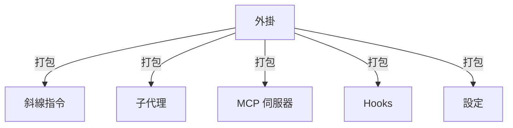
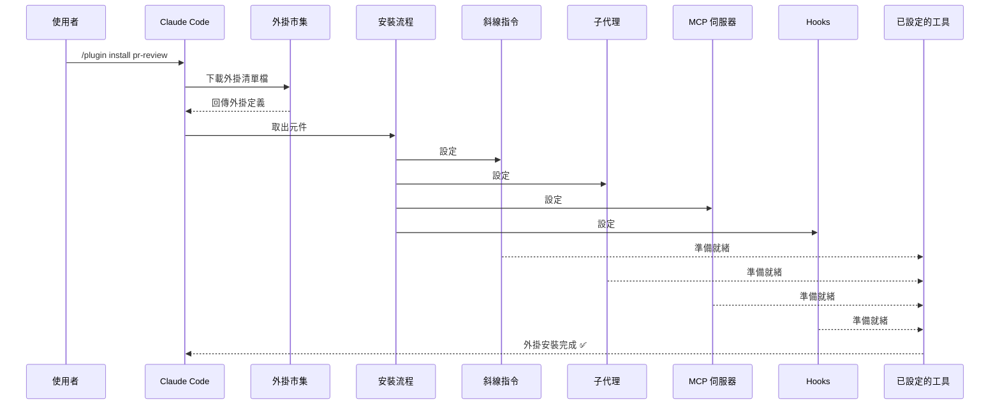
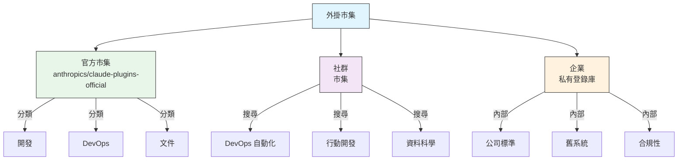
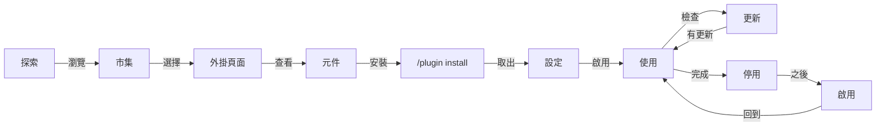
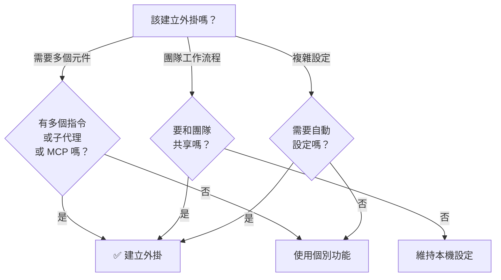

<picture>
  <source media="(prefers-color-scheme: dark)" srcset="../resources/logos/claude-code-tutorial-logo-dark.svg">
  
</picture>

# Claude Code 外掛

這個資料夾包含完整的外掛（Plugins）範例，把多個 Claude Code 功能打包成一致、可安裝的套件。

## 總覽

Claude Code 外掛（Plugins）是把自訂項目（斜線指令（Slash Commands）、子代理（Subagents）、MCP 伺服器與 Hooks）打包在一起、用單一指令即可安裝的集合。它們代表最高階的擴充機制——把多個功能組合成一致、可分享的套件。

## 外掛架構



## 外掛載入流程



> **不需要市集（v2.1.157+）**：放在 `.claude/skills` 目錄下的外掛現在會自動載入，不需要市集。用 `claude plugin init <name>` 建立一個新的外掛骨架，它會建立在 `~/.claude/skills/<name>/`（使用者全域），並在下次工作階段（session）以 `<name>@skills-dir` 自動載入。

## 外掛類型與散布方式

| 類型 | 範圍 | 共享對象 | 權責者 | 範例 |
|------|-------|--------|-----------|----------|
| 官方 | 全域 | 所有使用者 | Anthropic | PR Review、Security Guidance |
| 社群 | 公開 | 所有使用者 | 社群 | DevOps、Data Science |
| 組織 | 內部 | 團隊成員 | 公司 | 內部標準、工具 |
| 個人 | 個別 | 單一使用者 | 開發者 | 自訂工作流程 |

## 外掛定義結構

外掛清單檔以 JSON 格式存放在 `.claude-plugin/plugin.json`：

```json
{
  "name": "my-first-plugin",
  "description": "A greeting plugin",
  "version": "1.0.0",
  "author": {
    "name": "Your Name"
  },
  "homepage": "https://example.com",
  "repository": "https://github.com/user/repo",
  "license": "MIT"
}
```

除了這些身分欄位以外，清單檔還能指向不在預設資料夾內的元件，並附上探索用與相依性中繼資料：

| 欄位 | 型別 | 說明 |
|-------|------|-------------|
| `workflows` | string \| array | 自訂的[工作流程](https://code.claude.com/docs/en/workflows)指令碼檔案或目錄（取代預設的 `workflows/`） |
| `outputStyles` | string \| array | 自訂的輸出樣式檔案或目錄（取代預設的 `output-styles/`） |
| `lspServers` | string \| array \| object | 用於程式碼智慧功能的 LSP 伺服器——跳至定義、尋找參照、診斷。常見寫法是 `"./.lsp.json"`。參見[LSP 伺服器設定](#lsp-伺服器設定) |
| `channels` | array | 用於訊息注入的頻道宣告（Telegram、Slack、Discord 風格） |
| `dependencies` | array | 此外掛所需的其他外掛，可選擇附上 semver 版本限制 |
| `keywords` | array | 瀏覽與搜尋市集時使用的探索標籤 |
| `metadata` | object | 自由格式物件，可放你自己的資料，例如授權或目錄欄位 |
| `experimental.themes` | string \| array | 色彩主題檔案或目錄（取代預設的 `themes/`） |
| `experimental.monitors` | string \| array | [背景監控器](#背景監控器v21105)設定，會在外掛啟用時自動啟動 |

## 外掛結構範例

```
my-plugin/
├── .claude-plugin/
│   └── plugin.json       # 清單檔（name、description、version、author）
├── commands/             # 以 Markdown 檔案呈現的技能
│   ├── task-1.md
│   ├── task-2.md
│   └── workflows/
├── agents/               # 自訂代理定義
│   ├── specialist-1.md
│   ├── specialist-2.md
│   └── configs/
├── skills/               # 含 SKILL.md 檔案的代理技能
│   ├── skill-1.md
│   └── skill-2.md
├── hooks/                # hooks.json 中的事件處理器
│   └── hooks.json
├── .mcp.json             # MCP 伺服器設定
├── .lsp.json             # 用於程式碼智慧功能的 LSP 伺服器設定
├── bin/                  # 外掛啟用時加入 Bash 工具 PATH 的可執行檔
├── settings.json         # 外掛啟用時套用的預設設定（目前僅支援 `agent` 鍵）
├── themes/               # 選用：提供自訂 Claude Code 主題（v2.1.118+）
├── templates/
│   └── issue-template.md
├── scripts/
│   ├── helper-1.sh
│   └── helper-2.py
├── docs/
│   ├── README.md
│   └── USAGE.md
└── tests/
    └── plugin.test.js
```

> **備註**：`commands/` 屬於**舊版**寫法。官方建議是「*新外掛請改用 `skills/`*」。既有的 `commands/` 目錄仍可正常運作——本模組的三個範例外掛就用了這種寫法——但新外掛應該把功能放在 `skills/` 底下，以 `SKILL.md` 目錄的形式呈現，而不是扁平的 Markdown 指令檔。

### LSP 伺服器設定

外掛可以內建 Language Server Protocol（LSP）支援，提供即時的程式碼智慧功能。LSP 伺服器會在你工作時提供診斷、程式碼導覽與符號資訊。

**設定位置**：
- 外掛根目錄下的 `.lsp.json` 檔案
- `plugin.json` 中的 `lspServers` 鍵——這是官方清單檔欄位名稱。它接受字串、陣列或物件：字串或陣列會指向 LSP 設定檔或目錄（例如 `"./.lsp.json"`），物件則是直接內嵌宣告伺服器。

#### 欄位參考

| 欄位 | 是否必填 | 說明 |
|-------|----------|-------------|
| `command` | 是 | LSP 伺服器執行檔（必須在 PATH 中） |
| `extensionToLanguage` | 是 | 將副檔名對應到語言 ID |
| `args` | 否 | 伺服器的命令列引數 |
| `transport` | 否 | 通訊方式：`stdio`（預設）或 `socket` |
| `env` | 否 | 伺服器程序的環境變數 |
| `initializationOptions` | 否 | LSP 初始化期間傳送的選項 |
| `settings` | 否 | 傳給伺服器的工作區設定 |
| `workspaceFolder` | 否 | 覆寫工作區資料夾路徑 |
| `startupTimeout` | 否 | 等待伺服器啟動的最長時間（毫秒） |
| `shutdownTimeout` | 否 | 正常關閉的最長時間（毫秒） |
| `restartOnCrash` | 否 | 伺服器當機時自動重新啟動 |
| `maxRestarts` | 否 | 放棄前的最大重試次數 |

#### 設定範例

**Go（gopls）**：

```json
{
  "go": {
    "command": "gopls",
    "args": ["serve"],
    "extensionToLanguage": {
      ".go": "go"
    }
  }
}
```

**Python（pyright）**：

```json
{
  "python": {
    "command": "pyright-langserver",
    "args": ["--stdio"],
    "extensionToLanguage": {
      ".py": "python",
      ".pyi": "python"
    }
  }
}
```

**TypeScript**：

```json
{
  "typescript": {
    "command": "typescript-language-server",
    "args": ["--stdio"],
    "extensionToLanguage": {
      ".ts": "typescript",
      ".tsx": "typescriptreact",
      ".js": "javascript",
      ".jsx": "javascriptreact"
    }
  }
}
```

#### 可用的 LSP 外掛

官方市集內含預先設定好的 LSP 外掛：

| 外掛 | 語言 | 伺服器執行檔 | 安裝指令 |
|--------|----------|---------------|----------------|
| `pyright-lsp` | Python | `pyright-langserver` | `pip install pyright` |
| `typescript-lsp` | TypeScript/JavaScript | `typescript-language-server` | `npm install -g typescript-language-server typescript` |
| `rust-lsp` | Rust | `rust-analyzer` | 透過 `rustup component add rust-analyzer` 安裝 |

#### LSP 功能

設定完成後，LSP 伺服器可以提供：

- **即時診斷** — 編輯後立刻顯示錯誤與警告
- **程式碼導覽** — 跳至定義、尋找參照、尋找實作
- **懸停資訊** — 滑鼠懸停時顯示型別簽章與文件
- **符號列表** — 瀏覽目前檔案或工作區中的符號

### `PATH` 上的 `bin/` 目錄

外掛啟用時，它的 `bin/` 目錄會被加到該工作階段 `PATH` 的最前面。放在裡面的任何可執行檔都能直接用檔名從 Bash 工具呼叫，不需要完整路徑。

```bash
# 外掛目錄結構：
my-plugin/
├── plugin.json
└── bin/
    └── my-tool          # 可執行檔（chmod +x）

# 在已啟用該外掛的 Claude Code 工作階段中：
$ my-tool --help
```

適合用來放同一個外掛裡的 Hooks、技能（Skills）或指令要呼叫的 CLI 輔助工具。記得在外掛儲存庫裡把檔案標記為可執行（`chmod +x`）——git 會保留這個權限位元。

## 外掛選項（v2.1.83+）

外掛可以透過清單檔中的 `userConfig` 宣告使用者可設定的選項。標記 `sensitive: true` 的值會存放在系統鑰匙圈，而不是純文字設定檔中：

```json
{
  "name": "my-plugin",
  "version": "1.0.0",
  "userConfig": {
    "apiKey": {
      "description": "API key for the service",
      "sensitive": true
    },
    "region": {
      "description": "Deployment region",
      "default": "us-east-1"
    }
  }
}
```

## 外掛持久化資料 `${CLAUDE_PLUGIN_DATA}`（v2.1.78+）

外掛可以透過 `${CLAUDE_PLUGIN_DATA}` 環境變數存取一個持久化的狀態目錄。這個目錄每個外掛各自獨立，且會跨工作階段保留，適合用來存放快取、資料庫等持久化狀態：

```json
{
  "hooks": {
    "PostToolUse": [
      {
        "command": "node ${CLAUDE_PLUGIN_DATA}/track-usage.js"
      }
    ]
  }
}
```

這個目錄會在外掛安裝時自動建立。存放在這裡的檔案會一直保留，直到外掛被解除安裝為止。

### 背景監控器（v2.1.105）

外掛可以註冊背景監控器，在工作階段開始或外掛的技能被呼叫時自動啟動。在外掛清單檔中加入頂層的 `monitors` 鍵：

```json
{
  "name": "my-plugin",
  "version": "1.0.0",
  "monitors": [
    {
      "command": "tail -f /var/log/app.log",
      "trigger": "session_start"
    }
  ]
}
```

`trigger` 欄位接受：
- `"session_start"` — 工作階段開始時自動啟動監控器
- `"skill_invoke"` — 外掛的技能被呼叫時啟動監控器

監控器底層使用同一個 Monitor 工具，把 stdout 的每一行串流成事件，讓 Claude 可以做出反應。

## 透過設定檔內嵌外掛 `source: 'settings'`（v2.1.80+）

外掛可以用 `source: 'settings'` 欄位，以市集項目的形式直接內嵌在設定檔中定義。這樣就能直接嵌入外掛定義，不需要另外的儲存庫或市集：

```json
{
  "pluginMarketplaces": [
    {
      "name": "inline-tools",
      "source": "settings",
      "plugins": [
        {
          "name": "quick-lint",
          "source": "./local-plugins/quick-lint"
        }
      ]
    }
  ]
}
```

## 外掛設定

外掛可以附上一個 `settings.json` 檔案來提供預設設定。目前支援 `agent` 鍵，用來設定該外掛的主執行緒代理：

```json
{
  "agent": "agents/specialist-1.md"
}
```

外掛包含 `settings.json` 時，其中的預設值會在安裝時套用。使用者可以在自己的專案或個人設定中覆寫這些設定。

## 獨立指令 vs. 外掛方式

| 方式 | 指令名稱 | 設定方式 | 最適合 |
|----------|---------------|---|---|
| **獨立指令** | `/hello` | 在 CLAUDE.md 中手動設定 | 個人、專案專屬 |
| **外掛** | `/plugin-name:hello` | 透過 plugin.json 自動設定 | 分享、散布、團隊使用 |

個人的快速工作流程請使用**獨立斜線指令**。想要打包多個功能、與團隊分享或發布給他人時，請使用**外掛**。

> **以空格呼叫（v2.1.136+）**：外掛的斜線指令也能用空格呼叫——`/myplugin review` 會解析為正規形式 `/myplugin:review`。兩種寫法都可以；冒號形式是正規寫法，在腳本中建議使用。

> **`skills/` 探索機制（v2.1.136+）**：`plugin.json` 中的 `skills` 項目不再會隱藏外掛預設的 `skills/` 目錄。兩處宣告的技能會合併，所以你可以在 `plugin.json` 中列出幾個重點技能，而不會遺漏其他技能。

> **根層級 `SKILL.md` 外掛（v2.1.142+）**：如果外掛的頂層有 `SKILL.md`、且**沒有 `skills/` 子目錄**，這個外掛本身就會被視為一個技能——外掛本身*就是*技能。這是額外的一種寫法，並非要取代 `skills/` 目錄或 `plugin.json` 的 `skills` 項目；適合用在目錄結構沒有額外價值的小型單一技能外掛上。

## 實際範例

### 範例 1：PR Review 外掛

**檔案：** `.claude-plugin/plugin.json`

```json
{
  "name": "pr-review",
  "version": "1.0.0",
  "description": "完整的 PR 審查工作流程，涵蓋安全性、測試與文件",
  "author": {
    "name": "Anthropic"
  },
  "repository": "https://github.com/your-org/pr-review",
  "license": "MIT"
}
```

**檔案：** `commands/review-pr.md`

```markdown
---
name: Review PR
description: 啟動包含安全性與測試檢查的完整 PR 審查
---

# PR 審查

這個指令會啟動一次完整的 Pull Request 審查，包括：

1. 安全性分析
2. 測試涵蓋率驗證
3. 文件更新
4. 程式碼品質檢查
5. 效能影響評估
```

**檔案：** `agents/security-reviewer.md`

```yaml
---
name: security-reviewer
description: 以安全性為核心的程式碼審查
tools: Read, Grep, Bash
---

# 安全性審查員

專精於找出安全性漏洞：
- 身分驗證／授權問題
- 資料外洩
- 注入攻擊
- 安全設定
```

**安裝：**

```bash
/plugin install pr-review

# 結果：
# ✅ 已安裝 3 個斜線指令
# ✅ 已設定 3 個子代理
# ✅ 已連接 2 個 MCP 伺服器
# ✅ 已註冊 4 個 Hooks
# ✅ 準備就緒！
```

### 範例 2：DevOps 外掛

**元件：**

```
devops-automation/
├── commands/
│   ├── deploy.md
│   ├── rollback.md
│   ├── status.md
│   └── incident.md
├── agents/
│   ├── deployment-specialist.md
│   ├── incident-commander.md
│   └── alert-analyzer.md
├── mcp/
│   ├── github-config.json
│   ├── kubernetes-config.json
│   └── prometheus-config.json
├── hooks/
│   ├── pre-deploy.js
│   ├── post-deploy.js
│   └── on-error.js
└── scripts/
    ├── deploy.sh
    ├── rollback.sh
    └── health-check.sh
```

### 範例 3：Documentation 外掛

**打包的元件：**

```
documentation/
├── commands/
│   ├── generate-api-docs.md
│   ├── generate-readme.md
│   ├── sync-docs.md
│   └── validate-docs.md
├── agents/
│   ├── api-documenter.md
│   ├── code-commentator.md
│   └── example-generator.md
├── mcp/
│   ├── github-docs-config.json
│   └── slack-announce-config.json
└── templates/
    ├── api-endpoint.md
    ├── function-docs.md
    └── adr-template.md
```

## 外掛市集

官方由 Anthropic 維護的外掛目錄是 `anthropics/claude-plugins-official`，會在第一次互動式啟動時自動註冊。企業管理員也可以建立私有外掛市集，用於內部散布。

另外還有一個**社群市集** `anthropics/claude-plugins-community`，收錄了通過 Anthropic 自動化驗證與安全性篩選的第三方外掛——目錄中每個項目都釘選在特定的 commit SHA。與官方市集不同，你需要手動加入它：

```bash
/plugin marketplace add anthropics/claude-plugins-community

# 接著用 claude-community 這個市集名稱從中安裝
/plugin install <plugin-name>@claude-community
```



### 市集設定

企業與進階使用者可以透過設定控制市集行為：

| 設定 | 說明 |
|---------|-------------|
| `extraKnownMarketplaces` | 在預設值之外新增其他市集來源 |
| `strictKnownMarketplaces` | 控制使用者可以加入哪些市集（僅受管設定可用） |
| `blockedMarketplaces` | 由管理員維護的市集封鎖清單（自 v2.1.119 起支援 `hostPattern` / `pathPattern` 正規表達式欄位） |
| `deniedPlugins` | 由管理員維護的封鎖清單，用來阻擋特定外掛被安裝 |

> **更易懂的別名（v2.1.232）**：`additionalMarketplaces` 可作為 `extraKnownMarketplaces` 的別名，`allowedMarketplaces` 可作為 `strictKnownMarketplaces` 的別名。
> **來源為 changelog**——v2.1.232 的 changelog 宣布了這兩個別名，但官方設定參考文件目前尚未列出這兩個名稱。繼續使用原本的正規鍵名是安全的。

> **擁有者萬用字元（v2.1.223+）**：`"owner/*"` 這種寫法可以允許或封鎖某個 GitHub 擁有者底下的所有市集儲存庫。**只有 `strictKnownMarketplaces` 與 `blockedMarketplaces` 接受這種寫法**。在其他出現 `github` 來源的地方——包括 `extraKnownMarketplaces` 與 `/plugin marketplace add`——`repo` 值都必須指名單一儲存庫。

> **強制執行**（v2.1.117+）：`blockedMarketplaces` 與 `strictKnownMarketplaces` 會在外掛生命週期的每個事件強制生效——安裝、更新、重新整理、自動更新——不只是第一次加入時。`strictKnownMarketplaces` 僅受管設定可用。

`blockedMarketplaces` 搭配主機／路徑正規表達式的範例（v2.1.119）：

```json
{
  "blockedMarketplaces": [
    {
      "hostPattern": "^evil\\.example\\.com$",
      "pathPattern": "^/marketplaces/.*"
    }
  ]
}
```

#### 市集 `headersHelper`（v2.1.238）

`url` 型市集——或個別的目錄項目——可以指定一個 `headersHelper` 指令，用來產生抓取目錄與同源封存檔時所用的 HTTP 標頭。這讓位於發行 token 服務背後的私有市集，不必在設定中放入靜態機密就能完成驗證。

**目錄項目**的 helper 只會在安裝或更新時執行，而且只有在它的指令內容顯示給你看過之後：`claude plugin install` 與 `claude plugin update` 會在執行前提示 `[y/N]`。在自動化流程中可傳入 `-y` 跳過提示直接同意。

### 其他市集功能

- **市集搜尋列（v2.1.172）**：在 `/plugin` 中瀏覽某個市集的外掛時，搜尋列可以讓你依名稱或關鍵字篩選該市集的外掛——對於項目很多、捲動整份清單很慢的大型市集特別好用。
- **預設 Git 逾時**：針對大型外掛儲存庫，已從 30 秒提高到 120 秒
- **自訂 npm 登錄庫**：外掛可以指定自訂的 npm 登錄庫網址，用於解析相依套件
- **版本釘選**：把外掛鎖定在特定版本，確保環境可重現
- **瀏覽面板中的預估上下文成本（v2.1.143）**：`/plugin` 市集瀏覽器會顯示每個外掛預估的每輪上下文 token 成本——也就是永遠會載入的技能、Hooks 與 MCP 伺服器描述子的總和。安裝前可以用它評估外掛的採用成本。安裝後也能透過 [`claude plugin details <name>`](#claude-plugin-details-namev21139) 取得同樣的預估值。

含成本欄位的瀏覽列範例：

```text
NAME              VERSION   AUTHOR     CTX/TURN   DESCRIPTION
code-reviewer     1.2.0     anthropic  +1,420     多代理 PR 審查
devops-toolkit    0.4.1     acme       +3,180     SRE 手冊、待命輔助工具
docs-helper       0.9.0     community  +610       文件風格規範強制執行
```

### 市集定義綱要

外掛市集定義在 `.claude-plugin/marketplace.json` 中：

```json
{
  "name": "my-team-plugins",
  "owner": "my-org",
  "plugins": [
    {
      "name": "code-standards",
      "source": "./plugins/code-standards",
      "description": "強制團隊程式碼標準",
      "version": "1.2.0",
      "author": "platform-team"
    },
    {
      "name": "deploy-helper",
      "source": {
        "source": "github",
        "repo": "my-org/deploy-helper",
        "ref": "v2.0.0"
      },
      "description": "部署自動化工作流程"
    }
  ]
}
```

| 欄位 | 是否必填 | 說明 |
|-------|----------|-------------|
| `name` | 是 | 市集名稱，使用 kebab-case |
| `owner` | 是 | 維護該市集的組織或使用者 |
| `plugins` | 是 | 外掛項目陣列 |
| `plugins[].name` | 是 | 外掛名稱（kebab-case） |
| `plugins[].source` | 是 | 外掛來源（路徑字串或來源物件） |
| `plugins[].description` | 否 | 外掛簡短說明 |
| `plugins[].version` | 否 | 語意化版本字串 |
| `plugins[].author` | 否 | 外掛作者名稱 |
| `plugins[].renames` | 否 | 把外掛先前的 `name` 對應到目前的名稱（若已移除則為 `null`），讓使用者自動遷移（v2.1.193） |
| `plugins[].displayName` | 否 | UI 中顯示的易讀名稱；不用於查找（v2.1.143） |
| `plugins[].defaultEnabled` | 否 | 若為 `false`，外掛安裝後預設停用，直到使用者選擇啟用（v2.1.154） |

### 外掛來源類型

外掛可以來自多種位置：

| 來源 | 語法 | 範例 |
|--------|--------|---------|
| **相對路徑** | 字串路徑 | `"./plugins/my-plugin"` |
| **GitHub** | `{ "source": "github", "repo": "owner/repo" }` | `{ "source": "github", "repo": "acme/lint-plugin", "ref": "v1.0" }` |
| **Git URL** | `{ "source": "url", "url": "..." }` | `{ "source": "url", "url": "https://git.internal/plugin.git" }` |
| **Git 子目錄** | `{ "source": "git-subdir", "url": "...", "path": "..." }` | `{ "source": "git-subdir", "url": "https://github.com/org/monorepo.git", "path": "packages/plugin" }` |
| **npm** | `{ "source": "npm", "package": "..." }` | `{ "source": "npm", "package": "@acme/claude-plugin", "version": "^2.0" }` |
| **pip** | `{ "source": "pip", "package": "..." }` | `{ "source": "pip", "package": "claude-data-plugin", "version": ">=1.0" }` |
| **封存檔**（v2.1.224+） | `{ "source": "archive", "url": "..." }` | `{ "source": "archive", "url": "https://cdn.example.com/lint-plugin-1.2.0.zip", "sha256": "…" }` |
| **指令**（v2.1.229+） | `{ "source": "command", "command": "..." }` | `{ "source": "command", "command": "acme-plugin-resolver --print-dir" }` |

GitHub 與 git 來源都支援選用的 `ref`（分支／標籤）與 `sha`（commit hash）欄位，用於版本釘選。

**裸來源名稱與 `metadata.pluginRoot`（v2.1.239）**：市集的 `metadata.pluginRoot` 現在會生效——目錄中的裸外掛來源名稱會解析為該根目錄底下的一個資料夾，不必在每個項目都寫出完整的相對路徑。

**從 claude.ai 同步的技能（v2.1.239）**：從 claude.ai 同步下來的外掛會顯示為 `name@synced`。要用這個名稱來操作，例如 `claude plugin enable <name>@synced` 與 `claude plugin disable <name>@synced`。同步的外掛絕不會覆蓋同名的已安裝外掛——兩者會並存，以 `@synced` 後綴區分。

#### `archive` 來源（v2.1.224+）

透過 HTTPS 從 zip 檔安裝外掛——不需要 git clone，也不需要 npm install。

```json
{
  "source": "archive",
  "url": "https://cdn.example.com/lint-plugin-1.2.0.zip",
  "sha256": "3b1f0c2e9a7d4f5b8c6e1a2d3f4b5c6d7e8f9a0b1c2d3e4f5a6b7c8d9e0f1a2b"
}
```

| 欄位 | 是否必填 | 備註 |
|-------|----------|-------|
| `url` | 是 | **僅限 HTTPS。**`http://`、loopback、link-local 與雲端中繼資料主機都會被拒絕——而且**每一次重新導向**都會重新檢查，所以無法透過重新導向偷渡到被封鎖的主機 |
| `sha256` | 否 | 64 個十六進位字元。不符時安裝會失敗，並顯示 `Plugin archive integrity check failed` |

封存檔上限為 **256 MiB**。凡不是自己建置的內容都應該釘選 `sha256`——沒有它的話，誰控制這個網址，誰就控制了在你工作階段中執行的程式碼。

#### `command` 來源（v2.1.229+）

讓本機安裝的工具決定外掛存放的位置。當內部套件管理工具已經知道如何抓取並排列你的外掛時很好用。

```json
{
  "source": "command",
  "command": "acme-plugin-resolver --print-dir",
  "timeout": 60,
  "mode": "copy"
}
```

這裡的約定很嚴格：**該指令必須在 stdout 剛好印出一行，並以代碼 0 結束**。那一行就是包含完整外掛的目錄絕對路徑。

| 欄位 | 是否必填 | 預設值 | 備註 |
|-------|----------|---------|-------|
| `command` | 是 | — | 要執行的指令 |
| `timeout` | 否 | `60`（秒） | 最大值 600 |
| `mode` | 否 | `"copy"` | `"copy"` 會為目錄拍快照；`"link"` 則建立符號連結，讓編輯即時生效 |

這個指令每個工作階段都會重新解析一次，結果套用時不需要重新啟動。組織可以用 `disableCommandPluginSources` 完全封鎖這種來源類型。

保留的市集名稱現在包括 `first-party-plugins` 與 `healthcare`（v2.1.205）——這些名稱保留給官方使用，自訂市集無法佔用。

### 散布方式

**GitHub（建議）**：
```bash
# 使用者加入你的市集
/plugin marketplace add owner/repo-name
```

**其他 git 服務**（需要完整網址）：
```bash
/plugin marketplace add https://gitlab.com/org/marketplace-repo.git
```

裸 `gitlab.com` 儲存庫網址——包括巢狀子群組——複製方式和 `github.com` 網址一樣（v2.1.232）。**scheme 是必要的**：自 v2.1.196 起，裸寫的
`gitlab.example.com/team/plugins` 會被視為無效的 `owner/repo` 簡寫而拒絕，所以請使用完整的
`https://gitlab.com/company/plugins.git` 形式。v2.1.232 也為 GitLab 加入了 token 系列機密遮蔽功能，並讓
`glab` CLI 享有和 `gh` 相同的沙箱與憑證路徑保護。

**私有儲存庫**：可透過 git 憑證輔助工具或環境變數 token 支援。使用者必須具備該儲存庫的讀取權限。

**官方市集提交**：透過 [claude.ai/settings/plugins/submit](https://claude.ai/settings/plugins/submit) 或 [platform.claude.com/plugins/submit](https://platform.claude.com/plugins/submit) 把外掛提交到 Anthropic 精選市集，以獲得更廣泛的散布。

### 管理市集

```bash
# 市集 CLI 指令
claude plugin marketplace add <source>       # 加入市集（GitHub、URL、本機）
claude plugin marketplace update [name]      # 重新整理目錄索引
claude plugin marketplace remove <name>      # 移除市集
claude plugin marketplace list               # 列出已設定的市集
```

> **重要**：`marketplace update` 只會重新整理外掛目錄（也就是可以安裝的項目），並**不會**更新已安裝的外掛。要更新特定的已安裝外掛，請使用 `plugin update <name>`。

### 嚴格模式

控制市集定義如何與本機的 `plugin.json` 檔案互動：

| 設定 | 行為 |
|---------|----------|
| `strict: true`（預設） | 以本機 `plugin.json` 為準；市集項目只是補充 |
| `strict: false` | 市集項目就是完整的外掛定義 |

使用 `strictKnownMarketplaces` 的**組織限制**：

| 值 | 效果 |
|-------|--------|
| 未設定 | 無限制——使用者可以加入任何市集 |
| 空陣列 `[]` | 完全鎖定——不允許任何市集 |
| 模式陣列 | 允許清單——只能加入符合的市集 |

```json
{
  "strictKnownMarketplaces": [
    "my-org/*",
    "github.com/trusted-vendor/*"
  ]
}
```

> **警告**：在搭配 `strictKnownMarketplaces` 的嚴格模式下，使用者只能從允許清單內的市集安裝外掛。這對需要控管外掛散布的企業環境很有用。

## 外掛安裝與生命週期



## 外掛功能比較

| 功能 | 斜線指令 | 技能 | 子代理 | 外掛 |
|---------|---------------|-------|----------|--------|
| **安裝** | 手動複製 | 手動複製 | 手動設定 | 一個指令 |
| **設定時間** | 5 分鐘 | 10 分鐘 | 15 分鐘 | 2 分鐘 |
| **打包** | 單一檔案 | 單一檔案 | 單一檔案 | 多個檔案 |
| **版本控制** | 手動 | 手動 | 手動 | 自動 |
| **團隊共享** | 複製檔案 | 複製檔案 | 複製檔案 | 安裝 ID |
| **更新** | 手動 | 手動 | 手動 | 自動可用 |
| **相依套件** | 無 | 無 | 無 | 可能包含 |
| **市集** | 否 | 否 | 否 | 是 |
| **散布方式** | 儲存庫 | 儲存庫 | 儲存庫 | 市集 |

## 外掛 CLI 指令

所有外掛操作都可以透過 CLI 指令執行：

```bash
claude plugin install <name>@<marketplace>   # 從市集安裝
claude plugin uninstall <name>               # 移除外掛
claude plugin update <name>                  # 把已安裝的外掛更新到最新版本
claude plugin list                           # 列出已安裝的外掛
claude plugin enable <name>                  # 啟用已停用的外掛
claude plugin disable <name>                 # 停用外掛
claude plugin validate <path>                # 驗證 <path> 底下的外掛結構
claude plugin tag [path]                     # 建立 {name}--v{version} 發行版的 git 標籤（v2.1.118+）
claude plugin prune                          # 移除孤兒自動安裝的外掛相依套件（v2.1.121+）
claude plugin uninstall <name> --prune       # 解除安裝並連鎖清除孤兒相依套件（v2.1.121+）
claude plugin details <name>                 # 顯示清單與預估每輪 token 成本（v2.1.139+）
claude plugin init <name>                    # 建立新外掛骨架（別名：claude plugin new）
```

**別名**：`init` 用 `claude plugin new`，`uninstall` 用 `remove` / `rm`，`list` 用 `ls`，`prune` 用 `autoremove`。

**值得認識的旗標：**

| 指令 | 旗標 | 用途 |
|---------|------|-----|
| `plugin init` | `--with <components...>` | 建立特定的元件資料夾：`skills`、`agents`、`hooks`、`mcp`、`lsp`、`output-style`、`channel` |
| `plugin init` | `-f`、`--force` | 覆寫既有的 `.claude-plugin/` 目錄 |
| `plugin install` | `--config <key=value>` | 在安裝時設定 `userConfig` 選項 |
| `plugin install` | `-y`、`--yes` | 不經確認提示直接接受指令 |
| `plugin list` | `--available` | 同時列出市集中可安裝的外掛（需搭配 `--json`） |
| `plugin tag` | `--push` | 建立標籤後推送到遠端 |
| `plugin tag` | `--dry-run` | 印出將建立的標籤內容，但不實際建立 |
| `plugin validate` | `--strict` | 把警告視為錯誤 |
| `plugin validate` | `--json` | 輸出機器可讀的驗證報告（v2.1.259+） |

範例：`claude plugin tag ./my-plugin` 接受的是外掛的**路徑**（不是版本字串）。它會依 `plugin.json` 建立 `{name}--v{version}` 的 git 標籤，並驗證 `plugin.json` 與任何外層市集項目是否一致，是切外掛發行版本供散布的建議做法。

`claude plugin prune` 適合在安裝或解除安裝帶有自身相依套件的市集外掛之後使用——它會移除任何父外掛已被移除的自動安裝外掛。`plugin uninstall --prune` 則是一步完成同樣的連鎖清除。

> **相依套件強制檢查（v2.1.143）**：如果還有其他已啟用的外掛依賴目標外掛（會破壞相依關係圖），`claude plugin disable <name>` 會**拒絕執行**。`claude plugin enable <name>` 只需一次確認提示就會**強制啟用遞移相依套件**，不需要逐一個別啟用。用 `claude plugin prune` 清除相依對象後來被移除的孤兒相依套件。

### `claude plugin details <name>`（v2.1.139+）

`claude plugin details <name>` 會印出外掛完整的元件清單——技能、Hooks、MCP 伺服器、LSP 伺服器、背景監控器、斜線指令——外加**預估每輪（以及每次呼叫）的 token 成本**。可以用它在採用外掛之前評估其負擔，尤其是在上下文受限的模型上。

範例輸出（節錄）：

```text
plugin: code-reviewer (1.2.0)
skills:        3      hooks: 2      mcp: 1      lsp: 0      monitors: 0
commands:      /review, /security-review
projected ctx: +1,420 tokens per turn  ·  +9,800 tokens per /review invocation
```

LSP 伺服器是在 v2.1.142 加入細節面板的。也可以參考市集瀏覽面板中的預估上下文成本（v2.1.143），詳見[外掛市集](#外掛市集)。

## 安裝方式

### 從市集安裝
```bash
/plugin install plugin-name
# 或用 CLI：
claude plugin install plugin-name@marketplace-name
```

**是不是馬上就生效？** 從 **v2.1.221** 起，通常是的——看安裝摘要的最後一行：

| 安裝摘要顯示 | 代表意思 |
|---|---|
| `Plugin is now active.` | Claude Code 在安裝過程中已啟用該外掛，不需要再做任何事。 |
| `Run /reload-plugins to activate.` | 外掛已安裝但尚未生效——可能是啟用會讓提示詞快取失效，或啟用嘗試失敗了。 |

在 v2.1.221 之前，安裝不會在目前工作階段立即生效，必須執行 `/reload-plugins` 或重新啟動，所以較舊的指南會把這個步驟描述成必要動作。

### 啟用／停用（自動偵測範圍）
```bash
/plugin enable plugin-name
/plugin disable plugin-name
```

`/plugin` 介面會顯示未使用的外掛，方便你清理（v2.1.187+）。當外掛的 `plugin.json` 中的 `name` 與市集項目名稱不同時，啟用／停用也一樣能運作（v2.1.195+）。

### 列出已安裝的外掛（v2.1.163）
確認目前工作階段中有哪些外掛是啟用狀態：
```bash
/plugin list             # 所有已安裝的外掛
/plugin list --enabled   # 只列出已啟用的外掛
/plugin list --disabled  # 只列出已停用的外掛
```

### 本機外掛（開發用）
```bash
# 本機測試用的 CLI 旗標（可重複指定多個外掛）
claude --plugin-dir ./path/to/plugin
claude --plugin-dir ./plugin-a --plugin-dir ./plugin-b

# --plugin-dir 也接受 .zip 封存檔路徑（v2.1.128+）
claude --plugin-dir ./my-plugin.zip

# 從網址擷取外掛的 .zip 封存檔，只在目前工作階段生效（v2.1.129+，可重複指定）
claude --plugin-url https://example.com/releases/my-plugin-0.3.0.zip
```

### 從 Git 儲存庫安裝
```bash
/plugin install github:username/repo
```

## 自動更新

Claude Code 可以在啟動時自動更新市集及其已安裝的外掛。

| 市集類型 | 自動更新預設值 | 如何切換 |
|------------------|---------------------|---------------|
| 官方（`claude-plugins-official`） | ✅ 啟用 | `/plugin` → Marketplaces → Select |
| 第三方／本機 | ❌ 停用 | 同一個介面路徑 |

自動更新執行時，Claude Code 會：
1. 重新整理市集目錄
2. 把已安裝的外掛更新到最新版本
3. 回報每個外掛的結果：更新過程中已啟用的顯示 `Plugin is now active.`，沒有啟用的顯示 `Run /reload-plugins to activate.`

### 環境變數

| 變數 | 作用 |
|----------|--------|
| `DISABLE_AUTOUPDATER=1` | 停用所有自動更新（Claude Code ＋外掛） |
| `DISABLE_AUTOUPDATER=1` + `FORCE_AUTOUPDATE_PLUGINS=1` | 保留外掛更新，停用 Claude Code 更新 |
| `CLAUDE_CODE_PLUGIN_PREFER_HTTPS=1` | （v2.1.141+）強制 `claude plugin install` 用 HTTPS（而非 SSH）複製 GitHub 外掛來源，即使有可用的 SSH 遠端也一樣。適合用在沒有 SSH 金鑰的 CI 執行器或容器中。 |

```bash
# 停用所有自動更新
export DISABLE_AUTOUPDATER=1

# 只保留外掛自動更新
export DISABLE_AUTOUPDATER=1
export FORCE_AUTOUPDATE_PLUGINS=1

# 沒有 SSH 金鑰的 CI 執行器——強制外掛安裝改用 HTTPS
export CLAUDE_CODE_PLUGIN_PREFER_HTTPS=1
claude plugin install code-reviewer@anthropic
```

> **遠端工作階段的外掛載入（v2.1.179）**：v2.1.179 改善了遠端工作階段中外掛的載入效能，連上遠端工作階段時外掛能更快可用。

## 何時該建立外掛



### 外掛使用情境

| 使用情境 | 建議 | 原因 |
|----------|-----------------|-----|
| **團隊導入** | ✅ 使用外掛 | 一次到位，所有設定都含在內 |
| **框架設定** | ✅ 使用外掛 | 打包框架專屬的指令 |
| **企業標準規範** | ✅ 使用外掛 | 集中散布、版本控管 |
| **快速任務自動化** | ❌ 使用指令 | 用外掛太過度複雜 |
| **單一領域專長** | ❌ 使用技能 | 外掛太重，改用技能就好 |
| **專門分析** | ❌ 使用子代理 | 手動建立或改用技能 |
| **即時資料存取** | ❌ 使用 MCP | 獨立使用即可，不用打包 |

## 測試外掛

發布之前，先用 `--plugin-dir` CLI 旗標在本機測試外掛（可重複指定多個外掛）：

```bash
claude --plugin-dir ./my-plugin
claude --plugin-dir ./my-plugin --plugin-dir ./another-plugin

# --plugin-dir 除了目錄外也接受 .zip 封存檔（v2.1.128+）
claude --plugin-dir ./my-plugin.zip

# --plugin-url 會從網址擷取外掛 .zip，只在本次工作階段生效（v2.1.129+，可重複指定）
claude --plugin-url https://example.com/releases/my-plugin-0.3.0.zip
```

這樣會載入你的外掛啟動 Claude Code，讓你可以：
- 確認所有斜線指令都可用
- 測試子代理與代理是否正常運作
- 確認 MCP 伺服器能正確連線
- 驗證 Hook 執行狀況
- 檢查 LSP 伺服器設定
- 檢查是否有任何設定錯誤

## 熱重載

外掛在開發期間支援熱重載。修改外掛檔案時，Claude Code 能自動偵測變更。你也可以用以下指令強制重新載入：

```bash
/reload-plugins
```

這會重新讀取所有外掛清單檔、指令、代理、技能、Hooks，以及 MCP/LSP 設定，不需要重新啟動工作階段。

## 外掛的受管設定

管理員可以透過受管設定，在整個組織內控管外掛行為：

| 設定 | 說明 |
|---------|-------------|
| `enabledPlugins` | 預設啟用的外掛允許清單 |
| `deniedPlugins` | 禁止安裝的外掛黑名單 |
| `extraKnownMarketplaces` | 在預設之外新增額外的市集來源 |
| `strictKnownMarketplaces` | 限制使用者可以新增哪些市集（僅受管設定；自 v2.1.117 起在每個外掛生命週期事件中強制執行） |
| `blockedMarketplaces` | 市集黑名單；自 v2.1.117 起在每個外掛生命週期事件中強制執行；自 v2.1.119 起支援 `hostPattern` / `pathPattern` 正規表達式欄位 |
| `allowedChannelPlugins` | 控制每個發行頻道允許使用哪些外掛 |
| `disableCommandPluginSources` | 在整個組織封鎖 `command` 這種外掛來源類型（v2.1.229+） |

> **更友善的別名（v2.1.232）**：`additionalMarketplaces` 可作為 `extraKnownMarketplaces` 的別名使用，`allowedMarketplaces` 則是 `strictKnownMarketplaces` 的別名。
> **來源為 changelog**——v2.1.232 的 changelog 宣布了這兩個別名，但官方設定參考文件目前尚未收錄任一名稱。原本的正式鍵名可以繼續安心使用。

> **擁有者萬用字元（v2.1.223+）**：`"owner/*"` 這種項目可以允許或封鎖某個 GitHub 擁有者底下的所有市集儲存庫。**僅適用於 `strictKnownMarketplaces` 與 `blockedMarketplaces`。** 其他所有出現 `github` 來源的地方——包括 `extraKnownMarketplaces` 與 `/plugin marketplace add`——`repo` 值都必須指定單一儲存庫。

這些設定可以透過受管設定檔套用在組織層級，並且優先於使用者層級的設定。

## 外掛安全性

外掛子代理是在受限的沙箱中執行。以下 frontmatter 鍵**不允許**出現在外掛子代理的定義中：

- `hooks` —— 子代理不能註冊事件處理器
- `mcpServers` —— 子代理不能設定 MCP 伺服器
- `permissionMode` —— 子代理不能覆寫權限模型

這樣可以確保外掛無法提升權限，也無法在宣告範圍之外修改主機環境。

## 發布外掛

**發布步驟：**

1. 建立包含所有元件的外掛結構
2. 撰寫 `.claude-plugin/plugin.json` 清單檔
3. 建立含有文件說明的 `README.md`
4. 用 `claude --plugin-dir ./my-plugin` 在本機測試
5. 用 `claude plugin tag ./my-plugin`（v2.1.118+）替發行版本打標籤——接受外掛**路徑**，並依 `plugin.json` 建立 `{name}--v{version}` 的 git 標籤
6. 提交到外掛市集
7. 通過審查與核准
8. 在市集上發布
9. 使用者可以用一個指令安裝

**提交範例：**

```markdown
# PR Review 外掛

## 說明
完整的 PR 審查工作流程，涵蓋安全性、測試與文件檢查。

## 內含項目
- 3 個對應不同審查類型的斜線指令
- 3 個專門的子代理
- GitHub 與 CodeQL 的 MCP 整合
- 自動化安全性掃描 Hooks

## 安裝
```bash
/plugin install pr-review
```

## 功能
✅ 安全性分析
✅ 測試涵蓋率檢查
✅ 文件驗證
✅ 程式碼品質評估
✅ 效能影響分析

## 用法
```bash
/review-pr
/check-security
/check-tests
```

## 需求
- Claude Code 2.1+
- GitHub 存取權
- CodeQL（選用）
```

## 外掛 vs. 手動設定

**手動設定（2 小時以上）：**
- 一個一個安裝斜線指令
- 個別建立子代理
- 分別設定 MCP
- 手動設定 Hooks
- 把一切都寫成文件
- 分享給團隊（祈禱大家都設定正確）

**用外掛（2 分鐘）：**
```bash
/plugin install pr-review
# ✅ 一切都已安裝並設定完成
# ✅ 立即可以使用
# ✅ 團隊可以重現一模一樣的設定
```

## 最佳實踐

### 建議做法 ✅
- 使用清楚、易懂的外掛名稱
- 附上完整的 README
- 妥善為外掛設定版本（semver）
- 一起測試所有元件
- 清楚記錄需求
- 提供使用範例
- 加入錯誤處理
- 適當打上標籤方便被發現
- 維持向後相容性
- 讓外掛專注且內聚
- 加入完整的測試
- 記錄所有相依套件

### 避免做法 ❌
- 不要打包不相關的功能
- 不要把憑證寫死在程式裡
- 不要跳過測試
- 不要忘記寫文件
- 不要建立重複的外掛
- 不要忽略版本控管
- 不要讓元件相依關係過度複雜
- 不要忘記妥善處理錯誤

## 安裝說明

### 從市集安裝

1. **瀏覽可用的外掛：**
   ```bash
   /plugin list
   ```

2. **查看外掛詳細資訊：**
   ```bash
   claude plugin details plugin-name
   ```

3. **安裝外掛：**
   ```bash
   /plugin install plugin-name
   ```

### 從本機路徑安裝

```bash
/plugin install ./path/to/plugin-directory
```

### 從 GitHub 安裝

```bash
/plugin install github:username/repo
```

### 列出已安裝的外掛

```bash
/plugin list             # 所有已安裝的外掛
/plugin list --enabled   # 只列出已啟用的外掛
/plugin list --disabled  # 只列出已停用的外掛
```

### 更新外掛

請用 CLI 形式——這是 [`plugin update`](https://code.claude.com/docs/en/plugins-reference) 文件中記載的形式，也是有更新可用時 Claude Code 本身會指引你使用的形式：

```bash
claude plugin update plugin-name
```

### 停用／啟用外掛

```bash
# 暫時停用
/plugin disable plugin-name

# 重新啟用
/plugin enable plugin-name
```

### 解除安裝外掛

```bash
/plugin uninstall plugin-name
```

## 相關概念

以下 Claude Code 功能會與外掛搭配運作：

- **[斜線指令](../01-slash-commands/)** - 打包在外掛中的個別指令
- **[記憶（Memory）](../02-memory/)** - 外掛用的持久化上下文
- **[技能](../03-skills/)** - 可以包裝成外掛的領域專長
- **[子代理](../04-subagents/)** - 作為外掛元件的專門代理
- **[MCP 伺服器](../05-mcp/)** - 打包在外掛中的 Model Context Protocol 整合
- **[Hooks](../06-hooks/)** - 觸發外掛工作流程的事件處理器

## 完整範例工作流程

### PR Review 外掛完整工作流程

```
1. 使用者：/review-pr

2. 外掛執行：
   ├── pre-review.js hook 驗證 git 儲存庫
   ├── GitHub MCP 取得 PR 資料
   ├── security-reviewer 子代理分析安全性
   ├── test-checker 子代理驗證涵蓋率
   └── performance-analyzer 子代理檢查效能

3. 整合並呈現結果：
   ✅ 安全性：沒有重大問題
   ⚠️  測試：涵蓋率 65%（建議 80% 以上）
   ✅ 效能：沒有明顯影響
   📝 提供了 12 項建議
```

## 疑難排解

### 外掛無法安裝
- 檢查 Claude Code 版本相容性：`/version`
- 用 JSON 驗證工具檢查 `plugin.json` 語法
- 檢查網路連線（適用於遠端外掛）
- 檢查權限：`ls -la plugin/`

### 元件未載入
- 確認 `plugin.json` 中的路徑與實際目錄結構相符
- 檢查檔案權限：`chmod +x scripts/`
- 檢查元件檔案語法
- 檢查元件清單：`claude plugin details plugin-name`

### MCP 連線失敗
- 確認環境變數設定正確
- 檢查 MCP 伺服器的安裝與健康狀態
- 用 `/mcp test` 獨立測試 MCP 連線
- 檢查 `mcp/` 目錄中的 MCP 設定

### 安裝後指令無法使用
- 確認外掛已成功安裝：`/plugin list`
- 檢查外掛是否已啟用：`/plugin list --enabled`
- 檢查外掛是否已生效——參閱[安裝方式](#安裝方式)中的安裝摘要說明：`Plugin is now active.` 不需要任何動作，`Run /reload-plugins to activate.` 表示要執行該指令（不需要重新啟動）
- 檢查是否與既有指令發生命名衝突

### Hook 執行問題
- 確認 Hook 檔案的權限正確
- 檢查 Hook 語法與事件名稱
- 查看 Hook 記錄以了解錯誤細節
- 如果可以，手動測試 Hooks

## 延伸資源

- [官方外掛文件](https://code.claude.com/docs/en/plugins)
- [探索外掛](https://code.claude.com/docs/en/discover-plugins)
- [外掛市集](https://code.claude.com/docs/en/plugin-marketplaces)
- [外掛參考文件](https://code.claude.com/docs/en/plugins-reference)
- [MCP 伺服器參考文件](https://modelcontextprotocol.io/)
- [子代理設定指南](../04-subagents/README.md)
- [Hook 系統參考文件](../06-hooks/README.md)

---

**最後更新**：2026 年 9 月 6 日
**Claude Code 版本**：2.1.263
**資料來源**：
- https://code.claude.com/docs/en/plugins
- https://code.claude.com/docs/en/plugins-reference
- https://code.claude.com/docs/en/changelog#2-1-172
- https://code.claude.com/docs/en/changelog
- https://code.claude.com/docs/en/commands
- https://code.claude.com/docs/en/plugin-marketplaces
- https://code.claude.com/docs/en/discover-plugins.md
- https://github.com/anthropics/claude-code/releases/tag/v2.1.117
- https://github.com/anthropics/claude-code/releases/tag/v2.1.118
- https://github.com/anthropics/claude-code/releases/tag/v2.1.131
- https://github.com/anthropics/claude-code/releases/tag/v2.1.138
- https://github.com/anthropics/claude-code/releases/tag/v2.1.139
- https://github.com/anthropics/claude-code/releases/tag/v2.1.141
- https://github.com/anthropics/claude-code/releases/tag/v2.1.142
- https://github.com/anthropics/claude-code/releases/tag/v2.1.143
- https://code.claude.com/docs/en/cli-reference
- https://code.claude.com/docs/en/model-config
- https://github.com/anthropics/claude-code/blob/main/CHANGELOG.md
**相容模型**：Claude Fable 5、Claude Opus 5、Claude Sonnet 5、Claude Sonnet 4.6、Claude Opus 4.8、Claude Haiku 4.5
