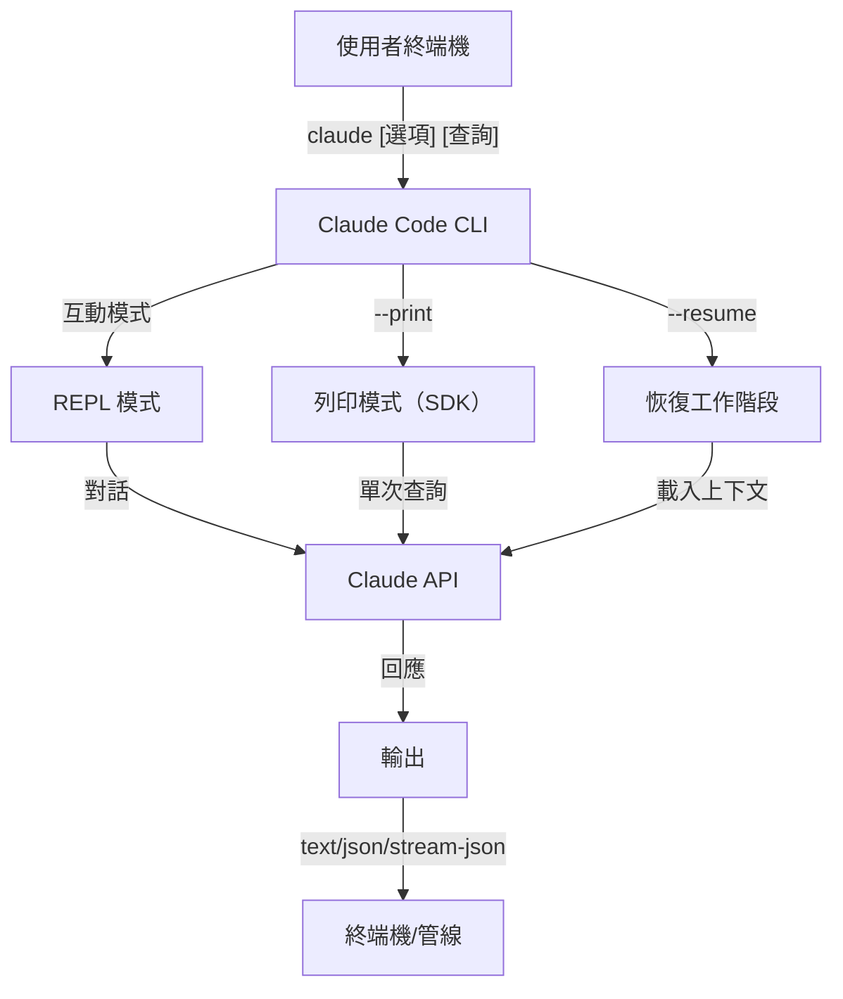
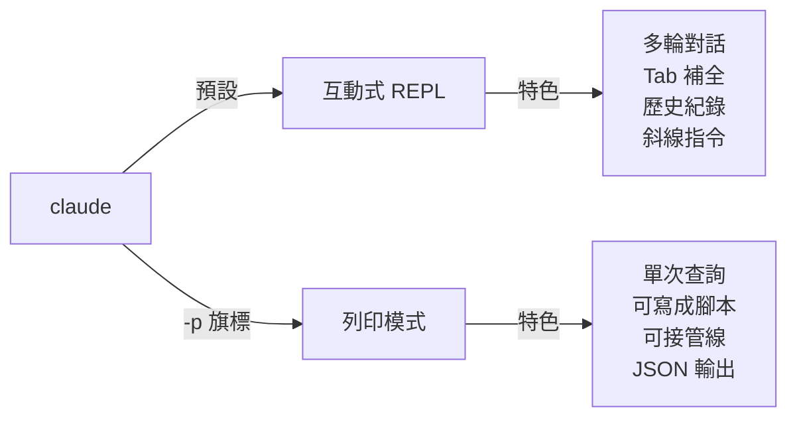

<picture>
  <source media="(prefers-color-scheme: dark)" srcset="../resources/logos/claude-code-tutorial-logo-dark.svg">
  
</picture>

# CLI 參考

## 總覽

Claude Code CLI（命令列介面）是與 Claude Code 互動的主要方式。它提供強大的選項，讓你執行查詢、管理工作階段（session）、設定模型，以及把 Claude 整合進你的開發工作流程。

## 架構



## 執行環境與封裝

自 **v2.1.113** 起，Claude Code CLI 會透過選用的 npm 相依套件，啟動**原生的各平台執行檔**（macOS、Linux、Windows）。安裝時會依你的作業系統與架構配對對應的執行檔——舊有的、以 JavaScript 打包的執行環境已不再是 macOS 或 Linux 上的預設方式。

**使用者端的安裝方式不變**：`npm install -g @anthropic-ai/claude-code` 仍然可用，也仍是建議的安裝路徑。npm 會在背後自動抓取適合你平台的原生執行檔。

**下載主機**（v2.1.116+）：原生執行檔的產物由 `https://downloads.claude.ai/claude-code-releases` 提供。

> **企業／代理伺服器使用者**：如果你的網路需要明確的允許清單，請把 `downloads.claude.ai`（以及 `https://downloads.claude.ai/claude-code-releases`）加進你的 proxy 出口規則。過去只把 `storage.googleapis.com` 或 npm 註冊來源列入允許清單的環境，需要更新規則，否則 `claude update` 與初次安裝都會失敗。

舊版的 JavaScript 打包版本仍會為 Windows、以及固定使用該版本的環境產出；這些安裝仍把 Glob 與 Grep 當成第一等工具（見 [工具與權限管理](#工具與權限管理) 段落下的 Glob/Grep 附註）。

## CLI 指令

| 指令 | 說明 | 範例 |
|---------|-------------|---------|
| `claude` | 啟動互動式 REPL | `claude` |
| `claude "query"` | 以初始提示詞啟動 REPL | `claude "解釋這個專案"` |
| `claude -p "query"` | 列印模式——查詢後即結束 | `claude -p "解釋這個函式"` |
| `cat file \| claude -p "query"` | 處理管線輸入的內容 | `cat logs.txt \| claude -p "explain"` |
| `claude -c` | 繼續最近一次的對話 | `claude -c` |
| `claude -c -p "query"` | 以列印模式繼續 | `claude -c -p "檢查型別錯誤"` |
| `claude -r "<session>" "query"` | 依 ID 或名稱恢復工作階段 | `claude -r "auth-refactor" "完成這個 PR"` |
| `claude update` | 更新到最新版本 | `claude update` |
| `/doctor`（斜線指令） | 診斷安裝、設定與外掛（Plugins）健康狀態。自 v2.1.116 起，可在 **Claude 回應中**開啟，會內嵌顯示狀態圖示，並支援按下 `f` 鍵自動修正偵測到的問題。v2.1.178 把版面改成扁平樹狀結構，狀態圖示更清楚，指令也有醒目標示 | 在 REPL 內執行 `/doctor` |
| `claude mcp` | 設定 MCP 伺服器（含用於驗證的 `login`/`logout`，v2.1.186+） | 見 [MCP 文件](../05-mcp/) |
| `claude mcp serve` | 把 Claude Code 當作 MCP 伺服器執行 | `claude mcp serve` |
| `claude agents` | 開啟 **Agent View**（研究預覽，v2.1.139+）——多工作階段管理介面，列出每個 Claude Code 工作階段及其狀態。詳見下方 [Agent View](#agent-view-claude-agents-v21139)。 | `claude agents` |
| `claude auto-mode defaults` | 以 JSON 印出自動模式的預設規則 | `claude auto-mode defaults` |
| `claude auto-mode reset` | 還原自動模式的預設設定，會有確認提示（`--yes` 可跳過）（v2.1.212） | `claude auto-mode reset --yes` |
| `claude --remote-control [name]` | 啟動遠端控制（這是旗標，不是子指令；別名 `--rc`） | `claude --rc` |
| `claude plugin` | 管理外掛（安裝、啟用、停用） | `claude plugin install my-plugin` |
| `claude plugin init <name>` | 在 `~/.claude/skills/<name>/`（使用者全域）建立新外掛的骨架——下個工作階段會自動以 `<name>@skills-dir` 載入，不需要市集（v2.1.157+） | `claude plugin init my-plugin` |
| `claude plugin tag [path]` | 為 `[path]` 的外掛建立 `{name}--v{version}` 發行用 git tag，並驗證 `plugin.json` 與外圍市集項目是否一致（v2.1.118+） | `claude plugin tag ./my-plugin` |
| `claude install [version]` | 安裝指定版本的原生執行檔。可接受 `stable`、`latest` 或明確的版本字串 | `claude install 2.1.131` |
| `claude project purge [path]` | 刪除某專案在本機的所有 Claude Code 狀態（逐字稿、任務、除錯日誌、檔案編輯歷史、提示詞歷史，以及 `~/.claude.json` 內的項目）。省略 `[path]` 會出現互動式選單。旗標：`--dry-run` 預覽、`-y/--yes` 跳過確認、`-i/--interactive` 逐項確認、`--all` 套用到所有專案（v2.1.126+） | `claude project purge ~/work/repo --dry-run` |
| `claude plugin prune` | 移除已成孤兒的自動安裝外掛相依項目（母外掛已不存在）。解除安裝目標後執行 `plugin uninstall --prune` 也會做同樣的連鎖清理（v2.1.121+） | `claude plugin prune` |
| `claude ultrareview [target]` | 以非互動方式執行 `/ultrareview`。把結果印到 stdout，成功結束碼為 0、失敗為 1。用 `--json` 取得原始資料、`--timeout <minutes>` 覆寫預設的 30 分鐘、`--post` / `--no-post` 控制是否把結果回貼到 PR。**需要 Claude Code v2.1.227 以上版本** | `claude ultrareview 1234 --json --no-post` |
| `claude self-hosted-runner <setup\|doctor\|orchestrator>` | 把你自己的機器或容器變成 Claude Code 網頁版、行動版、桌面版工作階段可以執行的地方。`setup` 部署 runner、`doctor` 診斷它、`orchestrator` 執行協調流程。**限 Team 與 Enterprise 方案；需要 Claude Code v2.1.224 以上版本**。在 Windows 上，啟動時必須明確指定 `--base-dir`（v2.1.229） | `claude self-hosted-runner setup` |
| `claude auth login` | 登入（支援 `--email`、`--sso`）。自 v2.1.126 起，當瀏覽器的回呼無法連到 localhost 時（WSL2、SSH、容器），支援把貼到終端機的 OAuth 代碼當作備援方案 | `claude auth login --email user@example.com` |
| `claude auth logout` | 登出目前帳號 | `claude auth logout` |
| `claude auth status` | 檢查登入狀態（已登入結束碼為 0，未登入為 1） | `claude auth status` |

## 核心旗標

| 旗標 | 說明 | 範例 |
|------|-------------|---------|
| `-p, --print` | 以非互動模式印出回應 | `claude -p "query"` |
| `-c, --continue` | 載入最近一次的對話 | `claude --continue` |
| `-r, --resume` | 依 ID 或名稱恢復特定工作階段 | `claude --resume auth-refactor` |
| `-v, --version` | 輸出版本號 | `claude -v` |
| `-w, --worktree` | 在獨立的 git worktree 中啟動。自 v2.1.233 起，除了 GitHub PR 網址，也接受 GitLab merge-request 網址 | `claude -w` |
| `-n, --name` | 工作階段顯示名稱 | `claude -n "auth-refactor"` |
| `--from-pr <url-or-number>` | 恢復與 pull/merge request 關聯的工作階段。自 v2.1.119 起支援 GitHub（雲端與 Enterprise）、GitLab MR、Bitbucket PR 網址；之前只支援 GitHub.com | `claude --from-pr 42` 或 `claude --from-pr https://gitlab.example.com/org/repo/-/merge_requests/17` |
| `--cloud [description\|session_id\|url]` | 以指定描述在 claude.ai 建立雲端工作階段，或依工作階段 ID 或 claude.ai/code 網址附掛到既有工作階段 | `claude --cloud "實作 API"` |
| `--remote "task"` | **`--cloud` 的棄用別名**，含既有工作階段的用法。請改用 `--cloud` | `claude --remote "實作 API"` |
| `--remote-control, --rc` | 以遠端控制進行互動式工作階段 | `claude --rc` |
| `--teleport [session]` | 在本機恢復網頁工作階段。不帶參數時開啟你的網頁工作階段選單；帶工作階段 ID 則直接恢復該工作階段。需要 claude.ai 訂閱 | `claude --teleport` |
| `--teammate-mode` | 代理團隊（Agent Teams）顯示模式 | `claude --teammate-mode tmux` |
| `--bare` | 最精簡模式（略過 Hooks、技能（Skills）、外掛、MCP、自動記憶、CLAUDE.md） | `claude --bare` |
| `--safe-mode` | 以停用所有自訂設定（CLAUDE.md、外掛、技能、Hooks、MCP）啟動，用來排除設定問題；也可用 `CLAUDE_CODE_SAFE_MODE=1`（v2.1.169） | `claude --safe-mode` |
| `--restricted` | 鎖定工作階段以供不受信任或共用情境使用：移除內建的指令／程式碼執行工具與 WebFetch、忽略使用者／專案／本機設定、把檔案工具限制在工作目錄內，並拒絕 `bypassPermissions` 與雲端工作階段。也可用 `CLAUDE_CODE_RESTRICTED=1`（v2.1.248+） | `claude --restricted -p "摘要這個儲存庫"` |
| `--permission-mode auto` | 以自動權限模式啟動（取代已移除的 `--enable-auto-mode` 旗標，自 v2.1.111 起已移除） | `claude --permission-mode auto` |
| `--channels` | 訂閱 MCP 頻道外掛。項目必須標記為 `plugin:<name>@<marketplace>`；純名稱會被拒絕 | `claude --channels plugin:discord@my-marketplace` |
| `--chrome` / `--no-chrome` | 啟用／停用 Chrome 瀏覽器整合 | `claude --chrome` |
| `--effort` | 設定思考投入等級 | `claude --effort high` |
| `--init` / `--init-only` | 執行初始化 Hooks | `claude --init` |
| `--maintenance` | 執行維護用 Hooks 後結束 | `claude --maintenance` |
| `--disable-slash-commands` | 停用所有技能與斜線指令 | `claude --disable-slash-commands` |
| `--no-session-persistence` | 停用工作階段儲存（列印模式） | `claude -p --no-session-persistence "query"` |
| `--exclude-dynamic-system-prompt-sections` | 從系統提示詞中排除動態區段，以提升提示詞快取命中率 | `claude -p --exclude-dynamic-system-prompt-sections "query"` |

### 限制模式（`--restricted`，v2.1.248+）

`--restricted`（或 `CLAUDE_CODE_RESTRICTED=1`）用於代表你無法控制其輸入的對象執行 `claude`——例如共用機器上的評測框架、由外部貢獻者觸發的 CI 工作、展示用的機器。它會套用以下所有限制：

- **移除可執行指令或程式碼的工具**——Bash、PowerShell 與 REPL——以及 WebFetch，除非 `--tools` 明確指名它們。
- **忽略使用者、專案與本機設定檔**。受管設定與明確指定的 `--settings` 檔仍然生效，讓管理者保有控制權，同時已提交（checked-in）的 `.claude/settings.json` 無法擴大沙箱範圍。
- **把檔案工具限制在工作目錄內**，讀寫都無法跳出你啟動時所在的路徑。
- **拒絕 `bypassPermissions`**，無論以何種方式要求都一樣。
- **拒絕建立雲端工作階段**，讓受限的執行無法把工作推到機器之外。

```bash
# 評測框架：無 shell、無網路擷取、不繼承設定
claude --restricted -p "摘要這個儲存庫的架構"

# 同樣的鎖定，但刻意重新啟用一項工具
claude --restricted --tools WebFetch -p "查看連結的 RFC"
```

> **備註**：`--restricted` 是比 `--permission-mode` 更粗粒度的鎖定。它直接移除工具，而不是提示詢問，所以受限的工作階段無法從內部被放寬。

### 互動模式與列印模式



**互動模式**（預設）：
```bash
# 啟動互動式工作階段
claude

# 以初始提示詞啟動
claude "解釋這個身分驗證流程"
```

**列印模式**（非互動）：
```bash
# 單次查詢後結束
claude -p "這個函式在做什麼？"

# 處理檔案內容
cat error.log | claude -p "解釋這個錯誤"

# 與其他工具串接
claude -p "列出待辦事項" | grep "URGENT"
```

## 模型與設定

| 旗標 | 說明 | 範例 |
|------|-------------|---------|
| `--model` | 設定模型（sonnet、opus、haiku 或完整名稱） | `claude --model opus` |
| `--fallback-model` | 主要模型過載或無法使用時自動改用其他模型；可透過 `fallbackModel` 設定最多三個備援模型。自 v2.1.166 起也適用於互動式工作階段（先前僅限列印模式） | `claude -p --fallback-model sonnet "query"` |
| `--agent` | 指定工作階段使用的代理 | `claude --agent my-custom-agent` |
| `--agents` | 透過 JSON 定義自訂子代理（Subagents） | 見 [代理設定](#代理設定) |
| `--effort` | 設定投入等級（low、medium、high、xhigh、max） | `claude --effort xhigh` |

### 模型選擇範例

```bash
# 用 Opus 5 處理複雜任務
claude --model opus "設計快取策略"

# 用 Haiku 4.5 處理快速任務
claude --model haiku -p "格式化這個 JSON"

# 完整模型名稱
claude --model claude-sonnet-4-6-20250929 "審查這段程式碼"

# 附上備援模型以提升可靠性
claude -p --model opus --fallback-model sonnet "分析架構"

# 使用 opusplan（Opus 規劃，Sonnet 執行）
claude --model opusplan "設計並實作快取層"
```

> **Gateway 模型探索（v2.1.129+，選用）**：當 `ANTHROPIC_BASE_URL` 指向與 Anthropic 相容的 gateway 時，設定 `CLAUDE_CODE_ENABLE_GATEWAY_MODEL_DISCOVERY=1` 可讓 `/model` 從 gateway 的 `/v1/models` 端點取得可用模型清單。沒設這個環境變數時，`/model` 會退回內建的靜態清單。此旗標為選用（v2.1.129 改的），因為探索呼叫可能會顯示使用者沒有使用權限的模型；v2.1.126 曾把它預設開啟，後來又還原了這個行為。

> **組織預設模型（v2.1.196）**：當組織管理員設定了預設模型時，`/model` 會標示為「組織預設」（或「角色預設」）。

## 系統提示詞自訂

| 旗標 | 說明 | 範例 |
|------|-------------|---------|
| `--system-prompt` | 取代整個預設提示詞 | `claude --system-prompt "你是 Python 專家"` |
| `--system-prompt-file` | 從檔案載入提示詞（列印模式） | `claude -p --system-prompt-file ./prompt.txt "query"` |
| `--append-system-prompt` | 附加到預設提示詞後 | `claude --append-system-prompt "一律使用 TypeScript"` |
| `--append-subagent-system-prompt` | 把文字附加到每個子代理的系統提示詞後（非互動模式） | `claude -p --append-subagent-system-prompt "引用來源" "query"` |
| `--append-subagent-system-prompt-file` | （v2.1.261）改從檔案載入要附加的文字，適合太長無法放進命令列的提示詞。僅限非互動模式，且**不能與** `--append-subagent-system-prompt` **合併使用** | `claude -p --append-subagent-system-prompt-file ./subagent-rules.txt "query"` |

### 系統提示詞範例

```bash
# 完整的自訂人設
claude --system-prompt "你是資深安全工程師，專注於找出漏洞。"

# 附加特定指示
claude --append-system-prompt "一律附上包含程式碼範例的單元測試"

# 從檔案載入複雜提示詞
claude -p --system-prompt-file ./prompts/code-reviewer.txt "審查 main.py"
```

### 系統提示詞旗標比較

| 旗標 | 行為 | 互動模式 | 列印模式 |
|------|----------|-------------|-------|
| `--system-prompt` | 取代整個預設系統提示詞 | ✅ | ✅ |
| `--system-prompt-file` | 用檔案內容取代 | ❌ | ✅ |
| `--append-system-prompt` | 附加到預設系統提示詞後 | ✅ | ✅ |

**`--system-prompt-file` 只能在列印模式使用。互動模式請改用 `--system-prompt` 或 `--append-system-prompt`。**

## 工具與權限管理

| 旗標 | 說明 | 範例 |
|------|-------------|---------|
| `--tools` | 限制可用的內建工具 | `claude -p --tools "Bash,Edit,Read" "query"` |
| `--allowedTools` | 不經提示即可執行的工具 | `"Bash(git log:*)" "Read"` |
| `--disallowedTools` | 從上下文中移除的工具 | `"Bash(rm:*)" "Edit"` |
| `--dangerously-skip-permissions` | 跳過所有權限提示 | `claude --dangerously-skip-permissions` |
| `--permission-mode` | 以指定的權限模式開始 | `claude --permission-mode auto` |
| `--permission-prompt-tool` | 用於處理權限的 MCP 工具 | `claude -p --permission-prompt-tool mcp_auth "query"` |
| `--permission-prompts` | （v2.1.259）在列印模式下由誰回答權限提示。預設值 `host` 會把提示送給 Agent SDK 主機或 `--permission-prompt-tool` 工具；當沒有人能回答時傳入 `none`，Claude Code 會改為直接拒絕 | `claude -p --permission-prompts none "query"` |

> **v2.1.111 更新**：`--enable-auto-mode` 已移除；自動模式現在預設就在 `Shift+Tab` 循環選單中——想直接以自動模式啟動，用 `--permission-mode auto`。

> **Glob / Grep 附註（v2.1.113+）**：在原生的 macOS/Linux 版本中，`Glob` 與 `Grep` 是透過 Bash 工具呼叫內嵌的 `bfs` 與 `ugrep` 執行檔，而不是獨立的第一等工具。Windows 與 npm 打包（JS）版本仍把它們當成獨立工具提供。對子代理的 `allowedTools` / `disallowedTools` 清單而言，這種底層替換是透明的——你在任何平台的設定中都可以照樣使用 `Glob` / `Grep`。

> **PowerShell 自動核准（v2.1.119）**：PowerShell 工具指令現在可以用和 Bash 指令完全相同的方式，在權限模式中被自動核准。用你已經在 `Bash(...)` 規則裡使用的相同比對語法來限定 PowerShell 的權限範圍——例如 `PowerShell(Get-ChildItem:*)`。

> **`--permission-mode` 在恢復工作階段時生效（v2.1.132+）**：`claude -p --continue --permission-mode plan`（以及 `--resume`）現在會遵循這個旗標。舊版本在恢復工作階段時會悄悄忽略 `--permission-mode`，所以一個規劃模式（Planning Mode）的工作階段在恢復時如果沒有重新加上旗標，就會悄悄降級——這個問題已經修正。

> **權限強化（v2.1.214）**：使用 daemon-redirect 旗標（例如 `--url`、`--connection`、`--identity`）的 Docker/Podman 指令現在需要權限提示，不會再自動執行。使用 `-m`/`--magic-file` 或 `-f`/`--files-from` 的 `file` 指令現在也需要權限。超過 10,000 字元的 Bash 指令一律要求權限提示，無論允許規則為何。

### 權限範例

```bash
# 程式碼審查用的唯讀模式
claude --permission-mode plan "審查這個程式碼庫"

# 只限制使用安全工具
claude --tools "Read,Grep,Glob" -p "找出所有 TODO 註解"

# 允許特定 git 指令不經提示執行
claude --allowedTools "Bash(git status:*)" "Bash(git log:*)"

# 封鎖危險操作
claude --disallowedTools "Bash(rm -rf:*)" "Bash(git push --force:*)"
```

> **參數比對 `Tool(param:value)`（v2.1.178）**：權限規則遵循 `Tool`（每次使用皆套用）或 `Tool(specifier)` 的格式。自 v2.1.178 起，specifier 可以比對工具的輸入**參數**，不再只限指令或路徑樣式——用 `Tool(param:value)` 形式，並支援萬用字元。這把你原本用在 `Bash(...)` 指令前綴（例如 `Bash(npm run test *)`）與 `Read(...)` 路徑萬用字元（例如 `Read(./.env.*)`）上的比對方式一般化，讓其他工具也能依參數限定範圍。寫規則前請先查閱 [權限參考文件](https://code.claude.com/docs/en/settings)，確認目前各工具的範例字串，因為確切的參數名稱因工具而異。

## 輸出與格式

| 旗標 | 說明 | 選項 | 範例 |
|------|-------------|---------|---------|
| `--output-format` | 指定輸出格式（列印模式） | `text`、`json`、`stream-json` | `claude -p --output-format json "query"` |
| `--input-format` | 指定輸入格式（列印模式） | `text`、`stream-json` | `claude -p --input-format stream-json` |
| `--verbose` | 啟用詳細記錄 | | `claude --verbose` |
| `--include-partial-messages` | 包含串流事件 | 需要 `stream-json` | `claude -p --output-format stream-json --include-partial-messages "query"` |
| `--forward-subagent-text` | 把子代理的文字輸出轉發進串流中。自 v2.1.219 起，深度 2 以上的子代理也會被轉發，並依其產生者 `Agent` 的 `tool_use` id 分類（這是預設由 `CLAUDE_CODE_MAX_SUBAGENT_SPAWN_DEPTH` 啟用的巢狀結構的觀察方式） | 需要 `stream-json` | `claude -p --output-format stream-json --forward-subagent-text "query"` |
| `--json-schema` | 取得符合 schema 的已驗證 JSON | | `claude -p --json-schema '{"type":"object"}' "query"` |
| `--max-budget-usd` | 列印模式的最高花費上限。自 v2.1.217 起，一旦達到上限也會停止正在執行的背景子代理，並拒絕產生新的子代理（先前背景代理會在超過上限後繼續執行） | | `claude -p --max-budget-usd 5.00 "query"` |

### 輸出格式範例

```bash
# 純文字（預設）
claude -p "解釋這段程式碼"

# JSON，方便程式化使用
claude -p --output-format json "列出 main.py 中的所有函式"

# 串流 JSON，適合即時處理
claude -p --output-format stream-json "產生一份長報告"

# 附 schema 驗證的結構化輸出
claude -p --json-schema '{"type":"object","properties":{"bugs":{"type":"array"}}}' \
  "找出這段程式碼中的錯誤，並以 JSON 格式回傳"
```

## 工作區與目錄

| 旗標 | 說明 | 範例 |
|------|-------------|---------|
| `--add-dir` | 新增額外的工作目錄 | `claude --add-dir ../apps ../lib` |
| `--setting-sources` | 以逗號分隔的設定來源 | `claude --setting-sources user,project` |

> **`/config` 持久化（v2.1.119）**：透過 `/config` 指令互動式做出的變更，現在會寫入 `~/.claude/settings.json`，並納入一般的優先順序鏈（policy → local → project → user）。在 v2.1.119 之前，某些 `/config` 變更只在該工作階段內有效。完整優先順序見 [記憶與設定](../02-memory/README.md)。
| `--settings` | 從檔案或 JSON 載入設定。檔案大小不得超過 2 MiB（v2.1.214） | `claude --settings ./settings.json` |
| `--plugin-dir` | 從目錄載入外掛（可重複指定） | `claude --plugin-dir ./my-plugin` |

### 多目錄範例

```bash
# 跨多個專案目錄工作
claude --add-dir ../frontend ../backend ../shared "找出所有 API 端點"

# 載入自訂設定
claude --settings '{"model":"opus","verbose":true}' "複雜任務"
```

## MCP 設定

| 旗標 | 說明 | 範例 |
|------|-------------|---------|
| `--mcp-config` | 從 JSON 載入 MCP 伺服器 | `claude --mcp-config ./mcp.json` |
| `--strict-mcp-config` | 只使用指定的 MCP 設定 | `claude --strict-mcp-config --mcp-config ./mcp.json` |
| `--channels` | 訂閱 MCP 頻道外掛。項目必須標記為 `plugin:<name>@<marketplace>`；純名稱會被拒絕 | `claude --channels plugin:discord@my-marketplace` |

### MCP 範例

```bash
# 載入 GitHub MCP 伺服器
claude --mcp-config ./github-mcp.json "列出開啟中的 PR"

# 嚴格模式——只使用指定的伺服器
claude --strict-mcp-config --mcp-config ./production-mcp.json "部署到預備環境"
```

## 工作階段管理

| 旗標 | 說明 | 範例 |
|------|-------------|---------|
| `--session-id` | 使用指定的工作階段 ID（UUID） | `claude --session-id "550e8400-..."` |
| `--fork-session` | 恢復時建立新的工作階段 | `claude --resume abc123 --fork-session` |

### 工作階段範例

```bash
# 繼續最近一次對話
claude -c

# 恢復具名工作階段
claude -r "feature-auth" "繼續實作登入功能"

# 分岔工作階段以進行實驗
claude --resume feature-auth --fork-session "嘗試替代做法"

# 使用指定的工作階段 ID
claude --session-id "550e8400-e29b-41d4-a716-446655440000" "繼續"
```

### 工作階段分岔

從既有工作階段建立分支以進行實驗：

```bash
# 分岔工作階段以嘗試不同做法
claude --resume abc123 --fork-session "嘗試替代實作"

# 分岔並附上自訂訊息
claude -r "feature-auth" --fork-session "用不同架構測試"
```

**使用情境：**
- 嘗試不同的實作方式，同時不失去原本的工作階段
- 平行實驗多種不同做法
- 從成功的成果建立分支，做出各種變化版本
- 測試破壞性變更而不影響主要工作階段

原本的工作階段維持不變，分岔出來的則成為一個新的獨立工作階段。

### 專案狀態清理（v2.1.126+）

`claude project purge` 會刪除某專案在本機的所有 Claude Code 狀態——逐字稿、任務清單、除錯日誌、檔案編輯歷史、提示詞歷史紀錄，以及該專案在 `~/.claude.json` 中的項目。建議先用 `--dry-run` 預覽將被刪除的內容；`--all` 會走訪機器上的每個專案。

```bash
# 預覽將被刪除的內容（安全）
claude project purge ~/work/repo --dry-run

# 刪除指定專案的狀態，不經提示
claude project purge ~/work/repo --yes

# 互動式走訪每個專案
claude project purge --all --interactive
```

## 進階功能

| 旗標 | 說明 | 範例 |
|------|-------------|---------|
| `--chrome` | 啟用 Chrome 瀏覽器整合 | `claude --chrome` |
| `--no-chrome` | 停用 Chrome 瀏覽器整合 | `claude --no-chrome` |
| `--ide` | 若有可用 IDE 則自動連線 | `claude --ide` |
| `--max-turns` | 限制代理式回合數（非互動模式） | `claude -p --max-turns 3 "query"` |
| `--debug` | 啟用可過濾的除錯模式 | `claude --debug "api,mcp"` |
| `--enable-lsp-logging` | 啟用詳細的 LSP 記錄 | `claude --enable-lsp-logging` |
| `--betas` | API 請求用的 Beta 標頭 | `claude --betas interleaved-thinking` |
| `--plugin-dir` | 從目錄載入外掛（可重複指定） | `claude --plugin-dir ./my-plugin` |
| `--effort` | 設定思考投入等級 | `claude --effort high` |
| `--bare` | 最精簡模式（略過 Hooks、技能、外掛、MCP、自動記憶、CLAUDE.md） | `claude --bare` |
| `--channels` | 訂閱 MCP 頻道外掛（標記為 `plugin:<name>@<marketplace>`） | `claude --channels plugin:discord@my-marketplace` |
| `--tmux` | 為 worktree 建立 tmux 工作階段 | `claude --tmux` |
| `--fork-session` | 恢復時建立新的工作階段 ID | `claude --resume abc --fork-session` |
| `--max-budget-usd` | 最高花費上限（列印模式）；達到上限時也會停止背景子代理（v2.1.217） | `claude -p --max-budget-usd 5.00 "query"` |
| `--json-schema` | 已驗證的 JSON 輸出 | `claude -p --json-schema '{"type":"object"}' "q"` |
| `--ax-screen-reader` | 給螢幕報讀器使用的純文字渲染模式（v2.1.208） | `claude --ax-screen-reader` |

### 平台與主題附註（v2.1.112）

- **Windows 上的 PowerShell 工具**：專用的 PowerShell 工具正逐步在 Windows 上推出，可透過環境變數控制。
- **自動（比對終端機）主題**：新的「Auto（match terminal）」主題會讓 Claude Code 的明暗外觀與你的終端機同步。
- **更安靜的權限提示**：唯讀的 `Bash` 呼叫與 `Glob` 樣式不再觸發權限提示。

### 進階範例

```bash
# 限制自主行動的次數
claude -p --max-turns 5 "重構這個模組"

# 除錯 API 呼叫
claude --debug "api" "測試查詢"

# 啟用 IDE 整合
claude --ide "幫我看看這個檔案"
```

## 代理設定

`--agents` 旗標接受一個 JSON 物件，用來為某個工作階段定義自訂子代理。

自 **v2.1.243** 起，`--agents` 不再悄悄忽略無效的 JSON 或無效的代理定義——它會結束並顯示明確錯誤，與 `--mcp-config` 原本的行為一致。

### 代理 JSON 格式

```json
{
  "agent-name": {
    "description": "必填：何時呼叫此代理",
    "prompt": "必填：此代理的系統提示詞",
    "tools": ["選填", "工具", "陣列"],
    "model": "選填：sonnet|opus|haiku"
  }
}
```

**必填欄位：**
- `description` - 用自然語言描述何時該使用此代理
- `prompt` - 定義此代理角色與行為的系統提示詞

**選填欄位：**
- `tools` - 可用工具的陣列（省略時繼承全部工具）
  - 格式：`["Read", "Grep", "Glob", "Bash"]`
- `model` - 要使用的模型：`sonnet`、`opus` 或 `haiku`

### 完整代理範例

```json
{
  "code-reviewer": {
    "description": "資深程式碼審查專家。程式碼變更後應主動使用。",
    "prompt": "你是一位資深程式碼審查員，專注於程式碼品質、安全性與最佳實踐。",
    "tools": ["Read", "Grep", "Glob", "Bash"],
    "model": "sonnet"
  },
  "debugger": {
    "description": "專精處理錯誤與測試失敗的除錯專家。",
    "prompt": "你是一位除錯專家，負責分析錯誤、找出根本原因，並提供修正方案。",
    "tools": ["Read", "Edit", "Bash", "Grep"],
    "model": "opus"
  },
  "documenter": {
    "description": "專門產生指南文件的技術文件專家。",
    "prompt": "你是一位技術文件撰寫者，負責產出清楚、完整的文件。",
    "tools": ["Read", "Write"],
    "model": "haiku"
  }
}
```

### 代理指令範例

```bash
# 用內嵌 JSON 定義自訂代理
claude --agents '{
  "security-auditor": {
    "description": "專精漏洞分析的安全性專家",
    "prompt": "你是一位安全性專家，負責找出漏洞並提出修正建議。",
    "tools": ["Read", "Grep", "Glob"],
    "model": "opus"
  }
}' "audit this codebase for security issues"

# 從檔案載入代理設定
claude --agents "$(cat ~/.claude/agents.json)" "審查身分驗證模組"

# 與其他旗標搭配使用
claude -p --agents "$(cat agents.json)" --model sonnet "分析效能"
```

### 代理優先順序

當存在多個代理定義時，會依以下優先順序載入：
1. **CLI 定義**（`--agents` 旗標）- 僅限本次工作階段
2. **專案層級**（`.claude/agents/`）- 目前的專案
3. **使用者層級**（`~/.claude/agents/`）- 所有專案

CLI 定義的代理在該工作階段中會覆蓋專案與使用者層級的代理。當名稱衝突時，專案層級的代理會覆蓋使用者層級的代理。完整優先順序表（含外掛層級代理）見 [第 04 課——子代理](../04-subagents/README.md#檔案位置)。

### Agent View (`claude agents`, v2.1.139+)

> **研究預覽（Research Preview）**——此功能已穩定到可日常使用，但仍可能變動。

`claude agents` 會開啟 **Agent View**——一份列出機器上每個 Claude Code 工作階段及其目前狀態（`running`、`blocked on you`、`done`）的單一清單。當你同時執行背景代理、排程任務或以 `--bg` 啟動的工作階段時，它取代了在多個終端機分頁之間來回切換的做法。

```bash
# 開啟 Agent View
claude agents
```

當你從此檢視畫面派送工作階段（或透過 `claude --bg <prompt>`）時，可以傳入與 `claude` 本身相同的設定旗標。以下是為 Agent View 派送流程新增的旗標：

| 旗標 | 起始版本 | 說明 |
|------|-------|-------------|
| `--cwd <path>` | v2.1.141 | 把工作階段清單（或新工作階段）限定在特定工作目錄 |
| `--add-dir <path>` | v2.1.142 | 為派送的工作階段的工作區新增目錄 |
| `--settings <path>` | v2.1.142 | 為派送的工作階段使用指定的 `settings.json` |
| `--mcp-config <path>` | v2.1.142 | 為派送的工作階段使用指定的 MCP 設定 |
| `--plugin-dir <path>` | v2.1.142 | 為派送的工作階段使用指定的外掛目錄 |
| `--permission-mode <mode>` | v2.1.142 | 為派送的工作階段設定權限模式（`plan`、`acceptEdits`、`auto` 等） |
| `--model <model>` | v2.1.142 | 為派送的工作階段固定使用某個模型 |
| `--effort <level>` | v2.1.142 | 固定投入等級（`low`/`medium`/`high`/`xhigh`/`max`） |
| `--dangerously-skip-permissions` | v2.1.142 | 讓派送的工作階段不經權限提示執行（僅限沙箱環境使用） |
| `--json` | v2.1.145 | 以機器可讀的 JSON 印出代理清單，方便寫腳本（狀態列、工作階段選單、tmux-resurrect 整合等） |

已完成工作但仍留著背景 shell 的工作階段，狀態會從「Working」變成「Completed」（v2.1.141 修正）。在已附掛的代理工作階段中，`Shift+Tab` 可以在各權限模式間循環切換，包括自動模式（v2.1.143）。

**GitLab merge request（v2.1.233）**——Agent View 除了 GitHub PR 網址，也能辨識 GitLab MR 網址，並把 merge request 顯示為 `!N`（GitHub pull request 仍顯示為 `#N`）。同一版本也讓 `--worktree` 能接受 GitLab MR 網址。

**釘選工作階段**——在 `claude agents` 中對某個工作階段按 `Ctrl+T` 即可釘選（v2.1.147）。已釘選的背景工作階段在閒置時仍會保持存活、會就地重啟以套用 Claude Code 更新，且只有在非釘選工作階段都被釋放後，才會在記憶體壓力下被釋放。（這個 `Ctrl+T` 只在 Agent View 中生效；在主工作階段中，它是切換任務清單檢視的快捷鍵。）

---

## 高價值使用情境

### 1. CI/CD 整合

在你的 CI/CD 管線中使用 Claude Code，做自動化的程式碼審查、測試與文件產出。

**GitHub Actions 範例：**

```yaml
name: AI Code Review

on: [pull_request]

jobs:
  review:
    runs-on: ubuntu-latest
    steps:
      - uses: actions/checkout@v4

      - name: Install Claude Code
        run: npm install -g @anthropic-ai/claude-code

      - name: Run Code Review
        env:
          ANTHROPIC_API_KEY: ${{ secrets.ANTHROPIC_API_KEY }}
        run: |
          claude -p --output-format json \
            --max-turns 1 \
            "審查這個 PR 的變更，檢查：
            - 安全性漏洞
            - 效能問題
            - 程式碼品質
            以含有 'issues' 陣列的 JSON 格式輸出" > review.json

      - name: Post Review Comment
        uses: actions/github-script@v7
        with:
          script: |
            const fs = require('fs');
            const review = JSON.parse(fs.readFileSync('review.json', 'utf8'));
            // 處理並張貼審查留言
```

**Jenkins Pipeline：**

```groovy
pipeline {
    agent any
    stages {
        stage('AI Review') {
            steps {
                sh '''
                    claude -p --output-format json \
                      --max-turns 3 \
                      "分析測試涵蓋率，並提出還缺少哪些測試" \
                      > coverage-analysis.json
                '''
            }
        }
    }
}
```

**無介面模式（headless）的 `ultrareview`（需要 v2.1.227+）：**

```yaml
# .github/workflows/ultrareview.yml
- name: Claude ultrareview
  run: claude ultrareview ${{ github.event.pull_request.number }} --json --no-post > review.json
```

`claude ultrareview` 在審查乾淨時結束碼為 0，發現問題時為 1，所以可以直接當成 PR 的關卡使用。用 `--timeout <minutes>` 覆寫預設的 30 分鐘。`--post` 會把完成的審查結果張貼回 pull request；`--no-post` 只把結果留在 stdout，適合後續有其他 CI 步驟自行格式化報告的情境。

### 2. 腳本管線處理

把檔案、日誌與資料透過 Claude 進行分析。

**日誌分析：**

```bash
# 分析錯誤日誌
tail -1000 /var/log/app/error.log | claude -p "摘要這些錯誤並提出修正建議"

# 在存取日誌中找出可疑模式
cat access.log | claude -p "找出可疑的存取模式"

# 分析 git 歷史
git log --oneline -50 | claude -p "摘要最近的開發活動"
```

**程式碼處理：**

```bash
# 審查特定檔案
cat src/auth.ts | claude -p "審查這段驗證程式碼是否有安全性問題"

# 產生文件
cat src/api/*.ts | claude -p "以 markdown 格式產生 API 文件"

# 找出 TODO 並排序優先順序
grep -r "TODO" src/ | claude -p "依重要性為這些 TODO 排出優先順序"
```

### 3. 多工作階段工作流程

用多條對話串管理複雜的專案。

```bash
# 啟動一個功能分支工作階段
claude -r "feature-auth" "來實作使用者身分驗證"

# 之後，繼續這個工作階段
claude -r "feature-auth" "新增重設密碼功能"

# 分岔以嘗試不同做法
claude --resume feature-auth --fork-session "改試 OAuth"

# 在不同的功能工作階段之間切換
claude -r "feature-payments" "繼續進行 Stripe 整合"
```

### 4. 自訂代理設定

為你團隊的工作流程定義專用代理。

```bash
# 把代理設定存成檔案
cat > ~/.claude/agents.json << 'EOF'
{
  "reviewer": {
    "description": "負責 PR 審查的程式碼審查員",
    "prompt": "審查程式碼的品質、安全性與可維護性。",
    "model": "opus"
  },
  "documenter": {
    "description": "文件專家",
    "prompt": "產出清楚、完整的文件。",
    "model": "sonnet"
  },
  "refactorer": {
    "description": "程式碼重構專家",
    "prompt": "提出並實作乾淨的程式碼重構。",
    "tools": ["Read", "Edit", "Glob"]
  }
}
EOF

# 在工作階段中使用代理
claude --agents "$(cat ~/.claude/agents.json)" "審查身分驗證模組"
```

### 5. 批次處理

用一致的設定處理多筆查詢。

```bash
# 處理多個檔案
for file in src/*.ts; do
  echo "處理 $file 中..."
  claude -p --model haiku "摘要這個檔案：$(cat $file)" >> summaries.md
done

# 批次程式碼審查
find src -name "*.py" -exec sh -c '
  echo "## $1" >> review.md
  cat "$1" | claude -p "簡短的程式碼審查" >> review.md
' _ {} \;

# 為所有模組產生測試
for module in $(ls src/modules/); do
  claude -p "為 src/modules/$module 產生單元測試" > "tests/$module.test.ts"
done
```

### 6. 重視安全性的開發方式

使用權限控制來安全地操作。

```bash
# 唯讀安全性稽核
claude --permission-mode plan \
  --tools "Read,Grep,Glob" \
  "稽核這個程式碼庫是否有安全性漏洞"

# 封鎖危險指令
claude --disallowedTools "Bash(rm:*)" "Bash(curl:*)" "Bash(wget:*)" \
  "幫我清理這個專案"

# 受限的自動化
claude -p --max-turns 2 \
  --allowedTools "Read" "Glob" \
  "找出所有寫死的憑證"
```

### 7. JSON API 整合

搭配 `jq` 解析，把 Claude 當成你工具的可程式化 API。

```bash
# 取得結構化分析
claude -p --output-format json \
  --json-schema '{"type":"object","properties":{"functions":{"type":"array"},"complexity":{"type":"string"}}}' \
  "分析 main.py，並回傳含有複雜度評分的函式清單"

# 搭配 jq 處理
claude -p --output-format json "列出所有 API 端點" | jq '.endpoints[]'

# 在腳本中使用
RESULT=$(claude -p --output-format json "這段程式碼安全嗎？請用 {secure: boolean, issues: []} 的格式回答" < code.py)
if echo "$RESULT" | jq -e '.secure == false' > /dev/null; then
  echo "發現安全性問題！"
  echo "$RESULT" | jq '.issues[]'
fi
```

### jq 解析範例

用 `jq` 解析並處理 Claude 的 JSON 輸出：

```bash
# 擷取特定欄位
claude -p --output-format json "分析這段程式碼" | jq '.result'

# 篩選陣列元素
claude -p --output-format json "列出問題" | jq -r '.issues[] | select(.severity=="high")'

# 擷取多個欄位
claude -p --output-format json "描述這個專案" | jq -r '.{name, version, description}'

# 轉成 CSV
claude -p --output-format json "列出函式" | jq -r '.functions[] | [.name, .lineCount] | @csv'

# 條件式處理
claude -p --output-format json "檢查安全性" | jq 'if .vulnerabilities | length > 0 then "UNSAFE" else "SAFE" end'

# 擷取巢狀值
claude -p --output-format json "分析效能" | jq '.metrics.cpu.usage'

# 處理整個陣列
claude -p --output-format json "找出待辦事項" | jq '.todos | length'

# 轉換輸出
claude -p --output-format json "列出改善建議" | jq 'map({title: .title, priority: .priority})'
```

---

## 模型

Claude Code 支援多種能力各異的模型：

| 模型 | ID | 上下文視窗 | 備註 |
|-------|-----|----------------|-------|
| Sonnet 5 | `claude-sonnet-5` | 1M tokens | Pro / Team Standard / Enterprise 座位的預設模型（v2.1.197）；原生 1M token 上下文視窗。自 v2.1.219 起，**Opus 5** 是 Max、Team Premium、Enterprise 按量付費方案，以及 Anthropic API 上的預設 Opus 模型；Microsoft Foundry 上 `opus` 別名仍解析為 Opus 4.6 |
| Opus 5 | `claude-opus-5` | 1M tokens | Max、Team Premium、Enterprise 按量付費方案、Anthropic API、AWS 上的 Claude Platform、Amazon Bedrock，以及 Google Cloud 的 Agent Platform 上的預設 Opus 模型（v2.1.219）；具備自適應投入等級 `low → max`，預設投入為 `high` |
| Opus 4.8 | `claude-opus-4-8` | 1M tokens | 前一代旗艦 Opus 模型，仍可選用；具備自適應投入等級 `low → max`；預設投入為 `high`（v2.1.154） |
| Sonnet 4.6 | `claude-sonnet-4-6` | 1M tokens | 兼顧速度與能力；Pro/Max 訂閱者的預設投入在 v2.1.117 從 `medium` 提高為 `high` |
| Haiku 4.5 | `claude-haiku-4-5` | 200K tokens | 速度最快，最適合快速任務；沒有投入等級 |
| Fable 5.1 | `claude-fable-5-1` | — | 目前的 Fable 模型；`fable` 別名會解析為它（v2.1.257） |
| Fable 5 | `claude-fable-5` | — | Mythos 等級模型，已調整為可安全地一般使用（v2.1.170） |

### 模型選擇

```bash
# 使用簡短名稱
claude --model opus "複雜的架構審查"
claude --model sonnet "實作這個功能"
claude --model haiku -p "格式化這個 JSON"

# 使用 opusplan 別名（Opus 規劃，Sonnet 執行）
claude --model opusplan "設計並實作這個 API"

# 在工作階段中切換快速模式
/fast
```

> **Fable 5.1 與 `fable` 別名（v2.1.257）**：Fable 5.1（`claude-fable-5-1`）在 **v2.1.257** 推出，`fable` 別名現在會解析為它，而不是 Fable 5。官方的模型設定頁面說 Fable 5.1「需要 Claude Code v2.1.255 以上」，但 2.1.255 其實從未發行——v2.1.257 才是使用者實際能安裝到它的第一個版本。在 Claude apps gateway 上，`fable` 與 `best` 仍會解析為 **Fable 5**；要用 5.1 得在 `/model` 中明確選擇。

> **快速模式在 Opus 5 與 Opus 4.8 上執行（v2.1.219）**：自 v2.1.219 起，`/fast` 適用於 **Opus 5 與 Opus 4.8**——Opus 4.7 已從快速模式中移除。Opus 5 的快速模式收費為每 Mtok $10/$50。快速模式在 v2.1.154 首次移到 Opus 4.8（約為標準費率的 2 倍，換取約 2.5 倍的輸出速度），在此之前於 v2.1.142 從 Opus 4.6 切換到 Opus 4.7。`CLAUDE_CODE_OPUS_4_6_FAST_MODE_OVERRIDE` 環境變數已在 **v2.1.154 棄用，並於 2026-06-01 移除**；Opus 4.6 已無法使用快速模式——請改選 Opus 5 或 Opus 4.8。

### 投入等級（Opus 5 / Sonnet 5 / Opus 4.8 / Opus 4.7）

Opus 5、Sonnet 5、Opus 4.8 與 Opus 4.7 支援具投入等級的自適應推理，由輕到重依序為：`low`（○）、`medium`（◐）、`high`（●）、`xhigh` 與 `max`。在 Opus 5、Sonnet 5、Opus 4.8（自 v2.1.154 起）、Opus 4.6 與 Sonnet 4.6 上，**預設值**為 `high`；在 Opus 4.7 上則是 `xhigh`。`xhigh` 可用於 Opus 5、Sonnet 5、Opus 4.8 與 Opus 4.7；`max` 可用於 Opus 5、Sonnet 5、Opus 4.8/4.7/4.6 與 Sonnet 4.6（僅限該工作階段）。Haiku 4.5 沒有投入等級。在 Opus 4.6 / Sonnet 4.6 上，Pro/Max 訂閱者的預設投入在 v2.1.117 從 `medium` 提高為 `high`。

```bash
# 透過 CLI 旗標設定投入等級
claude --effort high "複雜的審查"

# 透過斜線指令設定投入等級
/effort high

# 透過環境變數設定投入等級
export CLAUDE_CODE_EFFORT_LEVEL=high   # low、medium、high、xhigh（Opus 5、Sonnet 5、Opus 4.8/4.7）或 max——Opus 5 上的預設值是 high
```

提示詞中的「ultrathink」關鍵字會啟動深度推理。`/effort` 選單也提供 `ultracode`，這**不是**模型投入等級——它會送出 `xhigh`，並讓 Claude 協調動態工作流程（僅限該工作階段）。

---

## 主要環境變數

| 變數 | 說明 |
|----------|-------------|
| `ANTHROPIC_API_KEY` | 用於驗證的 API 金鑰 |
| `ANTHROPIC_MODEL` | 覆寫預設模型 |
| `ANTHROPIC_DEFAULT_MODEL` | （v2.1.236）設定新工作階段啟動時所用的模型。與會固定模型的 `ANTHROPIC_MODEL` 不同，用 `/model` 選擇仍會覆寫這個值，**而且會在重啟後持續生效**——這個對比正是這個變數存在的重點。 |
| `ANTHROPIC_CUSTOM_MODEL_OPTION` | API 用的自訂模型選項 |
| `ANTHROPIC_DEFAULT_OPUS_MODEL` | 覆寫預設的 Opus 模型 ID |
| `ANTHROPIC_DEFAULT_SONNET_MODEL` | 覆寫預設的 Sonnet 模型 ID |
| `ANTHROPIC_DEFAULT_HAIKU_MODEL` | 覆寫預設的 Haiku 模型 ID |
| `MAX_THINKING_TOKENS` | 設定延伸思考（Extended Thinking）的 token 預算 |
| `CLAUDE_CODE_EFFORT_LEVEL` | 設定投入等級（`low`/`medium`/`high`/`xhigh`/`max`）——在 Opus 5、Sonnet 5 與 Opus 4.8 上預設為 `high`（Opus 4.7 上為 `xhigh`）；`xhigh` 需要 Opus 5、Sonnet 5 或 Opus 4.8/4.7；`max` 可用於 Opus 5、Sonnet 5、Opus 4.8/4.7/4.6 與 Sonnet 4.6 |
| `CLAUDE_CODE_SIMPLE` | 最精簡模式，由 `--bare` 旗標設定 |
| `CLAUDE_CODE_SAFE_MODE` | 設為 `1` 可在停用所有自訂設定（CLAUDE.md、外掛、技能、Hooks、MCP）的狀態下啟動——是 `--safe-mode` 的環境變數形式，用來排除設定問題（v2.1.169） |
| `CLAUDE_CODE_DISABLE_BUNDLED_SKILLS` | 設為 `1` 可對模型隱藏內建的技能、工作流程與指令（v2.1.169） |
| `CLAUDE_CODE_DISABLE_AUTO_MEMORY` | 停用自動更新 CLAUDE.md |
| `CLAUDE_CODE_DISABLE_BACKGROUND_TASKS` | 停用背景任務執行 |
| `CLAUDE_CODE_DISABLE_CRON` | 停用排程／cron 任務 |
| `CLAUDE_CODE_DISABLE_GIT_INSTRUCTIONS` | 停用與 git 相關的指示 |
| `CLAUDE_CODE_DISABLE_TERMINAL_TITLE` | 停用終端機標題更新 |
| `CLAUDE_CODE_DISABLE_1M_CONTEXT` | 停用 1M token 的上下文視窗 |
| `CLAUDE_CODE_DISABLE_MOUSE_CLICKS` | 停用全螢幕模式下的滑鼠點擊／拖曳／懸停；滾輪捲動仍可使用（v2.1.195+） |
| `CLAUDE_CODE_DISABLE_NONSTREAMING_FALLBACK` | 停用非串流備援 |
| `CLAUDE_CODE_ENABLE_TASKS` | 啟用任務清單功能 |
| `CLAUDE_CODE_TASK_LIST_ID` | 跨工作階段共用的具名任務目錄 |
| `CLAUDE_CODE_ENABLE_PROMPT_SUGGESTION` | 切換提示詞建議（`true`/`false`） |
| `CLAUDE_CODE_EXPERIMENTAL_AGENT_TEAMS` | 啟用實驗性的代理團隊 |
| `CLAUDE_CODE_NEW_INIT` | 使用新的初始化流程 |
| `CLAUDE_CODE_SUBAGENT_MODEL` | 子代理執行時使用的模型 |
| `CLAUDE_CODE_PLUGIN_SEED_DIR` | 外掛種子檔案的目錄 |
| `CLAUDE_CODE_SUBPROCESS_ENV_SCRUB` | 要從子行程中清除的環境變數 |
| `CLAUDE_AUTOCOMPACT_PCT_OVERRIDE` | 覆寫自動壓縮（compact）的百分比 |
| `CLAUDE_STREAM_IDLE_TIMEOUT_MS` | 串流閒置逾時時間（毫秒） |
| `SLASH_COMMAND_TOOL_CHAR_BUDGET` | 斜線指令工具的字元預算 |
| `ENABLE_TOOL_SEARCH` | 啟用工具搜尋能力 |
| `MAX_MCP_OUTPUT_TOKENS` | MCP 工具輸出的最大 token 數 |
| `CLAUDE_CODE_PERFORCE_MODE` | 設為 `1` 可啟用 Perforce 模式——預設把檔案視為唯讀（適用於 Perforce/P4 版本控制工作流程）（v2.1.98 新增） |
| `DISABLE_UPDATES` | 封鎖所有更新途徑，包含手動執行的 `claude update`。比只封鎖背景自動更新程式的 `DISABLE_AUTOUPDATER` 更嚴格（v2.1.118+） |
| `CLAUDE_CODE_HIDE_CWD` | 設為 `1` 時，會在啟動 logo 中隱藏目前的工作目錄（適合注重隱私或畫面分享的情境）（v2.1.119+） |
| `CLAUDE_CODE_FORK_SUBAGENT` | 設為 `1` 可在預設關閉分岔模式的情境下開啟它：非互動模式（`claude -p`）、Agent SDK，或早於 v2.1.232 的 Claude Code。自 v2.1.232 起，無論是否為官方版本，互動式工作階段預設都會開啟分岔模式（GA v2.1.117） |
| `CLAUDE_CODE_DISABLE_ALTERNATE_SCREEN` | 設為 `1` 可退出全螢幕的替代畫面（alternate-screen）渲染方式；工作階段會留在一般的終端機捲動紀錄中。適合把逐字稿接管線輸出到日誌，或搭配 `script(1)` 使用（v2.1.132+）。 |
| `CLAUDE_CODE_SESSION_ID` | Claude Code 啟動的每個 Bash 工具子行程都會設定此變數；其值等同於 Hook 輸入 JSON 中的 `session_id`。可用來把 bash 日誌與 Hook 遙測資料互相對應（v2.1.132+）。 |
| `CLAUDE_CODE_ENABLE_FEEDBACK_SURVEY_FOR_OTEL` | 設為 `1` 可為有擷取 OpenTelemetry 資料的組織重新啟用 Anthropic 的工作階段品質調查。在 OTEL 部署中預設關閉（v2.1.136+）。 |
| `OTEL_LOG_TOOL_DETAILS` | 設為 `1` 可在 OpenTelemetry 事件中不遮蔽自訂與 MCP 指令名稱（v2.1.117+）。預設仍會遮蔽。 |
| `CLAUDE_CODE_OTEL_CONTENT_MAX_LENGTH` | 設定套用在 OpenTelemetry 內容屬性上的截斷上限（預設 60 KB）（v2.1.214） |
| `FORCE_HYPERLINK` | 設為 `0` 可退出頁尾中可點擊的 PR 徽章超連結，即使無法自動偵測終端機支援度，現在也會顯示這些連結（v2.1.217） |
| `ANTHROPIC_BEDROCK_SERVICE_TIER` | 選擇 Bedrock 服務層級：`default`、`flex` 或 `priority`（v2.1.122+） |
| `AI_AGENT` | 會自動在子行程上設定，讓外部 CLI（例如 `gh`）可以把流量歸因於 Claude Code（v2.1.120+） |
| `CLAUDE_CODE_FORCE_SYNC_OUTPUT` | 設為 `1` 可為自動偵測失效的終端機（例如 Emacs 的 `eat`）強制使用同步輸出（v2.1.129+） |
| `CLAUDE_CODE_PACKAGE_MANAGER_AUTO_UPDATE` | 設為 `1` 可為 Homebrew/WinGet 安裝的版本啟用背景升級（這類安裝方式通常不會自動更新）（v2.1.129+） |
| `CLAUDE_CODE_ENABLE_GATEWAY_MODEL_DISCOVERY` | 當設定了 `ANTHROPIC_BASE_URL` 時，設為 `1` 可選用 gateway 的 `/v1/models` 探索功能。沒設定時，`/model` 會顯示內建的靜態清單（v2.1.129+） |
| `CLAUDE_CODE_ENABLE_AUTO_MODE` | 過去用於在 Bedrock、Vertex 與 Foundry 上選用自動模式的舊變數（v2.1.158–v2.1.206）。自 v2.1.207 起，這些供應商上的 Sonnet 5、Opus 4.7/4.8 與 Fable 5 預設就能使用自動模式（Opus 5 於 v2.1.219 加入）——為相容性而繼續接受此變數，但已無實際作用 |
| `CLAUDE_CODE_MAX_WEB_SEARCHES_PER_SESSION` | 限制每個工作階段呼叫 WebSearch 工具的次數上限，避免搜尋迴圈失控。預設為 200（v2.1.212） |
| `CLAUDE_CODE_MAX_CONCURRENT_SUBAGENTS` | 限制同時執行的子代理數量上限。預設為 20（v2.1.217） |
| `CLAUDE_CODE_MAX_SUBAGENT_SPAWN_DEPTH` | 控制子代理巢狀產生可以到多深。自 v2.1.219 起預設為**3 層**（先前為 1 層）；設為 `1` 可完全停用巢狀結構 |
| `CLAUDE_CODE_MCP_AUTO_BACKGROUND_MS` | 長時間執行的 MCP 工具呼叫自動轉為背景執行前的門檻時間（毫秒）。預設 120000（2 分鐘）（v2.1.212） |
| `CLAUDE_AX_SCREEN_READER` | 設為 `1` 可啟用純文字的螢幕報讀器渲染模式。效果與 `--ax-screen-reader` 或設定中的 `"axScreenReader": true` 相同（v2.1.208） |
| `CLAUDE_CLIENT_PRESENCE_FILE` | 指向一個標記檔案，在你使用該機器時抑制手機推播通知（v2.1.181+）。注意：名稱是 `CLAUDE_CLIENT_PRESENCE_FILE`，不是 `CLAUDE_CODE_CLIENT_PRESENCE_FILE`。 |
| `CLAUDE_CODE_MAX_RETRIES` | API 重試的最大次數。自 v2.1.186 起上限為 15。 |
| `CLAUDE_CODE_RETRY_WATCHDOG` | 建議用於無人值守工作階段的重試控制機制，可作為調高 `CLAUDE_CODE_MAX_RETRIES` 之外的替代方案（v2.1.186+）。 |
| `CLAUDE_ENABLE_STREAM_WATCHDOG` | 串流閒置監控（5 分鐘沒有串流事件就中止／重試）在所有供應商上預設開啟；設為 `0` 可停用（v2.1.196）。 |
| `CLAUDE_CODE_MCP_TOOL_IDLE_TIMEOUT` | 覆寫遠端 MCP 工具呼叫在無回應掛起時，預設 5 分鐘閒置中止的時間（v2.1.187+）。 |
| `CLAUDE_CODE_OPUS_4_6_FAST_MODE_OVERRIDE` | **已移除（自 v2.1.160 起無作用）**。先前用來把快速模式（`/fast`）固定在 Opus 4.6 上。自 v2.1.219 起，`/fast` 只適用於 **Opus 5 與 Opus 4.8**——Opus 4.6 與 Opus 4.7 已不再是快速模式的對象。 |
| `CLAUDE_CODE_ENABLE_TODO_TOOLS` | 設為 `1` 可還原待辦／任務追蹤工具（`TaskCreate`/`Get`/`Update`/`List`、`TodoWrite`），這些工具在 Opus 4.8、Sonnet 5、Fable 5、Mythos 5 及更新的模型上無法使用（v2.1.233） |
| `CLAUDE_CODE_WEBFETCH_CACHE_TTL_MS` | WebFetch 快取已擷取網址的時間長度。預設 15 分鐘（v2.1.233） |
| `CLAUDE_CODE_TOOL_MEMORY_LIMIT` | 僅限 Linux：選用套用在 Bash 指令上的記憶體 cgroup 限制（v2.1.233） |
| `ANTHROPIC_BEDROCK_REGION_PREFIX` | 指定偏好使用的 Bedrock 跨區域推論設定檔（v2.1.224） |
| `CLAUDE_CODE_DISABLE_UNKNOWN_MODEL_WINDOW_ENFORCEMENT` | 設為 `1` 可在遇到無法辨識的模型 ID 時，還原 v2.1.223 之前的自動壓縮行為（v2.1.223） |
| `CLAUDE_CODE_WORKFLOW_PREFIX_STAGGER_MS` | 設為 `0` 可停用動態工作流程展開時的前綴錯開機制（v2.1.229） |
| `CLAUDE_CODE_USER_DIALOG_TIMEOUT_MS` | 覆寫 `dialogExpiry` 設定（v2.1.224） |
| `CLAUDE_CODE_PROJECT_DIR_NAME` | 覆寫 Claude Code 依專案路徑推導出的每專案逐字稿目錄名稱（v2.1.234） |

> **以下這八列的資料來源是 changelog**。CLI 參考頁面沒有專屬的
> 環境變數章節，所以這些內容是依 v2.1.221–v2.1.234 的
> changelog 項目整理而成，而非來自參考頁面。

> **`CLAUDE_CODE_DISABLE_1M_CONTEXT` 在 v2.1.223 擴大適用範圍**：現在會透過自動壓縮，把**每個**具備原生 1M token 視窗的 Claude 模型都限制在 200K，而不只是固定清單中列出的模型 ID。

> **Vertex AI 上的 `ENABLE_TOOL_SEARCH`（v2.1.119+）**：在 Google Cloud Vertex AI 部署中，工具搜尋**預設為停用**。想在 Vertex 上使用工具搜尋能力的使用者，必須明確用 `export ENABLE_TOOL_SEARCH=true` 選用。在直接使用 Anthropic API 時，這項功能仍預設為啟用。

---

## Settings.json 鍵值

這些鍵存在於 `settings.json` 檔案中（使用者範圍是 `~/.claude/settings.json`，專案範圍是 `.claude/settings.json`），而不是透過旗標或環境變數傳入。下表列出幾個最近新增的 UI/UX 鍵；受管的 `enforceAvailableModels` 鍵請見 [進階功能 → 受管設定](../09-advanced-features/README.md#可用的受管設定)。

| 鍵 | 說明 |
|-----|-------------|
| `respondToBashCommands` | （v2.1.186）自動回應 `!` bash 指令的輸出。預設為 `true`。設為 `false` 可還原成僅供上下文使用（v2.1.186 之前）的行為。見 [進階功能 → Bash 模式](../09-advanced-features/README.md#bash-模式)。 |
| `wheelScrollAccelerationEnabled` | （v2.1.174）設為 `false` 可停用全螢幕渲染器中的滑鼠滾輪捲動加速。適合滾輪快速滑動會過衝的情況。 |
| `footerLinksRegexes` | （v2.1.176）一組正規表達式陣列，符合的連結會在頁尾列以徽章顯示。可在使用者設定或受管設定中設定。 |
| `language` | 設定 Claude 偏好的回應語言與語音輸入語言（例如 `"french"`、`"japanese"`）。自 **v2.1.176** 起，也會固定自動產生的工作階段標題所使用的語言。 |
| `sandbox.filesystem.disabled` | （v2.1.216）略過檔案系統沙箱，同時維持網路對外流量的控管。適合檔案沙箱會破壞工具運作、但網路政策仍須強制執行的工作流程。 |
| `emojiCompletionEnabled` | （v2.1.217）在提示詞輸入框中啟用 emoji 短碼自動完成（例如輸入 `:heart:` 會插入 ❤️）。設為 `false` 可停用。 |
| `workflowSizeGuideline` | （v2.1.219）從任一設定檔設定動態工作流程規模的建議值。這個準則是 Claude 力求達到的建議方向，不是硬性上限——預設為中等（力求少於 15 個代理），也可選擇其他規模或不限制。設定此鍵時，`/config` 中的「Dynamic workflow size」列會被隱藏。與強制執行並行上限的 `CLAUDE_CODE_MAX_CONCURRENT_SUBAGENTS` 不同。 |
| `spellcheck` | （v2.1.235）用你 `PATH` 上找得到的 `aspell`、`hunspell` 或 `ispell`（依此順序嘗試）在提示詞輸入框中為拼字錯誤的單字加底線。值是物件——`{"enabled": true, "language": "en_GB"}`——預設關閉。**只會從使用者設定、`--settings` 旗標與受管設定讀取**：專案的 `.claude/settings.json` 或 `.claude/settings.local.json` 中的 `spellcheck` 區塊會被忽略。另見 [進階功能 → 其他個人設定](../09-advanced-features/README.md#其他個人設定)。 |
| `modelPicker` | （v2.1.243）選擇 `/model` 選單要列出哪些模型，用你自己的順序與標籤。這是少數在各層設定之間**取代而非合併**的設定之一。 |
| `promptCacheTtl` | （v2.1.243）選擇主要對話的提示詞快取存活時間。 |
| `subagentPromptCacheTtl` | （v2.1.243）為子代理與主要對話之外的其他請求選擇相同的存活時間設定。 |
| `modelPricing` | （v2.1.243）**受管設定**。提供你組織的合約費率，讓 `/cost`、狀態列與遙測資料改用這些費率，而非公版價格。 |
| `keybindingFlavor` | **自 v2.1.261 起已棄用，不再有作用**。提示詞的文字編輯按鍵一律遵循 readline 慣例，就像 Bash 一樣：`Ctrl+W` 會刪到前一個空白處，`Alt+F` 與 `Alt+D` 會停在字詞結尾，標點符號會分隔字詞。Claude Code 仍會接受這個鍵，所以設定了它的設定檔仍然有效。（在 v2.1.238–v2.1.260 之間，它可在 `"classic"` 與 `"readline"` 之間選擇。） |
| `bashOutputMaxChars` | （v2.1.261）Claude 內嵌收到的**成功**執行的 Bash 或 PowerShell 指令輸出字元數上限，最多 128K。超過上限時，Claude Code 會把輸出存成檔案，Claude 只會收到簡短預覽與檔案路徑。設定此鍵會讓 Claude Code 忽略 `BASH_MAX_OUTPUT_LENGTH`。 |
| `taskOutputMaxChars` | （v2.1.261）用 `TaskOutput` 工具讀取**背景任務**輸出時，Claude 內嵌收到的字元數上限，最多 128K。對於較長的已完成任務，Claude 會收到最近的那部分字元。設定此鍵會讓 Claude Code 忽略 `TASK_MAX_OUTPUT_LENGTH`。 |

```json
{
  "wheelScrollAccelerationEnabled": false,
  "language": "french",
  "footerLinksRegexes": ["https://jira\\.example\\.com/.*"]
}
```

---

## 快速參考

### 最常用的指令

```bash
# 互動式工作階段
claude

# 快速提問
claude -p "我該怎麼做……"

# 繼續對話
claude -c

# 處理檔案
cat file.py | claude -p "審查這個"

# 供腳本使用的 JSON 輸出
claude -p --output-format json "query"
```

### 旗標組合

| 使用情境 | 指令 |
|----------|---------|
| 快速程式碼審查 | `cat file \| claude -p "審查"` |
| 結構化輸出 | `claude -p --output-format json "query"` |
| 安全地探索 | `claude --permission-mode plan` |
| 兼顧安全的自主執行 | `claude --permission-mode auto` |
| CI/CD 整合 | `claude -p --max-turns 3 --output-format json` |
| 恢復工作 | `claude -r "session-name"` |
| 自訂模型 | `claude --model opus "複雜任務"` |
| 最精簡模式 | `claude --bare "快速查詢"` |
| 限制花費上限的執行 | `claude -p --max-budget-usd 2.00 "分析程式碼"` |

---

## 疑難排解

### 找不到指令

**問題：** `claude: command not found`

**解決方法：**
- 安裝 Claude Code：`npm install -g @anthropic-ai/claude-code`
- 檢查 PATH 是否包含 npm 全域 bin 目錄
- 試試用完整路徑執行：`npx claude`

### API 金鑰問題

**問題：** 驗證失敗

**解決方法：**
- 設定 API 金鑰：`export ANTHROPIC_API_KEY=your-key`
- 檢查金鑰是否有效，且額度是否足夠
- 確認金鑰對所要求的模型有使用權限

### 找不到工作階段

**問題：** 無法恢復工作階段

**解決方法：**
- 列出可用的工作階段，找出正確的名稱／ID
- 工作階段可能會在閒置一段時間後過期
- 用 `-c` 繼續最近一次的工作階段

### 輸出格式問題

**問題：** JSON 輸出格式不正確

**解決方法：**
- 用 `--json-schema` 強制指定結構
- 在提示詞中加入明確的 JSON 指示
- 使用 `--output-format json`（而不是只在提示詞中要求 JSON）

### 權限被拒絕

**問題：** 工具執行被封鎖

**解決方法：**
- 檢查 `--permission-mode` 設定
- 檢視 `--allowedTools` 與 `--disallowedTools` 旗標
- 自動化情境可用 `--dangerously-skip-permissions`（請謹慎使用）

---

## 延伸資源

- **[官方 CLI 參考](https://code.claude.com/docs/en/cli-reference)** - 完整指令參考
- **[無介面模式（Headless Mode）文件](https://code.claude.com/docs/en/headless)** - 自動化執行
- **[斜線指令](../01-slash-commands/)** - Claude 內的自訂捷徑
- **[記憶指南](../02-memory/)** - 透過 CLAUDE.md 維持的持久上下文
- **[MCP 協定](../05-mcp/)** - 外部工具整合
- **[進階功能](../09-advanced-features/)** - 規劃模式、延伸思考
- **[子代理指南](../04-subagents/)** - 委派任務執行

---

*本文為 [Claude Code 完整教學](../) 指南系列的一部分*

---

**最後更新**：2026 年 9 月 6 日
**Claude Code 版本**：2.1.263
**資料來源**：
- https://code.claude.com/docs/en/cli-reference
- https://code.claude.com/docs/en/env-vars
- https://code.claude.com/docs/en/changelog#2-1-174
- https://code.claude.com/docs/en/changelog#2-1-176
- https://code.claude.com/docs/en/changelog
- https://code.claude.com/docs/en/settings
- https://github.com/anthropics/claude-code/blob/main/CHANGELOG.md
- https://code.claude.com/docs/en/troubleshooting
- https://code.claude.com/docs/en/commands
- https://code.claude.com/docs/en/model-config
- https://platform.claude.com/docs/en/about-claude/models/overview
- https://www.anthropic.com/news/claude-opus-4-8
- https://github.com/anthropics/claude-code/releases/tag/v2.1.117
- https://github.com/anthropics/claude-code/releases/tag/v2.1.139
- https://github.com/anthropics/claude-code/releases/tag/v2.1.142
- https://github.com/anthropics/claude-code/releases/tag/v2.1.154
- https://code.claude.com/docs/en/plugins
- https://code.claude.com/docs/en/overview
- https://code.claude.com/docs/en/sub-agents
- https://code.claude.com/docs/en/headless
- https://code.claude.com/docs/en/cli-reference.md
- https://code.claude.com/docs/en/settings.md
- https://code.claude.com/docs/en/settings-reference
**相容模型**：Claude Fable 5、Claude Opus 5、Claude Sonnet 5、Claude Sonnet 4.6、Claude Opus 4.8、Claude Haiku 4.5
