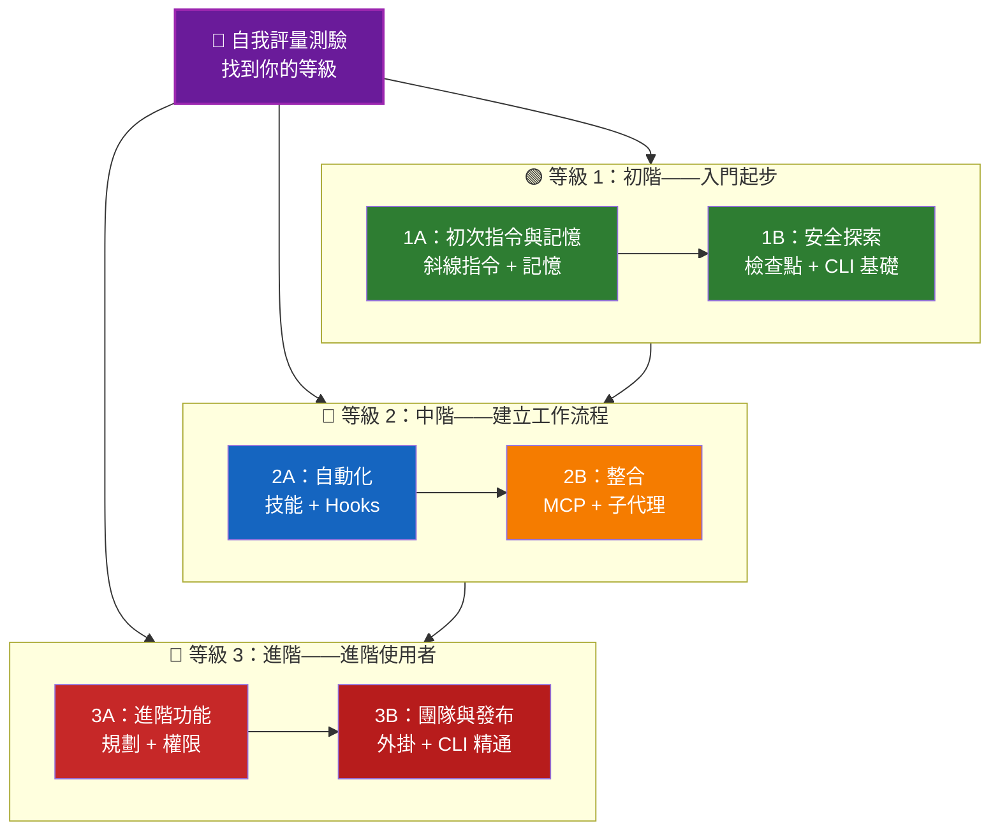

<picture>
  <source media="(prefers-color-scheme: dark)" srcset="resources/logos/claude-code-tutorial-logo-dark.svg">
  
</picture>

# 📚 Claude Code 學習路線圖

**剛接觸 Claude Code？** 這份指南幫助你依自己的步調精通 Claude Code 的各項功能。不論你是完全的新手還是有經驗的開發者，都可以先做下面的自我評量測驗，找到最適合你的路徑。

---

## 🧭 找到你的等級

不是每個人都從同樣的起點開始。做這個簡短的自我評量，找到適合你的切入點。

**誠實回答以下問題：**

- [ ] 我能啟動 Claude Code 並進行對話（`claude`）
- [ ] 我建立過或編輯過 CLAUDE.md 檔案
- [ ] 我至少用過 3 個內建斜線指令（Slash Commands）（例如 /help、/compact、/model）
- [ ] 我建立過自訂斜線指令或技能（Skills）（SKILL.md）
- [ ] 我設定過 MCP 伺服器（例如 GitHub、資料庫）
- [ ] 我在 ~/.claude/settings.json 中設定過 Hooks
- [ ] 我建立過或使用過自訂子代理（Subagents）（.claude/agents/）
- [ ] 我用過列印模式（`claude -p`）來寫腳本或做 CI/CD

**你的等級：**

| 打勾數 | 等級 | 起點 | 完成時間 |
|--------|-------|----------|------------------|
| 0-2 | **等級 1：初階**——入門起步 | [里程碑 1A](#里程碑-1a初次指令與記憶) | 約 3 小時 |
| 3-5 | **等級 2：中階**——建立工作流程 | [里程碑 2A](#里程碑-2a自動化技能與-hooks) | 約 5 小時 |
| 6-8 | **等級 3：進階**——進階使用者與團隊負責人 | [里程碑 3A](#里程碑-3a進階功能) | 約 5 小時 |

> **提示**：如果你不確定，就從低一級開始。快速複習熟悉的內容，總比漏掉基礎概念好。

> **互動版本**：在 Claude Code 中執行 `/self-assessment`，進行有引導的互動測驗，為你在全部 10 個功能領域的熟練度評分，並產生個人化的學習路徑。

---

## 🎯 學習理念

這個儲存庫裡的資料夾依照**建議的學習順序**編號，背後有三個核心原則：

1. **相依關係**——基礎概念優先
2. **複雜度**——簡單的功能先於進階功能
3. **使用頻率**——最常用的功能先教

這種做法能確保你在打好穩固基礎的同時，也能立即獲得生產力上的好處。

---

## 🗺️ 你的學習路徑



**顏色圖例：**
- 💜 紫色：自我評量測驗
- 🟢 綠色：等級 1——初階路徑
- 🔵 藍色 / 🟡 金色：等級 2——中階路徑
- 🔴 紅色：等級 3——進階路徑

---

## 📊 完整路線圖總表

| 步驟 | 功能 | 複雜度 | 時間 | 等級 | 相依 | 為什麼要學 | 主要好處 |
|------|---------|-----------|------|-------|--------------|----------------|--------------|
| **1** | [斜線指令](01-slash-commands/) | ⭐ 初階 | 30 分鐘 | 等級 1 | 無 | 快速提升生產力（60+ 個內建指令 + 10 個內建技能） | 立即自動化、團隊標準 |
| **2** | [記憶](02-memory/) | ⭐⭐ 初階＋ | 45 分鐘 | 等級 1 | 無 | 所有功能的必備基礎 | 持久上下文、偏好設定 |
| **3** | [檢查點（Checkpoints）](08-checkpoints/) | ⭐⭐ 中階 | 45 分鐘 | 等級 1 | 工作階段（session）管理 | 安全探索 | 實驗、復原 |
| **4** | [CLI 基礎](10-cli/) | ⭐⭐ 初階＋ | 30 分鐘 | 等級 1 | 無 | CLI 核心用法 | 互動模式與列印模式 |
| **5** | [技能](03-skills/) | ⭐⭐ 中階 | 1 小時 | 等級 2 | 斜線指令 | 自動化的專業能力 | 可重複使用的能力、一致性 |
| **6** | [Hooks](06-hooks/) | ⭐⭐ 中階 | 1 小時 | 等級 2 | 工具、指令 | 工作流程自動化（33 個事件、5 種類型） | 驗證、品質關卡 |
| **7** | [MCP](05-mcp/) | ⭐⭐⭐ 中階＋ | 1 小時 | 等級 2 | 設定 | 即時資料存取 | 即時整合、API |
| **8** | [子代理](04-subagents/) | ⭐⭐⭐ 中階＋ | 1.5 小時 | 等級 2 | 記憶、指令 | 處理複雜任務（6 個內建，含 Bash） | 委派、專門的專業能力 |
| **9** | [進階功能](09-advanced-features/) | ⭐⭐⭐⭐⭐ 進階 | 2-3 小時 | 等級 3 | 之前全部 | 進階使用者工具 | 規劃、自動模式、頻道、語音輸入、權限 |
| **10** | [外掛（Plugins）](07-plugins/) | ⭐⭐⭐⭐ 進階 | 2 小時 | 等級 3 | 之前全部 | 完整解決方案 | 團隊上手、發布 |
| **11** | [CLI 精通](10-cli/) | ⭐⭐⭐ 進階 | 1 小時 | 等級 3 | 建議：全部 | 精通命令列用法 | 腳本、CI/CD、自動化 |

**總學習時間**：約 11-13 小時（也可以直接跳到你的等級，節省時間）

---

## 🟢 等級 1：初階——入門起步

**適合對象**：測驗打勾數 0-2 的使用者
**時間**：約 3 小時
**重點**：立即提升生產力、理解基礎概念
**成果**：能自在應付日常使用，準備好進入等級 2

### 里程碑 1A：初次指令與記憶

**主題**：斜線指令 + 記憶
**時間**：1-2 小時
**複雜度**：⭐ 初階
**目標**：用自訂指令與持久上下文，立即提升生產力

#### 學習成果
✅ 為重複性任務建立自訂斜線指令
✅ 設定專案記憶以維護團隊標準
✅ 設定個人偏好
✅ 理解 Claude 如何自動載入上下文

#### 實作練習

```bash
# 練習 1：安裝你的第一個斜線指令
mkdir -p .claude/commands
cp 01-slash-commands/optimize.md .claude/commands/

# 練習 2：建立專案記憶
cp 02-memory/project-CLAUDE.md ./CLAUDE.md

# 練習 3：試試看
# 在 Claude Code 中輸入：/optimize
```

#### 成功標準
- [ ] 成功呼叫 `/optimize` 指令
- [ ] Claude 能從 CLAUDE.md 記住你的專案標準
- [ ] 你理解該在什麼情況下用斜線指令，什麼情況下用記憶

#### 下一步
熟悉之後，閱讀：
- [01-slash-commands/README.md](01-slash-commands/README.md)
- [02-memory/README.md](02-memory/README.md)

> **檢查你的理解程度**：在 Claude Code 中執行 `/lesson-quiz slash-commands` 或 `/lesson-quiz memory`，測試你學到的內容。

---

### 里程碑 1B：安全探索

**主題**：檢查點 + CLI 基礎
**時間**：1 小時
**複雜度**：⭐⭐ 初階＋
**目標**：學會安全地實驗，並使用核心 CLI 指令

#### 學習成果
✅ 建立並還原檢查點，安全地進行實驗
✅ 理解互動模式與列印模式的差異
✅ 使用基本的 CLI 旗標與選項
✅ 透過管線處理檔案

#### 實作練習

```bash
# 練習 1：試試檢查點工作流程
# 在 Claude Code 中：
# 做一些實驗性的變更，然後按兩下 Esc 或使用 /rewind
# 選擇你實驗之前的檢查點
# 選擇「還原程式碼與對話」回到之前的狀態

# 練習 2：互動模式與列印模式
claude "解釋這個專案"                     # 互動模式
claude -p "解釋這個函式"                  # 列印模式（非互動）

# 練習 3：透過管線處理檔案內容
cat error.log | claude -p "解釋這個錯誤"
```

#### 成功標準
- [ ] 建立並還原到某個檢查點
- [ ] 用過互動模式與列印模式
- [ ] 透過管線把檔案傳給 Claude 分析
- [ ] 理解何時該用檢查點來做安全實驗

#### 下一步
- 閱讀：[08-checkpoints/README.md](08-checkpoints/README.md)
- 閱讀：[10-cli/README.md](10-cli/README.md)
- **準備好進入等級 2 了！** 前往[里程碑 2A](#里程碑-2a自動化技能與-hooks)

> **檢查你的理解程度**：執行 `/lesson-quiz checkpoints` 或 `/lesson-quiz cli`，確認你準備好進入等級 2。

---

## 🔵 等級 2：中階——建立工作流程

**適合對象**：測驗打勾數 3-5 的使用者
**時間**：約 5 小時
**重點**：自動化、整合、任務委派
**成果**：自動化工作流程、外部整合，準備好進入等級 3

### 先備知識檢查

開始等級 2 之前，先確認你已經熟悉以下等級 1 的概念：

- [ ] 能建立並使用斜線指令（[01-slash-commands/](01-slash-commands/)）
- [ ] 已透過 CLAUDE.md 設定專案記憶（[02-memory/](02-memory/)）
- [ ] 知道如何建立並還原檢查點（[08-checkpoints/](08-checkpoints/)）
- [ ] 能在命令列中使用 `claude` 與 `claude -p`（[10-cli/](10-cli/)）

> **有落差？** 請先複習上面連結的教學，再繼續往下走。

---

### 里程碑 2A：自動化（技能與 Hooks）

**主題**：技能 + Hooks
**時間**：2-3 小時
**複雜度**：⭐⭐ 中階
**目標**：自動化常見的工作流程與品質檢查

#### 學習成果
✅ 用 YAML frontmatter 自動呼叫專門能力（包含 `effort` 與 `shell` 欄位）
✅ 針對 33 個 Hook 事件設定事件驅動的自動化
✅ 使用全部 5 種 Hook 類型（command、http、mcp_tool、prompt、agent）
✅ 落實程式碼品質標準
✅ 為你的工作流程建立自訂 Hooks

#### 實作練習

```bash
# 練習 1：安裝一個技能
cp -r 03-skills/code-review-specialist ~/.claude/skills/

# 練習 2：設定 Hooks
mkdir -p ~/.claude/hooks
cp 06-hooks/pre-tool-check.sh ~/.claude/hooks/
chmod +x ~/.claude/hooks/pre-tool-check.sh

# 練習 3：在設定中設定 Hooks
# 加入 ~/.claude/settings.json：
{
  "hooks": {
    "PreToolUse": [
      {
        "matcher": "Bash",
        "hooks": [
          {
            "type": "command",
            "command": "~/.claude/hooks/pre-tool-check.sh"
          }
        ]
      }
    ]
  }
}
```

#### 成功標準
- [ ] 相關情境下自動呼叫程式碼審查技能
- [ ] PreToolUse Hook 在工具執行前執行
- [ ] 你理解技能自動呼叫與 Hook 事件觸發的差異

#### 下一步
- 建立你自己的自訂技能
- 為你的工作流程設定更多 Hooks
- 閱讀：[03-skills/README.md](03-skills/README.md)
- 閱讀：[06-hooks/README.md](06-hooks/README.md)

> **檢查你的理解程度**：執行 `/lesson-quiz skills` 或 `/lesson-quiz hooks`，在繼續之前測試你的知識。

---

### 里程碑 2B：整合（MCP 與子代理）

**主題**：MCP + 子代理
**時間**：2-3 小時
**複雜度**：⭐⭐⭐ 中階＋
**目標**：整合外部服務並委派複雜任務

#### 學習成果
✅ 存取 GitHub、資料庫等來源的即時資料
✅ 把工作委派給專門的 AI 代理
✅ 理解該用 MCP 還是子代理
✅ 建立整合式工作流程

#### 實作練習

```bash
# 練習 1：設定 GitHub MCP
export GITHUB_TOKEN="your_github_token"
claude mcp add github -- npx -y @modelcontextprotocol/server-github

# 練習 2：測試 MCP 整合
# 在 Claude Code 中：/mcp__github__list_prs

# 練習 3：安裝子代理
mkdir -p .claude/agents
cp 04-subagents/*.md .claude/agents/
```

#### 整合練習
試試這個完整的工作流程：
1. 用 MCP 取得一個 GitHub PR
2. 讓 Claude 把審查工作委派給 code-reviewer 子代理
3. 用 Hooks 自動執行測試

#### 成功標準
- [ ] 成功透過 MCP 查詢 GitHub 資料
- [ ] Claude 能把複雜任務委派給子代理
- [ ] 你理解 MCP 與子代理之間的差異
- [ ] 在同一個工作流程中結合 MCP、子代理與 Hooks

#### 下一步
- 設定更多 MCP 伺服器（資料庫、Slack 等）
- 為你的領域建立自訂子代理
- 閱讀：[05-mcp/README.md](05-mcp/README.md)
- 閱讀：[04-subagents/README.md](04-subagents/README.md)
- **準備好進入等級 3 了！** 前往[里程碑 3A](#里程碑-3a進階功能)

> **檢查你的理解程度**：執行 `/lesson-quiz mcp` 或 `/lesson-quiz subagents`，確認你準備好進入等級 3。

---

## 🔴 等級 3：進階——進階使用者與團隊負責人

**適合對象**：測驗打勾數 6-8 的使用者
**時間**：約 5 小時
**重點**：團隊工具、CI/CD、企業功能、外掛開發
**成果**：成為進階使用者，能建立團隊工作流程與 CI/CD

### 先備知識檢查

開始等級 3 之前，先確認你已經熟悉以下等級 2 的概念：

- [ ] 能建立並使用具備自動呼叫功能的技能（[03-skills/](03-skills/)）
- [ ] 已設定 Hooks 做事件驅動的自動化（[06-hooks/](06-hooks/)）
- [ ] 能設定 MCP 伺服器存取外部資料（[05-mcp/](05-mcp/)）
- [ ] 知道如何用子代理委派任務（[04-subagents/](04-subagents/)）

> **有落差？** 請先複習上面連結的教學，再繼續往下走。

---

### 里程碑 3A：進階功能

**主題**：進階功能（規劃、權限、延伸思考（Extended Thinking）、自動模式、頻道、語音輸入、遠端／桌面／網頁）
**時間**：2-3 小時
**複雜度**：⭐⭐⭐⭐⭐ 進階
**目標**：精通進階工作流程與進階使用者工具

#### 學習成果
✅ 用規劃模式（Planning Mode）處理複雜功能
✅ 用 6 種模式做細粒度的權限控制（manual——原名 default、acceptEdits、plan、auto、dontAsk、bypassPermissions）
✅ 用 Alt+T／Option+T 切換延伸思考
✅ 背景任務管理
✅ 用自動記憶學習偏好設定
✅ 搭配背景安全分類器的 自動模式
✅ 用頻道做結構化的多工作階段工作流程
✅ 用語音輸入做免持互動
✅ 遠端控制（已正式推出——你的機器會以裝置卡片的形式出現在 Claude app 中）、桌面應用程式，以及網頁工作階段
✅ 用 Agent Teams（代理團隊（Agent Teams））做多代理協作

#### 實作練習

```bash
# 練習 1：使用規劃模式
/plan 實作使用者驗證系統

# 練習 2：試試權限模式（共 6 種：manual [原名 default]、acceptEdits、plan、auto、dontAsk、bypassPermissions）
claude --permission-mode plan "分析這個程式碼庫"
claude --permission-mode acceptEdits "重構驗證模組"
claude --permission-mode auto "實作這個功能"

# 練習 3：啟用延伸思考
# 工作階段中按 Alt+T（macOS 上為 Option+T）即可切換

# 練習 4：進階檢查點工作流程
# 1. 建立檢查點「Clean state」
# 2. 用規劃模式設計功能
# 3. 委派子代理實作
# 4. 在背景執行測試
# 5. 若測試失敗，回溯到檢查點
# 6. 嘗試其他做法

# 練習 5：試試 自動模式（背景安全分類器）
claude --permission-mode auto "實作使用者設定頁面"

# 練習 6：啟用 agent teams
export CLAUDE_AGENT_TEAMS=1
# 請 Claude：「用團隊合作的方式實作功能 X」

# 練習 7：排程任務
/loop 5m /check-status
# 或使用 CronCreate 建立持久的排程任務

# 練習 8：頻道用於多工作階段工作流程
# 用 channels 整理跨工作階段的工作

# 練習 9：語音輸入
# 用語音輸入與 Claude Code 免持互動
```

#### 成功標準
- [ ] 用規劃模式處理過複雜功能
- [ ] 設定過權限模式（plan、acceptEdits、auto、dontAsk）
- [ ] 用 Alt+T／Option+T 切換過延伸思考
- [ ] 用過搭配背景安全分類器的 自動模式
- [ ] 用背景任務處理過長時間的操作
- [ ] 探索過用於多工作階段工作流程的頻道
- [ ] 試過用語音輸入做免持輸入
- [ ] 理解遠端控制、桌面應用程式與網頁工作階段
- [ ] 在跨工作階段的 `SendMessage` 上用過 `notify_when_idle`，在另一個工作階段閒置時收到通知
- [ ] 啟用並使用代理團隊處理協作任務
- [ ] 用 `/loop` 處理週期性任務或排程監控

#### 下一步
- 閱讀：[09-advanced-features/README.md](09-advanced-features/README.md)

> **檢查你的理解程度**：執行 `/lesson-quiz advanced`，測試你對進階使用者功能的掌握程度。

---

### 里程碑 3B：團隊與發布（外掛與 CLI 精通）

**主題**：外掛 + CLI 精通 + CI/CD
**時間**：2-3 小時
**複雜度**：⭐⭐⭐⭐ 進階
**目標**：建立團隊工具、建立外掛、精通 CI/CD 整合

#### 學習成果
✅ 安裝並建立完整的內建外掛
✅ 精通用於腳本與自動化的 CLI
✅ 用 `claude -p` 設定 CI/CD 整合
✅ 為自動化管線產生 JSON 輸出
✅ 工作階段管理與批次處理

#### 實作練習

```bash
# 練習 1：安裝一個完整的外掛
# 在 Claude Code 中：/plugin install pr-review

# 練習 2：CI/CD 用的列印模式
claude -p "執行所有測試並產生報告"

# 練習 3：腳本用的 JSON 輸出
claude -p --output-format json "列出所有函式"

# 練習 4：工作階段管理與恢復
claude -r "feature-auth" "繼續實作"

# 練習 5：帶限制的 CI/CD 整合
claude -p --max-turns 3 --output-format json "審查程式碼"

# 練習 6：批次處理
for file in *.md; do
  claude -p --output-format json "摘要這個：$(cat $file)" > ${file%.md}.summary.json
done
```

#### CI/CD 整合練習
建立一個簡單的 CI/CD 腳本：
1. 用 `claude -p` 審查變更的檔案
2. 把結果輸出為 JSON
3. 用 `jq` 處理特定問題
4. 整合進 GitHub Actions 工作流程

#### 成功標準
- [ ] 安裝並使用過一個外掛
- [ ] 為你的團隊建立或修改過外掛
- [ ] 在 CI/CD 中用過列印模式（`claude -p`）
- [ ] 為腳本產生過 JSON 輸出
- [ ] 成功恢復過先前的工作階段
- [ ] 建立過批次處理腳本
- [ ] 把 Claude 整合進 CI/CD 工作流程

#### CLI 的實際使用情境
- **程式碼審查自動化**：在 CI/CD 管線中執行程式碼審查
- **日誌分析**：分析錯誤日誌與系統輸出
- **文件產生**：批次產生文件
- **測試洞察**：分析測試失敗原因
- **效能分析**：檢視效能指標
- **資料處理**：轉換並分析資料檔案

#### 下一步
- 閱讀：[07-plugins/README.md](07-plugins/README.md)
- 閱讀：[10-cli/README.md](10-cli/README.md)
- 建立全團隊共用的 CLI 捷徑與外掛
- 設定批次處理腳本

> **檢查你的理解程度**：執行 `/lesson-quiz plugins` 或 `/lesson-quiz cli`，確認你已經掌握內容。

---

## 🧪 測試你的知識

這個儲存庫內建兩個互動技能，你隨時可以在 Claude Code 中使用它們來評估你的理解程度：

| 技能 | 指令 | 用途 |
|-------|---------|---------|
| **Self-Assessment** | `/self-assessment` | 評估你在全部 10 個功能上的整體熟練度。選擇快速模式（2 分鐘）或深入模式（5 分鐘），取得個人化的技能檔案與學習路徑。 |
| **Lesson Quiz** | `/lesson-quiz [lesson]` | 用 10 個問題測試你對特定課程的理解。可以在上課前（前測）、上課中（進度檢查）或上課後（精熟驗證）使用。 |

**範例：**
```
/self-assessment                  # 找到你的整體等級
/lesson-quiz hooks                # 測驗課程 06：Hooks
/lesson-quiz 03                   # 測驗課程 03：技能
/lesson-quiz advanced-features    # 測驗課程 09
```

---

## ⚡ 快速開始路徑

### 如果你只有 15 分鐘
**目標**：拿到你的第一個成果

1. 複製一個斜線指令：`cp 01-slash-commands/optimize.md .claude/commands/`
2. 在 Claude Code 中試試看：`/optimize`
3. 閱讀：[01-slash-commands/README.md](01-slash-commands/README.md)

**成果**：你會有一個能用的斜線指令，並理解基本概念

---

### 如果你有 1 小時
**目標**：設定必備的生產力工具

1. **斜線指令**（15 分鐘）：複製並測試 `/optimize` 與 `/pr`
2. **專案記憶**（15 分鐘）：建立包含你專案標準的 CLAUDE.md
3. **安裝一個技能**（15 分鐘）：設定 code-review-specialist 技能
4. **一起試試看**（15 分鐘）：看看它們如何協同運作

**成果**：透過指令、記憶與自動技能，基本提升生產力

---

### 如果你有一個週末
**目標**：熟練掌握大多數功能

**週六上午**（3 小時）：
- 完成里程碑 1A：斜線指令 + 記憶
- 完成里程碑 1B：檢查點 + CLI 基礎

**週六下午**（3 小時）：
- 完成里程碑 2A：技能 + Hooks
- 完成里程碑 2B：MCP + 子代理

**週日**（4 小時）：
- 完成里程碑 3A：進階功能
- 完成里程碑 3B：外掛 + CLI 精通 + CI/CD
- 為你的團隊建立自訂外掛

**成果**：你會成為 Claude Code 的進階使用者，準備好訓練其他人並自動化複雜的工作流程

---

## 💡 學習小技巧

### ✅ 建議做法

- **先做測驗**，找到你的起點
- 為每個里程碑**完成實作練習**
- **從簡單開始**，逐漸增加複雜度
- 在進入下一項之前，**先測試每個功能**
- **做筆記**，記錄哪些做法適合你的工作流程
- 學習進階主題時，**回頭參考**之前的概念
- 用檢查點**安全地實驗**
- 跟你的團隊**分享知識**

### ❌ 避免做法

- 跳到更高等級時，**跳過先備知識檢查**
- **試圖一次學完所有東西**——這樣會不知所措
- **在不理解的情況下複製設定**——你會不知道怎麼除錯
- **忘記測試**——一定要驗證功能真的能用
- **匆忙趕過里程碑**——花時間好好理解
- **忽視文件**——每份 README 都有寶貴的細節
- **獨自悶頭做**——多跟隊友討論

---

## 🎓 學習風格

### 視覺型學習者
- 研究每份 README 中的 Mermaid 圖
- 觀察指令執行的流程
- 畫出你自己的工作流程圖
- 使用上面的視覺化學習路徑

### 實作型學習者
- 完成每一個實作練習
- 嘗試不同的變化
- 把東西弄壞再修好（用檢查點！）
- 建立你自己的範例

### 閱讀型學習者
- 徹底閱讀每份 README
- 研究程式碼範例
- 檢視比較表格
- 閱讀資源中連結的部落格文章

### 社交型學習者
- 安排結對程式設計時段
- 把概念教給隊友
- 加入 Claude Code 社群討論
- 分享你的自訂設定

---

## 📈 進度追蹤

用以下檢查清單依等級追蹤你的進度。隨時執行 `/self-assessment` 取得最新的技能檔案，或在每份教學之後執行 `/lesson-quiz [lesson]` 來驗證你的理解程度。

### 🟢 等級 1：初階
- [ ] 完成 [01-slash-commands](01-slash-commands/)
- [ ] 完成 [02-memory](02-memory/)
- [ ] 建立第一個自訂斜線指令
- [ ] 設定專案記憶
- [ ] **達成里程碑 1A**
- [ ] 完成 [08-checkpoints](08-checkpoints/)
- [ ] 完成 [10-cli](10-cli/) 基礎
- [ ] 建立並還原到某個檢查點
- [ ] 用過互動模式與列印模式
- [ ] **達成里程碑 1B**

### 🔵 等級 2：中階
- [ ] 完成 [03-skills](03-skills/)
- [ ] 完成 [06-hooks](06-hooks/)
- [ ] 安裝第一個技能
- [ ] 設定 PreToolUse Hook
- [ ] **達成里程碑 2A**
- [ ] 完成 [05-mcp](05-mcp/)
- [ ] 完成 [04-subagents](04-subagents/)
- [ ] 連接 GitHub MCP
- [ ] 建立自訂子代理
- [ ] 在工作流程中結合多種整合
- [ ] **達成里程碑 2B**

### 🔴 等級 3：進階
- [ ] 完成 [09-advanced-features](09-advanced-features/)
- [ ] 成功使用過規劃模式
- [ ] 設定過權限模式（含 auto 共 6 種）
- [ ] 用過搭配安全分類器的 自動模式
- [ ] 用過延伸思考切換
- [ ] 探索過頻道與語音輸入
- [ ] **達成里程碑 3A**
- [ ] 完成 [07-plugins](07-plugins/)
- [ ] 完成 [10-cli](10-cli/) 進階用法
- [ ] 設定過列印模式（`claude -p`）CI/CD
- [ ] 為自動化建立過 JSON 輸出
- [ ] 把 Claude 整合進 CI/CD 管線
- [ ] 建立過團隊外掛
- [ ] **達成里程碑 3B**

---

## 🆘 常見學習挑戰

### 挑戰 1：「一次太多概念」
**解法**：一次專注在一個里程碑上。完成所有練習後再往下走。

### 挑戰 2：「不知道什麼時候該用哪個功能」
**解法**：參考主要 README 中的[使用情境對照表](README.md#use-case-matrix)。

### 挑戰 3：「設定不生效」
**解法**：檢查[疑難排解](README.md#troubleshooting)一節，並確認檔案位置。

### 挑戰 4：「概念好像會重疊」
**解法**：檢視[功能比較](README.md#feature-comparison)表格，了解彼此的差異。

### 挑戰 5：「很難記住所有東西」
**解法**：建立你自己的小抄。用檢查點安全地實驗。

### 挑戰 6：「我有經驗，但不確定該從哪裡開始」
**解法**：做上面的[自我評量測驗](#-找到你的等級)。直接跳到你的等級，用先備知識檢查找出任何落差。

---

## 🎯 完成之後呢？

完成所有里程碑之後：

1. **建立團隊文件**——記錄你團隊的 Claude Code 設定
2. **建立自訂外掛**——把你團隊的工作流程包裝起來，包含較新的清單欄位（`workflows`、`channels`、`dependencies`）
3. **試試 `/design`**——在設計畫布上畫出 UI 草圖、畫面流程或到達頁面，不用手寫 HTML（研究預覽版，v2.1.233+）
4. **探索遠端控制**——從外部工具以程式化方式控制 Claude Code 工作階段，或透過 Claude app 中的裝置卡片從手機啟動一個工作階段
5. **試試網頁工作階段**——透過瀏覽器介面使用 Claude Code 進行遠端開發
6. **使用桌面應用程式**——透過原生桌面應用程式存取 Claude Code 功能
7. **使用 自動模式**——讓 Claude 搭配背景安全分類器自主運作
8. **善用自動記憶**——讓 Claude 隨時間自動學習你的偏好
9. **設定代理團隊**——協調多個代理處理複雜、多面向的任務
10. **使用頻道**——在結構化的多工作階段工作流程中整理工作
11. **試試語音輸入**——用免持語音輸入跟 Claude Code 互動
12. **使用排程任務**——用 `/loop` 與 cron 工具自動化週期性檢查
13. **貢獻範例**——分享給社群
14. **指導其他人**——幫助隊友學習
15. **最佳化工作流程**——依使用情況持續改進
16. **保持更新**——追蹤 Claude Code 的發行與新功能

---

## 📚 延伸資源

### 官方文件
- [Claude Code 文件](https://code.claude.com/docs/en/overview)
- [Anthropic 文件](https://docs.anthropic.com)
- [MCP 協定規格](https://modelcontextprotocol.io)

### 部落格文章
- [認識 Claude Code 斜線指令](https://medium.com/@kevin801221/discovering-claude-code-slash-commands-cdc17f0dfb29)

### 社群
- [Anthropic Cookbook](https://github.com/anthropics/anthropic-cookbook)
- [MCP 伺服器儲存庫](https://github.com/modelcontextprotocol/servers)

---

## 💬 意見回饋與支援

- **發現問題了嗎？** 在儲存庫中建立一個 Issue
- **有建議嗎？** 提交一個 Pull Request
- **需要協助嗎？** 查閱文件或詢問社群

---

**最後更新**：2026 年 9 月 2 日
**Claude Code 版本**：2.1.257
**資料來源**：
- https://code.claude.com/docs/en/overview
- https://code.claude.com/docs/en/hooks
- https://code.claude.com/docs/en/permission-modes
- https://github.com/anthropics/claude-code/releases/tag/v2.1.144
- https://github.com/anthropics/claude-code/releases/tag/v2.1.145
- https://code.claude.com/docs/en/model-config
**相容模型**：Claude Fable 5.1、Claude Fable 5、Claude Opus 5、Claude Sonnet 5、Claude Sonnet 4.6、Claude Opus 4.8 與 Claude Haiku 4.5
**維護者**：Claude How-To Contributors
**授權條款**：教育用途，可自由使用與調整

---

[← 回到主 README](README.md)
