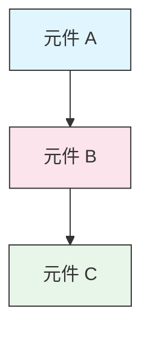

<picture>
  <source media="(prefers-color-scheme: dark)" srcset="resources/logos/claude-code-tutorial-logo-dark.svg">
  
</picture>

# 風格指南

> 為 Claude Code 完整教學 貢獻內容時應遵循的慣例與格式規則。遵循本指南可讓內容保持一致、專業且易於維護。

---

## 目錄

- [檔案與資料夾命名](#檔案與資料夾命名)
- [文件結構](#文件結構)
- [標題](#標題)
- [文字格式](#文字格式)
- [清單](#清單)
- [表格](#表格)
- [程式碼區塊](#程式碼區塊)
- [連結與交叉引用](#連結與交叉引用)
- [圖表](#圖表)
- [表情符號使用](#表情符號使用)
- [YAML Frontmatter](#yaml-frontmatter)
- [圖片與媒體](#圖片與媒體)
- [語氣與風格](#語氣與風格)
- [提交訊息](#提交訊息)
- [作者檢查清單](#作者檢查清單)

---

## 檔案與資料夾命名

### 課程資料夾

課程資料夾採用**兩位數字編號前綴**，後面接 **kebab-case**（連字號分隔小寫字）描述文字：

```
01-slash-commands/
02-memory/
03-skills/
04-subagents/
05-mcp/
```

數字代表由入門到進階的學習路徑順序。

### 檔名

| 類型 | 命名慣例 | 範例 |
|------|-----------|----------|
| **課程 README** | `README.md` | `01-slash-commands/README.md` |
| **功能檔案** | Kebab-case `.md` | `code-reviewer.md`, `generate-api-docs.md` |
| **Shell 腳本** | Kebab-case `.sh` | `format-code.sh`, `validate-input.sh` |
| **設定檔** | 標準名稱 | `.mcp.json`, `settings.json` |
| **記憶（Memory）檔案** | 依範圍加前綴 | `project-CLAUDE.md`, `personal-CLAUDE.md` |
| **根目錄文件** | UPPER_CASE `.md` | `CATALOG.md`, `QUICK_REFERENCE.md`, `CONTRIBUTING.md` |
| **圖片素材** | Kebab-case | `pr-slash-command.png`, `claude-code-tutorial-logo.svg` |

### 規則

- 所有檔案與資料夾名稱一律使用**小寫**（根目錄文件例外，如 `README.md`、`CATALOG.md`）
- 使用**連字號**（`-`）分隔單字，不要用底線或空白
- 名稱要具描述性但保持精簡

---

## 文件結構

### 根目錄 README

根目錄的 `README.md` 依下列順序編排：

1. Logo（含深色／淺色版本的 `<picture>` 元素）
2. H1 標題
3. 開場引言（一句話式的價值主張）
4. 「為什麼要用這份指南？」章節（含比較表格）
5. 水平分隔線（`---`）
6. 目錄
7. 功能目錄
8. 快速導覽
9. 學習路徑
10. 功能章節
11. 快速開始
12. 最佳實踐／疑難排解
13. 參與貢獻／授權條款

### 課程 README

每個課程的 `README.md` 依下列順序編排：

1. H1 標題（例如 `# 斜線指令`）
2. 簡短總覽段落
3. 快速參考表格（選用）
4. 架構圖（Mermaid）
5. 詳細章節（H2）
6. 實際範例（編號，4 到 6 個範例）
7. 最佳實踐（建議做法／避免做法表格）
8. 疑難排解
9. 相關指南／官方文件
10. 文件中繼資料頁尾

### 功能／範例檔案

個別功能檔案（例如 `optimize.md`、`pr.md`）：

1. YAML frontmatter（若適用）
2. H1 標題
3. 用途／說明
4. 使用方式
5. 程式碼範例
6. 自訂技巧

### 章節分隔線

使用水平分隔線（`---`）區隔文件中的主要區塊：

```markdown
---

## 新的主要章節
```

請放在開頭引言之後，以及文件中邏輯上不同區塊之間。

---

## 標題

### 階層

| 層級 | 用途 | 範例 |
|-------|-----|---------|
| `#` H1 | 頁面標題（每份文件一個） | `# 斜線指令` |
| `##` H2 | 主要章節 | `## 最佳實踐` |
| `###` H3 | 子章節 | `### 新增技能` |
| `####` H4 | 次子章節（少見） | `#### 設定選項` |

### 規則

- **每份文件只能有一個 H1** — 僅用於頁面標題
- **不要跳過層級** — 不要從 H2 直接跳到 H4
- **標題保持精簡** — 以 2 到 5 個字詞為原則
- **使用一般句子大小寫** — 只有第一個字與專有名詞需大寫（例外：功能名稱維持原樣）
- **只在根目錄 README 的章節標題加上 emoji 前綴**（見[表情符號使用](#表情符號使用)）

---

## 文字格式

### 強調

| 樣式 | 使用時機 | 範例 |
|-------|------------|---------|
| **粗體**（`**text**`） | 關鍵詞、表格欄位標籤、重要概念 | `**安裝**：` |
| *斜體*（`*text*`） | 技術術語第一次出現、書名／文件標題 | `*frontmatter*` |
| `程式碼`（`` `text` ``） | 檔名、指令、設定值、程式碼引用 | `` `CLAUDE.md` `` |

### 引言區塊標注（Callout）

使用加粗前綴的引言區塊來標注重要事項：

```markdown
> **備註**：自 v2.0 起，自訂斜線指令已整併為技能。

> **重要**：絕對不要提交 API 金鑰或憑證。

> **提示**：搭配記憶與技能一起使用效果最好。
```

支援的標注類型：**注意**、**重要**、**提示**、**警告**。

### 段落

- 段落保持簡短（2 到 4 句）
- 段落之間加空行
- 先講重點，再補充脈絡
- 說明「為什麼」而不只是「是什麼」

---

## 清單

### 無序清單

使用連字號（`-`），巢狀清單以 2 個空格縮排：

```markdown
- 第一項
- 第二項
  - 巢狀項目
  - 另一個巢狀項目
    - 更深層巢狀（避免超過 3 層）
- 第三項
```

### 有序清單

循序步驟、操作說明與排序項目使用數字清單：

```markdown
1. 第一步
2. 第二步
   - 子項目細節
   - 另一個子項目
3. 第三步
```

### 描述型清單

鍵值形式的清單使用粗體標籤：

```markdown
- **效能瓶頸** - 找出 O(n^2) 運算、低效率迴圈
- **記憶體洩漏** - 找出未釋放的資源、循環參照
- **演算法改進** - 提出更好的演算法或資料結構
```

### 規則

- 維持一致的縮排（每層 2 個空格）
- 清單前後加空行
- 保持清單項目結構一致（全部以動詞開頭，或全部是名詞等）
- 避免巢狀超過 3 層

---

## 表格

### 標準格式

```markdown
| 欄位 1 | 欄位 2 | 欄位 3 |
|----------|----------|----------|
| 資料     | 資料     | 資料     |
```

### 常見表格樣式

**功能比較（3 到 4 欄）：**

```markdown
| 功能 | 呼叫方式 | 持續性 | 最適合用途 |
|---------|-----------|------------|----------|
| **斜線指令** | 手動（`/cmd`） | 僅限單次工作階段 | 快速捷徑 |
| **記憶** | 自動載入 | 跨工作階段 | 長期學習 |
```

**建議做法／避免做法：**

```markdown
| 建議做法 | 避免做法 |
|----|-------|
| 使用具描述性的名稱 | 使用模糊的名稱 |
| 讓檔案聚焦單一主題 | 讓單一檔案塞太多內容 |
```

**快速參考：**

```markdown
| 面向 | 說明 |
|--------|---------|
| **用途** | 產生 API 文件 |
| **範圍** | 專案層級 |
| **複雜度** | 中階 |
```

### 規則

- 當表頭是列標籤（第一欄）時使用**粗體**
- 原始碼中對齊 `|` 分隔線以利閱讀（選用但建議）
- 儲存格內容保持精簡；細節請用連結
- 儲存格內的指令與檔案路徑使用 `程式碼格式`

---

## 程式碼區塊

### 語言標記

務必指定語言標記以啟用語法高亮：

| 語言 | 標記 | 用途 |
|----------|-----|---------|
| Shell | `bash` | CLI 指令、腳本 |
| Python | `python` | Python 程式碼 |
| JavaScript | `javascript` | JS 程式碼 |
| TypeScript | `typescript` | TS 程式碼 |
| JSON | `json` | 設定檔 |
| YAML | `yaml` | Frontmatter、設定 |
| Markdown | `markdown` | Markdown 範例 |
| SQL | `sql` | 資料庫查詢 |
| 純文字 | （無標記） | 預期輸出、目錄樹 |

### 慣例

```bash
# 用註解說明這個指令的作用
claude mcp add notion --transport http https://mcp.notion.com/mcp
```

- 在不易理解的指令前加上**註解行**
- 讓所有範例都**可直接複製貼上使用**
- 視情況同時提供**簡易版與進階版**
- 有助理解時附上**預期輸出**（使用不標語言的程式碼區塊）

### 安裝區塊

安裝說明使用以下樣式：

```bash
# 把檔案複製到你的專案
cp 01-slash-commands/*.md .claude/commands/
```

### 多步驟工作流程

```bash
# 步驟 1：建立目錄
mkdir -p .claude/commands

# 步驟 2：複製範本
cp 01-slash-commands/*.md .claude/commands/

# 步驟 3：確認安裝結果
ls .claude/commands/
```

---

## 連結與交叉引用

### 內部連結（相對路徑）

所有內部連結一律使用相對路徑：

```markdown
[斜線指令](01-slash-commands/)
[技能指南](03-skills/)
[記憶架構](02-memory/#記憶架構)
```

從課程資料夾連結回根目錄或同層資料夾：

```markdown
[回到主指南](../README.md)
[相關：技能](../03-skills/)
```

### 外部連結（絕對路徑）

使用完整網址，並搭配具描述性的錨點文字：

```markdown
[Anthropic 官方文件](https://code.claude.com/docs/en/overview)
```

- 絕對不要用「點這裡」或「這個連結」作為錨點文字
- 使用即使脫離上下文也看得懂的描述性文字

### 章節錨點

在同一份文件內，使用 GitHub 樣式的錨點連結到各章節：

```markdown
[功能目錄](#-功能目錄)
[最佳實踐](#最佳實踐)
```

### 相關指南樣式

在課程結尾加上相關指南章節：

```markdown
## 相關指南

- [斜線指令](../01-slash-commands/) - 快速捷徑
- [記憶](../02-memory/) - 跨工作階段的上下文
- [技能](../03-skills/) - 可重複使用的能力
```

---

## 圖表

### Mermaid

所有圖表一律使用 Mermaid。支援的類型：

- `graph TB` / `graph LR` — 架構、階層、流程
- `sequenceDiagram` — 互動流程
- `timeline` — 依時間先後排列的流程

### 樣式慣例

使用 style 區塊套用一致的顏色：



**色票：**

| 顏色 | 色碼 | 用途 |
|-------|-----|---------|
| 淺藍色 | `#e1f5fe` | 主要元件、輸入 |
| 淺粉色 | `#fce4ec` | 處理、中介層 |
| 淺綠色 | `#e8f5e9` | 輸出、結果 |
| 淺黃色 | `#fff9c4` | 設定、選用項目 |
| 淺紫色 | `#f3e5f5` | 面向使用者、UI |

### 規則

- 節點文字使用 `["標籤文字"]`（可支援特殊字元）
- 標籤內若要換行請用 `<br/>`
- 圖表保持簡單（最多 10 到 12 個節點）
- 在圖表下方附上簡短文字說明，以利無障礙閱讀
- 階層關係用由上到下（`TB`），工作流程用由左到右（`LR`）

---

## 表情符號使用

### 表情符號使用時機

表情符號**謹慎且有目的地**使用——只用在特定情境：

| 情境 | 表情符號 | 範例 |
|---------|--------|---------|
| 根目錄 README 章節標題 | 分類圖示 | `## 📚 學習路徑` |
| 技能（Skills）等級標示 | 彩色圓點 | 🟢 初階、🔵 中階、🔴 進階 |
| 建議做法／避免做法 | 打勾／打叉符號 | ✅ 建議這樣做、❌ 不要這樣做 |
| 複雜度評級 | 星號 | ⭐⭐⭐ |

### 標準表情符號集

| 表情符號 | 意義 |
|-------|---------|
| 📚 | 學習、指南、文件 |
| ⚡ | 快速開始、快速參考 |
| 🎯 | 功能、快速參考 |
| 🎓 | 學習路徑 |
| 📊 | 統計數據、比較 |
| 🚀 | 安裝、快速指令 |
| 🟢 | 初階等級 |
| 🔵 | 中階等級 |
| 🔴 | 進階等級 |
| ✅ | 建議做法 |
| ❌ | 避免做法／反模式 |
| ⭐ | 複雜度評級單位 |

### 規則

- **絕對不要在內文或段落中使用表情符號**
- **只在根目錄 README 的標題中使用表情符號**（課程 README 不用）
- **不要加裝飾性的表情符號** — 每個表情符號都要有意義
- 表情符號的使用方式要與上表保持一致

---

## YAML Frontmatter

### 功能檔案（技能、指令、代理）

```yaml
---
name: unique-identifier
description: 說明這個功能做什麼、什麼時候該用
allowed-tools: Bash, Read, Grep
---
```

### 選填欄位

```yaml
---
name: my-feature
description: 簡短說明
argument-hint: "[file-path] [options]"
allowed-tools: Bash, Read, Grep, Write, Edit
model: opus                        # opus、sonnet 或 haiku
disable-model-invocation: true     # 僅限使用者呼叫
user-invocable: false              # 在使用者選單中隱藏
context: fork                      # 在獨立的子代理中執行
agent: Explore                     # context: fork 時使用的代理類型
---
```

### 規則

- 把 frontmatter 放在檔案最上方
- `name` 欄位使用 **kebab-case**
- `description` 保持一句話
- 只包含需要的欄位

---

## 圖片與媒體

### Logo 樣式

所有以 logo 開頭的文件都使用 `<picture>` 元素以支援深色／淺色模式：

```html
<picture>
  <source media="(prefers-color-scheme: dark)" srcset="resources/logos/claude-code-tutorial-logo-dark.svg">
  
</picture>
```

### 螢幕截圖

- 存放在對應的課程資料夾中（例如 `01-slash-commands/pr-slash-command.png`）
- 檔名使用 kebab-case
- 附上具描述性的 alt 文字
- 圖表優先用 SVG，螢幕截圖優先用 PNG

### 規則

- 圖片一律附上 alt 文字
- 圖片檔案大小保持合理（PNG 建議 < 500KB）
- 圖片參照使用相對路徑
- 圖片與引用它的文件放在同一目錄，共用圖片則放在 `assets/`

---

## 語氣與風格

### 寫作風格

- **專業但平易近人** — 技術要正確，但不要堆滿術語
- **主動語態** — 用「建立一個檔案」而不是「檔案應該要被建立」
- **直接下指令** — 用「執行這個指令」而不是「你可能會想執行這個指令」
- **對初學者友善** — 假設讀者是 Claude Code 的新手，而非程式設計新手

### 內容原則

| 原則 | 範例 |
|-----------|---------|
| **展示而非空談** | 提供可實際運作的範例，而非抽象描述 |
| **漸進式複雜度** | 從簡單開始，後面的章節再加深難度 |
| **說明「為什麼」** | 用「用記憶來……因為……」而不只是「用記憶來……」 |
| **可直接複製貼上** | 每個程式碼區塊貼上後都要能直接運作 |
| **真實情境** | 使用實際情境，而非刻意編造的範例 |

### 用詞

- 用「Claude Code」（不要用「Claude CLI」或「這個工具」）
- 用「技能」（不要用「自訂指令」——這是舊用語）
- 編號章節用「課程」或「指南」
- 個別功能檔案用「範例」

---

## 提交訊息

遵循 [Conventional Commits](https://www.conventionalcommits.org/) 規範：

```
type(scope): description
```

### 類型

| 類型 | 用途 |
|------|---------|
| `feat` | 新功能、範例或指南 |
| `fix` | 錯誤修正、修正內容、修正失效連結 |
| `docs` | 文件改進 |
| `refactor` | 重構但不改變行為 |
| `style` | 純格式變更 |
| `test` | 新增或修改測試 |
| `chore` | 建置、相依套件、CI |

### 範圍

使用課程名稱或檔案所在區域作為 scope：

```
feat(slash-commands): Add API documentation generator
docs(memory): Improve personal preferences example
fix(README): Correct table of contents link
docs(skills): Add comprehensive code review skill
```

---

## 文件中繼資料頁尾

課程 README 結尾會有一個中繼資料區塊：

```markdown
---
**最後更新**：2026 年 8 月 25 日
**Claude Code 版本**：2.1.245
**相容模型**：Claude Fable 5、Claude Opus 5、Claude Sonnet 5、Claude Sonnet 4.6、Claude Opus 4.8、Claude Haiku 4.5
```

- 使用目前同步作業抓到的版本，不要用這裡顯示的值
- 使用「年 + 月 + 日」格式（例如：「2026 年 5 月 20 日」）
- 功能有變動時就更新版本號
- 列出所有相容模型

---

## 作者檢查清單

提交內容前，請確認：

- [ ] 檔案／資料夾名稱使用 kebab-case
- [ ] 文件以 H1 標題開頭（每個檔案一個）
- [ ] 標題階層正確（沒有跳過層級）
- [ ] 所有程式碼區塊都有語言標記
- [ ] 程式碼範例可直接複製貼上使用
- [ ] 內部連結使用相對路徑
- [ ] 外部連結有具描述性的錨點文字
- [ ] 表格格式正確
- [ ] 表情符號遵循標準表情符號集（若有使用）
- [ ] Mermaid 圖表使用標準色票
- [ ] 沒有機敏資訊（API 金鑰、憑證）
- [ ] YAML frontmatter 有效（若適用）
- [ ] 圖片有 alt 文字
- [ ] 段落簡短且聚焦
- [ ] 相關指南章節連結到相關課程
- [ ] 提交訊息遵循 conventional commits 格式

---

**最後更新**：2026 年 8 月 25 日
**Claude Code 版本**：2.1.245
**資料來源**：
- https://code.claude.com/docs/en/overview
- https://code.claude.com/docs/en/changelog
- https://code.claude.com/docs/en/model-config
- https://github.com/anthropics/claude-code/releases/tag/v2.1.154
**相容模型**：Claude Fable 5、Claude Opus 5、Claude Sonnet 5、Claude Sonnet 4.6、Claude Opus 4.8、Claude Haiku 4.5
