<picture>
  <source media="(prefers-color-scheme: dark)" srcset="resources/logos/claude-howto-logo-dark.svg">
  
</picture>

# Claude 概念完整指南

這份文件從概念層面說明 Claude Code 各項功能的運作方式與彼此的搭配關係——涵蓋斜線指令（Slash Commands）、子代理（Subagents）、記憶（Memory）、MCP、技能（Skills）、外掛（Plugins）、Hooks 等功能的架構圖、決策表與比較。

> **如何使用本指南**：本頁說明各項功能的*概念*——它是什麼、內部如何運作，以及什麼時候該用它。**可直接複製貼上的範本與完整參考資料放在編號模組中**（`01-` 到 `10-`），每個章節都會連結到對應模組。先在這裡建立心智模型，再前往模組實際動手設定。

---

## 目錄

1. [斜線指令](#斜線指令) — [模組](01-slash-commands/)
2. [子代理](#子代理) — [模組](04-subagents/)
3. [記憶](#記憶) — [模組](02-memory/)
4. [MCP 協定](#mcp-協定) — [模組](05-mcp/)
5. [代理技能](#代理技能) — [模組](03-skills/)
6. [外掛](#claude-code-外掛) — [模組](07-plugins/)
7. [比較與整合](#比較與整合)
8. [摘要表](#摘要表)
9. [快速開始指南](#快速開始指南)
10. [Hooks](#hooks) — [模組](06-hooks/)
11. [檢查點（Checkpoints）與回溯](#檢查點與回溯) — [模組](08-checkpoints/)
12. [進階功能](#進階功能) — [模組](09-advanced-features/)
13. [模型與推理強度](#模型與推理強度) — [模組](10-cli/)
14. [資源](#資源)

---

## 斜線指令

### 總覽

斜線指令（Slash Commands）是使用者主動觸發的捷徑，以 Markdown 檔案的形式儲存，可由 Claude Code 執行。它們能讓團隊把常用的提示詞與工作流程標準化。

### 架構

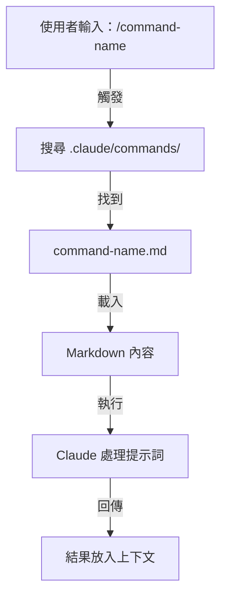

### 檔案結構

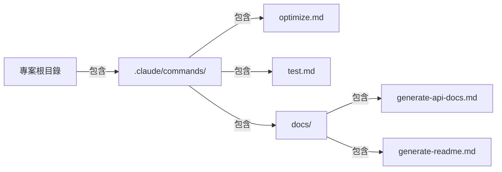

### 指令組織方式

| 位置 | 範圍 | 可用對象 | 使用情境 | Git 追蹤 |
|----------|-------|--------------|----------|-------------|
| `.claude/commands/` | 專案專屬 | 團隊成員 | 團隊工作流程、共用標準 | ✅ 是 |
| `~/.claude/commands/` | 個人 | 單一使用者 | 跨專案的個人捷徑 | ❌ 否 |
| 子目錄 | 具命名空間 | 依父目錄而定 | 依類別組織 | ✅ 是 |

### 功能與能力

| 功能 | 範例 | 支援 |
|---------|---------|-----------|
| 執行 Shell 腳本 | `bash scripts/deploy.sh` | ✅ 是 |
| 檔案引用 | `@path/to/file.js` | ✅ 是 |
| Bash 整合 | `$(git log --oneline)` | ✅ 是 |
| 引數 | `/pr --verbose` | ✅ 是 |
| MCP 指令 | `/mcp__github__list_prs` | ✅ 是 |

### 實際範例

**[01-slash-commands/](01-slash-commands/)** 收錄了八個可直接複製貼上的指令範本——`/optimize`、`/pr`、`/commit`、`/push-all`、`/generate-api-docs`、`/doc-refactor`、`/setup-ci-cd`、`/unit-test-expand`。

**[01-slash-commands/README.md](01-slash-commands/README.md)** 也收錄了完整的內建指令參考（60 多個指令）以及 frontmatter 欄位表。

### 指令生命週期圖

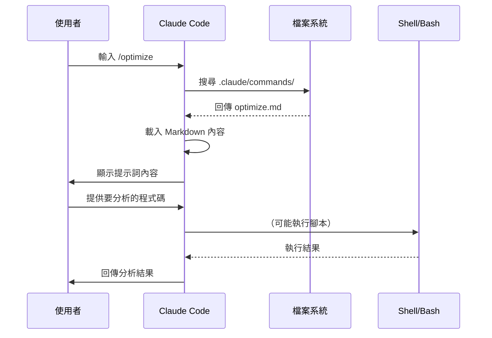

### 最佳實踐

| ✅ 建議做法 | ❌ 避免做法 |
|------|---------|
| 使用清楚、以動作為導向的名稱 | 為一次性任務建立指令 |
| 在 description 中說明觸發字詞 | 在指令中建立複雜邏輯 |
| 讓每個指令只專注於單一任務 | 建立重複的指令 |
| 將專案指令納入版本控制 | 寫死機密資訊 |
| 用子目錄組織指令 | 建立過長的指令清單 |
| 使用簡單易讀的提示詞 | 使用縮寫或難懂的字詞 |

---

## 子代理

### 總覽

子代理（Subagents）是具備獨立上下文視窗與自訂系統提示詞的專門 AI 助理。它們能在維持職責清楚分離的同時，把任務委派出去執行。

子代理可以再派生自己的子代理，**預設最多可巢狀到第 3 層（v2.1.219）**——所以階層架構不限於下圖所示的主代理 → 子代理單層關係。可設定 `CLAUDE_CODE_MAX_SUBAGENT_SPAWN_DEPTH` 來調整上限，設為 `1` 則會關閉巢狀功能。（沿革：v2.1.172–v2.1.216 預設巢狀最多 5 層且無法調整；v2.1.217 把巢狀改為選擇性啟用，深度為 1；v2.1.219 把預設值改為 3。）

### 架構圖

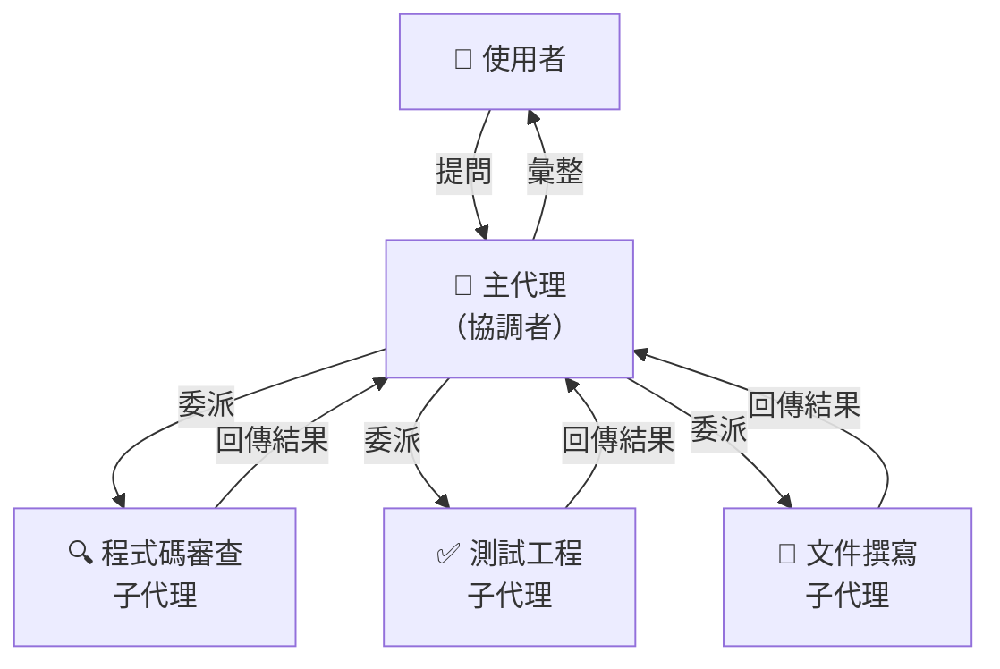

### 子代理生命週期

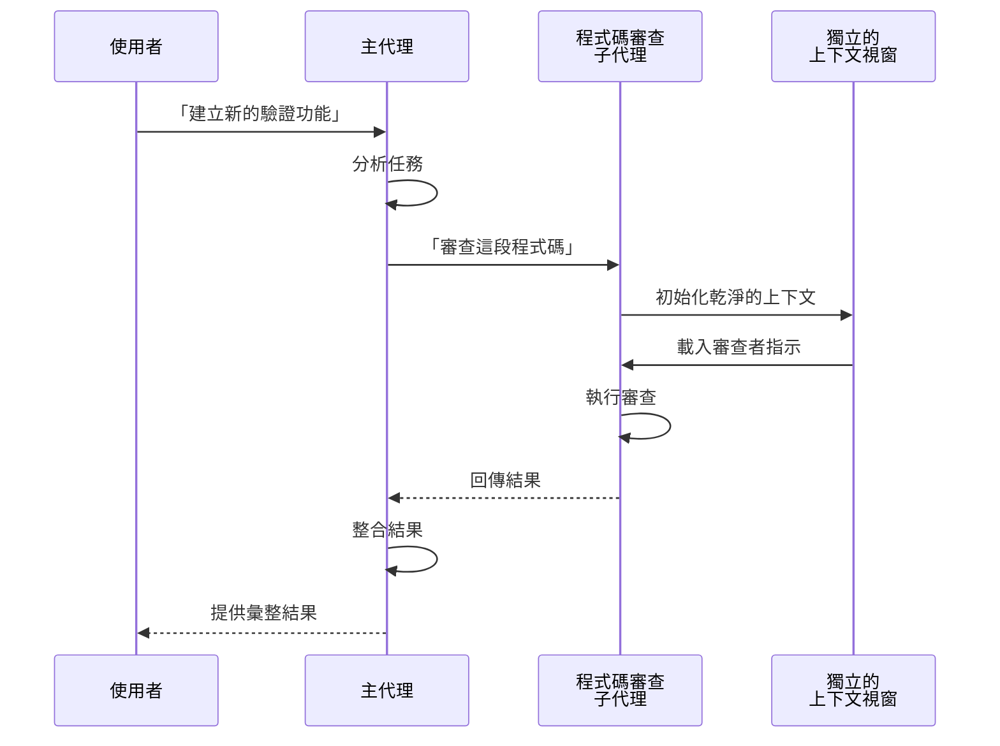

### 子代理設定欄位

| 設定欄位 | 型別 | 用途 | 範例 |
|---------------|------|---------|---------|
| `name` | 字串 | 代理識別碼 | `code-reviewer` |
| `description` | 字串 | 用途與觸發字詞 | `Comprehensive code quality analysis` |
| `tools` | 清單／字串 | 允許使用的能力 | `read, grep, diff, lint_runner` |
| `system_prompt` | Markdown | 行為指示 | 自訂準則 |

### 工具存取階層

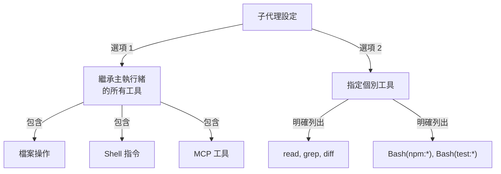

### 實際範例

**[04-subagents/](04-subagents/)** 收錄了九個現成可用的子代理定義——`code-reviewer`、`clean-code-reviewer`、`secure-reviewer`、`test-engineer`、`documentation-writer`、`implementation-agent`、`performance-optimizer`、`debugger`、`data-scientist`。

**[04-subagents/README.md](04-subagents/README.md)** 記載了完整的 frontmatter 參考、工具存取規則、巢狀層數上限，以及代理團隊（Agent Teams）。

### 子代理上下文管理

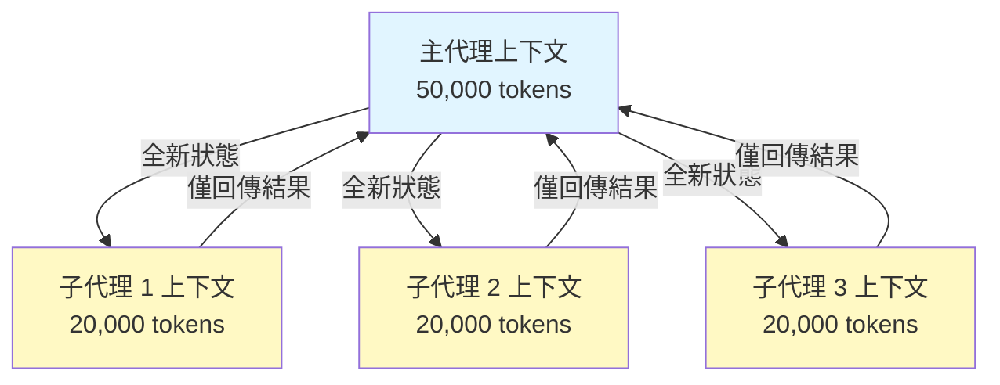

### 何時該用子代理

| 情境 | 使用子代理 | 原因 |
|----------|--------------|-----|
| 步驟繁多的複雜功能 | ✅ 是 | 分離職責，避免污染上下文 |
| 快速程式碼審查 | ❌ 否 | 沒必要增加額外開銷 |
| 平行執行任務 | ✅ 是 | 每個子代理擁有各自的上下文 |
| 需要專門知識 | ✅ 是 | 可自訂系統提示詞 |
| 長時間執行的分析 | ✅ 是 | 避免耗盡主上下文 |
| 單一任務 | ❌ 否 | 不必要地增加延遲 |

### 代理團隊

代理團隊（Agent Teams）能協調多個代理處理相關任務。與一次只委派給一個子代理不同，代理團隊讓主代理可以協調一整組代理，讓它們協同合作、共享中間結果，並朝同一個目標努力。這對大型任務很有用，例如全端功能開發，能讓前端代理、後端代理與測試代理平行作業。

---

## 記憶

### 總覽

記憶（Memory）讓 Claude 能夠跨工作階段（session）與對話保留上下文。它有兩種形式：claude.ai 中的自動合成，以及 Claude Code 中以檔案系統為基礎的 CLAUDE.md。

### 記憶架構

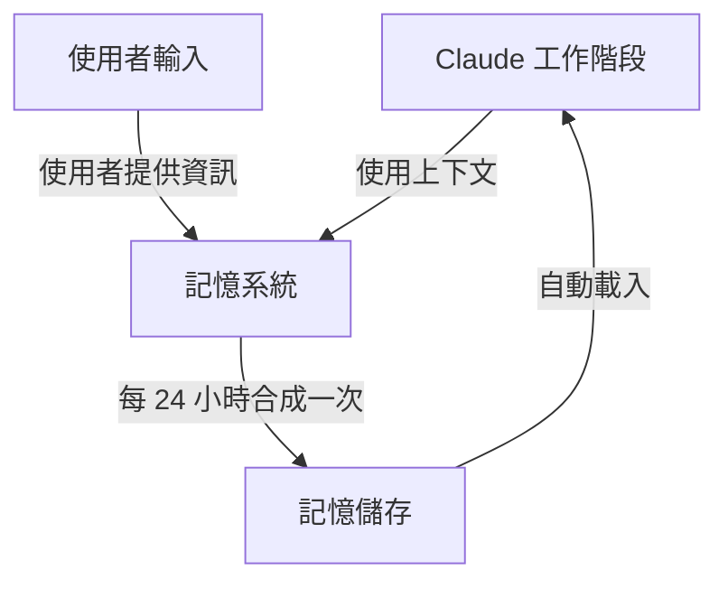

### Claude Code 中的記憶階層（7 層）

Claude Code 會從 7 個層級載入記憶，依優先順序由高到低列出：

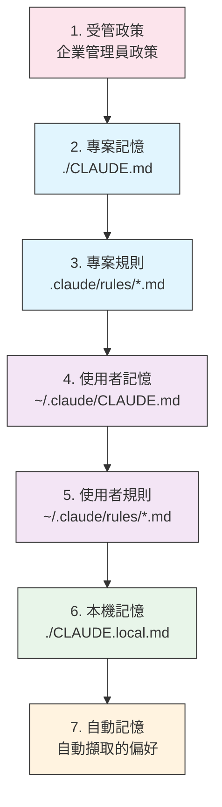

### 記憶位置表

| 層級 | 位置 | 範圍 | 優先順序 | 共用 | 最適合 |
|------|----------|-------|----------|--------|----------|
| 1. 受管政策 | 企業管理員 | 組織 | 最高 | 所有組織使用者 | 合規、安全政策 |
| 2. 專案 | `./CLAUDE.md` | 專案 | 高 | 團隊（Git） | 團隊標準、架構 |
| 3. 專案規則 | `.claude/rules/*.md` | 專案 | 高 | 團隊（Git） | 模組化的專案慣例 |
| 4. 使用者 | `~/.claude/CLAUDE.md` | 個人 | 中 | 個人 | 個人偏好 |
| 5. 使用者規則 | `~/.claude/rules/*.md` | 個人 | 中 | 個人 | 個人規則模組 |
| 6. 本機 | `./CLAUDE.local.md` | 本機 | 低 | 不共用 | 機器專屬設定 |
| 7. 自動記憶 | 自動 | 工作階段 | 最低 | 個人 | 學到的偏好、模式 |

### 自動記憶

自動記憶（Auto Memory）會自動擷取工作階段中觀察到的使用者偏好與模式。Claude 會從你的互動中學習，並記住：

- 程式碼風格偏好
- 你常做的修正
- 框架與工具選擇
- 溝通風格偏好

自動記憶會在背景運作，不需要手動設定。

### 記憶更新生命週期

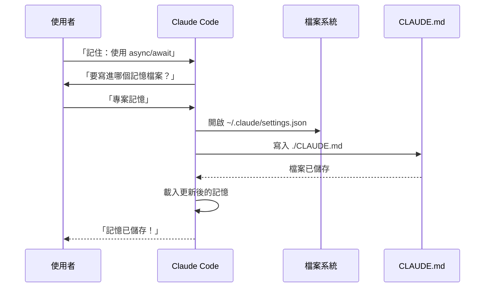

### 實際範例

可直接複製貼上的記憶範本放在 **[02-memory/](02-memory/)**：

- **`project-CLAUDE.md`** — `./CLAUDE.md` 的團隊專案標準
- **`personal-CLAUDE.md`** — `~/.claude/CLAUDE.md` 的個人偏好
- **`directory-api-CLAUDE.md`** — 子樹範圍內的目錄專屬標準

**[02-memory/README.md](02-memory/README.md)** 涵蓋完整的階層架構、匯入語法、`.claude/rules/`、自動記憶，以及如何讓 CLAUDE.md 保持在 200 行以內。

### Claude Web/Desktop 中的記憶

#### 記憶合成時間軸


### 自動記憶內容

自動記憶會把 Claude 跨工作階段學到的關於你的資訊，儲存在 `~/.claude/projects/<project>/memory/` 中，並由 `MEMORY.md` 建立索引。檔案結構、載入上限，以及如何啟用或停用，請參閱 **[02-memory/README.md](02-memory/README.md)**。

### 記憶功能比較

| 功能 | Claude Web/Desktop | Claude Code（CLAUDE.md） |
|---------|-------------------|------------------------|
| 自動合成 | ✅ 每 24 小時 | ❌ 手動 |
| 跨專案 | ✅ 共用 | ❌ 專案專屬 |
| 團隊存取 | ✅ 共用專案 | ✅ Git 追蹤 |
| 可搜尋 | ✅ 內建 | ✅ 透過 `/memory` |
| 可編輯 | ✅ 對話中直接編輯 | ✅ 直接編輯檔案 |
| 匯入／匯出 | ✅ 是 | ✅ 複製／貼上 |
| 持久性 | ✅ 24 小時以上 | ✅ 無限期 |

---

## MCP 協定

### 總覽

MCP（Model Context Protocol，模型上下文協定）是一套標準化的方式，讓 Claude 能存取外部工具、API 與即時資料來源。與記憶不同，MCP 提供的是對持續變動資料的即時存取。

### MCP 架構

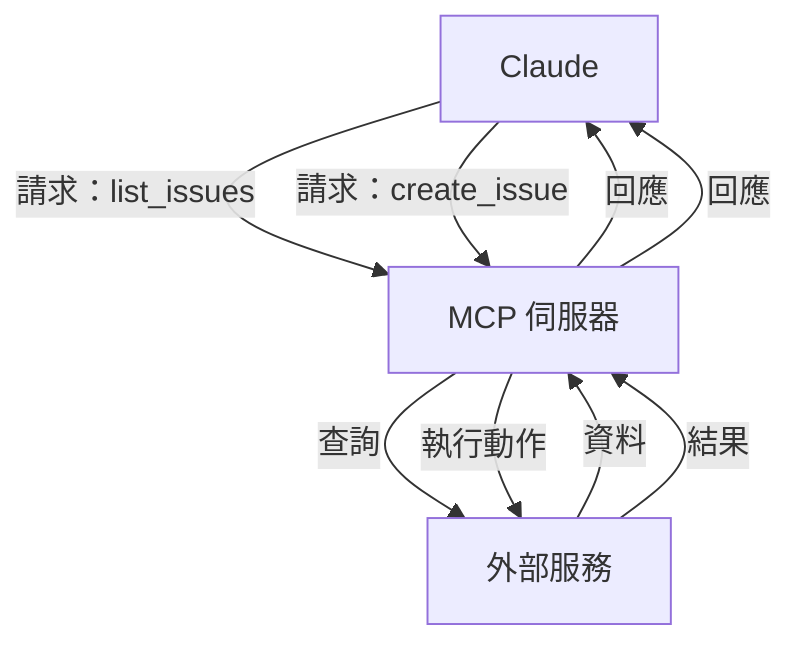

### MCP 生態系

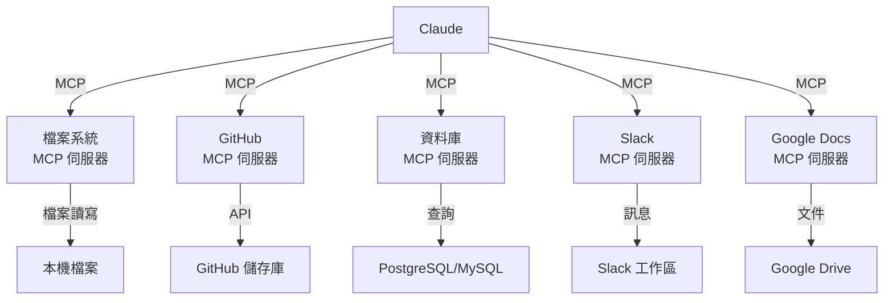

### MCP 設定流程

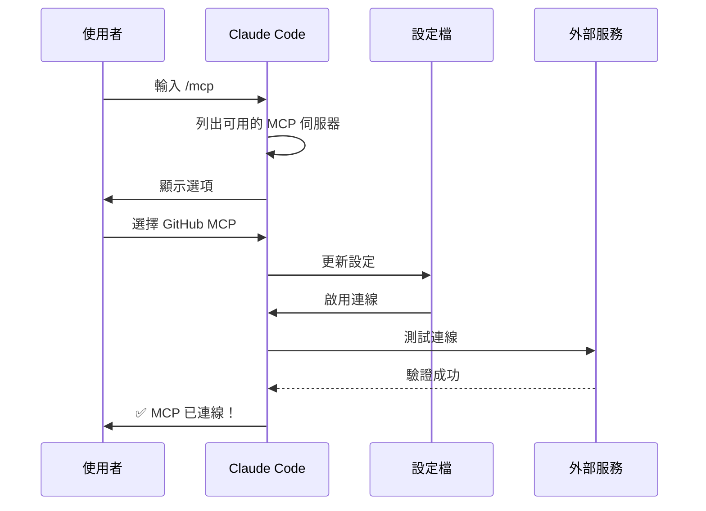

### 可用 MCP 伺服器表

| MCP 伺服器 | 用途 | 常用工具 | 驗證方式 | 即時 |
|------------|---------|--------------|------|-----------|
| **Filesystem** | 檔案操作 | read, write, delete | 作業系統權限 | ✅ 是 |
| **GitHub** | 儲存庫管理 | list_prs, create_issue, push | OAuth | ✅ 是 |
| **Slack** | 團隊溝通 | send_message, list_channels | Token | ✅ 是 |
| **Database** | SQL 查詢 | query, insert, update | 憑證 | ✅ 是 |
| **Google Docs** | 文件存取 | read, write, share | OAuth | ✅ 是 |
| **Asana** | 專案管理 | create_task, update_status | API 金鑰 | ✅ 是 |
| **Stripe** | 付款資料 | list_charges, create_invoice | API 金鑰 | ✅ 是 |
| **Memory** | 持久記憶 | store, retrieve, delete | 本機 | ❌ 否 |

### 實際範例

現成可用的 MCP 伺服器設定放在 **[05-mcp/](05-mcp/)**：`github-mcp.json`、`database-mcp.json`、`filesystem-mcp.json`，以及 `multi-mcp.json`（單一檔案內含四個伺服器）。

**[05-mcp/README.md](05-mcp/README.md)** 涵蓋完整的 `claude mcp add` 語法、傳輸方式、範圍、OAuth，以及企業允許清單。

### MCP 與記憶：決策矩陣

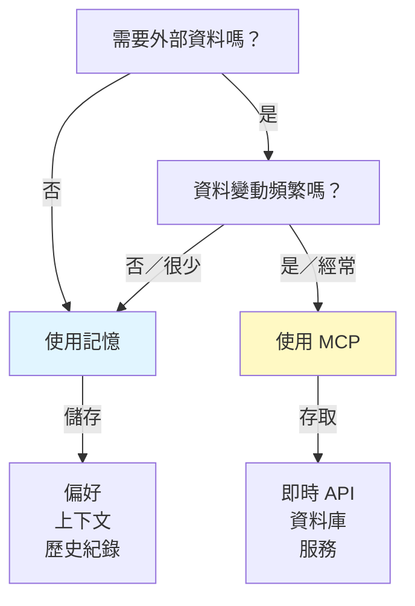

### 請求／回應模式

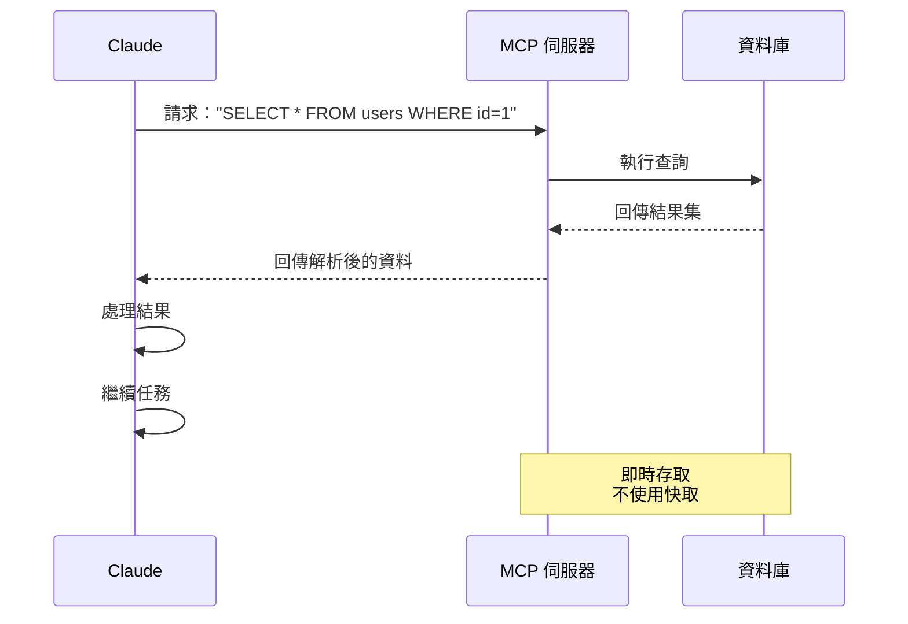

---

## 代理技能

### 總覽

代理技能（Agent Skills）是可重複使用、由模型自動觸發的能力，封裝成包含指示、腳本與資源的資料夾。Claude 會自動偵測並使用相關的技能。

### 技能架構

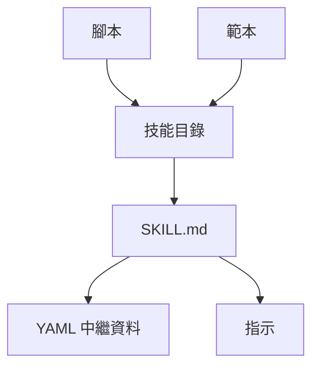

### 技能載入流程

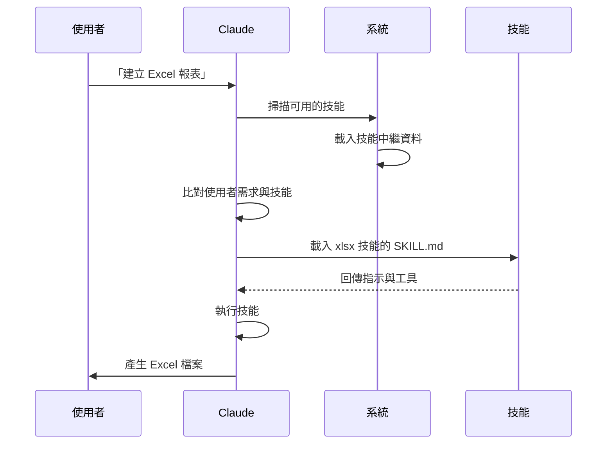

### 技能類型與位置表

| 類型 | 位置 | 範圍 | 共用 | 同步 | 最適合 |
|------|----------|-------|--------|------|----------|
| 預先建置 | 內建 | 全域 | 所有使用者 | 自動 | 建立文件 |
| 個人 | `~/.claude/skills/` | 個人 | 否 | 手動 | 個人自動化 |
| 專案 | `.claude/skills/` | 團隊 | 是 | Git | 團隊標準 |
| 外掛 | 透過安裝外掛 | 依情況而定 | 視情況 | 自動 | 整合功能 |

### 預先建置的技能

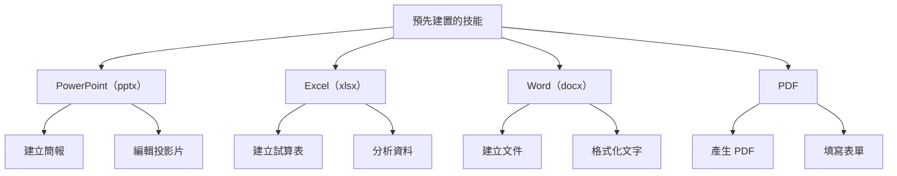

### 內建套裝技能

Claude Code 現在內建 10 個開箱即用的套裝技能：

| 技能 | 指令 | 用途 |
|-------|---------|---------|
| **Batch** | `/batch` | 對多個檔案或項目批次執行操作 |
| **Claude API** | `/claude-api` | 直接與 Anthropic API 互動 |
| **Code Review** | `/code-review` | 以選定的推理強度審查目前的 diff，找出正確性方面的錯誤。與 `/simplify`（品質／重用相關的清理）是不同的技能，兩者在 v2.1.154 重新拆分。自 v2.1.215 起僅能明確呼叫 |
| **Simplify** | `/simplify` | 品質、重用與清理面向的審查——自 v2.1.154 起再度與 `/code-review` 區分開來 |
| **Debug** | `/debug` | 以根因分析進行系統化除錯 |
| **Fewer Permission Prompts** | `/fewer-permission-prompts` | 掃描逐字稿，為常見的唯讀工具提出依優先順序排列的允許清單 |
| **Loop** | `/loop` | 以計時器排程重複執行的任務 |
| **Run** | `/run` | 啟動並操作專案的應用程式，以驗證變更（v2.1.145+） |
| **Run Skill Generator** | `/run-skill-generator` | 依描述生成新技能的骨架（v2.1.145+） |
| **Verify** | `/verify` | 驗證變更是否確實有效（v2.1.145+）。自 v2.1.215 起僅能明確呼叫 |

這些內建套裝技能一律可用，不需要額外安裝或設定。

### 實際範例

**[03-skills/](03-skills/)** 收錄了六個完整的技能——含腳本、範本與參考檔案：

- **`code-review-specialist/`** — 審查檢查清單、發現事項範本，以及兩個 Python 指標腳本
- **`refactor/`** — 程式碼異味目錄、重構目錄、計畫範本，以及兩個分析腳本
- **`doc-generator/`** — 從原始碼產生 API 文件
- **`blog-draft/`** — 大綱與草稿範本，並附版本化輸出慣例
- **`brand-voice/`** — 語氣規則與訊息範本（示範 `user-invocable: false`）
- **`claude-md/`** — 建立、更新與稽核 CLAUDE.md 檔案

完整的 frontmatter 參考與漸進式揭露模型，請參閱 **[03-skills/README.md](03-skills/README.md)**。

### 技能探索與呼叫

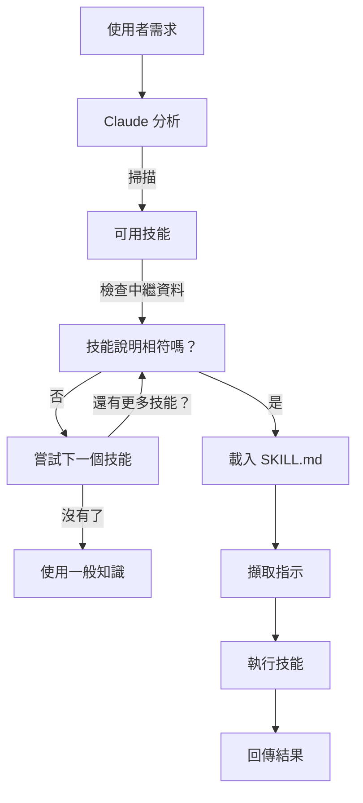

### 技能與其他功能的比較

```mermaid
graph TB
    A["擴充 Claude 的方式"]
    B["斜線指令"]
    C["子代理"]
    D["記憶"]
    E["MCP"]
    F["技能"]

    A --> B
    A --> C
    A --> D
    A --> E
    A --> F

    B -->|使用者觸發| G["快速捷徑"]
    C -->|自動委派| H["獨立的上下文"]
    D -->|持久保存| I["跨工作階段的上下文"]
    E -->|即時| J["存取外部資料"]
    F -->|自動觸發| K["自主執行"]
```

---

## Claude Code 外掛

### 總覽

Claude Code 外掛（Plugins）是把自訂內容（斜線指令、子代理、MCP 伺服器與 Hooks）打包起來、一個指令就能安裝的集合。它們是最高層級的擴充機制——把多項功能整合成一個完整、可分享的套件。

### 架構

```mermaid
graph TB
    A["外掛"]
    B["斜線指令"]
    C["子代理"]
    D["MCP 伺服器"]
    E["Hooks"]
    F["設定"]

    A -->|打包| B
    A -->|打包| C
    A -->|打包| D
    A -->|打包| E
    A -->|打包| F
```

### 外掛載入流程

```mermaid
sequenceDiagram
    participant User as 使用者
    participant Claude as Claude Code
    participant Plugin as 外掛市集
    participant Install as 安裝程序
    participant SlashCmds as 斜線指令
    participant Subagents as 子代理
    participant MCPServers as MCP 伺服器
    participant Hooks
    participant Tools as 已設定的工具

    User->>Claude: /plugin install pr-review
    Claude->>Plugin: 下載外掛清單
    Plugin-->>Claude: 回傳外掛定義
    Claude->>Install: 取出元件
    Install->>SlashCmds: 進行設定
    Install->>Subagents: 進行設定
    Install->>MCPServers: 進行設定
    Install->>Hooks: 進行設定
    SlashCmds-->>Tools: 準備就緒
    Subagents-->>Tools: 準備就緒
    MCPServers-->>Tools: 準備就緒
    Hooks-->>Tools: 準備就緒
    Tools-->>Claude: 外掛安裝完成 ✅
```

### 外掛類型與發佈方式

| 類型 | 範圍 | 共用 | 權責單位 | 範例 |
|------|-------|--------|-----------|----------|
| 官方 | 全域 | 所有使用者 | Anthropic | PR Review、Security Guidance |
| 社群 | 公開 | 所有使用者 | 社群 | DevOps、Data Science |
| 組織 | 內部 | 團隊成員 | 公司 | 內部標準、工具 |
| 個人 | 個人 | 單一使用者 | 開發者 | 自訂工作流程 |

### 外掛定義結構

```yaml
---
name: plugin-name
version: "1.0.0"
description: "這個外掛的功能說明"
author: "你的名字"
license: MIT

# 外掛中繼資料
tags:
  - category
  - use-case

# 需求
requires:
  - claude-code: ">=2.1.0"

# 打包的元件
components:
  - type: commands
    path: commands/
  - type: agents
    path: agents/
  - type: mcp
    path: mcp/
  - type: hooks
    path: hooks/

# 設定
config:
  auto_load: true
  enabled_by_default: true
---
```

### 外掛結構

```
my-plugin/
├── .claude-plugin/
│   └── plugin.json
├── commands/
│   ├── task-1.md
│   ├── task-2.md
│   └── workflows/
├── agents/
│   ├── specialist-1.md
│   ├── specialist-2.md
│   └── configs/
├── skills/
│   ├── skill-1.md
│   └── skill-2.md
├── hooks/
│   └── hooks.json
├── .mcp.json
├── .lsp.json
├── settings.json
├── templates/
│   └── issue-template.md
├── scripts/
│   ├── helper-1.sh
│   └── helper-2.py
├── docs/
│   ├── README.md
│   └── USAGE.md
└── tests/
    └── plugin.test.js
```

### 實際範例

**[07-plugins/](07-plugins/)** 收錄了三個完整、可直接安裝的外掛：

- **`pr-review/`** — 審查指令、三個專門代理、GitHub MCP，以及審查前 Hook
- **`documentation/`** — 文件產生指令、三個代理，以及可重複使用的範本
- **`devops-automation/`** — 部署／回滾／狀態／事件（incident）處理指令、三個代理、Kubernetes MCP，以及 shell 腳本

每個外掛都包含各自的 `.claude-plugin/plugin.json` 清單檔與目錄結構。

### 外掛市集

```mermaid
graph TB
    A["外掛市集"]
    B["官方<br/>Anthropic"]
    C["社群<br/>市集"]
    D["企業<br/>登錄庫"]

    A --> B
    A --> C
    A --> D

    B -->|分類| B1["開發"]
    B -->|分類| B2["DevOps"]
    B -->|分類| B3["文件"]

    C -->|搜尋| C1["DevOps 自動化"]
    C -->|搜尋| C2["行動開發"]
    C -->|搜尋| C3["資料科學"]

    D -->|內部| D1["公司標準"]
    D -->|內部| D2["舊系統"]
    D -->|內部| D3["合規"]
```

### 外掛安裝與生命週期

```mermaid
graph LR
    A["探索"] -->|瀏覽| B["市集"]
    B -->|選擇| C["外掛頁面"]
    C -->|檢視| D["元件"]
    D -->|安裝| E["/plugin install"]
    E -->|取出| F["設定"]
    F -->|啟用| G["使用"]
    G -->|檢查| H["更新"]
    H -->|有可用更新| G
    G -->|完成| I["停用"]
    I -->|之後| J["啟用"]
    J -->|回到| G
```

### 外掛功能比較

| 功能 | 斜線指令 | 技能 | 子代理 | 外掛 |
|---------|---------------|-------|----------|--------|
| **安裝方式** | 手動複製 | 手動複製 | 手動設定 | 一個指令 |
| **設定時間** | 5 分鐘 | 10 分鐘 | 15 分鐘 | 2 分鐘 |
| **打包方式** | 單一檔案 | 單一檔案 | 單一檔案 | 多個檔案 |
| **版本控制** | 手動 | 手動 | 手動 | 自動 |
| **團隊共用** | 複製檔案 | 複製檔案 | 複製檔案 | 安裝 ID |
| **更新方式** | 手動 | 手動 | 手動 | 自動可用 |
| **相依套件** | 無 | 無 | 無 | 可能包含 |
| **市集** | 否 | 否 | 否 | 是 |
| **發佈方式** | 儲存庫 | 儲存庫 | 儲存庫 | 市集 |

### 外掛使用情境

| 使用情境 | 建議 | 原因 |
|----------|-----------------|-----|
| **團隊導入** | ✅ 使用外掛 | 立即完成設定，所有設定一次到位 |
| **框架設定** | ✅ 使用外掛 | 打包框架專屬指令 |
| **企業標準** | ✅ 使用外掛 | 集中發佈、版本控制 |
| **快速任務自動化** | ❌ 使用斜線指令 | 用外掛太過頭 |
| **單一領域專業知識** | ❌ 使用技能 | 太重了，改用技能即可 |
| **專門分析** | ❌ 使用子代理 | 手動建立或改用技能 |
| **即時資料存取** | ❌ 使用 MCP | 應獨立設定，不要打包 |

### 何時該建立外掛

```mermaid
graph TD
    A["該建立外掛嗎？"]
    A -->|需要多個元件| B{"有多個指令、<br/>子代理<br/>或 MCP 嗎？"}
    B -->|是| C["✅ 建立外掛"]
    B -->|否| D["使用個別功能"]
    A -->|團隊工作流程| E{"要與團隊<br/>共用嗎？"}
    E -->|是| C
    E -->|否| F["維持本機設定"]
    A -->|設定複雜| G{"需要自動<br/>設定嗎？"}
    G -->|是| C
    G -->|否| D
```

### 發佈外掛

**發佈步驟：**

1. 建立包含所有元件的外掛結構
2. 撰寫 `.claude-plugin/plugin.json` 清單檔
3. 建立含說明文件的 `README.md`
4. 用 `/plugin install ./my-plugin` 在本機測試
5. 提交到外掛市集
6. 通過審查與核准
7. 發佈到市集上
8. 使用者可以用一個指令安裝

### 外掛 README 範例

請參閱 **[07-plugins/](07-plugins/)** 中的三個完整外掛——`pr-review/`、`documentation/`、`devops-automation/` 都附有完整的 `README.md`、清單檔、指令、代理與 MCP 設定，可以整份複製使用。

### 外掛與手動設定的比較

**手動設定（2 小時以上）：**
- 一個一個安裝斜線指令
- 逐一建立子代理
- 個別設定 MCP
- 手動設定 Hooks
- 把所有東西寫成文件
- 分享給團隊（祈禱他們能設定正確）

**用外掛（2 分鐘）：**
```bash
/plugin install pr-review
# ✅ 所有東西都已安裝並設定完成
# ✅ 立即可用
# ✅ 團隊可以重現一模一樣的設定
```

---

## 比較與整合

### 功能比較矩陣

| 功能 | 觸發方式 | 持久性 | 範圍 | 使用情境 |
|---------|-----------|------------|-------|----------|
| **斜線指令** | 手動（`/cmd`） | 僅限單一工作階段 | 單一指令 | 快速捷徑 |
| **子代理** | 自動委派 | 獨立上下文 | 專門任務 | 任務分派 |
| **記憶** | 自動載入 | 跨工作階段 | 使用者／團隊上下文 | 長期學習 |
| **MCP 協定** | 自動查詢 | 即時外部資料 | 即時資料存取 | 動態資訊 |
| **技能** | 自動觸發 | 以檔案系統為基礎 | 可重複使用的專業知識 | 自動化工作流程 |

### 互動時間軸

```mermaid
graph LR
    A["工作階段開始"] -->|載入| B["記憶（CLAUDE.md）"]
    B -->|探索| C["可用的技能"]
    C -->|註冊| D["斜線指令"]
    D -->|連線| E["MCP 伺服器"]
    E -->|就緒| F["使用者互動"]

    F -->|輸入 /cmd| G["斜線指令"]
    F -->|請求| H["自動觸發技能"]
    F -->|查詢| I["MCP 資料"]
    F -->|複雜任務| J["委派給子代理"]

    G -->|使用| B
    H -->|使用| B
    I -->|使用| B
    J -->|使用| B
```

### 實際整合範例：客服自動化

#### 架構

```mermaid
graph TB
    User["客戶郵件"] -->|收到| Router["客服路由器"]

    Router -->|分析| Memory["記憶<br/>客戶歷史紀錄"]
    Router -->|查詢| MCP1["MCP：客戶資料庫<br/>過往工單"]
    Router -->|檢查| MCP2["MCP：Slack<br/>團隊狀態"]

    Router -->|路由至複雜案件| Sub1["子代理：技術支援<br/>上下文：技術問題"]
    Router -->|路由至簡單案件| Sub2["子代理：帳務<br/>上下文：付款問題"]
    Router -->|路由至緊急案件| Sub3["子代理：升級處理<br/>上下文：優先處理"]

    Sub1 -->|格式化| Skill1["技能：回覆產生器<br/>維持品牌語氣"]
    Sub2 -->|格式化| Skill2["技能：回覆產生器"]
    Sub3 -->|格式化| Skill3["技能：回覆產生器"]

    Skill1 -->|產生| Output["格式化的回覆"]
    Skill2 -->|產生| Output
    Skill3 -->|產生| Output

    Output -->|發佈| MCP3["MCP：Slack<br/>通知團隊"]
    Output -->|傳送| Reply["客戶回覆"]
```

#### 請求流程

```markdown
## 客服請求流程

### 1. 收到郵件
「我在上傳檔案時遇到 500 錯誤，這卡住了我的工作流程！」

### 2. 查詢記憶
- 載入含有客服標準的 CLAUDE.md
- 查詢客戶歷史紀錄：VIP 客戶，本月第 3 次通報

### 3. MCP 查詢
- GitHub MCP：列出未結案的 Issue（找到相關的錯誤回報）
- Database MCP：檢查系統狀態（沒有服務中斷的回報）
- Slack MCP：確認工程團隊是否已知情

### 4. 技能偵測與載入
- 這個請求符合「技術支援」技能
- 從技能載入客服回覆範本

### 5. 委派子代理
- 路由到技術支援子代理
- 提供上下文：客戶歷史紀錄、錯誤細節、已知問題
- 子代理擁有完整存取權限：read、bash、grep 工具

### 6. 子代理處理
技術支援子代理：
- 在程式碼庫中搜尋檔案上傳的 500 錯誤
- 在 commit 8f4a2c 中找到最近的變更
- 建立替代解法文件

### 7. 技能執行
回覆產生器技能：
- 套用品牌語氣準則
- 以同理心格式化回覆
- 附上替代解法步驟
- 連結到相關文件

### 8. MCP 輸出
- 在 #support Slack 頻道發佈更新
- 標記工程團隊
- 在 Jira MCP 中更新工單

### 9. 回覆
客戶收到：
- 帶有同理心的確認訊息
- 原因說明
- 立即可用的替代解法
- 永久修復的時程
- 相關 Issue 的連結
```

### 完整功能協調流程

```mermaid
sequenceDiagram
    participant User as 使用者
    participant Claude as Claude Code
    participant Memory as 記憶<br/>CLAUDE.md
    participant MCP as MCP 伺服器
    participant Skills as 技能
    participant SubAgent as 子代理

    User->>Claude: 請求：「建立驗證系統」
    Claude->>Memory: 載入專案標準
    Memory-->>Claude: 驗證標準、團隊實務
    Claude->>MCP: 向 GitHub 查詢類似的實作
    MCP-->>Claude: 程式碼範例、最佳實踐
    Claude->>Skills: 偵測相符的技能
    Skills-->>Claude: 安全性審查技能 + 測試技能
    Claude->>SubAgent: 委派實作
    SubAgent->>SubAgent: 建置功能
    Claude->>Skills: 套用安全性審查技能
    Skills-->>Claude: 安全檢查清單結果
    Claude->>SubAgent: 委派測試
    SubAgent-->>Claude: 測試結果
    Claude->>User: 交付完整系統
```

### 各功能的使用時機

```mermaid
graph TD
    A["新任務"] --> B{"任務類型？"}

    B -->|重複性工作流程| C["斜線指令"]
    B -->|需要即時資料| D["MCP 協定"]
    B -->|要記住供下次使用| E["記憶"]
    B -->|專門子任務| F["子代理"]
    B -->|特定領域工作| G["技能"]

    C --> C1["✅ 團隊捷徑"]
    D --> D1["✅ 即時 API 存取"]
    E --> E1["✅ 持久上下文"]
    F --> F1["✅ 平行執行"]
    G --> G1["✅ 自動觸發專業知識"]
```

### 選擇決策樹

```mermaid
graph TD
    Start["需要擴充 Claude 嗎？"]

    Start -->|快速重複性任務| A{"手動還是自動？"}
    A -->|手動| B["斜線指令"]
    A -->|自動| C["技能"]

    Start -->|需要外部資料| D{"即時嗎？"}
    D -->|是| E["MCP 協定"]
    D -->|否／跨工作階段| F["記憶"]

    Start -->|複雜專案| G{"多種角色？"}
    G -->|是| H["子代理"]
    G -->|否| I["技能 + 記憶"]

    Start -->|長期上下文| J["記憶"]
    Start -->|團隊工作流程| K["斜線指令 +<br/>記憶"]
    Start -->|完全自動化| L["技能 +<br/>子代理 +<br/>MCP"]
```

---

## 摘要表

| 面向 | 斜線指令 | 子代理 | 記憶 | MCP | 技能 | 外掛 |
|--------|---|---|---|---|---|---|
| **設定難度** | 容易 | 中等 | 容易 | 中等 | 中等 | 容易 |
| **學習曲線** | 低 | 中等 | 低 | 中等 | 中等 | 低 |
| **對團隊的益處** | 高 | 高 | 中等 | 高 | 高 | 非常高 |
| **自動化程度** | 低 | 高 | 中等 | 高 | 高 | 非常高 |
| **上下文管理** | 單一工作階段 | 獨立 | 持久 | 即時 | 持久 | 涵蓋所有功能 |
| **維護負擔** | 低 | 中等 | 低 | 中等 | 中等 | 低 |
| **可擴展性** | 好 | 優秀 | 好 | 優秀 | 優秀 | 優秀 |
| **可共用性** | 普通 | 普通 | 好 | 好 | 好 | 優秀 |
| **版本控制** | 手動 | 手動 | 手動 | 手動 | 手動 | 自動 |
| **安裝方式** | 手動複製 | 手動設定 | 不適用 | 手動設定 | 手動複製 | 一個指令 |

---

## 快速開始指南

### 第 1 週：從簡單開始
- 為常見任務建立 2-3 個斜線指令
- 在設定中啟用記憶
- 把團隊標準寫進 CLAUDE.md

### 第 2 週：加入即時存取
- 設定 1 個 MCP（GitHub 或資料庫）
- 用 `/mcp` 進行設定
- 在工作流程中查詢即時資料

### 第 3 週：分派工作
- 為特定角色建立第一個子代理
- 使用 `/agents` 指令
- 用簡單任務測試委派

### 第 4 週：全面自動化
- 為重複性自動化建立第一個技能
- 使用技能市集，或自行建立
- 結合所有功能，打造完整工作流程

### 持續進行
- 每月檢視並更新記憶
- 當出現新模式時新增技能
- 最佳化 MCP 查詢
- 調整子代理的提示詞

---

## Hooks

### 總覽

Hooks 是事件驅動的 shell 指令，會在 Claude Code 發生特定事件時自動執行。它們能在不需要人工介入的情況下，實現自動化、驗證與自訂工作流程。

### Hook 事件

Claude Code 支援跨五種 Hook 類型（command、http、mcp_tool、prompt、agent）的 **33 個 Hook 事件**：

| Hook 事件 | 觸發時機 | 使用情境 |
|------------|---------|-----------|
| **SessionStart** | 工作階段開始／繼續／清除／壓縮（compact）時 | 環境設定、初始化 |
| **Setup** | 初次環境設定（每個工作階段執行一次） | 準備工具、安裝相依套件 |
| **InstructionsLoaded** | 載入 CLAUDE.md 或規則檔時 | 驗證、轉換、擴充 |
| **UserPromptSubmit** | 使用者送出提示詞時 | 輸入驗證、提示詞過濾 |
| **UserPromptExpansion** | 使用者提示詞展開時（解析 @ 提及、斜線指令） | 轉換或檢查展開後的提示詞 |
| **PreToolUse** | 任何工具執行之前 | 驗證、核准關卡、記錄 |
| **PermissionRequest** | 顯示權限對話框時 | 自動核准／拒絕流程 |
| **PermissionDenied** | 使用者拒絕權限請求時 | 記錄、分析、政策執行 |
| **PostToolUse** | 工具成功執行之後 | 自動格式化、通知、清理 |
| **PostToolUseFailure** | 工具執行失敗時 | 錯誤處理、記錄 |
| **PostToolBatch** | 一批工具呼叫全部完成之後 | 彙整報告、批次驗證 |
| **Notification** | 傳送通知時 | 警示、外部整合 |
| **MessageDisplay** | 顯示助理訊息文字時 | 轉換或隱藏顯示的訊息文字 |
| **SubagentStart** | 子代理被派生時 | 注入上下文、初始化 |
| **SubagentStop** | 子代理完成時 | 結果驗證、記錄 |
| **Stop** | Claude 完成回應時 | 產生摘要、清理任務 |
| **StopFailure** | API 錯誤導致回合結束時 | 錯誤復原、記錄 |
| **TeammateIdle** | 代理團隊隊友閒置時 | 工作分派、協調 |
| **TaskCompleted** | 任務標記完成時。僅在待辦事項工具啟用時觸發——在 Opus 4.8、Sonnet 5、Fable 5、Mythos 5 及更新的模型中預設為關閉；`CLAUDE_CODE_ENABLE_TODO_TOOLS=1` 可將其重新啟用（v2.1.233） | 任務後處理 |
| **TaskCreated** | 透過 TaskCreate 建立任務時。僅在待辦事項工具啟用時觸發——在 Opus 4.8、Sonnet 5、Fable 5、Mythos 5 及更新的模型中預設為關閉；`CLAUDE_CODE_ENABLE_TODO_TOOLS=1` 可將其重新啟用（v2.1.233） | 任務追蹤、記錄 |
| **ConfigChange** | 設定檔變更時 | 驗證、傳播 |
| **CwdChanged** | 工作目錄變更時 | 目錄專屬設定 |
| **DirectoryAdded** | 透過 `/add-dir` 或 SDK 的 `register_repo_root` 控制請求，於工作階段中途註冊新工作目錄時 | 為新增的目錄設定工具 |
| **FileChanged** | 監看的檔案變更時 | 檔案監控、觸發重建 |
| **PreCompact** | 上下文壓縮之前 | 保存狀態 |
| **PostCompact** | 壓縮完成之後 | 壓縮後的動作 |
| **PreModelSwitch** | 套用請求的模型切換之前 | 攔截或否決模型變更 |
| **PostModelSwitch** | 工作階段的模型變更之後 | 記錄或回應模型變更 |
| **WorktreeCreate** | worktree 建立時 | 環境設定、安裝相依套件 |
| **WorktreeRemove** | worktree 移除時 | 清理、釋放資源 |
| **Elicitation** | MCP 伺服器請求使用者輸入時 | 輸入驗證 |
| **ElicitationResult** | 使用者回應請求輸入時 | 處理回應 |
| **SessionEnd** | 工作階段結束時 | 清理、最終記錄 |

### 常見 Hooks

Hooks 是在 `~/.claude/settings.json`（使用者層級）或 `.claude/settings.json`（專案層級）中設定：

```json
{
  "hooks": {
    "PostToolUse": [
      {
        "matcher": "Write",
        "hooks": [
          {
            "type": "command",
            "command": "prettier --write $CLAUDE_FILE_PATH"
          }
        ]
      }
    ],
    "PreToolUse": [
      {
        "matcher": "Edit",
        "hooks": [
          {
            "type": "command",
            "command": "eslint $CLAUDE_FILE_PATH"
          }
        ]
      }
    ]
  }
}
```

### Hook 環境變數

- `$CLAUDE_FILE_PATH` - 正在編輯／寫入的檔案路徑
- `$CLAUDE_TOOL_NAME` - 正在使用的工具名稱
- `$CLAUDE_SESSION_ID` - 目前工作階段的識別碼
- `$CLAUDE_PROJECT_DIR` - 專案目錄路徑

### 最佳實踐

✅ **建議做法：**
- 讓 Hooks 保持快速執行（< 1 秒）
- 用 Hooks 做驗證與自動化
- 妥善處理錯誤
- 使用絕對路徑

❌ **避免做法：**
- 讓 Hooks 變成互動式
- 用 Hooks 執行長時間的任務
- 寫死憑證資訊

**詳見**：[06-hooks/](06-hooks/) 取得完整範例

---

## 檢查點與回溯

### 總覽

檢查點（Checkpoints）讓你能儲存對話狀態，並回溯（rewind）到先前的時間點，方便安全地實驗與探索多種做法。

### 核心概念

| 概念 | 說明 |
|---------|-------------|
| **檢查點（Checkpoint）** | 對話狀態的快照，包含訊息、檔案與上下文 |
| **回溯（Rewind）** | 回到先前的檢查點，捨棄之後的變更 |
| **分支點（Branch Point）** | 從此檢查點開始探索多種不同做法 |

### 存取檢查點

每次使用者送出提示詞時，都會自動建立檢查點。若要回溯：

```bash
# 按兩下 Esc 開啟檢查點瀏覽器
Esc + Esc

# 或使用 /rewind 指令
/rewind
```

選擇一個檢查點後，可以從五個選項中做選擇：
1. **還原程式碼與對話** -- 兩者都還原到該時間點
2. **還原對話** -- 回溯訊息，保留目前的程式碼
3. **還原程式碼** -- 還原檔案，保留對話
4. **從這裡開始摘要** -- 把對話壓縮成摘要
5. **取消** -- 取消操作

### 使用情境

| 情境 | 工作流程 |
|----------|----------|
| **探索不同做法** | 儲存 → 嘗試 A → 儲存 → 回溯 → 嘗試 B → 比較 |
| **安全重構** | 儲存 → 重構 → 測試 → 若失敗：回溯 |
| **A/B 測試** | 儲存 → 設計 A → 儲存 → 回溯 → 設計 B → 比較 |
| **錯誤復原** | 發現問題 → 回溯到最後一個正常的狀態 |

### 設定

```json
{
  "autoCheckpoint": true
}
```

**詳見**：[08-checkpoints/](08-checkpoints/) 取得完整範例

---

## 進階功能

### 規劃模式

在動手寫程式之前，先建立詳細的實作計畫。

**啟用方式：**
```bash
/plan 實作使用者驗證系統
```

**優點：**
- 清楚的路線圖與時間估算
- 風險評估
- 系統化的任務拆解
- 有機會審查與修改

### 延伸思考

針對複雜問題進行深度推理。

**啟用方式：**
- 在工作階段中按 `Alt+T`（macOS 為 `Option+T`）切換
- 設定 `MAX_THINKING_TOKENS` 環境變數以用程式控制

```bash
# 透過環境變數啟用延伸思考
export MAX_THINKING_TOKENS=50000
claude -p "該用微服務還是單體架構？"
```

**優點：**
- 全面分析各種取捨
- 更好的架構決策
- 考量邊界情況
- 系統化的評估

### 背景任務

在不阻塞對話的情況下執行長時間的操作。

**用法：**
```bash
User: 在背景執行測試

Claude: 已啟動任務 bg-1234

/task list           # 顯示所有任務
/task status bg-1234 # 查看進度
/task show bg-1234   # 檢視輸出
/task cancel bg-1234 # 取消任務
```

### 權限模式

控制 Claude 可以做什麼。

| 模式 | 說明 | 使用情境 |
|------|-------------|----------|
| **manual** | 標準權限，敏感操作會跳出提示（v2.1.200 由 `default` 更名而來；`default` 仍可作為別名使用） | 一般開發 |
| **acceptEdits** | 自動接受檔案編輯，不需確認 | 信任的編輯工作流程 |
| **plan** | 僅進行分析與規劃，不修改檔案 | 程式碼審查、架構規劃 |
| **auto** | 自動核准安全的操作，只在高風險時才詢問 | 兼顧自主性與安全性 |
| **dontAsk** | 執行所有操作，不跳出確認提示 | 有經驗的使用者、自動化 |
| **bypassPermissions** | 完全不受限制的存取，不做任何安全檢查 | CI/CD 管線、可信任的腳本 |

**用法：**
```bash
claude --permission-mode plan          # 唯讀分析
claude --permission-mode acceptEdits   # 自動接受編輯
claude --permission-mode auto          # 自動核准安全的操作
claude --permission-mode dontAsk       # 不跳出確認提示
```

### 無介面模式（headless / Print Mode）

使用 `-p`（print）旗標，在沒有互動輸入的情況下執行 Claude Code，適合自動化與 CI/CD。

**用法：**
```bash
# 執行特定任務
claude -p "執行所有測試"

# 用管線傳入內容進行分析
cat error.log | claude -p "解釋這個錯誤"

# CI/CD 整合（GitHub Actions）
- name: AI 程式碼審查
  run: claude -p "審查 PR 變更並回報問題"

# 用於腳本化的 JSON 輸出
claude -p --output-format json "列出 src/ 中所有的函式"
```

### 排程任務

用 `/loop` 指令依重複排程執行任務。

**用法：**
```bash
/loop every 30m "執行測試並回報失敗項目"
/loop every 2h "檢查相依套件是否有更新"
/loop every 1d "產生每日程式碼變更摘要"
```

排程任務會在背景執行，完成後回報結果。適合用於持續監控、定期檢查與自動化維運工作流程。

### Chrome 整合

Claude Code 可以與 Chrome 瀏覽器整合，執行網頁自動化任務。這讓你能直接在開發工作流程中瀏覽網頁、填寫表單、擷取畫面，以及從網站擷取資料。

### 工作階段管理

管理多個工作階段。

**指令：**
```bash
/resume                # 繼續先前的對話
/rename "Feature"      # 為目前的工作階段命名
/fork                  # 分岔出新的工作階段
claude -c              # 繼續最近一次的對話
claude -r "Feature"    # 依名稱／ID 繼續工作階段
```

### 互動功能

**鍵盤快捷鍵：**
- `Ctrl + R` - 搜尋指令歷史紀錄
- `Tab` - 自動完成
- `↑ / ↓` - 指令歷史紀錄
- `Ctrl + L` - 清除畫面

**多行輸入：**
```bash
User: \
> 又長又複雜的提示詞
> 橫跨多行
> \end
```

### 設定

完整設定範例：

```json
{
  "planning": {
    "autoEnter": true,
    "requireApproval": true
  },
  "extendedThinking": {
    "enabled": true,
    "showThinkingProcess": true
  },
  "permissions": {
    "defaultMode": "manual"
  }
}
```

背景任務沒有對應的 `settings.json` 設定區塊——這項功能是由 `CLAUDE_CODE_DISABLE_BACKGROUND_TASKS` 環境變數控制，並行數量則由 `CLAUDE_CODE_MAX_CONCURRENT_SUBAGENTS`（預設為 `20`）控制。

**詳見**：[09-advanced-features/](09-advanced-features/) 取得完整指南

---

## 模型與推理強度

Claude Code 支援下列具備自適應推理強度的模型：

| 模型 | 上下文視窗 | 強度等級 | 預設強度（Claude Code） |
|-------|----------------|---------------|------------------------------|
| Claude Opus 5 | 1M tokens（原生） | `low`、`medium`、`high`、`xhigh`、`max` | `high`——自 v2.1.219 起成為預設 Opus 模型（需要 Claude Code v2.1.219 以上版本） |
| Claude Sonnet 5 | 1M tokens（原生） | `low`、`medium`、`high`、`xhigh`、`max` | `high`——自 v2.1.197 起為 Pro／Team Standard／Enterprise 的預設模型 |
| Claude Opus 4.8 | 1M tokens（原生） | `low`、`medium`、`high`、`xhigh`、`max` | `high`（自 v2.1.154 起） |
| Claude Opus 4.7（舊版） | 1M tokens（原生） | `low`、`medium`、`high`、`xhigh`、`max` | `xhigh`（自 Opus 4.7 於 2026-04-16 發表起） |
| Claude Sonnet 4.6 | 1M tokens | `low`、`medium`、`high`、`max` | Pro／Max 訂閱者為 `high`（v2.1.117 由 `medium` 提高） |
| Claude Haiku 4.5 | 200K tokens | —（不支援強度設定） | — |

> **備註**：`xhigh` 可用於 Opus 5、Sonnet 5、Opus 4.8 與 Opus 4.7；`max` 可用於 Opus 5、Sonnet 5、Opus 4.8/4.7/4.6 與 Sonnet 4.6（僅限單一工作階段）。Haiku 4.5 不支援強度設定。

> **備註**：v2.1.117 修正了一個錯誤——先前 Opus 4.7 的工作階段在計算 `/context` 時是以 200K 而非原生的 1M 視窗為基準；升級到 v2.1.117 以上版本，Opus 4.7 才會真正取得 1M 的上下文視窗。Opus 5 與 Opus 4.8 同樣具備原生 1M token 的視窗。

> **備註**：`/cost` 與 `/stats` 已在 v2.1.118 合併進 `/usage`。`/usage` 現在是正式指令，內含成本／統計等分頁；`/cost` 與 `/stats` 仍保留為捷徑別名，會直接開啟對應的分頁。從 v2.1.149 起，成本檢視畫面也會依類別（技能、子代理、外掛，以及各個 MCP 伺服器）拆解支出。

## 資源

- [Claude Code 官方文件](https://code.claude.com/docs/en/overview)
- [Claude Code 更新日誌](https://code.claude.com/docs/en/changelog)
- [MCP GitHub 伺服器](https://github.com/modelcontextprotocol/servers)
- [Anthropic Cookbook](https://github.com/anthropics/anthropic-cookbook)

---
**最後更新**：2026 年 9 月 2 日
**Claude Code 版本**：2.1.257
**資料來源**：
- https://www.anthropic.com/news/claude-sonnet-5
- https://code.claude.com/docs/en/cli-reference
- https://code.claude.com/docs/en/model-config
- https://github.com/anthropics/claude-code/blob/main/CHANGELOG.md
- https://code.claude.com/docs/en/hooks
**相容模型**：Claude Fable 5.1、Claude Fable 5、Claude Opus 5、Claude Sonnet 5、Claude Sonnet 4.6、Claude Opus 4.8、Claude Haiku 4.5
