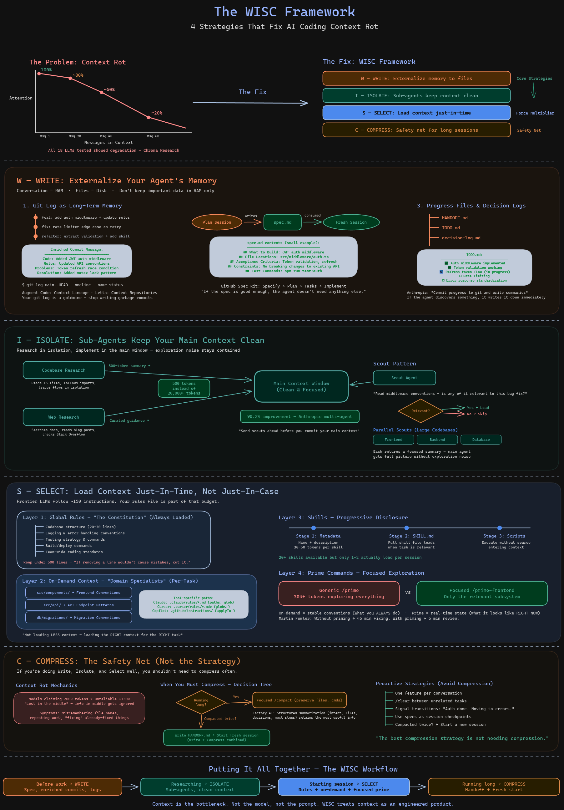

# WISC 框架：AI 編碼的上下文工程 (Context Engineering for AI Coding)



## 什麼是 WISC？

WISC 是一個在編碼對話中管理 AI 上下文的實用框架，基於 [Anthropic 的四種上下文工程策略](https://www.anthropic.com/engineering/effective-context-engineering-for-ai-agents)。該縮寫代表：

- **W - Write (寫入)**：將代理人的記憶外部化到檔案中，以便在上下文重置後依然存在。
- **I - Isolate (隔離)**：使用子代理人將研究產生的噪音排除在主對話之外。
- **S - Select (選擇)**：僅加載當前任務所需的上下文，而非全部加載。
- **C - Compress (壓縮)**：當對話過長時，透過聚焦進行壓縮或移交給新的對話。

順序是有意安排的 —— **Write** 和 **Isolate** 的影響最大，**Select** 是力量倍增器，而 **Compress** 是安全網。

## 三層上下文系統

此用例展示了一種 AI 上下文的漸進式披露方法，專為 Claude Code 構建，但也適用於任何 AI 編碼工具：

### 第一層：全局規則 (`CLAUDE.md`)

始終加載。涵蓋專案結構、基本命令、架構概述和通用慣例。保持精簡 —— 建議在 500 行以內。如果刪除某一行不會導致 AI 犯錯，那就刪掉它。

### 第二層：按需規則 (`.claude/rules/`)

根據代理人正在處理的檔案自動加載。每個規則檔案都有一個 `paths:` 前言 (frontmatter) 來觸發自動加載 —— 例如，當代理人觸碰 `**/*.test.ts` 時會加載 `testing.md`，而在 `packages/web/**/*.tsx` 中工作時則加載 `web-frontend.md`。

**`.claude/rules-example/` 中的範例：**

| 檔案 | 觸碰什麼時自動加載 | 涵蓋內容 |
|------|--------------------------|----------------|
| `testing.md` | `**/*.test.ts` | 模擬 (Mock) 隔離規則、測試批次處理、延遲記錄器 (Lazy logger) 模式 |
| `web-frontend.md` | `packages/web/**/*.tsx` | Tailwind v4, SSE 事件類型, React Router v7 |
| `database.md` | `**/db/**` | 查詢模式、遷移慣例、雙資料庫支援 |
| `orchestrator.md` | `**/orchestrator/**` | 對話生命週期、路由代理人、串流 (Streaming) |
| `workflows.md` | `**/workflows/**` | YAML 解析、執行模式、變數替換 |
| `adapters.md` | `**/adapters/**` | 平台適配器 (Adapter) 模式、身分驗證、訊息格式化 |
| `isolation.md` | `**/isolation/**` | 工作樹 (Worktree) 提供者、錯誤分類、環境生命週期 |
| `server-api.md` | `**/server/**`, `**/routes/**` | API 路由、SSE 串流、Webhook 驗證 |
| `cli.md` | `**/cli/**` | CLI 適配器、命令註冊、輸出格式化 |

### 第三層：參考文件 (`.claude/docs/`)

專為子代理人偵察設計的大型參考指南。這些**不會**自動加載。相反，子代理人會讀取標題以判斷相關性，然後僅在需要時加載完整文件。這可以將數千行的深度參考資料排除在您的主上下文之外。

**`.claude/docs-example/` 中的範例：**

| 檔案 | 行數 | 涵蓋內容 |
|------|-------|----------------|
| `architecture-deep-dive.md` | 324 | 完整的系統架構、資料流、套件依賴關係 |
| `workflow-yaml-reference.md` | 309 | 步驟、迴圈、DAG、變數的完整 YAML 語法 |
| `adapter-implementation-guide.md` | 248 | 如何端到端構建新的平台適配器 |
| `isolation-and-worktree-guide.md` | 231 | Git 工作樹機制、環境生命週期、錯誤處理 |

## 斜線命令 (Slash Commands)

這些在 Claude Code (`.claude/commands/`) 中將 WISC 策略實作為可重用的斜線命令：

### 引導命令 (Prime Commands) - **Select**

在對話開始時加載集中的程式碼庫上下文。與其探索整個程式碼庫 (~3 萬個以上 Token)，每個引導變體僅探索相關的子系統。

| 命令 | 引導內容 |
|---------|----------------|
| `/prime` | 完整程式碼庫概覽 (所有套件) |
| `/prime-backend` | 核心商業邏輯 + HTTP 伺服器 |
| `/prime-frontend` | React UI, SSE hooks, 組件 |
| `/prime-workflows` | 工作流引擎 (載入器, 路由, 執行器, DAG) |
| `/prime-isolation` | Git 工作樹隔離系統 |

### 計畫與執行 (Planning & Execution) - **Write**

| 命令 | 用途 |
|---------|-------------|
| `/plan-feature` | 啟動子代理人研究程式碼庫，然後將詳細的實作計畫寫入檔案。該計畫成為新實作對話的規格說明。 |
| `/execute` | 讀取計畫檔案並逐步實作。在僅以計畫作為上下文的新對話中運行 —— 沒有計畫對話產生的累贅。 |

### 對話管理 (Session Management) - **Write + Compress**

| 命令 | 用途 |
|---------|-------------|
| `/handoff` | 收集 Git 狀態，編寫 `HANDOFF.md`，包含已完成的工作、關鍵決定、死路和建議的後續行動。下一個對話讀取此檔案並立即接手。 |
| `/commit` | 建立包含慣例標籤 (Conventional tags)、以「為什麼 (WHY)」為中心的內容，以及一個 `Context:` 章節，記錄規則、命令或文件更改與程式碼更改的豐富提交 (Commit)。 |

## 策略與命令的對應關係

```
WRITE (寫入)     /plan-feature  /execute  /handoff  /commit
                  (規格)        (規格)     (進度)   (Git 記憶)

ISOLATE (隔離)   /plan-feature 啟動研究子代理人
                 /prime-* 命令使用集中的探索
                 偵察模式 (Scout pattern)：子代理人先讀取文件標題

SELECT (選擇)    /prime-*       .claude/rules/*.md    .claude/docs/*.md
                 (集中的)       (自動加載)             (透過偵察按需加載)

COMPRESS (壓縮)  /handoff       /compact (內建)
                 (寫入+壓縮)    (集中的壓縮)
```

## 將此應用於您的專案

1. **從 Write (寫入) 開始** —— 設定豐富的提交訊息和由規格驅動的計畫。光是這一點就能改變您的 AI 編碼工作流。
2. **新增 Select (選擇)** —— 將領域特定的慣例從全局規則移至路徑範圍的規則檔案中。保持您的 `CLAUDE.md` 精簡。
3. **使用 Isolate (隔離)** —— 研究時，啟動子代理人而非在主對話中讀取檔案。探索產生的噪音將被限制。
4. **根據需要 Compress (壓縮)** —— 使用具有明確保留目標的集中 `/compact`，或編寫 `/handoff` 並重新開始。

## 資源

- [Anthropic: AI 代理人的上下文工程](https://www.anthropic.com/engineering/effective-context-engineering-for-ai-agents)
- [Anthropic: 長期運行代理人的有效線束 (Harnesses)](https://www.anthropic.com/engineering/effective-harnesses-for-long-running-agents)
- [Martin Fowler: AI 代理人的知識引導 (Knowledge Priming)](https://martinfowler.com/articles/reduce-friction-ai/knowledge-priming.html)
- [AI 編碼工具的漸進式披露](https://alexop.dev/posts/stop-bloating-your-claude-md-progressive-disclosure-ai-coding-tools/)
- [上下文腐爛研究 (Chroma)](https://research.trychroma.com/context-rot)
- [GitHub Spec Kit](https://github.com/github/spec-kit)
