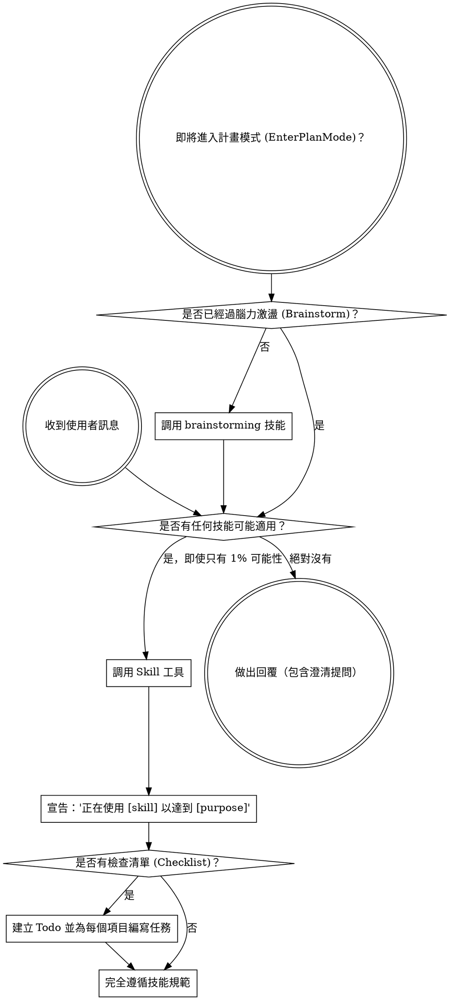

<SUBAGENT-STOP>
如果你是作為 Subagent（子代理）被分派去執行特定任務，請跳過此技能。
</SUBAGENT-STOP>

<EXTREMELY-IMPORTANT>
如果你認為有哪怕 1% 的可能性某個技能適用於你正在做的事情，你「絕對必須」調用該技能。

如果某個技能適用於你的任務，你沒有選擇的餘地。你「必須」使用它。

這沒有商量的空間。這不是可選的。你不能找任何藉口來規避這一點。
</EXTREMELY-IMPORTANT>

## 指令優先順序 (Instruction Priority)

Superpowers 技能會覆蓋預設的系統提示詞行為，但**使用者的明確指令永遠擁有最高優先權**：

1. **使用者的明確指令**（包括 CLAUDE.md、GEMINI.md、AGENTS.md、或直接的請求） —— 最高優先級
2. **Superpowers 技能** —— 在發生衝突時覆蓋預設的系統行為
3. **預設的系統提示詞** —— 最低優先級

如果 CLAUDE.md、GEMINI.md 或 AGENTS.md 明確指出「不要使用 TDD」，而某個技能寫著「必須使用 TDD」，請遵循使用者的指令。使用者擁有絕對的主導權。

## 如何獲取技能 (How to Access Skills)

**在 Claude Code 中：** 使用 `Skill` 工具。當你調用某個技能時，其內容會被載入並呈現給你 —— 請直接遵循它。切勿對技能檔案使用 `Read`（讀取）工具。

**在 Copilot CLI 中：** 使用 `skill` 工具。技能會從已安裝的插件中自動發現。`skill` 工具的運作方式與 Claude Code 的 `Skill` 工具相同。

**在 Gemini CLI 中：** 技能透過 `activate_skill` 工具啟用。Gemini 會在對話啟動時載入技能的 metadata，並在需要時按需啟用完整內容。

**在其他環境中：** 請查閱你的平台文件，以了解技能是如何被載入的。

## 平台適配 (Platform Adaptation)

技能描述中預設使用 Claude Code 的工具名稱。對於非 Claude Code 平台：請參閱 `references/copilot-tools.md`（Copilot CLI）或 `references/codex-tools.md`（Codex）以了解等效的工具。Gemini CLI 的使用者會透過 `GEMINI.md` 自動載入工具對應關係。

# 使用技能 (Using Skills)

## 核心規則

**在做出任何回覆或採取行動之前，先調用相關或被要求的技能。** 即使只有 1% 的機率適用，也意味著你應該調用該技能進行確認。如果調用後發現該技能不適用於當前情況，你可以不用它。

## 紅旗指標（理性的藉口）

如果你腦海中出現了以下想法，請**立即停止** —— 你正在為自己找藉口逃避流程：

| 藉口想法 (Thought) | 真實情況 (Reality) |
|---------|---------|
| 「這只是一個簡單的問題」 | 提問也是任務的一環。請檢查是否有適用的技能。 |
| 「我需要先獲取更多背景資訊」 | 技能檢查必須在提出任何澄清問題**之前**進行。 |
| 「讓我先探索一下程式庫」 | 技能會指導你**如何**探索程式庫。請先檢查技能。 |
| 「我可以快速看一下 Git 或檔案」 | 檔案本身缺乏對話背景。請先檢查技能。 |
| 「讓我先收集一些資訊」 | 技能會告訴你**如何**收集這些資訊。 |
| 「這不需要用到正式的技能」 | 只要有對應的技能存在，就必須使用它。 |
| 「我記得這個技能的內容」 | 技能是不斷演進的。請閱讀當前的最新版本。 |
| 「這不算是真正的任務」 | 任何行動都是任務。請檢查技能。 |
| 「這個技能有點大材小用了」 | 簡單的事情往往會變得很複雜。請使用它。 |
| 「我先做這件小事就好」 | 在動手做任何事情**之前**，先進行技能檢查。 |
| 「這樣做感覺很有生產力」 | 沒有紀律的行動是在浪費時間。技能正是為了防止這種情況。 |
| 「我知道那是什麼意思」 | 知道概念不等於切實執行技能。請務必調用它。 |

## 技能優先級 (Skill Priority)

當有多個技能同時適用時，請遵循以下順序：

1. **優先處理流程技能 (Process Skills)**（如 brainstorming、debugging）—— 這些技能決定了你**如何**著手處理任務。
2. **其次處理實作技能 (Implementation Skills)**（如 frontend-design、mcp-builder）—— 這些技能指導具體的執行。

* 「我們來開發 X」 → 先調用 `brainstorming`，再調用實作技能。
* 「修復這個 Bug」 → 先調用 `debugging`，再調用領域特定的技能。

## 技能類型 (Skill Types)

**嚴格型 (Rigid)**（如 TDD、debugging）：必須完全遵循。不要試圖透過權宜妥協來逃避紀律。

**靈活型 (Flexible)**（如各種 patterns）：根據實際背景靈活應用其核心原則。

技能的內容本身會告訴你它屬於哪一類。

## 使用者指令 (User Instructions)

使用者的指令往往只說明「做什麼（WHAT）」，而非「如何做（HOW）」。「加入功能 X」或「修復問題 Y」並不意味著可以跳過既有的工作流程。
