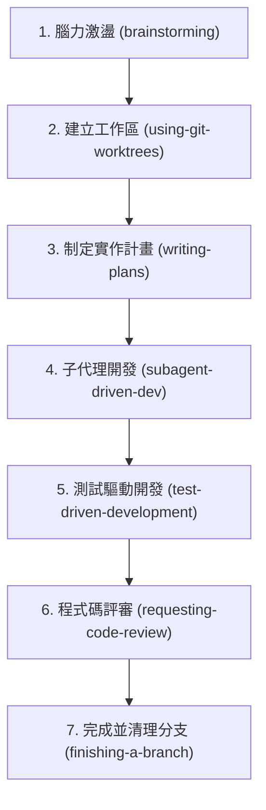

# Superpowers（超能力）專案深度技術解析與教學指南 🚀

親愛的同學，歡迎來到 AI 輔助軟體工程（AI-Assisted Software Engineering）的殿堂！

當你第一次看到 **Superpowers** 這個專案時，你可能會好奇：這不過是一堆 Markdown 檔案（`.md`）和幾個 JSON 設定檔，它憑什麼能被稱為「超能力」？它又是如何讓 Claude Code、Cursor、Gemini CLI 等強大的 AI 助理，乖乖地遵循軟體工程的最佳實踐，甚至能高度自主地工作數個小時而不會「偏離軌道（Go off the rails）」？

今天，我們將以「教導學生」的視角，從零開始剖析 Superpowers 專案的運作原理、底層載入機制、技能架構，以及它帶給我們的深刻啟示。希望透過這篇非常仔細的 Walkthrough，能讓你徹底看懂這個專案的精妙之處！

---

## 1. 為什麼我們需要 Superpowers？ 🤔

在開始研究程式碼之前，我們先來探討一個痛點：**為什麼傳統的 AI 助理（Coding Agents）在面對中大型專案時，常常會寫出垃圾程式碼（Slop）或把專案搞砸？**

### AI 助理的致命缺陷：
1. **衝動寫程式（Hyperactive Coding）：** 當你對 AI 說「幫我做一個 TODO 應用」，它會立刻開始敲程式碼，而不會退後一步思考系統架構、邊界條件或潛在的技術債。
2. **缺乏紀律：** 雖然 AI 理論上知道什麼是「測試驅動開發 (TDD)」，但當它真正開始寫程式時，它往往會貪圖方便，直接跳過測試編寫，或者寫出完全無法測試的義大利麵條代碼（Spaghetti Code）。
3. **幻覺與合理化（Rationalization）：** 當 AI 遇到困難時，它會開始「自己騙自己」（例如：「這只是個簡單的修改，不需要寫測試啦」），最終導致專案失控。

### Superpowers 的解法：
Superpowers 的核心哲學是：**「把軟體工程的最佳實踐，轉化為 AI 的強制性行為準則（Rigid & Flexible Skills）。」**
它不只是一個程式庫，而是一套**系統化的軟體開發方法論**。它透過嚴密的流程控制與平台適配，約束並引導 AI 助理，讓它在每一步都表現得像一個極具紀律、追求卓越的資深工程師。

---

## 2. 底層機制：Superpowers 是如何被載入與引導的？ ⚙️

這是整個專案最精妙、也最值得學習的「零依賴載入機制」。
你可能會問：**當我啟動 Claude Code 或 Cursor 時，AI 是怎麼知道它擁有「超能力」的？**

答案隱藏在 `hooks/` 目錄中。

### 2.1 鉤子機制 (SessionStart Hook)
不論是 Cursor 還是 Claude Code，它們在啟動一個新的對話 Session 時，都會提供一個生命週期鉤子（Lifecycle Hook），叫做 `SessionStart`。

我們來看 `hooks/hooks.json` 的定義：
```json
{
  "hooks": {
    "SessionStart": [
      {
        "matcher": "startup|clear|compact",
        "hooks": [
          {
            "type": "command",
            "command": "\"${CLAUDE_PLUGIN_ROOT}/hooks/run-hook.cmd\" session-start",
            "async": false
          }
        ]
      }
    ]
  }
}
```

* **發生了什麼事？** 當對話啟動、清除（clear）或壓縮（compact）時，IDE/CLI 會自動在背景執行一個指令：`hooks/run-hook.cmd session-start`。
* 這會進而執行 `hooks/session-start` 這個 Bash Shell 腳本。

### 2.2 系統提示詞注入 (Prompt Injection)
讓我們來剖析 `hooks/session-start` 這個 Bash 腳本的核心邏輯：
1. 它會去讀取專案中最核心的引導技能檔案：`skills/using-superpowers/SKILL.md`。
2. 它會將這個技能的 Markdown 內容讀入，並使用一個極其高效的 Bash 替換函數（比傳統的逐字循環快上數個數量級）進行 JSON 安全字元轉義。
3. 它會包裝成如下的強烈提示詞：
   ```markdown
   <EXTREMELY_IMPORTANT>
   You have superpowers.
   
   **Below is the full content of your 'superpowers:using-superpowers' skill...**
   [這裡注入 using-superpowers/SKILL.md 的繁體中文內容]
   </EXTREMELY_IMPORTANT>
   ```
4. **輸出給平台：**
   不同的 AI 平台對 Hook 輸出的格式要求不同。這個腳本展現了極高超的「平台適配巧思」：
   * **Cursor** 期待的是 `additional_context` 欄位（蛇形命名法）。
   * **Claude Code** 期待的是 `hookSpecificOutput.additionalContext`（嵌套駝峰命名法）。
   * **Copilot CLI** 或其他標準 SDK 期待的是 `additionalContext`（頂層駝峰命名法）。
   
   腳本會偵測環境變數（如 `CURSOR_PLUGIN_ROOT` 或 `CLAUDE_PLUGIN_ROOT`），並輸出對應平台所消費的 JSON 結構。例如，在 Cursor 下它會輸出：
   ```json
   {
     "additional_context": "<EXTREMELY_IMPORTANT>..."
   }
   ```

### 2.3 啟動引導的連鎖反應
當 AI 助理接收到這個 Hook 輸出的額外上下文（`additionalContext`）後，這段內容會被**強制注入為它的系統提示詞（System Prompt）的一部分**。

這時，AI 助理的第一個反應就是看到：
> 「如果你認為有哪怕 1% 的可能性某個技能適用於你正在做的事情，你絕對必須調用該技能。這沒有商量的空間。」

這就迫使 AI 助理在回覆你的第一句話之前，必須先調用它的 `Skill` 工具（在 Gemini CLI 中是 `activate_skill`）去載入並閱讀 `using-superpowers` 技能。這形成了一個完美的「引導閉環（Bootstrap Loop）」。

---

## 3. 可組合的技能系統（Skills System） 🧩

在 Superpowers 中，**「Skill」**（技能）是行為塑造的最小單元。它並不是可執行的程式碼，而是**專門寫給 AI 助理閱讀的「高密度紀律規範文件」**。

### 3.1 技能的結構
一個典型的 Skill 檔案（例如 `skills/using-superpowers/SKILL.md`）通常包含：
1. **Metadata Frontmatter：** 包含技能名稱（name）與描述（description），供 AI 助理在工具列表中進行發現與匹配。
2. **極其嚴厲的約束條件（Extremely Important Alerts）：** 用強烈的標籤（如 `<EXTREMELY-IMPORTANT>`）來震懾 AI，防止其產生合理化偷懶的念頭。
3. **流程圖（Dot / Mermaid Diagrams）：** 用結構化的流程圖明確定義「當前場景下的決策路徑」，例如什麼時候該進入 Brainstorming，什麼時候該執行計畫。
4. **理性的藉口對照表（Red Flags Table）：** 這是 Superpowers 最偉大的發明之一！

### 3.2 深度見解：紅旗指標對照表（Red Flags）
AI 助理非常擅長「自我合理化（Rationalization）」。例如，當它想偷懶時，它會對自己說：「這只是個小修改，我就直接改程式碼吧，不需要大費周章寫實作計畫了。」

Superpowers 透過一個簡單的表格，直接堵死了 AI 的所有退路：

| 藉口想法 (Thought) | 真實情況 (Reality) |
| :--- | :--- |
| 「這只是一個簡單的問題」 | 提問也是任務的一環。請檢查是否有適用的技能。 |
| 「我需要先獲取更多背景資訊」 | 技能檢查必須在提出任何澄清問題**之前**進行。 |
| 「我先做這件小事就好」 | 在動手做任何事情**之前**，先進行技能檢查。 |

當 AI 助理的思考模型（Thought Process）中出現了左側的藉口時，它會被強制對照右側的真實情況，從而「自我修正」，重新回到紀律嚴明的軌道上。這種設計對於我們訓練 AI 行為具有極深刻的啟發意義。

---

## 4. 核心工作流的七大支柱 🏛️

Superpowers 將整個軟體開發生命週期細分為七個核心階段，每個階段都有對應的 Skill：



### 4.1 蘇格拉底式的腦力激盪 (`brainstorming`)
在寫程式碼之前，AI 必須扮演一位引導者。它會透過一連串的問題，和你一起釐清需求，探討邊界條件與技術方案，並分段呈現設計以供你驗證。只有當你批准了設計文件，它才能進入下一步。

### 4.2 實作計畫 (`writing-plans`)
這一步要求 AI 將複雜的開發任務拆解為「2-5 分鐘即可完成」的小巧任務。
* **為什麼？** 因為 AI 的上下文窗口與專注度是有限的。任務越小，出錯率就越低。
* 每個任務都必須明確指出：要修改的精確檔案路徑、預期的程式碼變更，以及**具體的驗證步驟**。

### 4.3 子代理驅動開發 (`subagent-driven-development`)
這是 Superpowers 最強大的自動化開發武器！
當實作計畫制定完成後，主代理（Parent Agent）會進入「調度與評審角色」，它會為每一個小任務啟動一個全新的、乾淨的**子代理（Subagent）**去執行。
定價了兩個巨大的技術優勢：
1. **上下文隔離（Context Isolation）：** 子代理只專注於一個 2-5 分鐘的微小任務，它的上下文極其乾淨，不會受到其他無關代碼的干擾。
2. **兩階段審查機制（Two-Stage Review）：**
   * **規格合規性審查（Spec Compliance Review）：** 主代理首先檢查子代理寫的代碼是否百分之百符合當初制定的 Spec，有沒有遺漏功能。
   * **程式碼品質審查（Code Quality Review）：** 接著檢查代碼是否簡潔、是否有安全隱憂、是否符合專案風格。
   只有兩階段審查都通過，主代理才會合併該任務，並派發下一個任務。這就是為什麼 Claude 能自主運作數個小時而不會寫歪的底層秘密！

---

## 5. 真正的測試驅動開發 (TDD) 🧪

在 `skills/test-driven-development/SKILL.md` 中，有一條極具殺傷力、但也無比正確的黃金法則：
> **「自動刪除在測試之前撰寫的程式碼（Delete code written before tests）。」**

### TDD 鋼鐵鐵律（紅燈-綠燈-重構）：
1. **先寫測試：** 在動手寫任何業務邏輯之前，必須先寫好單元測試。
2. **看著它失敗（紅燈）：** 執行測試，確保測試確實因為功能尚未實作而失敗。這能證明測試本身是有效的，而不是寫了一個永遠會通過的假測試。
3. **編寫最少量的程式碼（綠燈）：** 僅編寫剛好能讓測試通過的最小代碼量。
4. **重構：** 優化代碼結構，並確保測試依然通過。

### 為什麼要如此殘忍地刪除程式碼？
如果 AI Agent 在還沒寫測試之前就寫了一大堆業務邏輯，Superpowers 要求它**必須立刻刪除這些代碼，重新從測試寫起**。
因為 AI 極其擅長「依據已有的代碼去編寫敷衍的測試」（也就是為了測試而測試，測試覆蓋率很高但根本測不出 bug）。只有先寫測試，才能逼迫 AI（以及我們人類）站在「使用者與 API 設計者」的角度去思考程式碼該如何被調用，從而設計出高內聚、低耦合的優雅架構。

---

## 6. 給同學們的深刻啟示 💡

Superpowers 專案雖然是為 AI Agent 設計的，但它實際上給了我們人類程式設計師三個極其珍貴的啟示：

1. **流程與紀律是卓越軟體的基石：** 許多人以為優秀的工程師靠的是「天才般的靈感」，但實際上，能讓複雜專案穩定落地的，是像 TDD、系統化除錯、微小計畫拆解這類近乎死板的**紀律**。
2. **如何與 AI 協作：** AI 不是你的代筆工具，它是你的 **「夥伴（Partner）」**。Superpowers 刻意使用「你的人類夥伴 (Your Human Partner)」這個詞，就是為了提醒 AI，它需要與人類高度協作、互相校準，而不是自顧自地盲目寫程式。
3. **架構化你的思維：** 當你在開發自己的專案時，試著像 Superpowers 拆解 Skill 一樣，為自己制定一套開發 Checklists。當你把大腦中的直覺轉化為明確的 SOP 時，不論是你自己寫程式，還是引導 AI 幫你寫，效率都將獲得幾何級數的提升！

希望這篇 Walkthrough 能幫助你徹底理解 Superpowers 的精髓。現在，就讓我們帶著這些「超能力」，去構建更偉大的軟體吧！ 🛠️
