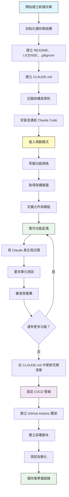
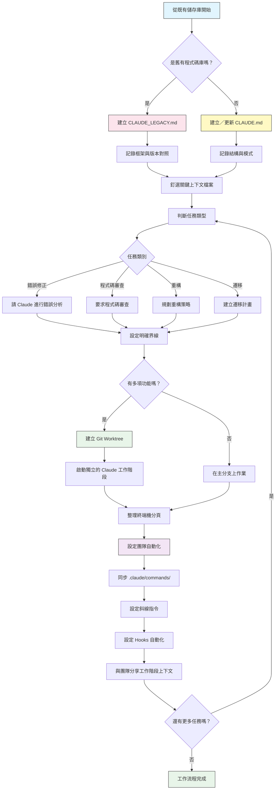

<picture>
  <source media="(prefers-color-scheme: dark)" srcset="resources/logos/claude-howto-logo-dark.svg">
  
</picture>

# 好用資源清單

## 官方文件

| 資源 | 說明 | 連結 |
|----------|-------------|------|
| Claude Code 文件 | Claude Code 官方文件 | [code.claude.com/docs/en/overview](https://code.claude.com/docs/en/overview) |
| Anthropic 文件 | Anthropic 完整文件 | [docs.anthropic.com](https://docs.anthropic.com) |
| MCP 協定 | Model Context Protocol 規範 | [modelcontextprotocol.io](https://modelcontextprotocol.io) |
| MCP 伺服器 | 官方 MCP 伺服器實作 | [github.com/modelcontextprotocol/servers](https://github.com/modelcontextprotocol/servers) |
| Anthropic Cookbook | 程式碼範例與教學 | [github.com/anthropics/anthropic-cookbook](https://github.com/anthropics/anthropic-cookbook) |
| Claude Code Skills | 社群技能（Skills）儲存庫 | [github.com/anthropics/skills](https://github.com/anthropics/skills) |
| 代理團隊（Agent Teams） | 多代理協調與協作 | [code.claude.com/docs/en/agent-teams](https://code.claude.com/docs/en/agent-teams) |
| 排程任務 | 用 /loop 與 cron 執行週期性任務 | [code.claude.com/docs/en/scheduled-tasks](https://code.claude.com/docs/en/scheduled-tasks) |
| Chrome 整合 | 瀏覽器自動化 | [code.claude.com/docs/en/chrome](https://code.claude.com/docs/en/chrome) |
| 按鍵綁定 | 鍵盤快捷鍵自訂 | [code.claude.com/docs/en/keybindings](https://code.claude.com/docs/en/keybindings) |
| 桌面應用程式 | 原生桌面應用程式 | [code.claude.com/docs/en/desktop](https://code.claude.com/docs/en/desktop) |
| 遠端控制 | 遠端工作階段（session）控制 | [code.claude.com/docs/en/remote-control](https://code.claude.com/docs/en/remote-control) |
| 自動模式 | 自動權限管理 | [code.claude.com/docs/en/permissions](https://code.claude.com/docs/en/permissions) |
| 頻道 | 多頻道通訊 | [code.claude.com/docs/en/channels](https://code.claude.com/docs/en/channels) |
| 語音輸入 | Claude Code 的語音輸入 | [code.claude.com/docs/en/voice-dictation](https://code.claude.com/docs/en/voice-dictation) |

## Anthropic 工程部落格

| 文章 | 說明 | 連結 |
|---------|-------------|------|
| 用程式碼執行處理 MCP | 如何用程式碼執行解決 MCP 上下文膨脹問題 — 減少 98.7% 的 token 用量 | [anthropic.com/engineering/code-execution-with-mcp](https://www.anthropic.com/engineering/code-execution-with-mcp) |

---

## 30 分鐘精通 Claude Code

_影片_：https://www.youtube.com/watch?v=6eBSHbLKuN0

_**所有技巧**_
- **探索進階功能與快捷鍵**
  - 定期查看發行說明，了解 Claude 新的程式碼編輯與上下文功能。
  - 學習鍵盤快捷鍵，快速在聊天、檔案與編輯器檢視之間切換。

- **有效率的設定**
  - 建立專案專屬的工作階段，使用清楚的名稱／說明以便日後查找。
  - 釘選最常用的檔案或資料夾，讓 Claude 隨時能存取。
  - 設定 Claude 的整合功能（例如 GitHub、常見 IDE），簡化你的開發流程。

- **有效的程式碼庫問答**
  - 向 Claude 提出關於架構、設計模式與特定模組的詳細問題。
  - 在問題中引用檔案與行號（例如：「`app/models/user.py` 中的邏輯做了什麼？」）。
  - 對於大型程式碼庫，提供摘要或清單，幫助 Claude 聚焦。
  - **範例提示詞**：_「你能說明 src/auth/AuthService.ts:45-120 中實作的驗證流程嗎？它如何與 src/middleware/auth.ts 中的 middleware 整合？」_

- **程式碼編輯與重構**
  - 在程式碼區塊中使用行內註解或請求，取得聚焦的編輯（例如「重構這個函式讓它更清楚」）。
  - 要求提供改前／改後的並排比較。
  - 在大幅修改後，讓 Claude 產生測試或文件以確保品質。
  - **範例提示詞**：_「把 api/users.js 中的 getUserData 函式重構成使用 async/await 而非 Promise。顯示改前／改後的比較，並為重構後的版本產生單元測試。」_

- **上下文管理**
  - 只貼上與目前任務相關的程式碼／上下文。
  - 使用結構化的提示詞（例如「這是檔案 A、這是函式 B、我的問題是 X」）以取得最佳效果。
  - 在提示視窗中移除或收合大型檔案，避免超出上下文限制。
  - **範例提示詞**：_「這是 models/User.js 中的 User model，以及 utils/validation.js 中的 validateUser 函式。我的問題是：我要如何在維持向下相容的情況下加入電子郵件驗證？」_

- **整合團隊工具**
  - 把 Claude 的工作階段連接到團隊的儲存庫與文件。
  - 使用內建範本，或為重複性的工程任務建立自訂範本。
  - 透過與隊友分享工作階段紀錄與提示詞來協作。

- **提升效能**
  - 給 Claude 清楚、目標導向的指示（例如「用五個重點摘要這個類別」）。
  - 從上下文視窗中修剪不必要的註解與樣板程式碼。
  - 如果 Claude 的輸出偏離主題，重設上下文或重新表述問題，以取得更好的對齊。
  - **範例提示詞**：_「用五個重點摘要 src/db/Manager.ts 中的 DatabaseManager 類別，聚焦在它的主要職責與關鍵方法上。」_

- **實際應用範例**
  - 除錯：貼上錯誤與 stack trace，然後詢問可能的原因與修正方式。
  - 產生測試：為複雜邏輯要求 property-based 測試、單元測試或整合測試。
  - 程式碼審查：請 Claude 找出高風險變更、邊界情況或程式碼異味。
  - **範例提示詞**：
    - _「我遇到這個錯誤：『TypeError: Cannot read property 'map' of undefined at line 42 in components/UserList.jsx』。這是 stack trace 與相關程式碼。是什麼原因造成的？我該怎麼修？」_
    - _「為 PaymentProcessor 類別產生完整的單元測試，包含交易失敗、逾時與無效輸入等邊界情況。」_
    - _「審查這個 pull request 的 diff，找出可能的安全性問題、效能瓶頸與程式碼異味。」_

- **工作流程自動化**
  - 用 Claude 提示詞把重複性任務（如格式化、清理、重複性重新命名）寫成腳本。
  - 用 Claude 根據程式碼 diff 草擬 PR 說明、發行說明或文件。
  - **範例提示詞**：_「根據這份 git diff，建立一份詳細的 PR 說明，包含變更摘要、修改檔案清單、測試步驟與潛在影響。同時為 2.3.0 版產生發行說明。」_

**提示**：為了取得最佳效果，建議結合多項作法——先釘選關鍵檔案並摘要你的目標，接著使用聚焦的提示詞與 Claude 的重構工具，逐步改善你的程式碼庫與自動化流程。

**搭配 Claude Code 的建議工作流程**

### 搭配 Claude Code 的建議工作流程

#### 針對新儲存庫

1. **初始化儲存庫與 Claude 整合**
   - 為新儲存庫建立基本結構：README、LICENSE、.gitignore、根目錄設定檔。
   - 建立一份 `CLAUDE.md` 檔案，說明架構、高層目標與程式碼撰寫準則。
   - 安裝 Claude Code 並連結到你的儲存庫，用於程式碼建議、測試鷹架與工作流程自動化。

2. **使用規劃模式（Planning Mode）與規格**
   - 在實作功能前，使用規劃模式（`shift-tab` 或 `/plan`）草擬詳細規格。
   - 請 Claude 提供架構建議與初始專案結構。
   - 保持清楚、目標導向的提示詞順序——要求提供元件大綱、主要模組與職責分工。

3. **迭代開發與審查**
   - 以小區塊實作核心功能，提示 Claude 產生程式碼、重構與撰寫文件。
   - 每完成一小段就要求提供單元測試與範例。
   - 在 CLAUDE.md 中維護一份持續更新的任務清單。

4. **CI/CD 與部署自動化**
   - 用 Claude 建立 GitHub Actions 鷹架、npm/yarn 腳本或部署工作流程。
   - 透過更新 CLAUDE.md 並要求對應的指令／腳本，輕鬆調整管線。

#### 針對既有儲存庫

1. **儲存庫與上下文設定**
   - 新增或更新 `CLAUDE.md`，記錄儲存庫結構、程式碼模式與關鍵檔案。對於舊有的儲存庫，使用 `CLAUDE_LEGACY.md`，涵蓋框架、版本對照、操作說明、已知問題與升級注意事項。
   - 釘選或標示 Claude 應該用來取得上下文的主要檔案。

2. **具上下文的程式碼問答**
   - 請 Claude 針對特定檔案／函式進行程式碼審查、錯誤說明、重構或提出遷移計畫。
   - 給 Claude 明確的界線（例如「只能修改這些檔案」或「不要新增相依套件」）。

3. **分支、worktree 與多工作階段管理**
   - 為隔離的功能或錯誤修正使用多個 git worktree，並在每個 worktree 中啟動獨立的 Claude 工作階段。
   - 依分支或功能整理終端機分頁／視窗，以利平行作業。

4. **團隊工具與自動化**
   - 透過 `.claude/commands/` 同步自訂指令，維持跨團隊的一致性。
   - 用 Claude 的斜線指令（Slash Commands）或 Hooks，自動化重複性任務、建立 PR 與程式碼格式化。
   - 與團隊成員分享工作階段與上下文，以協作排解問題與進行審查。

**提示**：
- 每個新功能或修正都先從規格與規劃模式提示詞開始。
- 對於舊有且複雜的儲存庫，把詳細指引存放在 CLAUDE.md/CLAUDE_LEGACY.md 中。
- 給予清楚、聚焦的指示，並把複雜的工作拆成多階段計畫。
- 定期清理工作階段、修剪上下文，並移除已完成的 worktree，避免雜亂。

以上步驟涵蓋了在新舊程式碼庫中，讓 Claude Code 工作流程順暢運作的核心建議。

---

## 新功能與能力

### 主要功能資源

| 功能 | 說明 | 深入了解 |
|---------|-------------|------------|
| **自動記憶** | Claude 會自動學習並跨工作階段記住你的偏好 | [記憶指南](02-memory/) |
| **遠端控制** | 從外部工具與腳本以程式化方式控制 Claude Code 工作階段 | [進階功能](09-advanced-features/) |
| **網頁工作階段** | 透過瀏覽器介面存取 Claude Code，進行遠端開發 | [CLI 參考](10-cli/) |
| **桌面應用程式** | 具備強化 UI 的 Claude Code 原生桌面應用程式 | [Claude Code Docs](https://code.claude.com/docs/en/desktop) |
| **延伸思考（Extended Thinking）** | 透過 `Alt+T`／`Option+T` 或 `MAX_THINKING_TOKENS` 環境變數切換深度推理 | [進階功能](09-advanced-features/) |
| **權限模式** | 細緻控制：manual（原本的 default）、acceptEdits、plan、auto、dontAsk、bypassPermissions | [進階功能](09-advanced-features/) |
| **7 層記憶** | 受管政策、專案、專案規則、使用者、使用者規則、本機、自動記憶 | [記憶指南](02-memory/) |
| **Hook 事件** | 33 種事件：PreToolUse、PostToolUse、PostToolUseFailure、Stop、StopFailure、SubagentStart、SubagentStop、Notification、Elicitation 等 | [Hooks 指南](06-hooks/) |
| **代理團隊** | 協調多個代理共同完成複雜任務 | [子代理（Subagents）指南](04-subagents/) |
| **排程任務** | 用 `/loop` 與 cron 工具設定週期性任務 | [進階功能](09-advanced-features/) |
| **Chrome 整合** | 用 headless Chromium 進行瀏覽器自動化 | [進階功能](09-advanced-features/) |
| **鍵盤自訂** | 自訂按鍵綁定，包含連續按鍵組合 | [進階功能](09-advanced-features/) |
| **Monitor 工具** | 監看背景指令的 stdout 串流並對事件做出反應，取代輪詢（v2.1.98+） | [進階功能](09-advanced-features/) |
| **/goal 模式** | 註冊工作階段層級的完成條件；Claude 會持續工作直到條件達成（v2.1.139+） | [斜線指令](01-slash-commands/) |
| **claude agents（代理檢視）** | 從終端機列出、檢視並恢復背景代理；`--json` 提供機器可讀輸出（v2.1.139+，`--json` 於 v2.1.145 加入） | [code.claude.com/docs/en/agent-view](https://code.claude.com/docs/en/agent-view) |
| **/run、/verify、/run-skill-generator** | 內建技能，用來啟動你的專案、確認修正是否生效，以及為每個專案產生 run/verify 技能（v2.1.145+） | [技能指南](03-skills/) |

---
**最後更新**：2026 年 8 月 19 日
**Claude Code 版本**：2.1.235
**資料來源**：
- https://code.claude.com/docs/en/overview
- https://code.claude.com/docs/en/changelog
- https://code.claude.com/docs/en/agent-view
- https://code.claude.com/docs/en/permission-modes
- https://github.com/anthropics/claude-code/releases/tag/v2.1.144
- https://github.com/anthropics/claude-code/releases/tag/v2.1.145
- https://code.claude.com/docs/en/model-config
**相容模型**：Claude Fable 5, Claude Opus 5, Claude Sonnet 5, Claude Sonnet 4.6, Claude Opus 4.8, Claude Haiku 4.5
